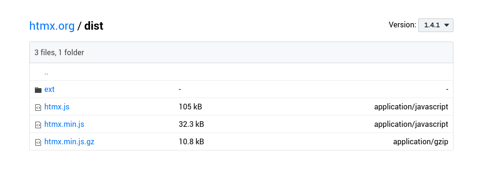
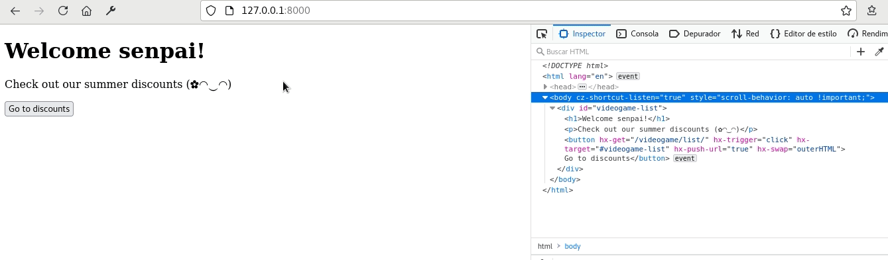
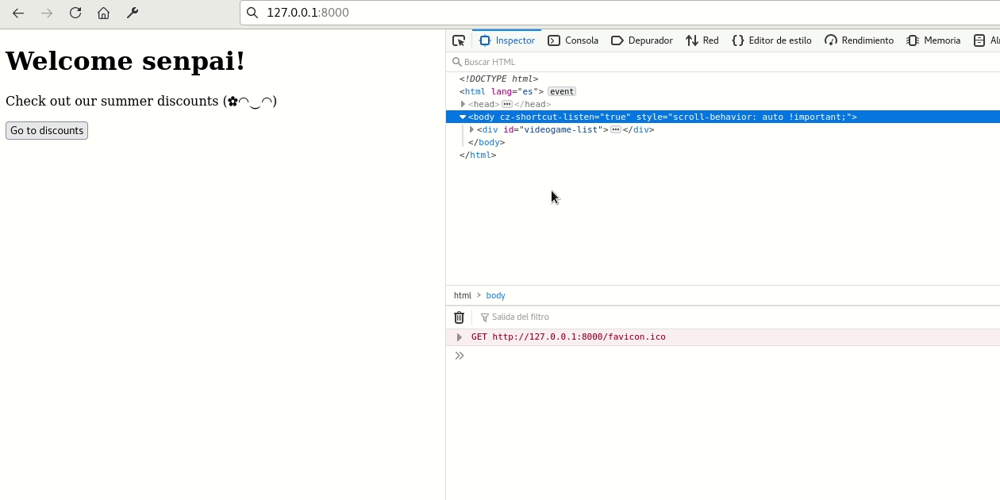
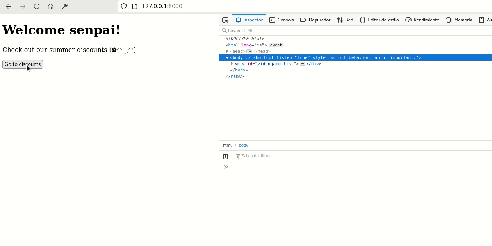

The other day I was testing a library called htmx, which promises to make web creation much easier, yes, another library, but with the difference that this one doesn't need you to write Javascript (JS) and it also combines quite well with Django. Htmx bases all its operation on writing attributes in your HTML tags, which are responsible for abstracting all the JS that runs behind the scenes. The result is code consisting only of HTML tags and their attributes, with no JS code (well, maybe just a little). No, you don't have to abandon all the JS, don't worry, you can also combine htmx with your favorite libraries and vanilla JS code.

And how many kB will you add to my project? Almost nothing, HTMX is quite light, it weighs about 10 kB gzipped or 30 kB minimized and has no dependencies.



Htmx allows you to handle AJAX requests, CSS transitions, websockets and events sent from the server on any HTML tag that accepts . All these functionalities can be triggered by a series of triggers such as an element loading, appearing in the viewport, a click, the mouse entering (or exiting), or even events that are triggered every so often without user interaction. In addition to GET and POST requests, HTMX allows PUT, DELETE, PATCH requests, all by modifying HTML tag attributes only.

Htmx does not generate HTML, but delegates that task to the server, so instead of having an endpoint with JSON responses we will work with endpoints that will directly generate the HTML code and send it as a response, as if it were SSR. This makes it perfect to combine with the template system that comes integrated in Django.

But I guess you want to see what the code looks like right? Take a look at this example taken from the documentation:

```html
<button hx-post="/clicked"
       hx-trigger="click"
       hx-target="#parent-div"
       hx-swap="outerHTML">
    Click Me!
  </button>
```

> When a user clicks on this button, it makes an HTTP POST request to the url /clicked and uses the content of the response to replace the element with the id parent-div in the DOM.
>
> https://htmx.org/docs/#introduction


Schematic diagram of HTMX operation

## Django and htmx project preparation

For this tutorial I have created a github repository, so if you want to save all the boilerplate, you can simply clone the whole project and follow the code as I write it.

Remember that if you are not convinced why you should use Django check my post where I explain the [advantages and disadvantages of Django](/why-should-you-use-django-framework/). If you have no idea how to use Django better start with the [Django-guide](/the-definitive-guide-to-django/)

```bash
# Ejecuta esto para no escribir el código
git clone https://github.com/EduardoZepeda/djangohtmxtest.git
cd djangohtmxtest/
pipenv install
pipenv shell
python manage.py migrate
python loaddata videogames
# Datos de inicio de sesión:
user: admin
password: contrasenaNoSegura
```

### Django model and dependencies installation

To start, let's create a virtual environment with [the pipenv virtual environment manager](/pipenv-the-virtual-environment-manager-you-don-t-know/). You can use [pip](/python-virtualenv-linux-basic-tutorial/), poetry, conda or whatever you prefer.

```bash
pipenv shell
pipenv install django
```

Let's create a project and an app with _django-admin_.

```bash
django-admin startproject djangoHtmx
django-admin startapp videogameStore
```

Enter the _videogameStore_ folder and create the models we will use

```python
from django.db import models

# Create your models here.
GENRES = (
    ("HOR","Horror"),
    ("RPG", "RPG"),
    ("ADV", "Adventure")
    )

class Videogame(models.Model):
    title = models.CharField(max_length=255)
    description = models.TextField(max_length=255)
    genre = models.CharField(choices=GENRES, max_length=3)
    price = models.DecimalField(max_digits=20, decimal_places=2)
```

Now let's run the migrations and create a super user.

```bash
python manage.py makemigrations
python manage.py migrate
python manage.py createsuperuser
```

Inside the _djangoHtmx_ folder we will modify the _urls.py._ file.

We will create urls for the _home/_ path and then create urls for our app under the _videogame/_ path.

```python
from django.contrib import admin
from django.urls import path, include
from .views import home
from videogameStore.urls import urlpatterns as videogameUrls

urlpatterns = [
    path('', home, name="home"),
    path('admin/', admin.site.urls),
    path('videogame/', include(videogameUrls)),
]
```

Now we create a folder _templates_ in the root of the project and we are going to create a base template that we will call _base.html_ and another template, that will inherit from this last one, called _home.html_, which we will use in the home view.

```bash
mkdir templates
cd templates
touch base.html
touch home.html
```

## Installing htmx

We open the _base.html_ file and place the following code. Notice how **to use htmx just load it from unpkg** using a script tag. In this tutorial we are using htmx version 1.4.1.

We will keep a very simple structure for the base template, with only the header, body and footer tags

```html
<!DOCTYPE html>
<html lang="en">
<head>
    <meta charset="UTF-8">
    <meta name="viewport" content="width=device-width, initial-scale=1.0">
    <title>{{ site.name }}</title>
    
      <meta name="theme-color" content="#333333">
      <meta name="msapplication-TileColor" content="#2b5797">
      <meta name="apple-mobile-web-app-capable" content="yes">
      <meta name="apple-mobile-web-app-status-bar-style" content="black">
      <meta name="apple-mobile-web-app-title" content="{{ site.name }}">
      <meta property="og:type" content="website">
      
    <script src="https://unpkg.com/htmx.org@1.4.1"></script>
</head>
<body>
    
    
    
</body>
</html>
```

## htmx basic attributes

Let's open the _home.html_ file. We extend from the _base.html_ template and replace the body tag with a simple layout and our first button with Htmx.

```python


    
        <div id="videogame-list">
            <h1>Welcome senpai!</h1>
            <p>Check out our summer discounts (✿◠‿◠)</p>
             <button hx-get=
               hx-trigger="click"
               hx-target="#videogame-list"
               hx-push-url="true"
               hx-swap="outerHTML">
                Go to discounts
            </button>           
        </div>

    
```

The button will have four attributes, each button will specify a number of behaviors: hx-get, hx-trigger, hx-target, hx-push-url

### hx-get

Here we will place the url to which we will make the request. Notice how we can even generate it dynamically using the __ tag provided by django.

hx-get is one of the attributes that perform AJAX requests, the others are hx-post, hx-put, hx-patch and hx-delete, which perform POST, PUT, PATCH and DELETE requests, respectively.

### hx-trigger

It will be the type of event that will trigger the request, a click in this case. We can however use [other events](https://developer.mozilla.org/es/docs/Web/Events) such as mouseenter, mouseleave, keyup, etc.

There are a number of special events available as well:

* load: activated when loading an element
* revealed: when an element is displayed in the viewport
* intersect: triggered when an element intersects with the viewport
* every ns: every so often (e.g. every 2s, every 10s)

If we do not specify an event the library will take certain events by default to perform the AJAX request.

* Form fields will trigger the request with the change event.
* Forms with the submit event
* All other elements with a click

These events have modifiers that delay an event or prevent it from being executed more than once.

* changed: performs the request only if the element changed
* delay: delays the execution of the request
* throttle: same as delay, but rejects new events if the specified time has not passed.
* from: allows listening to the event from another element. Receives a CSS selector (e.g. #id)

### hx-target

Indica the item where we want to load the response we get to the address we write in hx-get, if we do not specify any will use the one who made the request. In the example the id of the parent element has been specified. If this value is omitted, the element that made the request will be replaced, that is, the one that has the hx-get attribute.

### hx-swap

Indicates the element where the result of the request will be placed. We have several options:

* outerHTML: replacing the tag
* innerHTML: inside the label
* afterbegin: before the first child of the tag
* beforebegin: before the specified tag
* beforeend: after the last child of the tag
* afterend: after the tag
* none: nowhere

The default is innerHTML

### hx-push-url

It tells htmx to replace the browser url with the url we specify in hx-get.

## Generation of HTML for htmx

The HTML we will use will be exactly the same as what Django would generate in a normal request using its template system, either using the render method or with generic views.

Let us first define our views in the videogameStore app. Let's create the _urls.py_ file and, since we will use generic views, we name them and call its _as_view()_ method.

```python
from django.urls import path
from .views import ListVideogames, VideogameDetail

urlpatterns = [
    path('list/', ListVideogames.as_view(), name="videogameList"),
    path('<int:pk>/', VideogameDetail.as_view(), name="videogameDetail"),
]
```

That done, let's create the views. The _ListView_ view will be in charge of returning the objects of the _Videogame_ model. _context_object_name_ will be in charge of assigning the name that we will use to access this model in the _listVideogames.html_ template, that is "videogames".

_DetailView_ allows us to display a single object and we will use the variable "videogame" to access the object in the _videogameDetail.html_ template.

```python
from django.shortcuts import render
from django.views.generic import ListView, DetailView
from .models import Videogame

class ListVideogames(ListView):
    model = Videogame
    template_name = "listVideogames.html"
    context_object_name = "videogames"

class VideogameDetail(DetailView):
    model = Videogame
    template_name = "videogameDetail.html"
    context_object_name = "videogame"
```

We will now create the templates we need to make our views work

First _videogameDetail.html_.

```html
<div id="videogame-detail">
    <h2>{{videogame.title}}</h2>
    <p>{{videogame.description}}</p>
    <small>{{videogame.price}}</small>
     <button hx-get=
       hx-trigger="click"
       hx-target="#videogame-detail"
       hx-swap="outerHTML"
       hx-push-url="true">
        Return to list
    </button>           
</div>
```

After _listVideogames.html_

```html
<div id="videogame-list">

    <a 
        hx-get=
        hx-trigger="click"
        hx-target="#videogame-list"
        hx-swap="outerHTML"
        hx-push-url="true">
        <h2>{{videogame.title}}</h2>
        <p>{{videogame.description|truncatewords:15}}</p>
        <button>Read more</button>
    </a>

</div>
```

Note how, in both cases, the HTML generated by Django in the url to the one that points _hx-target_ will replace the divine with the id _videogame-list_ after having effected a click on the element.

### Interaction process between django and htmx

If our code works, after clicking on the home button the following steps will be performed:



1. Htmx will make a GET request to the url videogame/list/
2. Django will query the database, get the information and pass it to the template rendering system.
3. Django template system will render the _listVideogames.html_ template and return it as a response.
4. Htmx will take the content of the response and replace the tag that has the id _#videogame-list_ with this one.
5. Htmx will modify the browser url to point to _videogame/list_/

## Sending parameters with Htmx

Any element that triggers a request will include its value (inputs). If this element is a form, htmx will include the content of all the inputs that are inside the two form tags. Let's create a form to test this.

Let's first add a view to create a video game in our _views.py_ file

```python
from django.views.generic import ListView, DetailView, CreateView

class VideogameCreate(CreateView):
    model = Videogame
    fields = ["title", "description", "genre", "price"]
    template_name = "createVideogameForm.html"
```

Remember to provide the _get_absolute_url_ method to our Videogame model. Because if our request is successful, we will want django to redirect us to the newly created object.

```python
class Videogame(models.Model):
    # ...
    def get_absolute_url(self):
        return reverse('videogameDetail', args=[str(self.id)])
```

And let's put the url in our _urls.py_ file

```python
from .views import ListVideogames, VideogameDetail, VideogameCreate

url_patterns = [
    # ...
    path('create/', VideogameCreate.as_view(), name="videogameCreate"),
]
```

Let's go into the _templates_ folder and create the _createVideogameForm.html_ template that we specified in our generic view.

Also, notice how I have removed the _method_ attribute. If our request is successful, the video game will be added and redirect us to the url we specified in the _get_absolute_url_ method we created above.

```html
<div id="videogame-list">
   <form 
    hx-post=
    hx-target="#videogame-list"
    hx-swap="outerHTML">
    
    {{ form.as_p }}
        <input type="submit" value="Save">
    </form> 
</div>
```

I will place a button in the list of videogames, _listVideogames.html_ to redirect us to the page creation view.

This is important because **if we access a url different from _home_, which is where the htmx script is loaded, we will not have access to the functionalities **.

We will solve this problem later.



```html

    <a 
        hx-get=
        hx-trigger="click"
        hx-target="#videogame-list"
        hx-swap="outerHTML"
        hx-push-url="true">
        <button>Submit a videogame</button>
    </a>
</div>
```

See how it works



See the image below, htmx automatically sent the content of all the fields encompassed by the form tag as part of the POST request made to /videogame/create/.


### Excluding parameters with htmx

It is possible to exclude parameters by means of the hx-params attribute. To use it we simply place it in the form tag or whatever we are using.

hx-params receives the following possible options

* *: to include all
* none: to not include parameters
* not <comma-separated-list>: to exclude a comma-separated list of parameters
<comma-separated-list>: to include only the parameters appearing in this comma-separated list

```html

    <a 
        hx-get=
        hx-trigger="click"
        hx-target="#videogame-list"
        hx-swap="outerHTML"
        hx-push-url="true">
        hx-form="*"
        <button>Submit a videogame</button>
    </a>
</div>
```

## Special headers sent by htmx with each request

There is another thing that happened and I didn't tell you, when we submitted the form; htmx added some headers to our request.

Every time a request is made with Htmx, extra headers are sent to the server. Just go to the developer tools to see what we sent in the last request.

The url was sent via the HX-Current-URL header, the object element to be exchanged via HX-Target, and a parameter called HX-Request, which is always set to "true", which tells the server that we made the request with htmx. HX-Trigger, is sent if we specify an id in the tag that triggers the request. And what are these headers for? Well, you can retrieve them with django and use them as you see fit in your views.


## Rendering head, body and html conditionally

Do you remember that we had the problem that if we accessed the urls directly, without going through home, htmx would not load? Well, now that we know that we have these headers, we can use them so that the template system includes the head, html and body tags only when we access the path directly.

```html

    <!DOCTYPE html>
    <html lang="es">
    <head>
        <meta charset="UTF-8">
        <meta name="viewport" content="width=device-width, initial-scale=1.0">
        <title>{{ site.name }}</title>
        
          <meta name="generator" content="Htmx">
          <meta name="theme-color" content="#333333">
          <meta name="msapplication-TileColor" content="#BBBBBB">
          <meta name="apple-mobile-web-app-capable" content="yes">
          <meta name="apple-mobile-web-app-status-bar-style" content="black">
          <meta name="apple-mobile-web-app-title" content="{{ site.name }}">
          <meta property="og:type" content="website">
          
        <script src="https://unpkg.com/htmx.org@1.4.1"></script>
    </head>
    <body>

    
    
    

    </body>
    </html>    

```

And now in all our templates that only return HTML, we can make them extend from base.html and place the content inside the __ tag.

```html



    <div id="videogame-list">
    
        <a 
            hx-get=
            hx-trigger="click"
            hx-target="#videogame-list"
            hx-swap="outerHTML"
            hx-push-url="true">
            <h2>{{videogame.title}}</h2>
            <p>{{videogame.description|truncatewords:15}}</p>
            <button>Read more</button>
        </a>
    
        <a 
            hx-get=
            hx-trigger="click"
            hx-target="#videogame-list"
            hx-swap="outerHTML"
            hx-push-url="true">
            <button>Submit a videogame</button>
        </a>
    </div>

```

Now you can access url's directly and keep the htmx functionality.


I have shown you only the basics of htmx combined with django, remember to visit the [official documentation](https://htmx.org/docs/) to see the other things it has to offer, like CSS transitions, websockets and SSE,