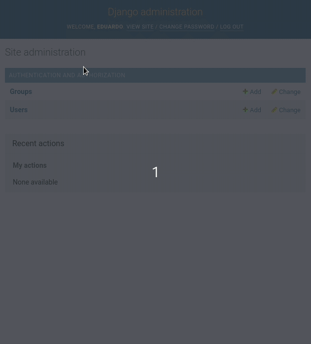

---
aliases:
- /como-funcionan-los-permisos-y-grupos-en-django
- /como-funcionan-los-permisos-y-grupos-en-django//1000
- /es/como-funcionan-los-permisos-y-grupos-en-django/
authors:
- Eduardo Zepeda
categories:
- django
coverImage: images/Permisos-en-django.jpg
coverImageCredits: https://www.pexels.com/es-es/@orlovamaria/
date: '2021-04-17'
description: Aprende a crear permisos, grupos, asignarlos a los usuarios, y crear
  permisos personalizados en Django. Incluso si jamás lo has hecho.
keywords:
- linux
slug: /django/como-funcionan-los-permisos-y-grupos-en-django/
title: ¿Cómo funcionan los permisos y grupos en Django?
---

La primera vez que me enteré de que Django tenía un sistema de permisos, hace ya muchos años, me pareció algo bastante esotérico, sin mucha utilidad y fácil de replicar, que equivocado estaba en aquel entonces. Después me di cuenta de que el sistema de permisos integrado era una maravilla y ahorraba muchísimo código, además de ser bastante sólido y puesto a prueba por algunas de las empresas más grandes del mundo.

Si aún no te decides a usar Django y estás investigando sus características revisa mi entrada sobre las [ventajas y desventajas del framework de desarrollo web Django.](/es/django/por-que-deberias-usar-django-framework/)

Por otro lado, si ya tienes un poco de práctica con Django quizá te convenga profundizar lo que sabes con este libro gratuito, y en español, llamado [la guía definitiva de Django](/es/django/la-guia-definitiva-de-django/)

## ¿Cómo se crean los permisos en Django?

Cada que creas un modelo y corres las migraciones **se crean automáticamente 4 permisos (add, edit, delete y view)** en _django.contrib.auth_ para ese objeto.

Por otro lado, el modelo usuario tiene una relación _ManyToMany_ con el modelo _Permissions_ (que guarda los permisos anteriores) y el modelo _Groups_. Por lo que ya de primeras contamos con una relación entre usuarios, grupos y permisos que podemos aprovechar.

Los permisos que crea Django vienen en la forma de <app>.<accion>\_<modelo> o app.accion\_modelo

```python
app.add_modelo # Para añadir modelos
app.edit_modelo # Para editar modelos
app.delete_modelo # Para borrar modelos
app.view_modelo # Para ver modelos
# por ejemplo: 
# streaming.add_pelicula
# tienda.edit_articulo
# encuestas.delete_encuesta
# vapor.view_videojuego
```



## Agregar o remover permisos a un usuario

Para agregar o remover los permisos a un usuario haremos uso de los métodos que nos provee Django

Para agregar permisos uno por uno los pasamos al método _add()_.

```python
user.permissions.add(permiso1, permiso2, ...)
```

Para remover permisos le pasamos el permiso que queremos remover al método _remove()_.

```python
user.permissions.remove(permiso1, permiso2, ...)
```

Si queremos establecer una lista de permisos simplemente igualamos el atributo _permissions_ a la lista que queremos que tenga.

```python
user.permissions = [lista_de_permisos]
```

Para eliminar todos los permisos de un usuario usamos el método _clear()_.

```python
user.permissions.clear()
```

## Comprobando los permisos para un usuario

Ya que hemos asignado permisos, podemos limitar el comportamiento de un usuario a los permisos que tenga. Por ejemplo, Patreon solo muestra su contenido a usuarios que donan periódicamente a un creador de contenido e incluso dentro de una sola cuenta hay diferentes permisos que están en función de la cantidad de dinero que dones.

### Comprobar que permisos tiene un usuario

El método _get\_all\_permissions()_ nos devuelve una lista de todos los permisos con los que cuenta un usuario.

```python
user.get_all_permissions()
```

### Comprobar los permisos de los grupos a los que pertenece un usuario

Esto nos devolverá los permisos que obtiene un usuario por los grupos a los que pertenece.

```python
user.user.get_group_permissions()
```

### Comprobar si un usuario tiene un permiso

Podemos corroborar si un usuario tiene un permiso único con el método _has\_perm()_. Devolverá _True_ si el usuario tiene el permiso. Si el usuario tiene los permisos pero su instancia de usuario tiene la propiedad active igual a _False_, devolverá _False_.

```python
user.has_perm("app.accion_modelo") 
```

### Comprobar si un usuario tiene una serie de permisos

_has\_perms_ es bastante útil si queremos comprobar si un usuario cuenta con una serie de permisos. Devolverá _True_, solamente si cuenta con todos los permisos. Igual que el anterior, **devolverá _False_ si el usuario no está activo, incluso si cuenta con los permisos.**

```python
user.has_perms(["app.edit_modelo", "app.delete_modelo"]) # por ejemplo videogame_store.edit_videogame, videogame_store.delete_videogame
```

### Comprobar si un usuario cuenta con algún permiso

Quizás queremos solo corroborar la existencia de cualquier permiso, para eso sirve _has\_module\_perms()_. Devuelve _True_ si el usuario cuenta con algún permiso para la etiqueta de la aplicación que le pasemos. De la misma manera, devuelve _False_ para usuarios inactivos.

```python
user.has_module_perms('etiqueta_de_la_app') # por ejemplo videogame.view_videogame

# models.py
class tuModelo(models.Model):
    class Meta:
        app_label = 'etiqueta_de_la_app'
```

## Aplicando los permisos para limitar acciones

Podemos aplicar los permisos para proteger nuestras vistas envolviéndolas en un decorador

### Comprobando con user\_passes\_test

Esta función requiere obligatoriamente un objeto como argumento y este objeto debe aceptar al objeto _user_ como su argumento. Dejando de lado eso, este test puede contener lo que quieras, desde comprobar un campo del usuario, permisos, corroborar una fecha límite, etc.

Existe un segundo parámetro opcional, la dirección url a redireccionar para usuarios que no están autenticados, que toma el valor de _settings.LOGIN\_URL_ (sí, el que especifiques en tu archivo de configuración) si no especificamos ninguno.

```python
def can_delete_and_edit(user):
return user.has_perm("app.edit_modelo") and user.has_perm("app.delete_modelo")

@user_passes_test(can_delete_and_edit, login_url="/login/")
def manage_videogame(request):
    pass
```

### Comprobando con permissions\_required

De igual manera, cuenta con un segundo parámetro opcional, la dirección url a redireccionar para usuarios que no están autenticados, que adopta el valor de _settings.LOGIN\_URL_ si no especificamos ninguno.

```python
from django.contrib.auth.decorators import permission_required

@permission_required('app.edit_videogame', login_url="/login/")
def edit_videogame(request):
# ...
```

### Aplicando los permisos en plantillas

Las plantillas de Django ya no son tan populares como antes, debido al auge de los microservicios y frameworks de frontend como React, Vue, Angular, etc. Aún así, si deseas usarlas en plantillas puedes acceder a los permisos de la siguiente manera:

Actualización: [Htmx](/es/django/django-y-htmx-web-apps-modernas-sin-escribir-js/) puede darle vida, nuevamente, a los permisos en el sistema de plantillas de Django.

```django

Para comprobar si el usuario tiene un permiso en específico


Para comprobar si el usuario tiene algún permiso para esa app

```

## Grupos de permisos en Django

Como ya sabes, usar grupos es una manera bastante cómoda de asignar una serie de permisos. Quizás tengas una aplicación de pago y quieras que todos los usuarios con el plan básico tengan una serie de permisos, mientas que los usuarios premium tengan permisos extra. **Para organizar los permisos y asignarlos de manera más sencilla podemos usar grupos**. Puedes acceder a estos grupos y asignarles permisos desde el panel de administración o desde la terminal de Python.

### Crear grupos de permisos



También podemos crearlos directo de la terminal de Python

```python
from django.contrib.auth.models import Group
Group.objects.create(name="Premium")
premium = Group.objects.get(name="Premium")
```

### Asignar permisos a un grupo

Si ya tenemos un grupo y queremos asignarle permisos **usamos prácticamente el mismo set de métodos que usamos para un usuario**.

Para establecer una lista de permisos

```python
premium.permissions.set([lista_de_permisos])
```

Para añadir permisos, ya sea una lista o uno por uno.

```python
premium.permissions.add(permiso1, permiso2, ...)
```

Para remover permisos, ya sea una lista o uno por uno

```python
premium.permissions.remove(permiso1, permiso2, ...)
```

Para eliminar todos los permisos de un grupo

```python
premium.permissions.clear()
```

## Añadir o remover usuarios de un grupo

Para añadir un grupo de permisos usamos los mismos métodos que en los ejemplos anteriores: add, remove, clear

```python
# agregar a un usuario a varios grupos
user.groups = group_list
# Agregar un usuario a uno o varios grupos
user.groups.add(grupo1, grupo2,...)
# Removemos un usuario de uno o varios grupos
user.groups.remove(grupo1, grupo2,...)
# Eliminamos a un usuario de todos los grupos
user.groups.clear()
```

## Crear permisos personalizados en Django

Podemos agregar permisos personalizados a un modelo, usaremos la sub _clase Meta_ del nuestro modelo y asignar la propiedad _permissions_ a una tupla de tuplas, donde cada tupla cuenta con el nombre del permiso y su descripción.

```python
permissions = (('permiso1', 'descripción 1'), ('permiso 2', 'descripción 2'))
```

Podemos nombrar estos permisos como deseemos, posteriormente dotar de ese permiso a ciertos usuarios y luego comprobar si un usuario cuenta alguno de nuestros permisos usando los métodos vistos con anterioridad.

```python
class usuarioPersonalizado(AbstractUser):
    # ...

    class Meta:
        permissions = (
            ('puede_ver_contenido_premium', 'Puede ver contenido para usuarios premium'),
            ('puede_ver_contenido_básico', 'Puede ver contenido para usuarios básico'))
```

Si ahora ejecutamos las migraciones, notaremos que ya podemos agregar los permisos que creamos desde el panel de administración y desde la terminal de Python.

```python
python manage.py makemigrations
python manage.py migrate
```

Recuerda revisar [la documentación de Django sobre permisos](https://docs.djangoproject.com/en/3.2/topics/auth/default/) para profundizar la publicación.