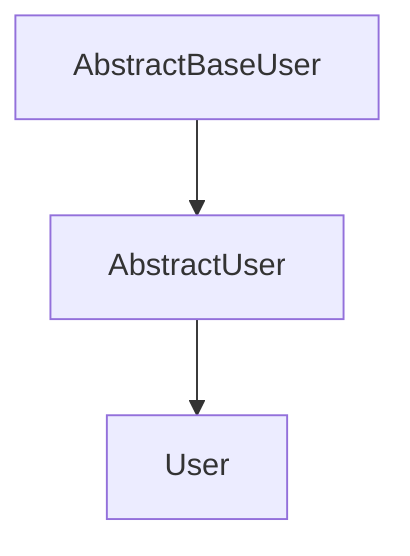
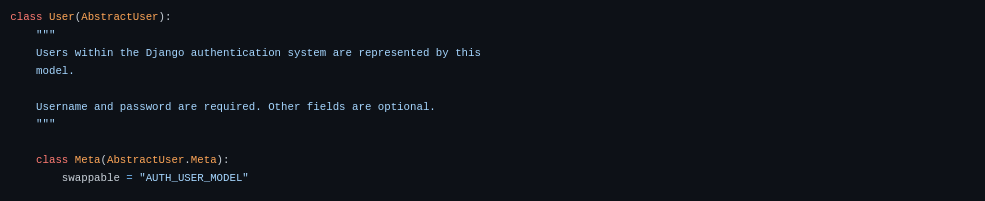
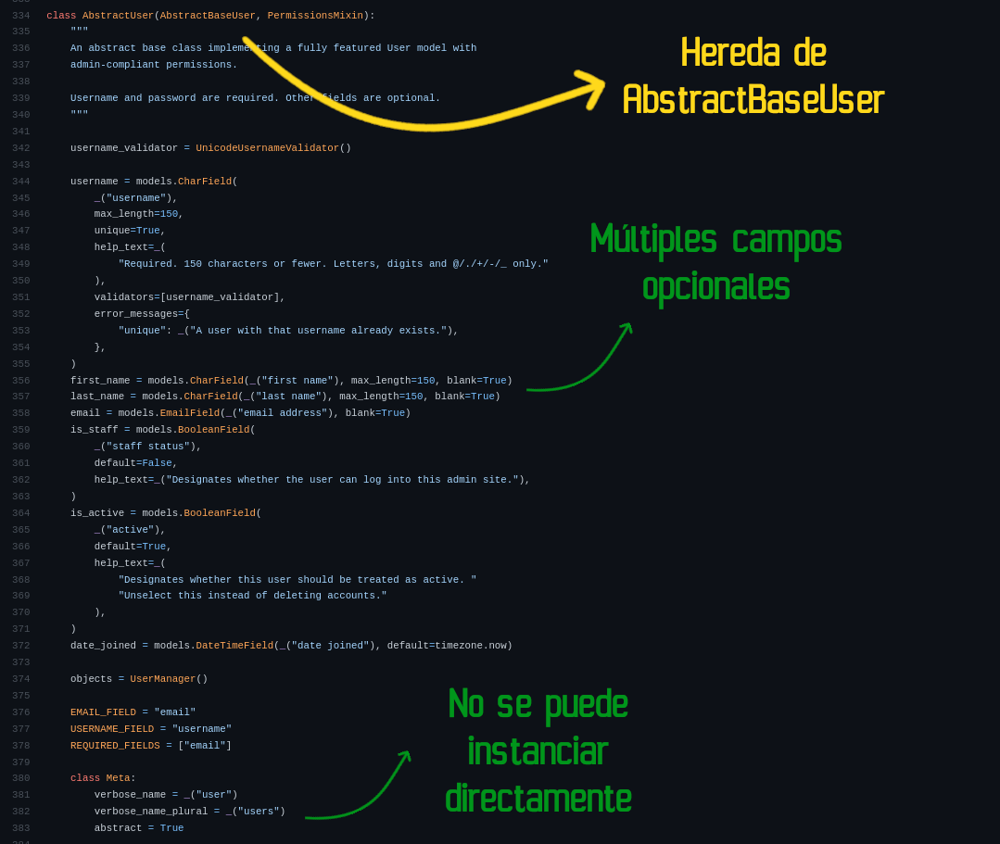
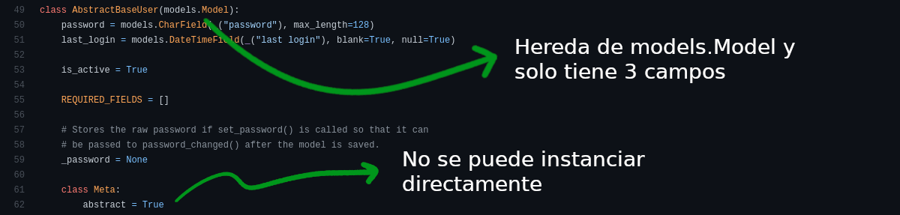

---
aliases:
- /en/how-to-customize-the-user-model-in-django/
authors:
- Eduardo Zepeda
categories:
- django
coverImage: images/pin-961667.jpg
coverImageCredits: 'Image credits to pin: https://www.pixiv.net/en/users/961667'
date: '2022-03-16'
description: Learn to customize Django User model, so it fits with your application
  requirements and business logic, whether it be adding extra fields or modifying
  its internal behavior
keyword: user model
keywords:
- django
- python
title: How to customize the User model in Django?
---

In this post I explain three methods to extend or customize Django's _User_ model, without having to rewrite it from scratch, and keeping all [Django's user management features](/en/django/why-should-you-use-django-framework/)

But, before we start, let's see where Django's User model comes from.

## Where does the Django User model come from?

Django's _User_ model inherits from _AbstractUser_ which, in turn, inherits from the _AbstractBaseUser_ class.



If you look at the Django source code, you will see that the **User model you normally use has virtually no functionality of its own**, but inherits all of its functionality from _AbstractUser_.



Now that we know the above, **we can use the AbstractUser and AbstractBaseUser classes to create our custom User models**.



## Extend Django user model inheriting from Django's AbstractUser subclass

This method is probably the most popular method for extending Django's _User_ model. This is because it retains almost all the functionality of the original _User_ model.

```python
# users/models.py
from django.contrib.auth.models import AbstractUser
from django.db import models

class CustomUser(AbstractUser):
    # Other properties defined by you
    credits = models.PositiveIntegerField(verbose_name='credits',
        default=0, 
        blank=True)
```

After creating a new class that inherits from _AbstractUser_, we need to tell Django that we want to use this new model instead of the default user model.

We set this behavior in our configuration file.

```python
# settings.py
AUTH_USER_MODEL = 'users.CustomUser'
```

### Extend Django user model using the custom model in Django's account views

If we want to use the Django template system to automatically generate a registration form, we will need to tell Django to use the new user model, for this we inherit a new form from the _UserCreationForm_ class, and pass it our custom model, which we can with the _get_user_model_ method.

```python
from django.contrib.auth import get_user_model
from django.contrib.auth.forms import UserCreationForm

User = get_user_model()

class RegisterFormForCustomUser(UserCreationForm):
    class Meta:
        model = User
        fields = ['username', 'email']
```

And that's it, we can use it exactly as if we were using the _User_ model included in Django.

### django admin does not hashed passwords

When we use a custom user model, we need to tell Django to handle passwords with the default user functionality

```python
from django.contrib import admin
from django.contrib.auth.admin import UserAdmin
from django.contrib.auth import get_user_model

user = get_user_model()

class CustomUserAdmin(UserAdmin):
    pass

admin.site.register(user, CustomUserAdmin)
```

Now the admin panel will behave exactly as it would with the default Django user.

### What does AbstractUser look like internally?

Notice how the _AbstractUser_ class inherits from _AbstractBaseUse_r and has multiple fields available to profile a user. Also, it cannot be instantiated directly, as it is an abstract class.



Let's move on to the second method.

### How to change the user field for authentication in Django?

If you look at the code above, there is an uppercase property called _USERNAME_FIELD_, there you can specify another field to work as the user.
As you don't want two users to identify themselves in the same way that field has to be marked as unique. Besides that you have to modify the object manager, the code is a bit long so I won't put it here

```python
class CustomUser(AbstractUser):
    custom_id = models.CharField(max_length=40, unique=True)
    # ...
    USERNAME_FIELD = 'custom_id'
```

## Extend Django user model inheriting from subclass AbstractBaseUser

This class, as you can see in the previous image, is the base class used to create the _AbstractUser_. Its operation is the minimum and it only has 3 fields:

* password
* last_login
* is_active

It only has the authentication function. And you have to indicate which field will be used as _username_, to authenticate the user.

This method is usually used to fully customize the User model or when we need almost no extra fields.

```python
# users/models.py
from django.contrib.auth.base_user import AbstractBaseUser
from django.db import models

class CustomUser(AbstractBaseUser):
    email = models.EmailField(verbose_name='emails', unique=True, max_length=255)
    credits = models.PositiveIntegerField(verbose_name='credits',
        default=0, 
        blank=True)
    USERNAME_FIELD='email'
    REQUIRED_FIELDS = []
```

Remember to tell Django to use your custom model instead of the default one.

```python
# settings.py
AUTH_USER_MODEL = 'users.CustomUser'
```

### What does AbstractBaseUser look like internally?

The following image is a direct screenshot of the Django code in version 4.0

As you can see, it only has the 3 fields mentioned, it inherits directly from _models.Model_ and its Meta class tells Python that it is an abstract model; you cannot create instances directly from it.



Now let's look at the third way to extend Django's _User_ model.

## Extend Django user model creating a profile for model User

Another way to extend the user model is to **create another model that serves as a container for the extra fields and then relate it by an _OneToOneField_** field to the model that the Django configuration receives by default.

This approach is ideal if we are the creator of a package that needs to customize the _User_ model of the project to work, but without modifying it directly.

It is also useful when we need several types of users or different profiles, with different fields between them.

To create a profile in this way it is enough to declare a field that relates our new model to the _User_ model, by means of an _OneToOneField_.

```python
from django.conf import settings
class Profile(models.Model):
    # other fields
    user = models.OneToOneField(settings.AUTH_USER_MODEL, on_delete=models.CASCADE)
```

And to access our user, we access the field that relates it to the model we created.

```python
user = User.objects.get(username='user')
user.Profile
```

## Other resources

* [Original source code of the Django User model](https://github.com/django/django/tree/main/django/contrib/auth)
* [Django User model documentation](https://docs.djangoproject.com/en/4.0/topics/auth/customizing/)