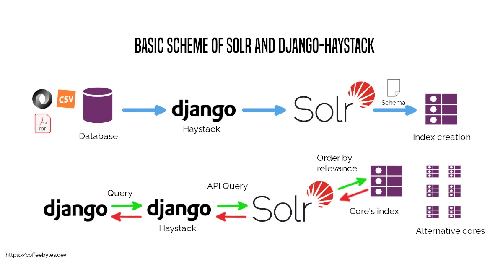
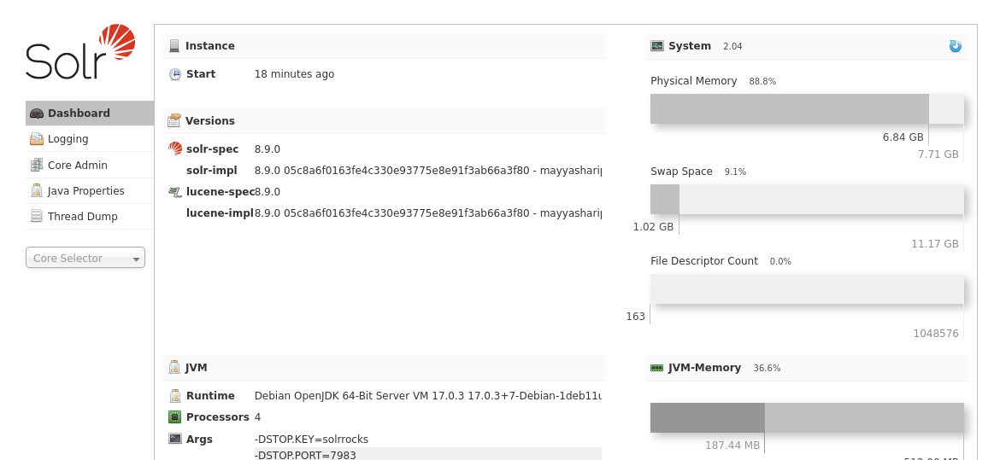
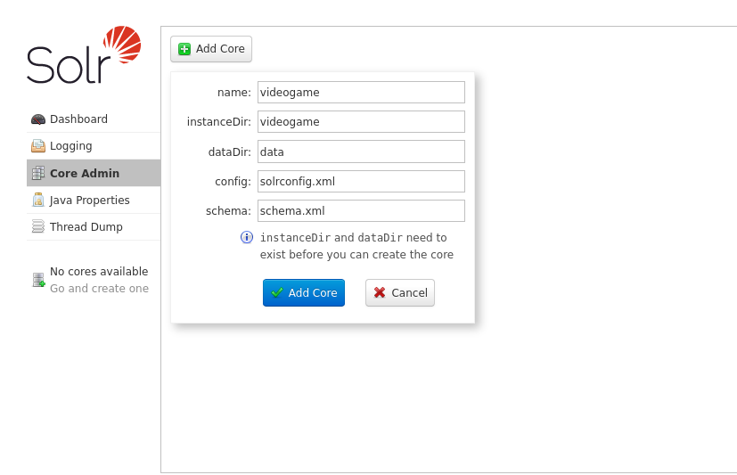
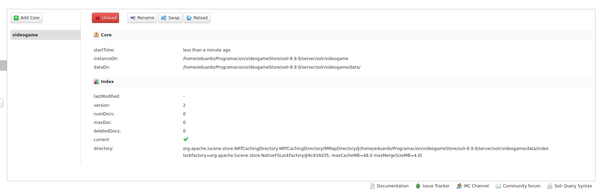
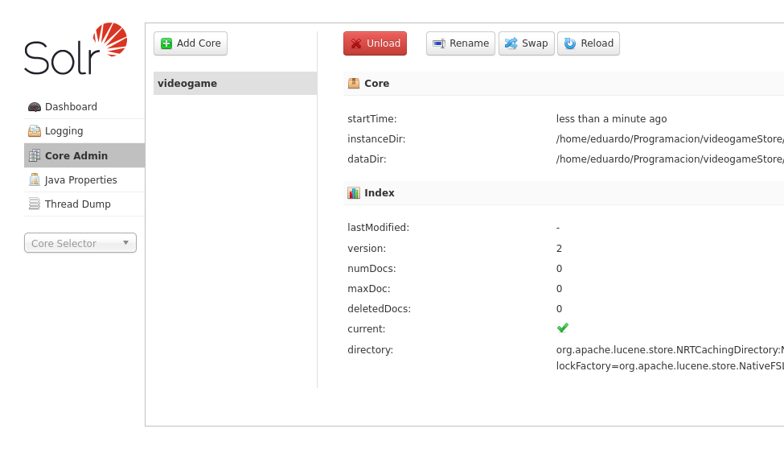
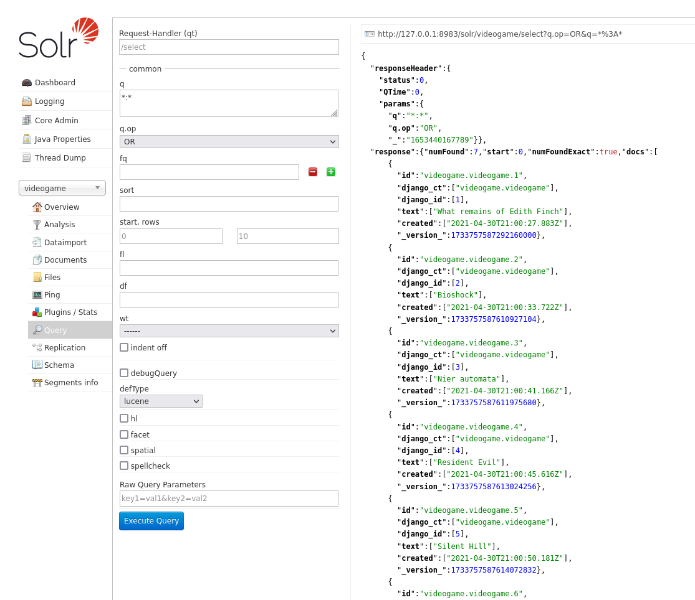

---
aliases:
- /en/how-to-implement-solr-for-searches-or-queries-in-django/
authors:
- Eduardo Zepeda
categories:
- django
- linux
coverImage: images/solr-django-busquedas.jpg
coverImageCredits: Credits to https://www.instagram.com/we_make_mangas/
date: '2022-05-26'
title: How to implement Solr for searches or queries in Django?
url: searches-with-solr-with-django-haystack
---

Previously I explained you how to implement [full text search in Django](/en/django/full-text-search-and-searches-with-django-and-postgres/) and [trigrams-and-search-rank]() using Postgres. Solr comes to offer us something better, a robust, stable and feature-rich search engine, ready to use, in exchange for a little more complexity, more dependencies and having to include Java (yes, Java) in our project.

## How does Solr work?

Internally Solr uses Lucene, which is the search engine that is in charge of generating an index to make the queries and all the options related to the searches, Solr adds some extra functions and gives us a friendly interface to work with. From now on I will refer to the union of Lucene and Solr only as Solr.

Simplifying to the extreme, Solr receives the content of our database (or csv file, pdf, json, xml, etc.) and, using a template or schema (managed schema), generates an inverted index with the information.

Subsequently, when Solr receives a query, it will query the generated index, sort the results according to their relevance and return them.



### Inverted index

Solr works with an inverted index. It is quite similar to the index that appears in the back of technical books, in which each topic of the book points to a page; in the indexing of our information tokens are generated and these are related to the documents that contain them.

| Token      | Documents |
| ---------- | --------- |
| Python     | 1,2       |
| Functional | 5,6       |
| Rust       | 3         |



## Advantages and disadvantages of Solr

### Advantages of Solr

Solr has many [advanced features, such as autocomplete, suggestions, search by field and others]()

* Solr's inverted index allows searching through millions of records in milliseconds.
* Solr allows you to generate search suggestions for misspellings.
* Returns auto-completion suggestions.
* Able to perform geospatial searches.
* Administration panel with monitoring tools.
* Advanced analysis tools.
* Support for multiple cores or instances.

### Disadvantages of Solr

* Very complex configuration.
* Configuration parameters change frequently between versions.
* It is necessary to keep the index updated after changes in our data.
* Requires Java.

## Solr installation and configuration

To install it we need to download the appropriate version from the [Solr download page](https://solr.apache.org/downloads.html#?). For this entry I will use the following dependencies:

* Solr: version 8.9.0
* Django: version 4.0.4
* Haystack: version 3.2.1

```bash
wget https://archive.apache.org/dist/lucene/solr/8.9.0/solr-8.9.0.zip
unzip solr-8.9.0.zip
cd solr-8.9.0/bin
```

Once unzipped and inside the main solr folder we will find a folder _bin/_, with the solr binaries.

The binary named solr has the commands stop and start, to stop and start, respectively, solr.

We will use start to execute it and, if no error occurs, we will have an administration panel available on port 8983.

```bash
./solr start
```



### Cores in Solr

A core is an instance of an index with its own configuration parameters. Solr allows us to work with different cores.

When using solr, we will interact with a kernel, so it is essential to create one in order to perform our queries.

### Create a core

To create a new core we will go to the _Add Core_ section and fill in the following information:

* name: The name to assign to our kernel.
* instanceDir: The name of the instance directory, it must be located inside <solr-x.y.z>/server/solr/ (Does not exist yet)
* dataDir: The directory where the generated data will be stored (does not exist yet)
* config: solrconfig.xml (We don't have it yet)
* schema: schema.xml (We don't have it yet)



To configure Solr we will create the following structure inside the solr installation folder _<solr-x.y.z>/server/solr/<solr_instance_name_dir>/_

```bash
<instance_name>/
├── conf
│   ├── lang
│   │   └── stopwords_en.txt
│   ├── protwords.txt
│   ├── managed-schema # Our config file
│   ├── solrconfig.xml
│   ├── stopwords.txt
│   └── synonyms.txt
├── data
```

**conf**, contains the configuration files of our kernel. We will modify managed-schema later.
**data**, contains the generator indexes of our kernel (right now it is empty).

### Get the configuration files.

In order not to start from scratch, we will take the default configuration folder, located at <solr-x.y.z>/server/solr/configsets/_default/conf and move it to the directory of the solr instance.

```bash
cp -r <solr-x.y.z>/server/solr/configsets/_default/conf <solr-x.y.z>/server/solr/<instance_directory>/
```

If we go to the administration panel we should be able to create the core successfully.



## Haystack in Django

We now have a working Solr core, with the basic configuration, but we have not connected it to Django.

To connect solr and django we will configure [django-haystack](https://django-haystack.readthedocs.io/en/master/).

Django-haystack is a bridge between django and different search engines:

* ElasticSearch
* Solr
* Whoosh
* Xapian

It allows us to generate configuration files and interact directly with the engines to generate indexes and perform searches or queries.

Right now we are competing with solr, so first we will install _django-haystack_ and _pysolr_.

```bash
pip install django-haystack==3.2.1 pysolr==3.9.0
```

### Configuring Haystack in Django

Once installed remember to add it to INSTALLED_APPS, before your applications. Also we need to tell Django where it can find the endpoint for solr through the HAYSTACK_CONNECTIONS variable.

```python
# settings.py

INSTALLED_APPS = [
    # ...
    'haystack',
    # tus apps 
]
HAYSTACK_CONNECTIONS = {
    'default': {
        'ENGINE': 'haystack.backends.solr_backend.SolrEngine',
        'URL': 'http://127.0.0.1:8983/solr/<core_name>'
    },
}
```

### Using a Django class as the basis for the index

Once installed we need to create a model that serves as the basis for the creation of the solr index. By convention, haystack looks for a file called _search_indexes.py_, inside our applications.

```python
# app/search_indexes.py

from haystack import indexes
from .models import Videogame

class VideogameIndex(indexes.SearchIndex, indexes.Indexable):
    # MUST BE NAMED text, by convention
    text = indexes.CharField(document=True, use_template=True)
    created = indexes.DateTimeField(model_attr='created')
    # optional field

    # Model to return
    def get_model(self):
        return Videogame

    # queryset to index, you can filter it
    def index_queryset(self, using=None):
        return self.get_model().objects.all()
```

I explain the structure of the class

**text**, the most important field, used to generate the index. In this class there must be at least one property with the parameter document=True.
**created**, an optional field that corresponds to a property called _created_ of our model (model_attr='created').
**get_model**, the model to return.
**index_queryset**, the queryset to index, you can customize it with filters, partition it or as you like.

#### Use another name instead of text

The name text is a convention used by haystack, to use a field name other than text we create the variable _HAYSTACK_DOCUMENT_FIELD_ in _settings.py_.

```python
HAYSTACK_DOCUMENT_FIELD = "alternative_name"
```

### Creating a template for the text field

After creating our template class for the index we will need to tell it what the _text_ field will contain, we will do this using a Django template.

Make sure you have set your _TEMPLATES_ variable in _settings.py_.

```bash
TEMPLATES = [
    {
        'BACKEND': 'django.template.backends.django.DjangoTemplates',
        'DIRS': ["<template_directory>"],
        # ...
    }
]
```

Haystack will automatically detect a file inside the _templates_ directory we use in Django, with the following path and use it as a base.

```bash
<template_directory>/search/indexes/<app_name>/<model_name>_text.txt
```

We will fill this file with the same syntax as a normal Django template.

```django
{{ object.name }}
```

### Generating a managed_schema

After creating the template we will proceed to generate the _managed_schema_ file, necessary to create the index, using the _build_solr_schema_ command provided by _django-haystack_.

```bash
python3 manage.py build_solr_schema > managed_schema
```

Notice how I redirect the output of the command to a file named _managed_schema_.

This file is the one we will replace in our solr configuration.

First we back up the configuration.

```bash
mv <solr-x.y.z>/server/solr/<instance_directory>/conf <solr-x.y.z>/server/solr/<instance_directory>/conf/_managed_schema.old
```

It is now safe to move the configuration.

```bash
mv managed_schema <solr-x.y.z>/server/solr/<instance_directory>/conf
```

#### Solr version +8.x and Django-haystack settings

Since we are using the newest version of solr django-haystack (3.2.1) only supports up to solr version 6.x, we need to make some modifications to the code in the _managed_schema_ file we just copied to the solr configuration. You know, "incompatibilities". If you are using other newer versions of haystack you probably don't have to do this anymore.

Locate the line:

```xml
<!-- <solr-x.y.z>/server/solr/<instance_directory>/conf/managed_schema -->
<field name="django_ct" type="string" indexed="true" stored="true" multiValued="false"/>
```

Replace it with your version of type="text_general":

```xml
<!-- <field name="django_ct" type="string" indexed="true" stored="true" multiValued="false"/> -->
<field name="django_ct" type="text_general" indexed="true" stored="true" multiValued="false"/>
```

This will prevent an error where the search result is treated as a list instead of as text.

Another change, before the closing of the last schema tag we add the following content

```xml
<!-- START Manually inserted snippet -->
<!-- Lines required to handle floats, long points, date points, etc. -->
<fieldType name="pdate" class="solr.DatePointField" docValues="true"/>
<fieldType name="pdates" class="solr.DatePointField" docValues="true" multiValued="true"/>
<fieldType name="pdouble" class="solr.DoublePointField" docValues="true"/>
<fieldType name="pdoubles" class="solr.DoublePointField" docValues="true" multiValued="true"/>
<fieldType name="pfloat" class="solr.FloatPointField" docValues="true"/>
<fieldType name="pfloats" class="solr.FloatPointField" docValues="true" multiValued="true"/>
<fieldType name="pint" class="solr.IntPointField" docValues="true"/>
<fieldType name="pints" class="solr.IntPointField" docValues="true" multiValued="true"/>
<fieldType name="plong" class="solr.LongPointField" docValues="true"/>
<fieldType name="plongs" class="solr.LongPointField" docValues="true" multiValued="true"/>
<!-- Manually inserted snippet END -->
```

This will prevent errors related to missing pdate, pdates, plongs and other fields.

The last change, move the _currency.xml_ file in the solr examples to our configuration folder.

```xml
mv <solr-x.y.z>/example/example-DIH/solr/solr/conf/currency.xml <solr-x.y.z>/server/solr/<instance_directory>/conf
```

This will avoid an error due to the lack of fields for currency management.

### Generate an index in solr

Before we continue, we need to reload our kernel in the Solr admin panel so that it recognizes the changes we made to the configuration.



Now it is time to generate an index with the _rebuild_index_ command provided by _django-haystack_.

```bash
python manage.py rebuild_index

WARNING: This will irreparably remove EVERYTHING from your search index in connection 'default'.
Your choices after this are to restore from backups or rebuild via the `rebuild_index` command.
Are you sure you wish to continue? [y/N] y
```

If everything went well we will have all our queryset indexed and we will be able to perform a query in the query section of our kernel, in the administration panel.

The query will return all results in JSON format if we do not specify anything.



Notice how the text field is filled with the content of our django template.

## Text search with haystack and solr in Django

With the index formed and solr running, we can perform queries directly to solr using haystack and Python code, either to return them in JSON format or to generate HTML with Django's native template system.

```python
from haystack.query import SearchQuerySet
from .models import Videogame

def vista(request):
    results = SearchQuerySet().models(Videogame).filter(content='<query text>').load_all()
    # ...
```

With the above I will end this post, probably in the next post I will talk a little more about the advanced search functions offered by django haystack.