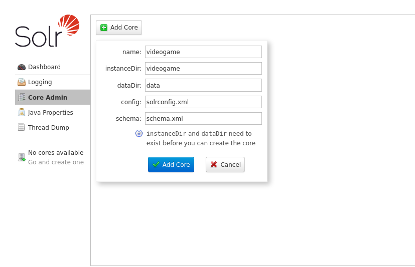
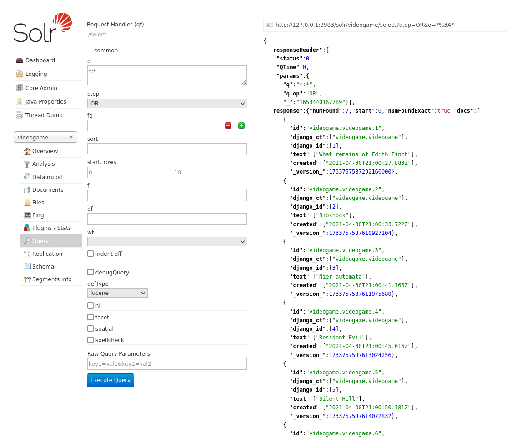

---
aliases:
- /solr-en-django-con-haystack
- /como-implementar-solr-para-busquedas-o-queries-en-django
- /busquedas-con-solr-con-django-haystack
- /es/como-implementar-solr-para-busquedas-o-queries-en-django/
authors:
- Eduardo Zepeda
categories:
- django
- linux
coverImage: images/solr-django-busquedas.jpg
coverImageCredits: Créditos a https://www.instagram.com/we_make_mangas/
date: '2022-05-26'
description: Solr, junto con Haystack, permite búsquedas exactas en milisegundos al
  crear un índice invertido del contenido de los modelos de Django
slug: /django/busquedas-con-solr-con-django-haystack/
title: ¿Cómo implementar Solr para búsquedas o queries en Django?
---

Anteriormente te expliqué como implementar [full text search en Django](/es/django/full-text-search-y-busquedas-con-django-y-postgres/) y [trigramas y search rank]() usando Postgres. Solr viene a ofrecernos algo mejor, un motor de búsquedas robusto, estable y con muchas funciones avanzadas, listo para usarse, a cambio de un poco más de complejidad, más dependencias y tener que incluir Java (sí, Java) en nuestro projecto.

## ¿Cómo funciona Solr?

Internamente Solr usa Lucene, que es el motor de búsqueda que se encarga de generar un índice para realizar las consultas y todas las opciones relacionadas con las búsquedas, Solr agrega unas funciones extras y nos da una interfaz amigable para trabajar. De aquí en adelante me referiré a la unión de Lucene y Solr solo como Solr.

Simplificando al extremo, Solr recibe el contenido de nuestra base de datos (o archivo csv, pdf, json, xml, etc.) y, usando una plantilla o esquema (managed schema), genera un índice invertido con la información. 

Posteriormente, cuando Solr recibe una consulta, consultará el índice generado, ordenará los resultados de acuerdo a su relevancia y los retornará.


### Índice invertido

Solr funciona con un índice invertido. Es bastante similar al índice que aparece hasta atrás en los libros técnicos, en el cada tema del libro apunta a una página; en el indexado de nuestra información se generan tokens y estos se relacionan con los documentos que los contienen.




## Ventajas y desventajas de Solr

### Ventajas de Solr

Solr cuenta con muchas [funciones avanzadas, tales como autocompletado, sugerencias, búsquedas por campo y otros.]()

* El índice invertido de Solr permite realizar búsquedas entre millones de registros en milisegundos.
* Solr permite generar sugerencias de búsqueda ante errores ortográficos.
* Devuelve sugerencias de autocompletado.
* Capaz de realizar búsquedas geoespaciales.
* Panel de administración con herramientas de monitoreo.
* Herramientas de análisis avanzadas.
* Soporte para múltiples núcleos o instancias.

### Desventajas de Solr

* Configuración muy compleja.
* Los parámetros de configuración cambian frecuentemente entre versiones.
* Es necesario mantener el índice actualizado tras cambios en nuestros datos.
* Requiere Java.

## Instalación y configuración de Solr

Para instalarlo necesitamos descargar la versión adecuada desde la [página de descargas de Solr](https://solr.apache.org/downloads.html#?). Para esta entrada usaré las siguientes dependencias: 

* Solr: versión 8.9.0
* Django: version 4.0.4
* Haystack: version 3.2.1

```bash
wget https://archive.apache.org/dist/lucene/solr/8.9.0/solr-8.9.0.zip
unzip solr-8.9.0.zip
cd solr-8.9.0/bin
```

Una vez descomprimido y dentro de la carpeta principal de solr encontraremos una carpeta *bin/*, con los binarios de solr.  

El binario llamado solr tiene los comandos stop y start, para detener y arrancar, respectivamente, solr. 

Usaremos start para ejecutarlo y, si no ocurre ningún error, tendremos un panel de administración disponible en el puerto 8983.

```bash
./solr start
```


### Núcleos o cores en Solr

Un núcleo es una instancia de un índice con sus propios parámetros de configuración. Solr nos permite trabajar con diferentes núcleos. 

Cuando usamos solr, interaccionaremos con un núcleo, por lo que es imprescindible crear uno para poder efectuar nuestras queries o consultas.

### Crear un núcleo

Para crear un nuevo núcleo iremos a la sección *Add Core* y llenaremos la siguiente información:

* name: El nombre a asignar a nuestro núcleo
* instanceDir: El nombre del directorio de la instancia, debe localizarse dentro de <solr-x.y.z>/server/solr/ (Aún no existe)
* dataDir: El directorio donde guardará la data generada (Aún no existe)
* config: solrconfig.xml (Aún no lo tenemos)
* schema: schema.xml (Aún no lo tenemos)



Para configurar Solr crearemos la siguiente estructura dentro de la carpeta de instalación de solr *<solr-x.y.z>/server/solr/<nombre_de_la_instancia_dir>/*

```bash
<nombre_de_la_instancia>/
├── conf
│   ├── lang
│   │   └── stopwords_en.txt
│   ├── protwords.txt
│   ├── managed-schema # Nuestro archivo de configuración personalizable.
│   ├── solrconfig.xml
│   ├── stopwords.txt
│   └── synonyms.txt
├── data
```

* **conf**, contiene los archivos de configuración de nuestro núcleo. Modificaremos managed-schema más adelante. 
* **data**, contiene los índices generador de nuestro núcleo (ahora mismo está vacio).

### Obtener los archivos de configuración.

Para no empezar desde cero, tomaremos la carpeta de configuración predeterminada, localizada en <solr-x.y.z>/server/solr/configsets/_default/conf y la llevaremos al directorio de la instancia de solr.

```bash
cp -r <solr-x.y.z>/server/solr/configsets/_default/conf <solr-x.y.z>/server/solr/<directorio_de_la_instancia>/
```

Si nos dirigimos al panel de administración deberíamos ser capaces de crear el núcleo de manera exitosa.


## Haystack en Django

Ahora tenemos un núcleo de Solr funcionando, con la configuración básica, pero no lo hemos conectado a Django. 

Para conectar solr y django configuraremos [django-haystack](https://django-haystack.readthedocs.io/en/master/).

Django-haystack es un puente entre django y diferentes motores de búsqueda:

* ElasticSearch
* Solr
* Whoosh
* Xapian

Nos permite generar archivos de configuración e interaccionar directamente con los motores para generar índices y realizar búsquedas o consultas.

Ahora mismo nos compete solr, por lo que primeramente instalaremos *django-haystack* y *pysolr*

```bash
pip install django-haystack==3.2.1 pysolr==3.9.0
```

### Configurando Haystack en Django

Una vez instalado recuerda que debes agregarlo a INSTALLED_APPS, antes de tus aplicaciones. Además necesitamos decirle a Django donde puede encontrar el endpoint para solr a través de la variable HAYSTACK_CONNECTIONS.

```python
# settings.py

INSTALLED_APPS = [
    # ...
    'haystack',
    # tus apps 
]
HAYSTACK_CONNECTIONS = {
    'default': {
        'ENGINE': 'haystack.backends.solr_backend.SolrEngine',
        'URL': 'http://127.0.0.1:8983/solr/<nombre_del_núcleo>'
    },
}
```

### Usar una clase de Django como base para el índice

Una vez instalado necesitamos crear un modelo que sirva como base para la creación del índice de solr. Por convención, haystack busca un archivo llamado *search_indexes.py*, dentro de nuestras aplicaciones.

```python
# app/search_indexes.py

from haystack import indexes
from .models import Videogame

class VideogameIndex(indexes.SearchIndex, indexes.Indexable):
    # Por convención DEBE llamarse text.
    text = indexes.CharField(document=True, use_template=True)
    created = indexes.DateTimeField(model_attr='created')
    # Más campos opcionales

    # El modelo a retornar
    def get_model(self):
        return Videogame

    # El queryset a indexar, puedes filtrarlo.
    def index_queryset(self, using=None):
        return self.get_model().objects.all()
```

Te explico la estructura de la clase
* **text**, el campo más importante, usado para generar el índice. En esta clase debe existir al menos una propiedad con el parámetro document=True.
* **created**, un campo opcional que se corresponde con una propiedad llamada *created* de nuestro modelo (model_attr='created'). 
* **get_model**, el modelo a retornar.
* **index_queryset**, el queryset a indexar, puedes personalizarlo con filtros, particionarlo o como te plazca.

#### Usar otro nombre en lugar de text

El nombre text es una convención usada por haystack, para utilizar otro nombre de campo que no sea text creamos la variable *HAYSTACK_DOCUMENT_FIELD* en *settings.py*

```python
HAYSTACK_DOCUMENT_FIELD = "otro_nombre"
```

### Creando una plantilla para el campo text

Tras crear nuestra clase plantilla para el índice necesitaremos decirle lo que contendrá el campo *text*, lo haremos mediante una plantilla de Django. 

Asegúrate de tener configurada tu variable *TEMPLATES* en *settings.py*

```bash
TEMPLATES = [
    {
        'BACKEND': 'django.template.backends.django.DjangoTemplates',
        'DIRS': ["<directorio_de_templates>"],
        # ...
    }
]
```

Haystack detectará de manera automática un archivo dentro del directorio *templates* que usamos en Django, con la siguiente ruta y lo usará como base.

```bash
<directorio_de_templates>/search/indexes/<nombre_de_app>/<nombre_del_modelo>_text.txt
```

Este archivo lo llenaremos con la misma sintaxis que una plantilla normal de Django.

```django
{{ object.name }}
```

### Generando un managed_schema

Tras crear la plantilla procederemos a generar el archivo *managed_schema*, necesario para crear el índice, usando el comando *build_solr_schema* que nos proporciona *django-haystack*.

```bash
python3 manage.py build_solr_schema > managed_schema
```

Observa como redirijo la salida del comando a un archivo llamado *managed_schema*. 

Este archivo es el que reemplazaremos en nuestra configuración de solr.

Primeramente respaldamos la configuración.

```bash
mv <solr-x.y.z>/server/solr/<directorio_de_la_instancia>/conf <solr-x.y.z>/server/solr/<directorio_de_la_instancia>/conf/_managed_schema.old
```

Ahora ya es seguro mover la configuración.

```bash
mv managed_schema <solr-x.y.z>/server/solr/<directorio_de_la_instancia>/conf
```

#### Solr version +8.x y Django-haystack ajustes

Como estamos usando la versión más nueva de solr django-haystack (3.2.1) solo soporta hasta la versión 6.x de solr, necesitamos realizar ciertas modificaciones al código del archivo *managed_schema* que acabamos de copiar a la configuración de solr. Ya sabes, "incompatibilidades". Si estás usando otras versiones más nuevas de haystack probablemente ya no tengas que realizar esto.

Localiza la linea:

```xml
<!-- <solr-x.y.z>/server/solr/<directorio_de_la_instancia>/conf/managed_schema -->
<field name="django_ct" type="string" indexed="true" stored="true" multiValued="false"/>
```

Reemplazala con su versión de type="text_general":

```xml
<!-- <field name="django_ct" type="string" indexed="true" stored="true" multiValued="false"/> -->
<field name="django_ct" type="text_general" indexed="true" stored="true" multiValued="false"/>
```

Esto prevendrá un error en el que el resultado de la búsqueda se trata como una lista en lugar de como texto.

Otro cambio, antes del cierre de la última etiqueta schema agregamos el siguiente contenido

```xml
<!-- Texto insertado manualmente -->
<!-- Lines para el manejo de flotantes, long points, date points, etc. -->
<fieldType name="pdate" class="solr.DatePointField" docValues="true"/>
<fieldType name="pdates" class="solr.DatePointField" docValues="true" multiValued="true"/>
<fieldType name="pdouble" class="solr.DoublePointField" docValues="true"/>
<fieldType name="pdoubles" class="solr.DoublePointField" docValues="true" multiValued="true"/>
<fieldType name="pfloat" class="solr.FloatPointField" docValues="true"/>
<fieldType name="pfloats" class="solr.FloatPointField" docValues="true" multiValued="true"/>
<fieldType name="pint" class="solr.IntPointField" docValues="true"/>
<fieldType name="pints" class="solr.IntPointField" docValues="true" multiValued="true"/>
<fieldType name="plong" class="solr.LongPointField" docValues="true"/>
<fieldType name="plongs" class="solr.LongPointField" docValues="true" multiValued="true"/>
<!-- Texto insertado manualmente -->
```

Lo anterior prevendrá errores relacionados con la falta de los campos pdate, pdates, plongs y otros.

El último cambio, mueve el archivo *currency.xml* en los ejemplos de solr a nuestra carpeta de configuración.

```xml
mv <solr-x.y.z>/example/example-DIH/solr/solr/conf/currency.xml <solr-x.y.z>/server/solr/<directorio_de_la_instancia>/conf
```

Esto evitará un error por la falta de campos para manejo de divisas.

### Generar un índice en solr

Antes de continuar, necesitamos recargar nuestro núcleo en el panel de administrador de Solr para que reconozca los cambios que efectuamos en la configuración.


Ahora ha llegado el momento de generar un índice con el comando *rebuild_index* que nos provee *django-haystack*

```bash
python manage.py rebuild_index

WARNING: This will irreparably remove EVERYTHING from your search index in connection 'default'.
Your choices after this are to restore from backups or rebuild via the `rebuild_index` command.
Are you sure you wish to continue? [y/N] y
```

Si todo salió bien tendremos todo nuestro queryset indexado y podremos llevar a cabo una query en la sección query de nuestro núcleo, en el panel de administración. 

La query devolverá todos los resultados en formato JSON si no especificamos nada.



Nota como el campo text se llena con el contenido de nuestra plantilla de django.

## Búsqueda de texto con haystack y solr en Django

Con el índice formado y solr ejecutándose, podemos realizar querys o consultas directamente a solr usando haystack y código en Python, ya sea para devolverlas en formato JSON o para  generar HTML con el sistema de plantillas nativo de Django.

```python
from haystack.query import SearchQuerySet
from .models import Videogame

def vista(request):
    results = SearchQuerySet().models(Videogame).filter(content='<query text>').load_all()
    # ...
```

Con lo anterior doy por terminada la entrada, probablemente en la siguiente entrada hable un poco más de las funciones de búsqueda avanzada que ofrece django haystack.