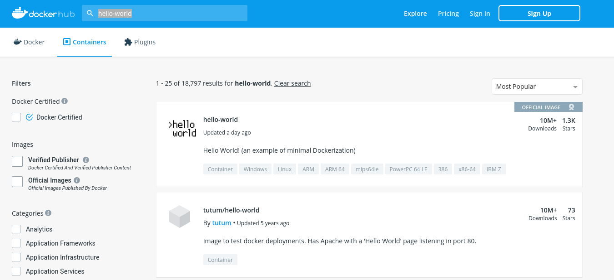
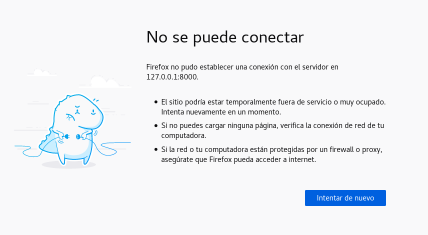
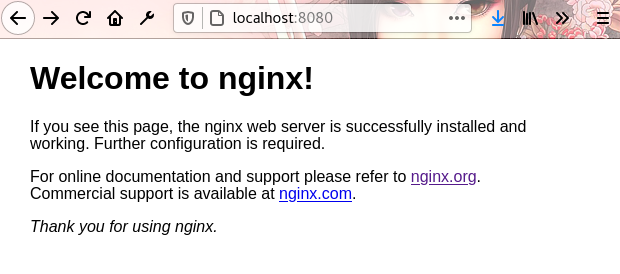

---
aliases:
- /docker-curso-practico-con-ejemplos-en-gnu-linux
- /los-comandos-basicos-de-docker-y-su-uso
- /tutorial-de-comandos-basicos-de-docker
- /docker-tutorial-con-ejemplos-en-gnu-linux/
- /tutorial-de-comandos-basicos-de-docker//1000
authors:
- Eduardo Zepeda
categories:
- docker
- linux y devops
coverImage: images/DockerCursoPractico.jpg
coverImageCredits: Créditos a https://www.pexels.com/es-es/@huy-phan-316220/
date: '2020-10-07'
description: Aprende a usar los comandos básicos de Docker, a diferenciar imágenes
  y contenedores, volúmenes, crear Dockerfiles y usar docker build.
keywords:
- docker
title: Comandos de Docker más útiles para manejar contenedores
url: tutorial-de-comandos-basicos-de-docker
---

Si te leíste la entrada anterior donde explico [para que sirve Docker](/es/que-es-docker-y-para-que-sirve/) ya debes tener una idea bastante simple de Docker, pero no he publicado nada acerca de los comandos. Aquí te explico los comandos más comunes de Docker, el uso de volúmenes y la creación de un Dockerfile de ejemplo.

## Las imágenes y los contenedores son diferentes

Antes de empezar hay que aclarar que en Docker trabajamos con contenedores que son creados a partir de imágenes. Una imagen es como una plantilla de solo lectura, mientras que el contenedor es la materialización de esa plantilla, se podría decir que es una imagen instanciada o en ejecución.

Puedes pensar en las imágenes y contenedores **como clases y sus instancias, respectivamente.**

Si te interesa conocer como funciona, a nivel código, un contenedor, tengo una entrada donde explico [como crear un contenedor desde cero con go](/es/container-de-docker-con-namespaces-y-cgroups/).

## Comandos básicos de Docker

### Correr un contenedor

Para correr un contenedor usaremos el comando run y el nombre de la imagen de la que derivará. Puedes especificar como quieres que se llame tu contenedor con la opción _\--name_.

```bash
docker run hello-world
docker run --name mi_nombre hello-world
Hello from Docker!
This message shows that your installation appears to be working correctly.
...
```

Tras ejecutar el comando anterior, Docker descargará la imagen de hello-world y creará un contenedor, este contenedor se ejecutará, realizará su función y terminará de ejecutarse.

### Descargar una imagen

Si solo quieres traer una imagen para que esté disponible, sin ejecutarla puedes usar el comando docker pull, seguido del nombre de la imagen. 

Este comando traera una imagen de los repositorios y la descargará en tu sistema.

```bash
docker pull hello-world
Using default tag: latest
latest: Pulling from library/hello-world
Digest: sha256:4cf9c47f86df71d48364001ede3a4fcd85ae80ce02ebad74156906caff5378bc
...
```

### Buscar una imagen

La imagen de hello-world es probablemente la más aburrida que hay y de seguro querrás buscar una imagen que haga algo más que imprimir texto en pantalla.

Para buscar una imagen podemos usar el comando docker search. Lo que hace este comando es conectarse a docker hub y buscar la imagen que le indiquemos.

En Dockerhub existen imágenes de mysql, de nginx, de alpine linux, de python, de django, wordpress, ghost y casi cualquier otra tecnología, y sus combinaciones, que puedas nombrar.

```bash
docker search nginx
NAME                               DESCRIPTION                                     STARS               OFFICIAL            AUTOMATED
nginx                              Official build of Nginx.                        13802               [OK]                
jwilder/nginx-proxy                Automated Nginx reverse proxy for docker con…   1885                                    [OK]
richarvey/nginx-php-fpm            Container running Nginx + PHP-FPM capable of…   787                                     [OK]
```

Por otro lado, si prefieres hacerlo de una manera más visual puedes visitar [Docker hub](https://hub.docker.com/). Ahí se puede conseguir cualquier tipo de
imagen que te imagines, incluso subir las tuyas. Date una vuelta y mira todas las opciones que están disponibles para descargar. Por ahora no descargaremos ninguna otra.



### Ver las imágenes

Si ahora ejecutamos docker images va a aparecer nuestra imagen descargada. Mira el bajo tamaño de la imagen, ¡pesa sólo 13.3kB! Asimismo mira la columna IMAGE ID**. Cada imagen, incluida las personalizadas, tiene un id único que la representa y un tag.**

```bash
docker images
REPOSITORY        TAG            IMAGE ID            CREATED             SIZE
hello-world       latest         bf756fb1ae65        8 months ago        13.3kB
```

### Inspeccionar una imagen

Para inspeccionar una imagen basta con usar docker inspect, seguido del nombre o id de la imagen. Docker imprimirá información relacionada con la imagen en formato JSON.

Con docker inspect podremos ver sus variables de entorno, sus comandos de arranque, volúmenes asociados, arquitectura y muchas otras características más.

```bash
docker inspect hello-world
[
    {
        "Id": "sha256:bf756fb1ae65adf866bd8c456593cd24beb6a0a061dedf42b26a993176745f6b",
        "RepoTags": [
            "hello-world:latest"
        ],
 ...}] 
```

### Historial de una imagen

Docker history nos muestra la historia de una imagen; los comandos que se han ejecutado y sus respectivos disparadores.

```bash
docker history hello-world
IMAGE               CREATED             CREATED BY                                      SIZE                COMMENT
bf756fb1ae65        9 months ago        /bin/sh -c #(nop)  CMD ["/hello"]               0B                  
```

### Borrar una imagen

Para borrar una imagen existe el comando _rmi_, sí como _rm_, pero con la i de "image" a continuación, necesitaremos ya sea su id o su repository y su tag separados por dos puntos ":"

```bash
docker rmi repository:tag
docker rmi id_de_la_imagen
```

Si quisieras borrar la imagen de hello-world sería de la siguiente manera. Escribiendo docker rmi, seguido del nombre de la imagen seáradp por dos puntos de su tag.

```bash
docker rmi hello-world:latest
```

### Ver los procesos de Docker

Si queremos ver los procesos ejecutados usamos docker ps con la opción _\-a_. **Por favor nota que nuestro contenedor tiene un id y, además un nombre**, el cual es generado por Docker automáticamente si no lo especificamos, en este caso "lucid\_morse".

```bash
docker ps -a
CONTAINER ID   IMAGE              COMMAND        CREATED          STATUS                     PORTS     NAMES
0f100ae4a21e   hello-world        "/hello"       10 minutes ago   Exited (0) 10 minutes ago            lucid_morse
```

Si le quitamos la opción _\-a_ mostrará únicamente los procesos activos. Como el contenedor que creamos a partir de la imagen hello-world terminó de ejecutarse no aparecerá en esta lista.

```bash
docker ps
CONTAINER ID   IMAGE              COMMAND        CREATED        STATUS                  PORTS     NAMES
```

### Borrar un contenedor al terminar de ejecutarlo

Cada vez que ejecutamos docker run se crea un nuevo contenedor. Para evitar llenarnos de contenedores podemos borrarlos automáticamente cuando estos terminan su ejecución usando la opción _\--rm_ después de docker run. Intenta corriendo la imagen hello-world nuevamente.

```bash
docker run --rm hello-world
```

Si ahora vuelves a ejecutar docker ps -a, verás que **no se ha creado un contenedor adicional** al que ya teníamos.

```bash
docker ps -a
CONTAINER ID   IMAGE              COMMAND        CREATED          STATUS                     PORTS     NAMES
0f100ae4a21e   hello-world        "/hello"       10 minutes ago    Exited (0) 10 minutes ago            lucid_morse
```

### Borrar un contenedor

Para borrar los contenedores, puedes usar el comando _docker rm_, con el nombre o id del contenedor.

```bash
docker rm nombre_o_id_del_contenedor
```

### Borrar todos los contenedores en Docker

Es bastante común querer borrar todos los contenedores en Docker. **Para hacerlo necesitamos conseguir todos los id de los contenedores.** 

Si ejecutas el siguiente comando verás como se imprime una lista con todos los id de los contenedores. Así es, es el mismo comando que ejecutamos anteriormente para ver todos los procesos de Docker, la opción _\-q_ hace que solo nos muestre los id de esos procesos.

```bash
docker ps -aq
8344e4d39fbf
42174ad3810d
...
```

Ahora que tenemos todos los id, podemos usar esta lista con el comando docker rm para eliminar todos los contenedores.

```bash
docker rm $(docker ps -aq)
```

### Acceder a la terminal de un contenedor

El siguiente comando nos introducirá en un contenedor creado a partir de una imagen. Técnicamente lo que hace docker run -it es vincular la entrada estándar (STDIN) de nuestro sistema operativo con la entrada estándar (STDIN) de nuestro contenedor. Esto nos permite correr un contenedor con el que podemos interactuar.

```bash
docker run -it ubuntu
```

**Nota como el prompt de la terminal cambiará** y nos encontraremos en una terminal desde la cual podremos interactuar.

Intenta ejecutar un _ls_ o un _pwd_. Podrás notar que estás dentro de un sistema operativo GNU/Linux. Puedes crear archivos, modificarlos, crear carpetas, etc.

Si no sabes nada sobre comandos de GNU/Linux puedes revisar mi entrada sobre los [comandos básicos de GNU Linux: cd, ls, rm, etc.](/es/comandos-basicos-de-linux-grep-ls-cd-history-cat-cp-rm-scp/) para refrescar tu memoria.

```bash
ls
bin  boot  dev  etc  home  lib  lib32  lib64  libx32  media  mnt  opt  proc  root  run  sbin  srv  sys  tmp  usr  var
pwd
/
```

### ¿Cómo extraer un archivo de un contenedor de Docker?

Para extraer un archivo de un contenedor usamos el comando *docker cp*, que básicamente es un análogo del [comando cp de Linux](/en/linux-basic-commands-grep-ls-cd-cat-cp-rm-scp/), con la siguiente sintaxis

``` bash
docker cp <container_name>:<path_to_file> <path_to_extract_on_your_computer>
```

### Correr un contenedor de Docker en segundo plano

Cuando queremos que un contenedor permanezca ejecutándose en segundo plano usamos la etiqueta _\-d_, que viene de detach (también puedes recordarlo fácilmente asociándolo con "daemon").

```bash
docker run -d nginx
```

Si ahora ejecutamos _docker ps_, para ver los procesos que están corriendo en Docker, podemos notar que el servidor Nginx que pusimos en marcha con el comando anterior se encuentra activo.

```bash
docker ps
CONTAINER ID    IMAGE           COMMAND                  CREATED             STATUS              PORTS        NAMES
8c7fbece083b    nginx           "/docker-entrypoint.…"   8 seconds ago       Up 6 seconds        80/tcp       boring_hugle
```

### Ver los logs de un contenedor

Si nuestro contenedor no pudo ejecutarse de la manera en la que esperábamos, examinar los logs sería un buen punto de partida.

Para esta tarea Docker nos provee del comando _docker logs_, al cual le especificaremos el contenedor a inspeccionar. Al contenedor del paso anterior se le asignó el nombre de "boring\_hugle", aunque el tuyo puede tener hombre.

Por ahora no te preocupes por los errores y las advertencias.

```bash
docker logs <nombre_del_contenedor>
/docker-entrypoint.sh: /docker-entrypoint.d/ is not empty, will attempt to perform configuration
/docker-entrypoint.sh: Looking for shell scripts in /docker-entrypoint.d/
/docker-entrypoint.sh: Launching /docker-entrypoint.d/10-listen-on-ipv6-by-default.sh
...
```

### Ejecutar un comando en un contenedor corriendo

Para ejecutar un comando en un **contenedor que está corriendo** se usará el comando exec. Es importante hacer notar que aquí se **usa el nombre del contenedor,** no de la imagen. El comando siguiente ejecutará bash en el contenedor. Recuerda que para ver los contenedores corriendo usamos "_docker ps -a_".

```bash
docker exec -it <nombre_del_contenedor> bash
```

El uso de _docker exec_ no se limita a entrar en un terminal. Mira lo que sucede si ejecutamos el comando curl a localhost en el contendor donde se está ejecutando Nginx.

```bash
docker exec -it boring_hugle curl localhost
<!DOCTYPE html>
<html>
<head>
<title>Welcome to nginx!</title>
...
```

### Detener un contenedor de Docker

Para detener un contenedor que está corriendo basta con ejecutar _docker stop_, seguido del nombre o id del contenedor.

```bash
docker stop <nombre_o_id_del_contenedor>
```

### Iniciamos un contenedor

Si queremos correr un contenedor que se encuentra detenido usamos ahora _docker start_.

```bash
docker start <nombre_o_id_del_contenedor>
```

### Reiniciar un contenedor de Docker

Si en lugar de eso queremos reiniciar un contenedor que se encuentra corriendo podemos usar _docker restart_.

```bash
docker restart <nombre_o_id_del_contenedor>
```

### Exponer un puerto en un contenedor de Docker al exterior

Hasta ahora hemos creado contenedores con los cuales no podemos interaccionar desde el exterior. Si intentamos abrir localhost del veremos que nuestro contenedor de Nginx no nos devuelve nada.




Esto sucede porque cada contenedor tiene su propia red y sus propios puertos. Si queremos redirigir los puertos del contenedor hacia los puertos de nuestra computadora usamos la opción _\-p_, **colocando primero el numero de puerto nuestra computadora** separado con dos puntos del que corresponde al contenedor.

```bash
docker run -d --name servidorNginx -p 8080:80 nginx
```

El comando anterior creó una instancia del servidor web Nginx, por lo que redireccionaremos, a NUESTRO puerto 8080, lo que sale de SU puerto 80. 

Al terminar de ejecutar este comando puedes abrir tu navegador y comprobar que, ahora sí, está corriendo un servidor en Nginx.



## Persistencia de datos con volúmenes en Docker

Los cambios que hacemos dentro de los contenedores de Docker, tales como crear archivos, modificar configuraciones y otros, se quedan ahí, si nosotros borramos el contenedor la información y los cambios se pierden para siempre.

### Persistencia de datos en Docker

Los volúmenes son la herramienta que nos permitirá almacenar información fuera de los contenedores y que, por lo tanto, permanece aunque los borremos. 

Puedes pensar en ellos como partes aisladas en tu sistema, que puedes montar en el sistema de los contenedores.

Docker almacena estos contenedores en la ubicación "_/var/lib/docker/volumes/nombre\_del\_volumen/\_data_". **Estas carpetas son solo accesibles para docker y el usuario root**, por lo que no tenemos los permisos para modificar su contenido directamente, usando nuestro usuario normal. Repasa los [permisos en GNU/Linux](/es/entiende-los-permisos-en-gnu-linux-y-el-comando-chmod/) si tienes dudas.

Vamos a tratar de dejarlo más claro con un ejemplo:

### Crear un volúmen al correr una imagen

Para crear un volumen al correr un contenedor lo especificamos con la opción -v, seguido que queremos asignar al volumen, separado por dos puntos de la ubicación a la que queremos asignar el volumen en el contenedor.

```bash
docker run -d -it --name <nombre_contenedor> -v <nombre_del_volumen>:/var/lib/mysql ubuntu
```

Si ahora entramos en la terminal de ese contenedor.

```bash
docker exec -it <nombre_contenedor> bash
```

Una vez en el contenedor entramos en la carpeta _/var/lib/mysql_ y creamos un archivo llamado _db.sql_

```bash
cd /var/lib/mysql
touch db.sql
exit
```

Ahora, si hacemos un ls en la ubicación donde Docker guarda los volúmenes deberíamos ver el archivo que acabamos de crear.

```bash
sudo ls /var/lib/docker/volumes/nombre_del_volumen/_data
db.sql
```

¡Ahí está! Si ahora detenemos y borramos el contenedor apreciaremos que nuestro volumen sigue existiendo.

```bash
docker stop <nombre_del_contenedor>
docker rm <nombre_del_contenedor>
sudo ls /var/lib/docker/volumes/nombre_del_volumen/_data
db.sql
```

¡Sobrevivió al borrado de su contenedor! El archivo _db.sql_ forma parte del volumen llamado nombre\_del\_volumen (o el que tú le hayas puesto) y para tener acceso a él nuevamente basta con montar el volumen en otro contenedor. Más adelante te explico como. 

Antes, veamos otra manera de crear volúmenes.

### Crear volúmenes en Docker

Docker también permite crear un volumen sin correr un contenedor usando el comando _docker volume create_, seguido del nombre que deseemos para nuestro volumen. Como ya mencionamos, Docker creará cada uno de estos volúmenes en la ubicación "/var/lib/docker/volumes/nombre\_del\_volumen/".

```bash
docker volume create <nombre_del_volumen>
```

### Inspeccionar volumen

Si inspeccionamos un volumen veremos información relacionada con el volumen que creamos, donde está localizado en nuestro sistema, su nombre y la fecha de creación.

```bash
docker volume inspect <nombre_del_volumen>
[
    {
        "CreatedAt": "2020-10-05T21:16:44-05:00",
        "Driver": "local",
        "Labels": {},
        "Mountpoint": "/var/lib/docker/volumes/nombre_del_volumen/_data",
        "Name": "nombre_del_volumen",
        "Options": {},
        "Scope": "local"
    }
]
```

### Listar volúmenes

Para listar todos los volúmenes disponibles usaremos el comando _docker volume ls._

```bash
docker volume ls
DRIVER              VOLUME NAME
local               <nombre_del_volumen>
```

### Montar volúmenes en Docker

**Para montar un volumen, que hemos creado previamente**, en un contenedor usamos la opción _\--mount_, seguido del nombre del volumen (src) y de su destino en el contenedor (dst), separados por una coma

```bash
docker run -d --name db --mount src=<nombre_del_volumen>,dst=/data/db mongo
```

### Borrar volúmenes

Para borrar un volumen usamos el comando _docker volume rm_. Sin embargo, **no podemos borrar un volumen que esté en uso por un contenedor,** por lo que es necesario detener y borrar primero su contenedor.

```bash
docker volume rm <nombre_del_volumen>
```

### Limpiar volúmenes

Si tenemos volúmenes que no están asociados a ningún contenedor podemos deshacernos de todos ellos con un único comando: _docker volume prune._

```bash
docker volume prune
WARNING! This will remove all local volumes not used by at least one container.
Are you sure you want to continue? [y/N] y
```

### Volúmenes conectados

Si queremos que una carpeta de nuestro sistema se sincronice con una carpeta de nuestro contenedor podemos hacerlo también usando volúmenes. En lugar de especificar el nombre del volumen usamos la dirección de la carpeta a sincronizar. A diferencia de los volúmenes que gestionaba Docker, que requerían permisos root aquí nosotros decidimos la carpeta que usará Docker como volumen, por lo que, si tenemos los permisos adecuados, seremos capaces de modificar, crear o leer archivos con nuestro usuario actual.

**Cualquier cambio que hagamos en nuestro contenedor o en nuestra máquina va a verse reflejado en ambos.** Es decir que si creamos o modificamos un archivo, este va a aparecer tanto en nuestro sistema, como dentro del contenedor.

El siguiente ejemplo crea un contenedor llamado mongoDB (_\--name mongoDB_), en modo detach (_\-d_). La opción _\-v_ va a vincular la carpeta especificada antes de los dos puntos, con el directorio del contenedor que especifiquemos después de los dos puntos. Al final va el nombre de nuestra imagen, en este caso nuestra base de datos No-sql llamada mongo.

```bash
docker run --name mongoDB -d -v /home/usuario/basesDeDatos/miBaseDeDatosEnMongo:/data/db mongo
```

Si queremos que el volumen sea de solo lectura bastará con agregar "_:ro_" al final de nuestra sintaxis.

```bash
docker run --name mongoDB -d -v /Users/usuario/Dev/database:/data/db:ro mongo
```

Listo, con esto basta para tener una idea básica de los volúmenes. Por último, siguen los archivos Dockerfile.

## Crear una imagen con un Dockerfile

Hasta este momento todo se ha hecho de manera manual, a través de la terminal, pero que tal si queremos una manera de guardar nuestro proceso de transformaciones a una imagen para poder compartirlo fácilmente o para meterlo en git. Los Dockerfile permiten justamente eso y facilitan poder diseñar una imagen acorde a nuestras caprichosas exigencias.

Un Dockerfile es un archivo **sin extensión** donde especificaremos una serie de transformaciones, ordenadas, que queremos aplicar a una imagen. En un Dockerfile podremos agregar archivos de configuración personalizados, código propio, librerías extras, abrir puertos personalizados o lo que querramos.

Es básicamente una plantilla o receta que índica como tiene que quedar nuestro sistema.

### Preparación de un Dockerfile

Para este ejemplo vamos a crear una carpeta nueva, donde crearemos el Dockerfile. Recuerda, que un **Dockerfile es solo un archivo sin extensión.**

```bash
mkdir dockerTest
cd dockerTest
touch Dockerfile
```

Ahora creamos un archivo de requerimientos para pip que incluya a Django y a gunicorn. En caso de que no lo sepas, Django es un framework de desarrollo web y gunicorn un servidor frecuentemente usado en conjunción con Django.

```bash
printf "Django==3.0.1\ngunicorn==19.7.1" > requirements.txt
```

A continuación, vamos a crear un proyecto con django para usarlo como base para nuestro proyecto. **Asegúrate de tener instalado pip en tu sistema o no podrás usar django-admin.** En caso de que no puedas descargar la versión 3.0.1 puedes usar cualquier otra y también debería funcionar.

```bash
sudo pip install Django==3.0.1
django-admin startproject myDjangoDockerApp
```

Si ahora revisamos nuestra carpeta actual veremos la siguiente estructura de archivos y carpetas. Si no conoces Django ignora los archivos, lo importante por ahora será que sepas que **gunicorn únicamente necesita saber donde está el archivo wsgi.py para iniciar el servidor**.

```bash
.
├── Dockerfile
├── myDockerDjangoApp
│   ├── manage.py
│   └── myDockerDjangoApp
│       ├── __init__.py
│       ├── settings.py
│       ├── urls.py
│       └── wsgi.py
└── requirements.txt
```

### Ejemplo, creación y análisis de un Dockerfile

Con todos estos archivos vamos a crear una imagen personalizada para nuestro Dockerfile. Abre el archivo Dockerfile con tu editor de texto favorito y vamos a escribir el siguiente contenido.

```dockerfile
FROM python:3.6
ENV PYTHONUNBUFFERED 1

ADD . /app/

WORKDIR /app/myDockerDjangoApp

RUN pip install -r /app/requirements.txt

EXPOSE 8000
ENV PORT 8000

CMD ["gunicorn", "myDockerDjangoApp.wsgi"]
```

- **FROM python:3.6: Todos los Dockerfile necesitan una imagen de la cual partir**, en este caso esa imagen es python:3.6
- **ENV PYTHONBUFFERED 1:** Permite que podamos leer los logs de Python en nuestra terminal
- **ADD . /app/:** Agrega todos los archivos en la carpeta actual a la carpeta /app/. También sirve COPY, la diferencia radica en que ADD acepta archivos comprimidos o una url.
- **WORKDIR /app/myDockerDjangoApp:** Establece la carpeta /app/myDockerDjangoApp como la carpeta base a usar al correr comandos con CMD, RUN, ADD o COPY
- **RUN pip install -r /app/requirements.txt:** RUN permite ejecutar comandos, los cuales se ejecutan al momento de compilar la imagen y quedan grabados como una capa nueva en la imagen. Usaremos RUN para instalar todas las dependencias que especificamos en el archivo requirments.txt (solo Django y Gunicorn).
- **EXPOSE 8000:** Expone el puerto 8000 al exterior.
- **ENV PORT 8000**: Crea una variable de entorno llamada PORT con el valor de 8000. Esto nos servirá para poder acceder al puerto.
- **CMD \["gunicorn", "myDockerDjangoApp.wsgi"\]:** CMD ejecuta un comando al momento de poner en marcha un contenedor a partir de una imagen, los comandos y los argumentos se separan como si fueran una lista de Python. En este caso, como mencioné arriba, gunicorn solo necesita saber donde está el archivo wsgi que generó django automáticamente.

### Diferencia entre RUN y CMD en Docker

La directiva RUN te permite ejecutar comandos dentro de una imagen de Docker, **estos comandos se ejecutan una sola vez cuando se compila la imagen** y quedan grabados en tu imagen de Docker, como una nueva capa. RUN es ideal para cambios permanentes que afecten la imagen, como la instalación de paquetes.

```dockerfile
RUN pip install -r requirements.txt
```

CMD te permite ejecutar **un comando una vez que el contenedor arranca**, sin embargo cualquier cambio en CMD requiere que recompiles la imagen. Lo anterior lo vuelve ideal para arrancar servidores web, o servicios.

```dockerfile
CMD ["gunicorn", "--bind", ":8000", "--workers", "2", "project.wsgi"]
```

### El orden es importante en un Dockerfile

La compilación de un Dockerfile es un proceso secuencial, cada paso crea una imagen intermediaria que Docker puede guardar en cache. 

Docker usa la cache almacenada para evitar tener que repetir pasos innecesarios cuando ocurre un cambio en un Dockerfile, es decir que si tú realizas un cambio en uno de los pasos, Docker tratará de usar sus datos en cache para no repetir todos los pasos anteriores. 

Por lo anterior, considera el orden en el que realizas tus instrucciones para evitarte compilaciones de imágenes costosas en tiempo y recursos.

Tip: Coloca primero las instalaciones de paquetes o procesos que son poco propensos a cambiar y coloca al final aquellos pasos que cambian frecuentamente, como el código de tu aplicación.

```bash
Sending build context to Docker daemon   12.8kB
Step 1/8 : FROM python:3.6
 ---> 46ff56815c7c
Step 2/8 : ENV PYTHONUNBUFFERED 1
 ---> Using cache
 ---> c55438b3c6a0
Step 3/8 : ADD . /app/
 ---> Using cache
 ---> ecedebf26f36
Step 4/8 : WORKDIR /app/myDockerDjangoApp
 ---> Using cache
 ---> 83b5ccaa1cc6
Step 5/8 : RUN pip install -r /app/requirements.txt
 ---> Using cache
 ---> 6cb2683c8fa8
Step 6/8 : EXPOSE 8000
 ---> Using cache
 ---> 744b46577c43
Step 7/8 : ENV PORT 8000
 ---> Using cache
 ---> 03111761fb54
Step 8/8 : CMD ["gunicorn", "myDockerDjangoApp.wsgi"]
 ---> Using cache
 ---> 6e3ffe358338
Successfully built 6e3ffe358338
Successfully tagged djangocontainer:0.1
```

### Compilación de un Dockerfile

Para compilar un Dockerfile y crear una imagen personalizada creada a partir del contenido de nuestro archivo, basta con ejecutar el comando _docker build_ y establecer la localización del Dockerfile. _Docker build_ nos permite especificar un tagname y una versión, separados por dos puntos ":", usando la etiqueta _\--tag_. Nota que el punto de al final no es una mancha en tu pantalla o un error, sino que hace referencia a la carpeta en la que nos encontramos.

```bash
docker build --tag djangocontainer:0.1 .
```

Puedes ver que nuestra imagen ha sido creada ejecutando el comando docker images

```bash
docker images
REPOSITORY                                      TAG                 IMAGE ID            CREATED              SIZE
djangocontainer                                 0.1                 6e3ffe358338        About a minute ago   912MB
```

Ahora que ya contamos con la imagen basta con ejecutarla. Para este ejemplo vincularemos nuestro puerto 8000 con el puerto 8000 de nuestro contenedor, ejecutaremos nuestro contenedor en segundo plano y lo nombraremos test\_container.

```bash
docker run -p 8000:8000 -d --name test_container djangocontainer:0.1
```

¡Ahora viene la mejor parte! El momento donde averiguamos si nuestro código funciona o hicimos un desastre completo.

```bash
curl localhost:8000
<!doctype html>
<html>
    <head>
        <meta charset="utf-8">
...
```

Si abrimos nuestro navegador y entramos a nuestro localhost en el puerto 8000 veremos el cohete de Django indicando que todo funcionó perfectamente. Gunicorn está sirviendo nuestra aplicación de Django en el puerto 8000, al que podemos acceder a través de nuestro puerto del mismo número.


Este tutorial cubrió solo lo básico sobre Docker. A continuación hablaré sobre [docker compose, la herramienta de gestión de contenedores de Docker](/es/docker-compose-tutorial-con-comandos-en-gnu-linux/)