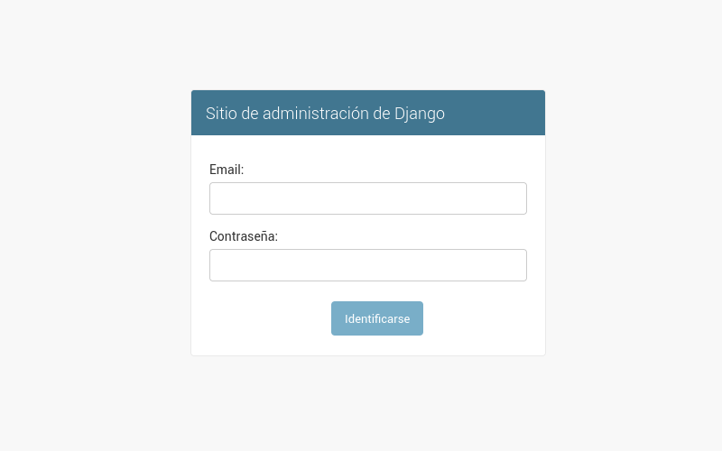
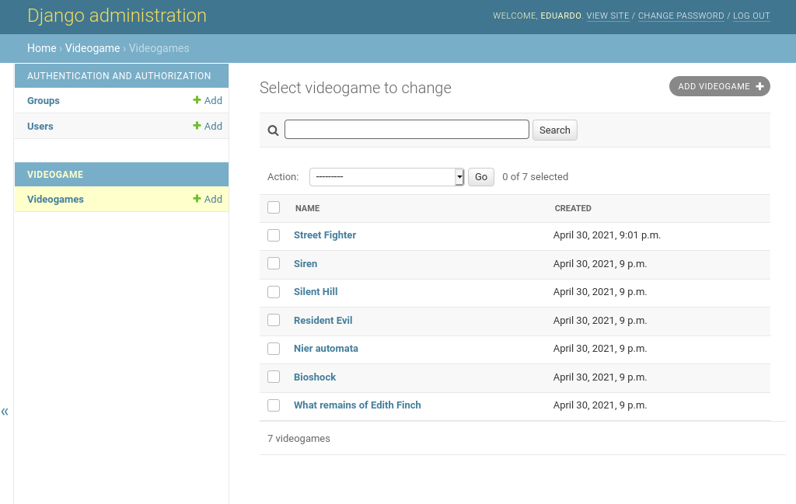
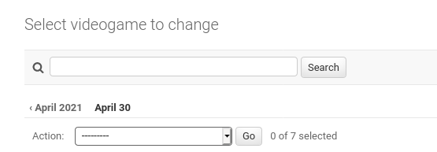
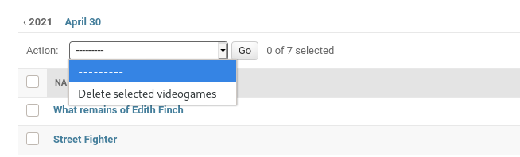
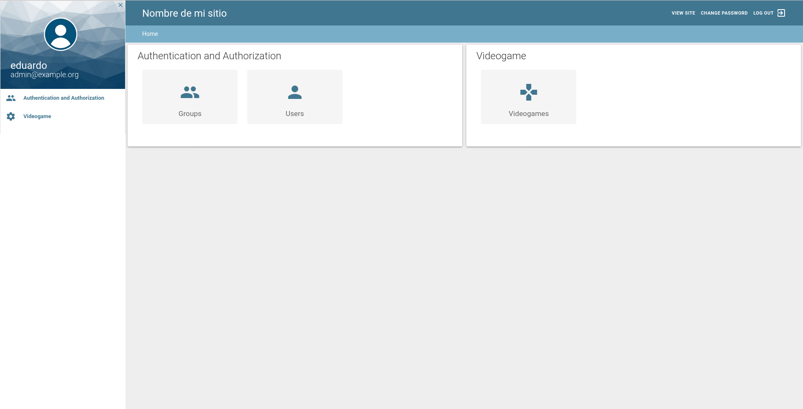

One of the best features of django is that it has the django admin panel, a ready-to-use administration panel, with basic functions such as create, read, edit and delete models, users, groups and permissions. All ready to use just by setting up your application. But sometimes our needs are different, what if we want to modify the appearance or functions of the interface? Fortunately Django includes many functions to customize the behavior of the admin, I will explain some of them below.

The django admin panel is one of [reasons why you should consider using Django](/blog/why-should-you-use-django-framework/).

## Checking that django admin panel is active

If you started your project with the startproject command, the django administration panel will be activated by default. If you go to _/admin/_ the login screen will appear.



If not, or if you start from a previous installation, you must first make sure that it is installed in your configuration file, as well as its dependencies:

* django.contrib.auth
* django.contrib.contenttypes
* django.contrib.messages
* django.contrib.sessions

After all, if you can't authenticate or log in, you won't be able to enter the administration panel, will you?

```python
INSTALLED_APPS = [
    'django.contrib.admin',
    'django.contrib.auth',
    'django.contrib.contenttypes',
    'django.contrib.sessions',
    'django.contrib.messages',
    # ...
]
```

You must also add _django.contrib.messages.context_processors.messages_ and _django.contrib.auth.context_processors.auth_ to the _context_processors_ option in the TEMPLATES variable of your _settings.py_ file.

In the same way add _django.contrib.auth.middleware.AuthenticationMiddleware_ and _django.contrib.messages.middleware.MessageMiddleware_ to the MIDDLEWARE variable of your _settings.py_ file as well.

Now that we are sure that the admin package is active, let's start by adding a model. I'm going to use a hypothetical model called Videogame that looks like this

```python
# videogameStore/models.py
from django.db import models
GENRES = (
        ('HR', 'Horror'),
        ('AD', 'Adventure')
    )

class Videogame(models.Model):
    name = models.CharField(max_length=256)
    description = models.TextField(blank="true")
    genre = models.CharField(choices=GENRES, max_length=2)
    rating = models.FloatField()
    created = models.DateTimeField(auto_now_add=True)
    modified = models.DateTimeField(auto_now=True)

    def __str__(self):
        return self.name
```

## Adding a template to the django admin panel

Let's start with the basics, adding a model to the admin.

```python
# videogameStore/admin.py
from django.contrib import admin
from .models import Videogame

admin.site.register(Videogame)
```

With this we will have a modifiable model in the admin.

If we enter the url /_admin/_ and log in, we will be able to see the interface working.


Note the absence of the search bar

If we click on the gray button in the upper right corner we can add a model.

## Modifying the fields that appear in admin

In the _admin.py_ file inside our Django application we are going to inherit from the admin.ModelAdmin class.

We can endow this model with the _list_display_ property, to tell the admin which fields we want to list in the manager.

The _search_field_ property allows us to specify on which fields the search will be performed.

```python
# videogameStore/admin.py
from django.contrib import admin
from .models import Videogame

class VideogameAdmin(admin.ModelAdmin):
      list_display = ('name', 'created') #Ahora la interfaz mostrará nombre, apellido y email de cada autor.
      search_fields = ('name', 'description')

admin.site.register(Videogame, VideogameAdmin)
```



See the created field and the search bar

## Change the order of the fields when editing

If we want to modify the order of the fields we add a _fields_ property to our class

```python
# videogameStore/admin.py
from django.contrib import admin
from .models import Videogame

class VideogameAdmin(admin.ModelAdmin):
      list_display = ('name', 'created') #Ahora la interfaz mostrará nombre, apellido y email de cada autor.
      search_fields = ('name', 'description')
      fields = ('description', 'name', 'genre', 'rating')
admin.site.register(Videogame, VideogameAdmin)
```

As you can see, the order in which the fields appear has been modified. In order Description, Name, Genre and Rating, just as we specified.


Notice how the order has changed from that specified in the fields property.

## Sorting objects by a field

Ordering specifies the field to be used for ordering the models.

```python
# videogameStore/admin.py
from django.contrib import admin
from .models import Videogame

class VideogameAdmin(admin.ModelAdmin):
      list_display = ('name', 'created') #Ahora la interfaz mostrará nombre, apellido y email de cada autor.
      search_fields = ('name', 'description')
      fields = ('description', 'name', 'genre', 'rating')
      ordering = ('-name',)
admin.site.register(Videogame, VideogameAdmin)
```

Here we have told you to order them by name, in descending order, using the "-" symbol.


Note the arrangement of the models in descending order

## Modifying the header, title and description

If you want to give a personalized touch to the Django admin, even giving it the name of your business, or your client's business. You can do this by modifying the properties of the Admin model as follows:

```python
# videogameStore/admin.py
# ...
admin.site.site_header = 'Nombre de mi sitio'
admin.site.index_title = 'Panel de control de mi sitio'
admin.site.site_title = 'Titulo en la pestaña del navegador'
```

Now you can see that in the main page of the admin you can see the changes we have made.


The three sites have changed

## Sorting objects according to a date field

If we add a _date_hierarchy_ field to our model, we will be able to sort the fields according to a _DateTimeField_ or _DateField_ type field in our model.

```python
# videogameStore/admin.py
from django.contrib import admin
from .models import Videogame

class VideogameAdmin(admin.ModelAdmin):
    # ...
    date_hierarchy = 'created'
admin.site.register(Videogame, VideogameAdmin)
```



The legend April2021 and April 30 appear after placing date_hierarchy

## Create custom dynamic fields

We can also create special fields, which are not part of the model, and which are generated dynamically according to information from the model's own fields or from elsewhere. For example a field that classifies an object according to its ratings.

To create such a field we add the field name to _list_display_ (to tell the admin to display it) and create a method with the same name, this method receives the individual object and must return what we want to be displayed on the screen.

```python
# videogameStore/admin.py
class VideogameAdmin(admin.ModelAdmin):
    list_display = ('name', 'created', 'popular')
    # ...

    def popular(self, obj):
        return "Popular" if obj.rating > 4.5 else "No es popular"
```


## Create actions for the Django admin

All models have the delete action available, which allows you to select several rows from the database and delete them.



In addition to the delete action we can create our own actions that modify our admin elements in the way we wish

As an example we are going to create an action that allows us to set a rating of 5.0 to our objects.

First, we create a function that receives modeladmin, request and the queryset as arguments. The queryset will contain all the objects that we will select in the interface. And we can also add a message to be displayed when the action is executed.

```python
# videogameStore/admin.py
from django.contrib import admin
from django.contrib import messages
from .models import Videogame
# Register your models here.

class VideogameAdmin(admin.ModelAdmin):
    # Ahora la interfaz mostrará nombre, apellido y email de cada autor.
    # ...

    def rate_five_stars(modeladmin, request, queryset):
        queryset.update(rating=5.0)
        messages.success(request, "Se calificó con 5 estrellas")

    admin.site.add_action(rate_five_stars, "Calificar con 5 estrellas")
```

Once the method is created, we add it to the admin through its _add_action()_ method, passing it the method we created and the name we want to appear on the screen to refer to that action, as the first and second arguments, respectively.


If we select some elements and execute the action, it will rate them with 5 stars and the message we defined will appear.


## Installing external templates for django admin

There are quite a few packages that allow quite sophisticated modifications of django admin, which can even turn it into a CMS, just like Wordpress, with which you can deliver to your customers a fully functional application ready to be used by non-technical people.

Examples of the above include the following packages:

* [Jazzmin](https://django-jazzmin.readthedocs.io/)
* [Wagtail](https://wagtail.org/)
* [Mezzanine](https://github.com/stephenmcd/mezzanine)
* [Django CMS](https://www.django-cms.org/en/)

Each one is a topic in itself, so I cannot summarize them in a single entry.

## Example of visual enhancement with django material admin

Finally, I will show you an example of visual enhancement with _django-material-admin_.

Let's install it.

```python
pipenv install django-material-admin
```

And now we modify our INSTALLED_APPS variable

```python
# settings.py
# ...

INSTALLED_APPS = [
    'material',
    'material.admin',
    # removemos django.contrib.admin
    'django.contrib.auth',
    # ...
]
```

We can add an extra field to our admin models to change the icons, just put the name that appears in the [materialize documentation](https://materializecss.com/icons.html).

```python
# videogameStore/admin.py
from django.contrib import admin
from .models import Videogame

class VideogameAdmin(admin.ModelAdmin):
    # ...
    icon_name = 'gamepad'
admin.site.register(Videogame, VideogameAdmin)
```

If we now access the admin, we will be able to see a new, much more stylish terminal. And also a more eye-catching administration panel.




I used this package especially because it installs very easily and gives a completely different look to the admin. But there are [many other options available](https://dev.to/sm0ke/django-admin-dashboards-open-source-and-free-1o80) that you can choose from, some paid and some free.

## Security in django admin

It is advisable to change the default url, _/admin/_, to a less obvious one, this in order to prevent brute force attacks, if the attacker does not know the django admin address, it will be impossible for him to try to guess your password by brute force.

There are also packages that create a fake admin panel that you can monitor, to find out which IP addresses are trying to take over your site via the admin panel, one of them is [django-admin-honeypot](https://github.com/dmpayton/django-admin-honeypot). Once you identify these IP addresses, you can limit their access, blacklist them or block them completely.

If you need extra functionality for the admin, check the [official Django documentation](https://docs.djangoproject.com/en/3.2/ref/contrib/admin/).