---
aliases:
- /django-admin-panel-y-su-personalizacion
- /tutorial-como-modificar-y-personalizar-el-django-admin-panel
- /django-admin-panel-y-su-personalizacion
authors:
- Eduardo Zepeda
categories:
- django
coverImage: images/PersonalizandoElDjangoAdmin.jpg
coverImageCredits: Créditos a https://www.pexels.com/@nic-livefeedpro/
date: '2021-09-14'
description: Tutorial para personalizar el comportamiento y la apariencia estética
  o UI del django admin panel en una aplicación, ordena los campos, omite campos.
keywords:
- django
- python
title: Tutorial ¿Cómo Modificar y Personalizar el Django Admin Panel?
url: django-admin-panel-y-su-personalizacion
---

Una de las mejores características de django es que cuenta con el django admin panel, un panel de administración listo para usarse, con funciones básicas como crear, leer, editar y eliminar modelos, usuarios, grupos y permisos. Todo listo con solo montar tu aplicación. Pero a veces nuestras necesidades son otras ¿y si queremos modificar la apariencia o las funciones de la interfaz? Afortunadamente Django incluye muchísimas funciones para personalizar el comportamiento del admin, te explicaré algunas a continuación.

El panel de administración de django es una de [las razones por las que deberías considerar usar Django](/es/por-que-deberias-usar-django-framework/).

## Revisando que django admin panel esté activo

Si iniciaste tu proyecto con el comando startproject el panel de administración de django estará activado por defecto. Si entras a _/admin/_ aparecerá la pantalla de logueo.

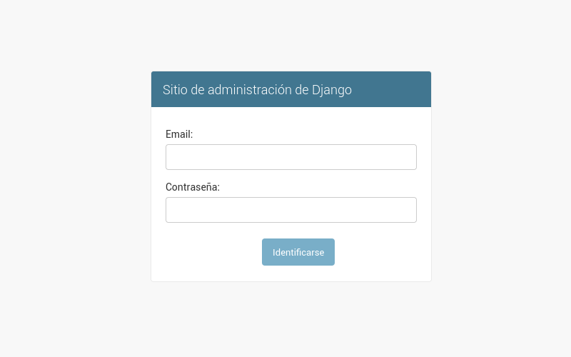

En caso de que no, o de que partas de una instalación previa, primero tienes que asegurarte de que esté instalado en tu archivo de configuraciones, así como sus dependencias:

- django.contrib.auth
- django.contrib.contenttypes
- django.contrib.messages
- django.contrib.sessions

Después de todo, si no puedes autenticarte ni iniciar sesión pues no podrás entrar al panel de administración ¿no?

```python
INSTALLED_APPS = [
    'django.contrib.admin',
    'django.contrib.auth',
    'django.contrib.contenttypes',
    'django.contrib.sessions',
    'django.contrib.messages',
    # ...
]
```

También debes agregar _django.contrib.messages.context\_processors.messages_ y d_jango.contrib.auth.context\_processors.auth_ a la opción de _context\_processors_ en la variable TEMPLATES de tu archivo _settings.py_

De la misma manera agrega _django.contrib.auth.middleware.AuthenticationMiddleware_ y _django.contrib.messages.middleware.MessageMiddleware_ a la variable MIDDLEWARE también de tu archivo _settings.py_.

Ahora que estamos seguros de que el paquete admin está activo, empecemos agregando un modelo. Voy a usar un modelo hipotético llamado Videogame que luce de la siguiente manera

```python
# videogameStore/models.py
from django.db import models
GENRES = (
        ('HR', 'Horror'),
        ('AD', 'Adventure')
    )

class Videogame(models.Model):
    name = models.CharField(max_length=256)
    description = models.TextField(blank="true")
    genre = models.CharField(choices=GENRES, max_length=2)
    rating = models.FloatField()
    created = models.DateTimeField(auto_now_add=True)
    modified = models.DateTimeField(auto_now=True)

    def __str__(self):
        return self.name
```

## Agregar un modelo al django admin panel

Empecemos con lo básico, agregar un modelo al admin.

```python
# videogameStore/admin.py
from django.contrib import admin
from .models import Videogame

admin.site.register(Videogame)
```

Con esto ya tendremos un modelo modificable en el admin.

Si entramos a la dirección url /_admin/_ nos logueamos, podremos ver la interfaz funcionando.

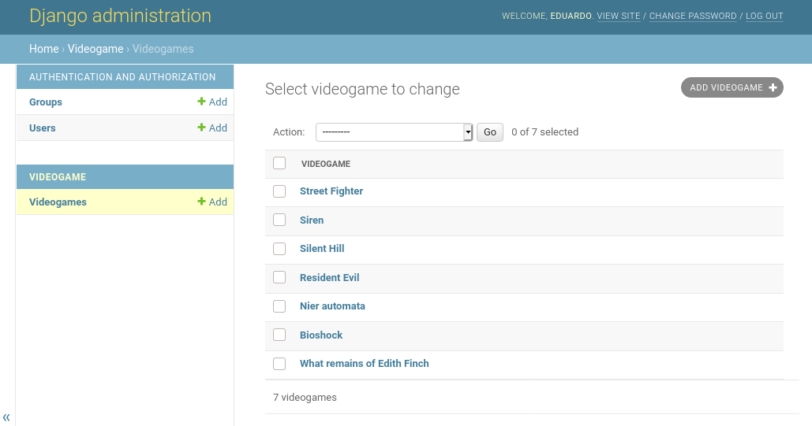

Nota la ausencia de barra de búsqueda

Si le damos click en el botón gris que está en la esquina superior derecha podremos agregar un modelo.

## Modificando los campos que aparecen en el admin

En el archivo _admin.py_ dentro de nuestra aplicación de Django vamos a heredar de la clase admin.ModelAdmin.

Podemos dotar a este modelo de la propiedad _list\_display_, para decirle al admin que campos queremos listar en el administrador.

La propiedad _search\_field_ nos permite especificar sobre que campos va a efectuarse la búsqueda.

```python
 # videogameStore/admin.py
from django.contrib import admin
from .models import Videogame

class VideogameAdmin(admin.ModelAdmin):
      list_display = ('name', 'created') #Ahora la interfaz mostrará nombre, apellido y email de cada autor.
      search_fields = ('name', 'description')

admin.site.register(Videogame, VideogameAdmin)
```

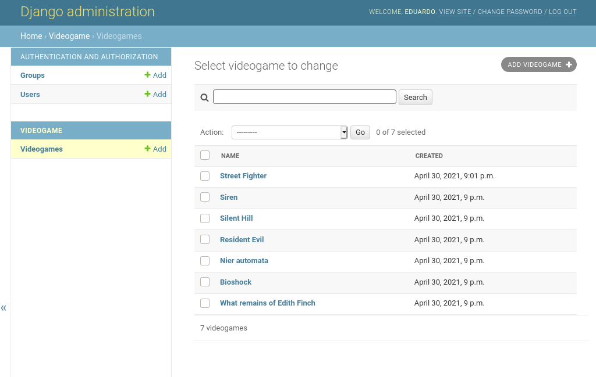

Mira el campo created y la barra de búsqueda

## Modificar el orden de los campos al editar

Si queremos modificar el orden de los campos agregamos una propiedad _fields_ a nuestra clase

```python
# videogameStore/admin.py
from django.contrib import admin
from .models import Videogame

class VideogameAdmin(admin.ModelAdmin):
      list_display = ('name', 'created') #Ahora la interfaz mostrará nombre, apellido y email de cada autor.
      search_fields = ('name', 'description')
      fields = ('description', 'name', 'genre', 'rating')
admin.site.register(Videogame, VideogameAdmin)
```

Como puedes apreciar, el orden en que aparecen los campos se ha modificado. En orden Description, Name, Genre y Rating, justo como lo especificamos.

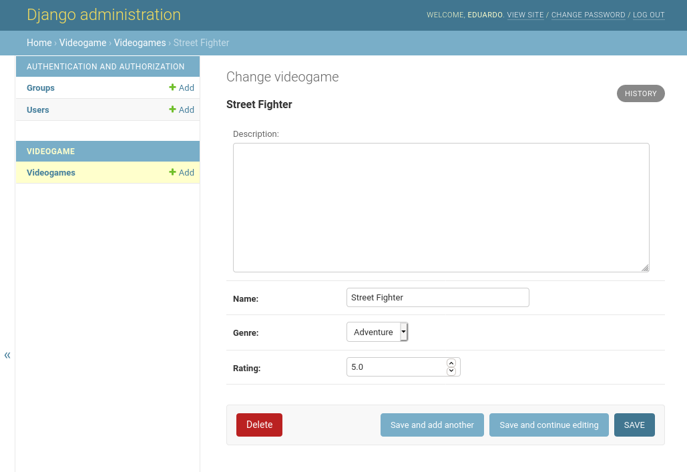

Observa como el orden ha cambio al especificado en la propiedad fields

## Ordenando los objetos por un campo

Ordering especifica el campo que se usará para ordenar los modelos.

```python
# videogameStore/admin.py
from django.contrib import admin
from .models import Videogame

class VideogameAdmin(admin.ModelAdmin):
      list_display = ('name', 'created') #Ahora la interfaz mostrará nombre, apellido y email de cada autor.
      search_fields = ('name', 'description')
      fields = ('description', 'name', 'genre', 'rating')
      ordering = ('-name',)
admin.site.register(Videogame, VideogameAdmin)
```

Aquí le hemos dicho que los ordene por su nombre, de manera descendente, usando el símbolo "-".

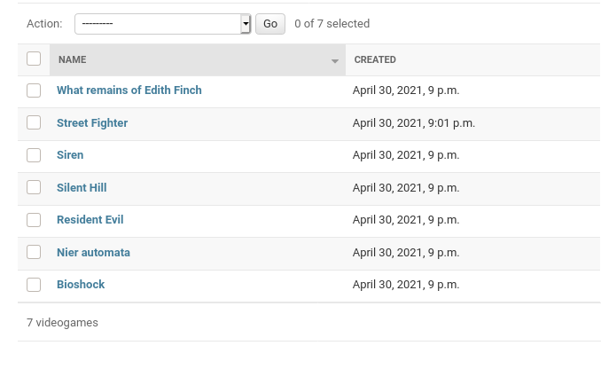

Nota el acomodo de los modelos en orden descendente

## Modificando la cabecera, el título y la descripción

Si quieres darle un toque personalizado al admin de Django, incluso poniéndole el nombre de tu negocio, o el del negocio de tu cliente. Puedes hacerlo modificando las propiedades del modelo Admin de la siguiente manera:

```python
# videogameStore/admin.py
# ...
admin.site.site_header = 'Nombre de mi sitio'
admin.site.index_title = 'Panel de control de mi sitio'
admin.site.site_title = 'Titulo en la pestaña del navegador'
```

Ahora puedes apreciar que en la página principal del admin ya aparecen los cambios que hemos hecho.

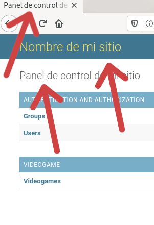

Los tres sitios señalados han cambiado

## Ordenando los objetos de acuerdo a un campo de fecha

Si agregamos un campo _date\_hierarchy_ a nuestro modelo, seremos capaces de ordenar los campos de acuerdo a un campo de tipo _DateTimeField_ o _DateField_ en nuestro modelo.

```python
# videogameStore/admin.py
from django.contrib import admin
from .models import Videogame

class VideogameAdmin(admin.ModelAdmin):
    # ...
    date_hierarchy = 'created'
admin.site.register(Videogame, VideogameAdmin)
```

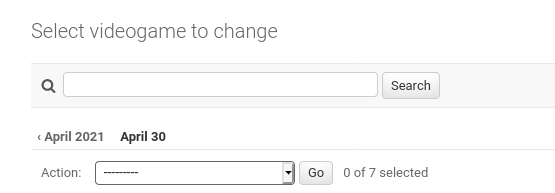

La leyenda April2021 y April 30 aparecen tras colocar date\_hierarchy

## Crear campos dinámicos personalizados

También podemos crear campos especiales, que no forman parte del modelo, y que se generan de manera dinámica de acuerdo a información de los propios campos del modelo o de otro lugar. Por ejemplo un campo que clasifique un objeto de acuerdo a sus calificaciones.

Para crear un campo de estos agregamos el nombre del campo a _list\_display_ (para indicarle al admin que lo muestre) y creamos un método con el mismo nombre, este método recibe el objeto individual y debe retornar lo que queremos que se muestre en pantalla.

```python
# videogameStore/admin.py
class VideogameAdmin(admin.ModelAdmin):
    list_display = ('name', 'created', 'popular')
    # ...

    def popular(self, obj):
        return "Popular" if obj.rating > 4.5 else "No es popular"
```

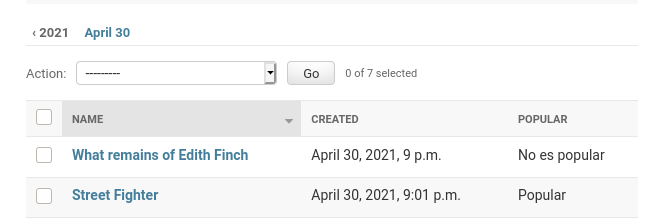

## Crear acciones para el admin de Django

Todos los modelos tienen la acción de eliminar disponible, la cual permite seleccionar varias filas de la base de datos y borrarlas.

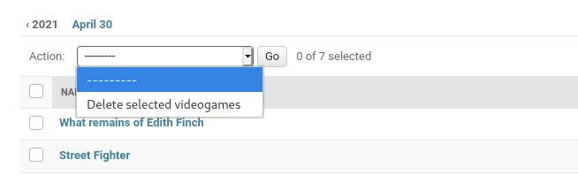

Además de la acción eliminar podemos crear nuestras propias acciones que modifiquen a nuestros elementos del admin en la manera en la que deseemos

Como ejemplo vamos a crear una acción que permite establecer un rating de 5.0 a nuestros objetos.

Primero, creamos una función que recibe modeladmin, request y el queryset como argumentos. El queryset contendrá todos los objetos que seleccionaremos en la interfaz. Y también podemos agregar un mensaje que se muestre cuando se ejecuta la acción.

```python
# videogameStore/admin.py
from django.contrib import admin
from django.contrib import messages
from .models import Videogame
# Register your models here.


class VideogameAdmin(admin.ModelAdmin):
    # Ahora la interfaz mostrará nombre, apellido y email de cada autor.
    # ...

    def rate_five_stars(modeladmin, request, queryset):
        queryset.update(rating=5.0)
        messages.success(request, "Se calificó con 5 estrellas")

    admin.site.add_action(rate_five_stars, "Calificar con 5 estrellas")
```

Una vez creado el método, lo agregamos al admin por medio de su método _add\_action()_, pasándole el método que creamos y el nombre que queremos que aparezca en pantalla para referirse a esa acción, como primer y segundo argumento, respectivamente.

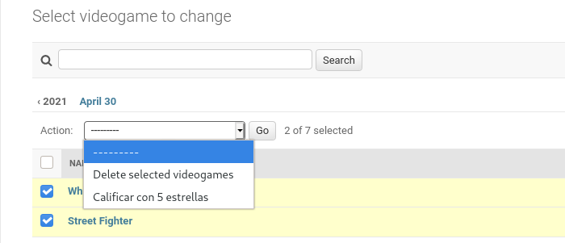

Si seleccionamos algunos elementos y ejecutamos la acción, los calificará con 5 estrellas y nos aparecerá el mensaje que definimos.

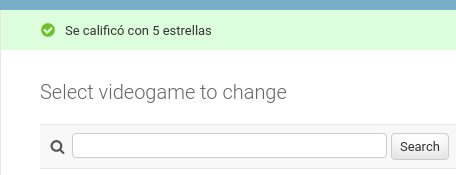

## Instalando plantillas externas para django admin

Existen bastantes paquetes que permiten modificaciones bastante sofisticadas del django admin, que incluso pueden volverlo un CMS, just como Wordpress, con los que puedes entregarle a tus clientes una aplicación complemente funcional y lista para ser usada por personas no técnicas.

Algunos ejemplos de lo anterior incluyen los siguientes paquetes:

- [Jazzmin](https://django-jazzmin.readthedocs.io/)
- [Wagtail](https://wagtail.org/)
- [Mezzanine](https://github.com/stephenmcd/mezzanine)
- [Django CMS](https://www.django-cms.org/en/)

Cada uno es un tema en si mismo, por lo que no puedo resumirlos en una sola entrada.

## Ejemplo de mejora visual con django material admin

Para finalizar te mostraré un ejemplo de mejora visual con _django-material-admin_.

Vamos a instalarlo.

```python
pipenv install django-material-admin
```

Y ahora modificamos nuestra variable INSTALLED\_APPS

```python
# settings.py
# ...

INSTALLED_APPS = [
    'material',
    'material.admin',
    # removemos django.contrib.admin
    'django.contrib.auth',
    # ...
]
```

Podemos agregar un campo extra a nuestros modelos de admin para cambiar los íconos, basta con colocar el nombre que aparece en la [documentación de materialize](https://materializecss.com/icons.html).

```python
# videogameStore/admin.py
from django.contrib import admin
from .models import Videogame

class VideogameAdmin(admin.ModelAdmin):
    # ...
    icon_name = 'gamepad'
admin.site.register(Videogame, VideogameAdmin)
```

Si ahora accedemos al admin, podremos ver una nueva terminal mucho más estilizada. Y también un panel de administración más llamativo.

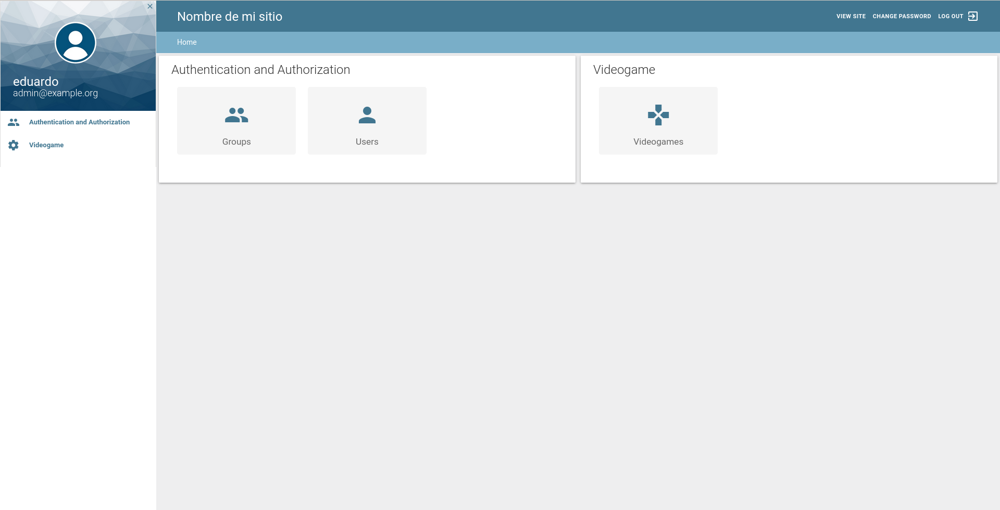

Panel de administración de Django con django-material

Usé este paquete en especial porque se instala muy fácil y le da un aspecto completamente diferente al admin. Pero existen [muchas otras opciones disponibles](https://dev.to/sm0ke/django-admin-dashboards-open-source-and-free-1o80) que puedes elegir, algunas de pago y otras gratuitas.

## Seguridad en el django admin

Es recomendable cambiar la url predeterminada, _/admin/_, a otra menos obvia, esto con la finalidad de prevenir ataques por fuerza bruta, si el atacante no conoce la dirección del django admin, le será imposible intentar adivinar tu contraseña por fuerza bruta.

También hay paquetes que crean un panel de administración falso que puedes monitorear, para conocer aquellas direcciones IP que intentan apoderarse de tu sitio por medio del panel de administración, uno de ellos es [django-admin-honeypot](https://github.com/dmpayton/django-admin-honeypot). Una vez que identificas estas direcciones IP, puedes limitar su acceso, ponerlas en una lista negra o bloquearlas por completo.

Si necesitas funcionalidades extra para el admin, revisa la [documentación oficial de Django](https://docs.djangoproject.com/en/3.2/ref/contrib/admin/).