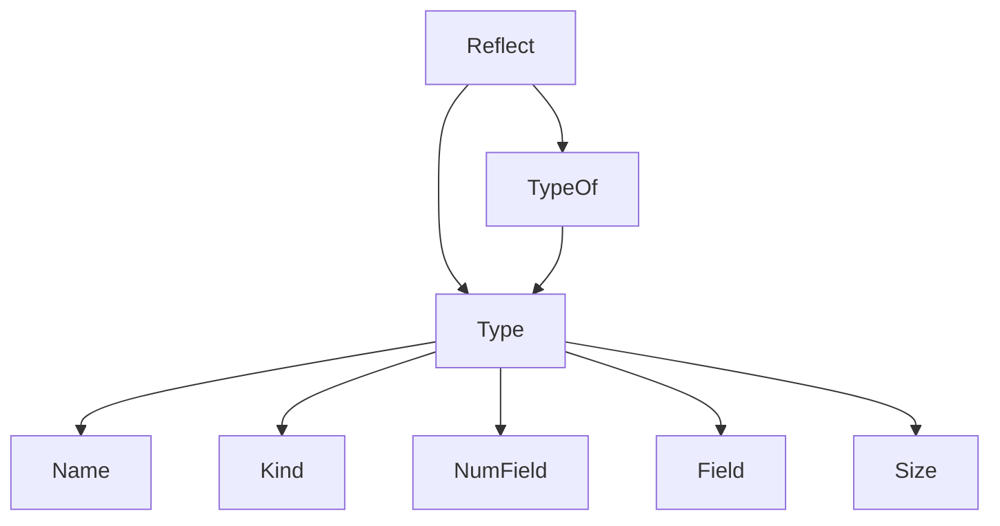
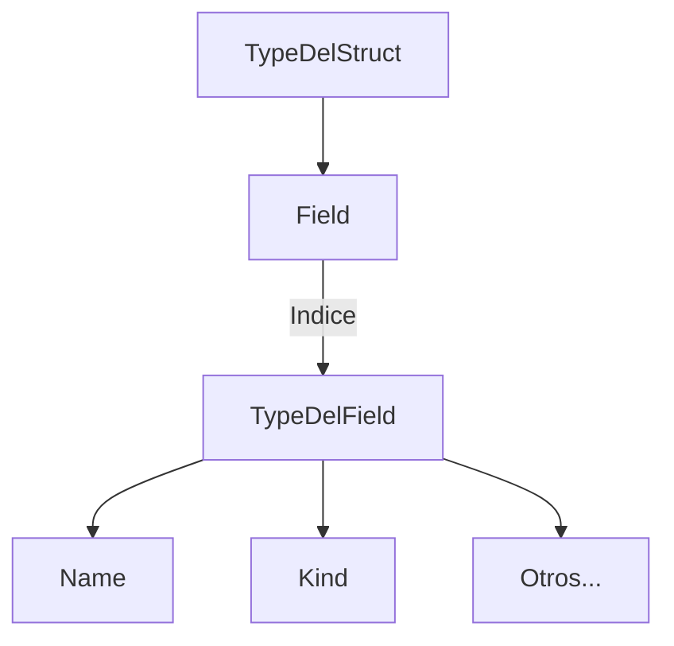
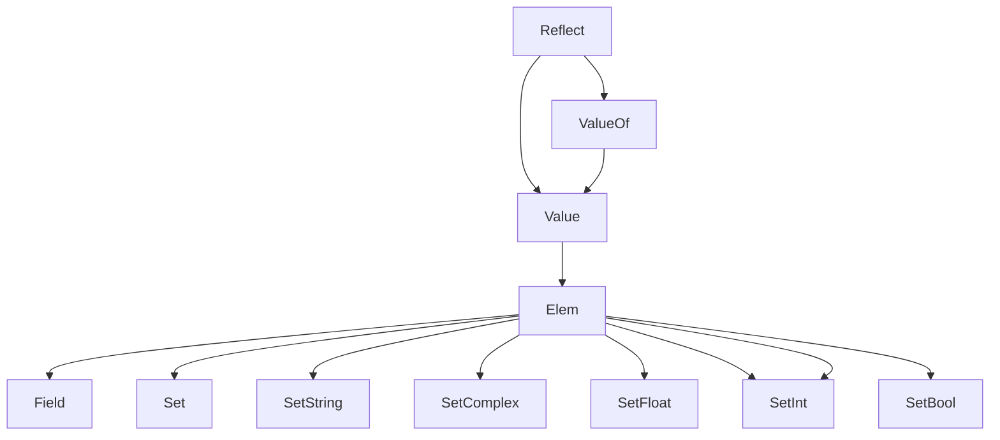

The "reflect" package is a useful library in the Go programming language that provides functions for working with reflection.

## What is reflection in programming?

Reflection is the ability of a program to inspect its own structure at runtime. This includes the ability to examine: types, values and metadata of objects in memory. Reflection allows us to have more flexible and generic code and allows us to create functions and data structures that can work with any type of object, regardless of its type. It is also the basis for metaprogramming.

We can divide Go's reflection into two important types of data:

**Type**: The Go data type, from which all the information of the data type, its class, name, size, etc. is broken down.
** **Value**: The Go data value, with methods to modify the data of an object.

## Data type: Type and TypeOf

_Type_ is the **most important data type in the reflect package** since it represents the object in memory and stores all the meta information of our objects: its type, representation, methods and fields.

And how do we get a _Type_? With the _TypeOf_ method

The _TypeOf_ method of the _reflect_ package is used to get the type of an interface, it receives an _interface_ (i.e. anything) and returns a _reflect.Type_; "the most important type of reflect".



In this diagram I place what I consider the most important methods of _Type_, but both _reflect.Type_ and _reflect.Value_ have many more.

See an example with _TypeOf_:

``` go
type Coffee struct {
    Origin string `tagEjemplo:"valor"`
    Height int
}

instanciaDelCafe := Coffee{Origin: "Michoacan", Height: 1100}
// TypeOf nos devolverá un tipo *reflect.Type*
typeOfCoffee := reflect.TypeOf(instanciaDelCafe)
fmt.Println(typeOfCoffee)
// main.coffee
```

Notice how the data type is a structure corresponding to main, named _coffee_.

### Name, the name of the data type

Name contains the name of the respective data type

``` go
// TypeOf nos devolverá un tipo *reflect.Type*
typeOfCoffee := reflect.TypeOf(instanciaDelCafe)
fmt.Println(typeOfCoffee.Name())
// coffee
```

### Kind, the data type class

The _TypeOf_ method allows us to obtain a _Type_ object, which represents the data type of our interface, from which we can read the data type, with its _Kind_ method.

``` go
// TypeOf nos devolverá un tipo *reflect.Type*
typeOfCoffee := reflect.TypeOf(instanciaDelCafe)
fmt.Println(typeOfCoffee.Kind())
// struct
```

### NumField to get the number of fields in a struct

From _Type_ we can obtain all kinds of useful information, such as the number of fields in an object. This is quite useful in the case of structs and other structures with multiple fields.

``` go
// Obtendremos el número de campos de nuestro objeto
typeOfCoffee := reflect.TypeOf(instanciaDelCafe)
coffeeNumFields := typeOfCoffee.NumField()
fmt.Println(coffeeNumFields)
// 2
```

In this case we get 2 fields (Location and Height)

Consider that if you try to get the NumField of an int type or another type that **does not have multiple fields**, Go will return an error.

``` go
panic: reflect: Field of non-struct type int
```

### Nested Field and Type of a struct

_Type_ also puts at our disposal the _Field_ method, which together with _NumField_, will allow us to access directly to the fields of a struct, from its index.

And, with this, we will be able to access the _Types_ nested inside the _Type_ object.



Each nested _Type_, like its parent, will have the _Name_ and _Kind_ methods that we saw a few lines above.

``` go
// Obtendremos el nombre y tipo del primer campo de nuestro objeto
typeOfCoffee := reflect.TypeOf(instanciaDelCafe)
field := typeOfCoffee.Field(0)
fmt.Println(field.Type.Name())
fmt.Println(field.Type.Kind())
// string string
```

In this case, being primitive data types, both are the same: string; since the string type field is called string.

### Read tags from a struct field with reflect

Reflect also allows us to access an object's metadata, those annotations that you've probably seen if you've worked with ORM and/or JSON in Go.

To obtain the Tags of a struct, _Tag.Get_ is used.

``` go
// Añadimos un tag personalizado para posteriormente leerlo
type Coffee struct {
    Origin string `tagEjemplo:"valor"`
    Height int
}

typeOfCoffee := reflect.TypeOf(instanciaDelCafe)
field := typeOfCoffee.Field(0)
// ...
fmt.Println(field.Tag.Get("tagEjemplo"))
// valor
```

## Data Value: Value and ValueOf

As I told you before, besides Type, there is another very important part in reflect, this is _Value_. The _Value_ corresponds to the value of an interface, and how can we obtain a _Value_? Well, with _ValueOf_, do you notice how consistency is preserved?

The _ValueOf_ method receives an _interface_ as parameter and returns an object of type _Value_ that will contain all the necessary methods to modify its own value.



Look at this example where you can see how _ValueOf_ returns the value of our struct.

``` go
// ValueOf devolverá el valor de nuestra variable
instanciaDelCafe := Coffee{Origin: "Michoacan", Height: 1100}
ValueOfCoffee := reflect.ValueOf(instanciaDelCafe)
fmt.Println(ValueOfCoffee)
// {Michoacan 1100}
```

From Value we will have a series of methods to change the value of an object.

### Modifying a field of a Value object

To modify a field we need to access the _Value_ object that points to our object, which we can obtain by passing a pointer to the _ValueOf_ method. And, from there, we will use _Elem_ to access the value of our object, then its first field (only in the case of structs) and finally change the value using _SetString_.

``` go
instanciaDelCafe := Coffee{Origin: "Michoacan", Height: 1100}
valueofCoffee := reflect.ValueOf(&instanciaDelCafe)
valueofCoffee.Elem().Field(0).SetString("Oaxaca")
fmt.Println(instanciaDelCafe)
//{Oaxaca 1100}
```

### Methods for assigning data in reflect

In addition to the SetString method, Go provides us with [another set of specialized methods for each data type](https://pkg.go.dev/reflect) :

* SetBool(x bool)
* SetBytes(x []byte)
* SetCap(n int)
* SetComplex(x complex128)
* SetFloat(x float64)
* SetInt(x int64)
* SetIterKey(iter *MapIter)
* SetIterValue(iter *MapIter)
* SetLen(n int)
* SetMapIndex(key, elem Value)
* SetPointer(x puntero inseguro)
* SetString(x cadena)
* SetUint(x uint64)
* SetZero()

These methods can be accessed directly from _Value.Elem_ for non-compound data types (such as structs).

``` go
stringOriginal := "Yo NO me imprimiré"
// Obtenemos el valor del string
valor := reflect.ValueOf(&stringOriginal)
stringModificado := "Yo SI me imprimiré en la pantalla"
// Cambiamos el valor original del string 
valor.Elem().SetString(stringModificado)
fmt.Printf(stringOriginal)
// Yo SI me imprimiré en la pantalla
```

#### Modifying a field with the Set method

The specialized methods to "set" a data are very useful, but sometimes we need a more generic method that allows us to modify the values dynamically, and for that reflect provides us with _Set_, yes _Set_ just like that, without anything else.

In this example, first we create a string, to later obtain its value, with _ValueOf_, and then pass this new value to the generic method _Set_, which receives a _Value_ object. And where do we get _Value_ from? Well, from passing any data to _ValueOf_.

``` go
unString := "Oaxaca"
nuevoValue := reflect.ValueOf(unString)
valueofCoffee.Elem().Field(0).Set(nuevoValue)
// {Oaxaca 1100}
```

## Creating an object with reflect

Reflect also allows us to create objects dynamically from a _Type_. To do this, just pass as argument the type of object, _Type_, that we want to create, to the _New_ method, which, as you know, can be easily obtained from _TypeOf_.

``` go
typeOfCoffee := reflect.TypeOf(instanciaDelCafe)
nuevaInstancia := reflect.New(typeOfCoffee)
fmt.Println(nuevaInstancia)
// &{ 0}
```

From the type we obtained with _TypeOf_ reflect will create a new object. However, in this case, being a struct to which we have not specified the values of its fields, it will be initialized with its [zero values](/en/go-programming-language-introduction-to-variables-and-data-types/).

And that's it for the little introduction to reflect, now you know enough to get confused and cry while working with anything that needs reflection. Great isn't it?