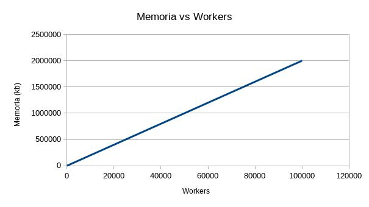
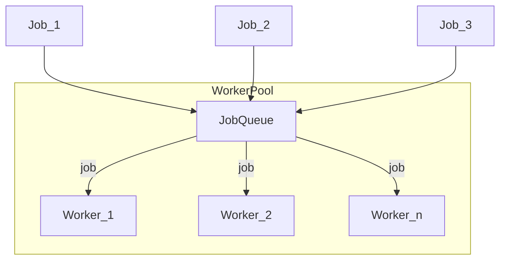
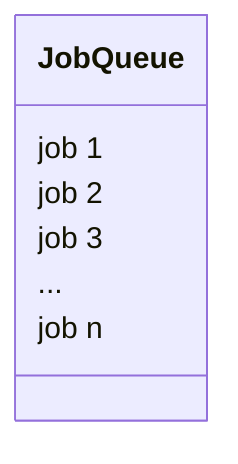
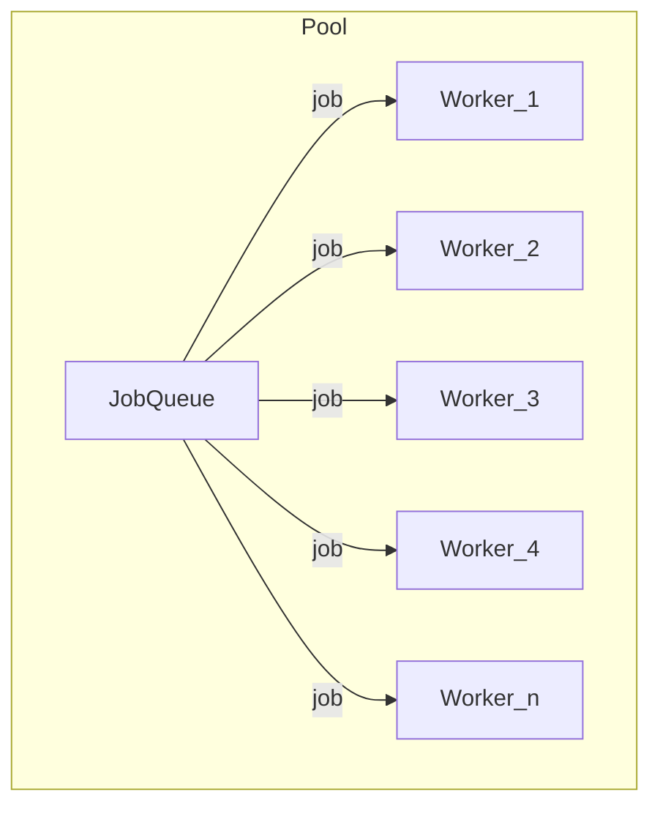
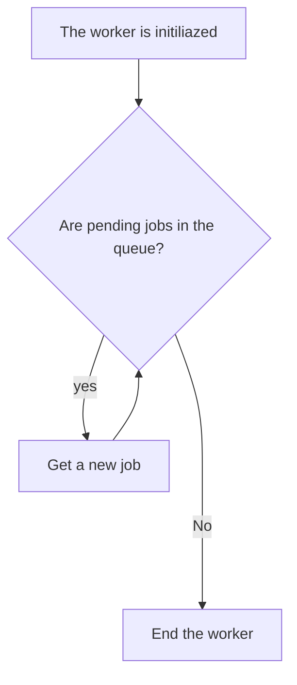
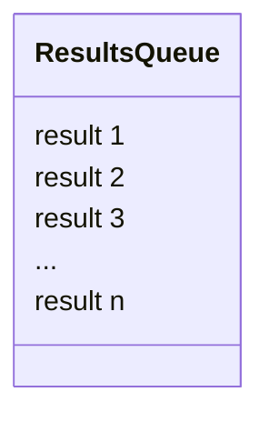

This entry is about a design pattern of which, at the time, I found little to none information in Spanish. Imagine that you have a number of concurrent tasks that you want to perform, either crawling many websites, or perhaps processing information from each of the pixels of an image or anything else you can think of.

The simplistic option is to create a series of workers and use them concurrently, something like this pseudocode:

``` python
for job in jobs:
    async process_concurrent_job()
```

This may look pretty good, at first, but it has multiple disadvantages; first, you will be creating workers without control, which can increase your program's memory usage incredibly fast; second, you are constantly creating and destroying workers, which can be costly for your program.



It would be best to keep memory usage constant and avoid creating and destroying workers frequently. For this, the worker pool pattern works perfect.

Worker pool is a [design pattern](/en/design-patterns-in-software/) that comes to make up for these shortcomings.

There are developers who have used this pattern to [handle a million requests per minute on go.](http://marcio.io/2015/07/handling-1-million-requests-per-minute-with-golang)

## How does the worker pool design pattern work?

Let's take a tail of a task by running, these can be fixed or dynamically created. Then, instead of creating and destroying multiple workers ([goroutines in the case of go](/en/go-introduction-to-goroutines-and-concurrency/)) constantly, we create a **fixed number of workers** and put them in a cycle, in which they will be constantly listening for information from the queue (through a [channel in the case of languages like Go](/en/go-use-of-channels-to-communicate-goroutines/)). This way we will keep our memory management much more stable and predictable, in addition to limiting the impact of constant creation and destruction of workers.

Finally, we can optionally save the results of these tasks in a queue from which they can be read later.



### Job queue

The tasks or jobs that we want to be executed by the workers will go to a task queue or job queue. A normal queue, like any other. This can be fixed, or created on the fly by means of user interactions or other systems.



### The pool

The pool initializes and hosts the number of workers we set up, generally you will want to use a configuration file, environment variables or other means. Each of these workers will take a task, run it, and when it becomes available again, it will again look for a task from the job queue to run and repeat the cycle.



### The worker

The worker is in charge of executing the tasks and, as I mentioned, it will be listening for new tasks or jobs permanently or until a certain limit that we indicate, such as the job queue runs out, a given number of tasks are executed or any other condition that we declare.



The fixed number of workers will ensure that, during the entire program execution, there will be a maximum number of tasks running, which will limit the memory impact of our concurrent tasks.

### The results queue

Optionally, we can send the result of each task executed by a worker to a second queue; the result queue, which we can process later.



This design pattern is very useful when huge amounts of tasks have to be processed and when we do not want to overload the system. And, as you can guess it is quite popular and useful in programming languages that heavily use concurrency, such as [the Go programming language](/en/go-programming-language-introduction-to-variables-and-data-types/).