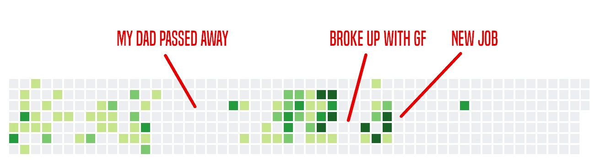
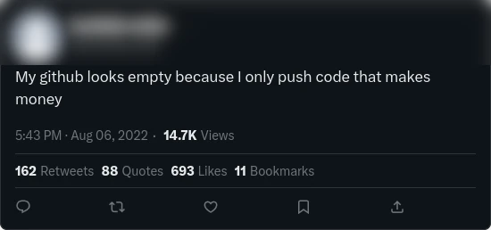
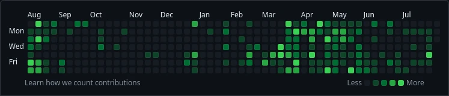
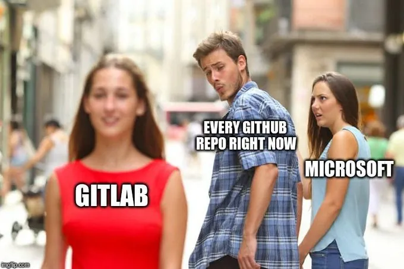

---
aliases:
- /en/using-github-to-evaluate-developers-is-naive/
date: '2024-08-06T10:13:25-06:00'
title: Don't Use Github To Evaluate Developers It Is Naive
categories:
- opinions
- git
coverImage: "images/the-problem-of-using-github-to-evaluate-candidates.jpg"
description: 'Using github to evaluate candidates is a sign of not understanding software world and all its nuances, there are many valid reasons to explain why a developer could refuse to use github'
keyword: ''
keywords:
- Opinions
- Github
- Repository
- Companies
- Human resources
- Gitlab
- Gitea
authors:
- 'Eduardo Zepeda'
---

If you are one of those who use Github contributions to evaluate your candidates, or clients, I'll explain why it's not necessarily a good idea.

It is common practice to use Github to assess a developer's capabilities, but to do so blindly, ignoring the following set of factors, would make your ignorance cost you access to candidates with greater potential and experience in the workings of the software world.

## An empty github does not mean someone is incompetent.

"Absence of evidence is not evidence of absence" or, put in other words, just because a person doesn't have excellent quality code on Github, doesn't mean they can't write it. 

But why would someone not want to show the ~~horrible quality of their code done in javascript~~ good quality of their code? One reason is that they're probably too busy writing code that does pay, rather than contributing to open source. 

Not everyone has an extra day each week to dedicate to open source, some have extra responsibilities beyond work, such as raising a family, caring for sick parents or personal projects.

Ironically my github looks like this:

### Not all programmers love open source

Yes, as you may know, not all developers are ~~fans of free software's Slavoj Žižek: Richard Stallman~~ so altruistic to contribute code to humanity without expecting anything in return, can we blame them?, aren't most companies being hypocritical? Do companies that use Github to evaluate their candidates put their code base as open source on Github?



## The fear of getting your code or ideas stolen

Microsoft has never been known for its ethics when it comes to doing business, since its early days it has been involved in [code theft related rampages](https://www.wired.com/2012/08/ms-dos-examined-for-thef/#?). It has also kept that reputation alive with scandals such as:

- When [Microsoft copied code from a micro-blogging startup](https://www.ft.com/content/ab21f416-e9d1-11de-ae43-00144feab49a#?) and launched its own service.
- When its [AI, Github copilot, blatantly copied the code](https://aibusiness.com/responsible-ai/github-s-ai-powered-coding-tool-allegedly-copied-code#?) of some researchers.

Considering the above, and regardless of the veracity of the claims, **I wouldn't be surprised if some developers choose to keep their code out of the hands of Microsoft and its services,** Github included, of course.

## Not all projects are on Github, Bitbucket, Gitlab, Gitea and others exist too

Github is the de facto service for managing online repositories, but there are other options such as Bitbucket, Gitlab, Gitea, launchpad, which although lacking the size and number of services offered by Github, compensate with a better reputation.

Some developers prefer to use these alternatives as a response to Github's monopoly or perhaps for reasons as banal as preferring one UI over another.

Should Github projects be ignored then?, of course not! but judging a person's capabilities just by the presence or absence of code on Github is just naive.