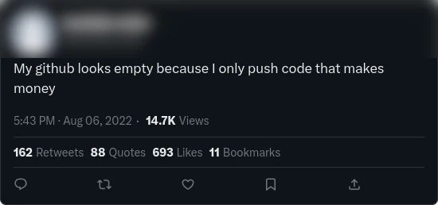

Es una práctica común usar Github para evaluar las capacidades de un desarrollador, pero hacerlo a ciegas, ignorando la siguiente serie de factores, haría que tu ignorancia te costara acceder a candidatos con un mayor potencial y experiencia en el funcionamiento del mundo del software.

## Un github vacio no significa ser incompetente

"La ausencia de evidencia no es evidencia de ausencia" o, puesto en otras palabras, que la persona no tenga código de excelente calidad en Github, no significa que no pueda escribirlo. 

¿Pero porqué alguien no querría mostrar la ~~horrible calidad de su código hecho en javascript~~ calidad de su código? Una de las razones es que probablemente esté demasiado ocupada escribiendo código que sí paga, en lugar de contribuir al open source.

No todos tienen un día extra cada semana para dedicarlo al open source, algunos tienen responsabilidades extras más allá del trabajo, como criar una familia, cuidar de padres enfermos o proyectos personales.

### No todos las programadores adoran el open source

Sí, como ya sabes no todos son ~~fans del Slavoj Žižek del software libre: Richard Stallman~~ tan altruistas para contribuir código a la humanidad sin esperar nada a cambio, ¿podríamos culparlos?, ¿no están siendo hipócritas la mayoría de las empresas? ¿Acaso las empresas que usan Github para evaluar a sus candidatos tienen su base de código como open source?

## Microsoft, Github y los escándalos relacionados con el robo de código

Microsoft nunca ha sido conocida por su ética a la hora de hacer negocios, desde sus inicios se ha visto implicada en [alborotos relacionados con el robo de código](https://www.wired.com/2012/08/ms-dos-examined-for-thef/#?). Además ha mantenido esa fama viva a base de escándalos como:

- Cuando [Microsoft copió el código de una startup de micro-blogging](https://www.ft.com/content/ab21f416-e9d1-11de-ae43-00144feab49a#?) y lanzó su propio servicio.
- Cuando su [AI, Github copilot, copió descaradamente el código](https://aibusiness.com/responsible-ai/github-s-ai-powered-coding-tool-allegedly-copied-code#?) de unos investigadores

Considerando lo anterior, e independientemente de la veracidad de las afirmaciones, **no me extrañaría que algunos desarrolladores opten por mantener su código fuera de las manos de Microsoft y sus servicios,** Github incluído, por supuesto.

## No todos los proyectos está en Github, existen Bitbucket, Gitlab, Gitea y otros

Github es el servicio de facto para el manejo de repositorios en linea, pero existen otras opciones tales como Bitbucket, Gitlab, Gitea, launchpad, que aunque carecen del tamaño y la cantidad de servicios ofrecidos por Github, compensan con una mejor reputación.

Algunos desarrolladores prefieren usar estas alternativas como una respuesta al monopolio de Github o quizás por razones tan banales como preferir una UI sobre otra.

