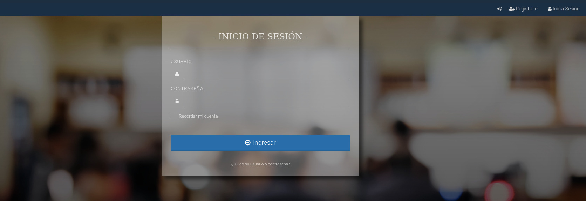
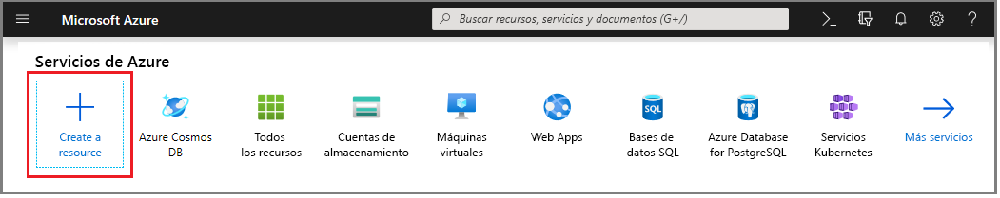
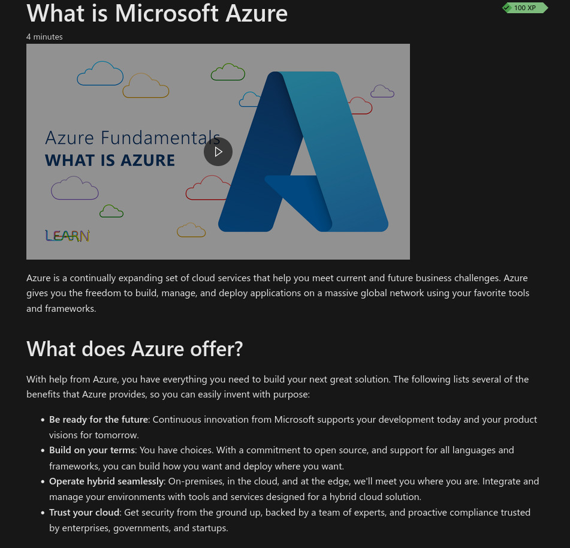
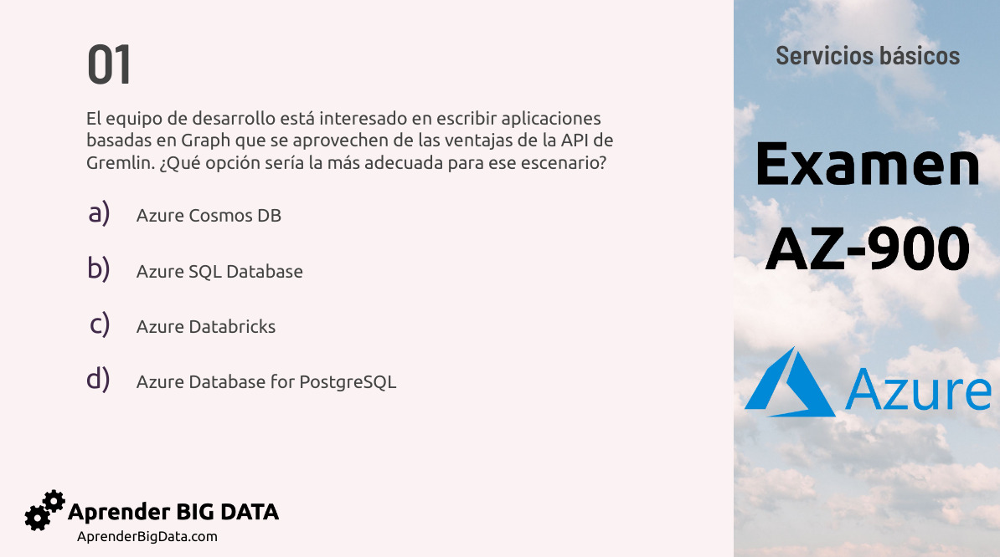
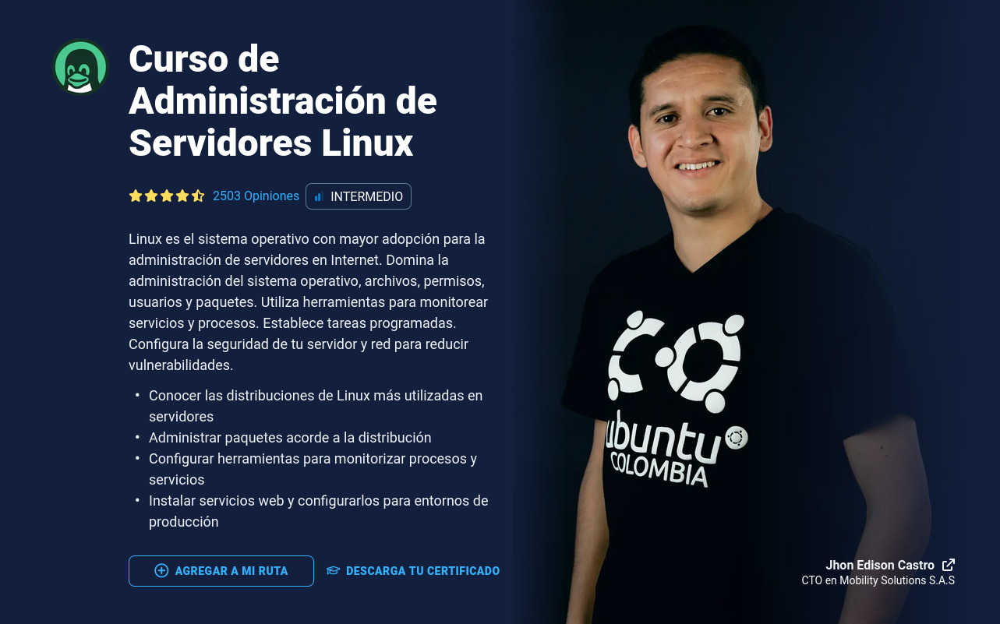

---
aliases:
- /examen-certificacion-azure-az-900-mi-experiencia
- /examen-de-certificacion-azure-az-900-mi-experiencia
authors:
- Eduardo Zepeda
categories:
- arquitectura de software
- opiniones
coverImage: images/mi-experiencia-con-azure.jpg
coverImageCredits: 'Créditos de la imagen: Dmitriy Zub https://unsplash.com/es/@dimitryzub'
date: '2022-09-02'
description: Mi experiencia personal, recomendaciones y todas las referencias que estudié para aprobar el examen de certificación Microsoft Azure AZ-900 Fundamentals
keyword: az-900
keywords:
- devops
- azure
- opinion
- certificacion
title: Examen de Certificacion Azure AZ-900 Mi Experiencia
---

El sábado 6 de agosto del 2022 presenté  y aprobé mi examen para la certificación Microsoft Azure AZ-900.

## ¿En que consiste la certificación AZ-900?

La certificación AZ-900 Fundamentals garantiza que una persona conoce todos los servicios básicos que tiene la nube de microsoft, Azure, y sus aplicaciones empresariales.

Para fines prácticos, te prepara para que sirvas como un intermediario que le recomienda servicios de Microsoft Azure a una empresa o tercero, de acuerdo a sus necesidades. O, que como profesional del software, puedas echar mano de todos los servicios que ofrece Azure. Suele leerse como algo sencillo pero Azure cuenta con una gran cantidad de servicios.

Para conseguir lo anterior necestas conocer la arquitectura básica de Azure, sus diferentes servicios: computo, almacenamiento, inteligencia artificial, etc., sus características especiales, diferencias, y sus respectivos casos de uso.



## Mi proceso de examen

El examen se llevó a cabo a través de la plataforma [Evaluaasi](https://www.evaluaasi.com/), a través de la cual descargas un programa que se conecta a un escritorio remoto para la realización al examen. Este programa monitoreará tu computadora y dispositivos conectados, probablemente para evitar que un usuario haga trampa de alguna manera; he escuchado que algunos procesos de evaluación son tan estrictos que solicitan ver la habitación en la que realizarás el examen antes de comenzar.

Llegada la hora del examen, y una vez conectado al escritorio remoto, un evaluador colocará su usuario y contraseña para darte acceso al examen. 

Según me dijeron en uno de sus correos, la aplicación del examen puede posponerse y son bastantes flexibles.

## Formato del examen AZ-900

La duración del examen es de aproximadamente 60 minutos y cuenta con 45 preguntas, hay preguntas de opción múltiple, verdadero o falso, de relacionar columnas e incluso algunas en las que tienes que elegir una opción del marketplace de Microsoft directamente, justo como si te encontraras en el navegador.

Puedes saltar preguntas y marcarlas para regresar a ellas más adelante, lo cual te recomiendo bastante porque el tiempo está justo, a mi me sobraron 10 minutos, pero hubo algunas preguntas que no pude contestar en la primera vuelta.

El examen se divide en diferentes secciones, cada una con un valor diferente, generalmente fluctuando cerca del 20%.

Al finalizar el examen, el sistema calcula tu puntuación de manera automática, y te informa si aprobaste. Requieres un mínimo de 700 puntos de un máximo 1000 puntos para aprobar.

### Contenido del examen de certificación AZ-900

El examen está fuertemente orientado a las aplicaciones prácticas de los servicios de la nube. Este cuenta con preguntas enfocadas a casos prácticos, donde una empresa ficticia necesita decidir que servicio de la nube puede satisfacer mejor sus necesidades, por lo que no basta con saber definiciones, sino tener muy claros los conceptos y entenderlos, para poder aplicarlos en un entorno un poco más parecido al real.

### ¿En que idioma está el examen?

Al momento de presentar el examen es posible seleccionar de entre **varios idiomas, entre ellos inglés y español**, por lo que despreocúpate si crees que el idioma será una barrera más en este examen.

## ¿Dónde estudiar para el examen de certificación AZ-900?

Para estudiar utilicé los siguientes recursos, te dejo una descripción breve de cada uno.

### Microsoft Learn

La plataforma de [microsoft Learn](https://docs.microsoft.com/en-us/learn/) es el recurso por defecto,  pues nadie mejor que microsoft para para empezar a leer las características básicas de la nube de Azure. Sin embargo, al ser una solución basada únicamente en texto puede llegar a ser algo tediosa. Además, la gran cantidad de información puede hacer que se sientan perdidas aquellas personas que tienen su primer acercamiento con las nuevas tecnologías.

La plataforma de e-learning también está disponible en español, solo selecciona el idioma. 

Lee más adelante para detalles del contenido de esta plataforma.

### Aprenderbigdata

Aprenderbigdata tiene una [guia de examen en 5 archivos PDF](https://aprenderbigdata.com/az-900-azure-fundamentals/) bastante completa con preguntas en español, que puedes usar a manera de cuestionario de repaso, se encuentra casi al final de la página.

### Sitio web de Adam Marczac

El [sitio web de Marczac](https://marczak.io/az-900/) tiene un repaso completo del contenido de la certificación AZ-900, organizado en secciones, junto con un formulario interactivo en el que puedes probar tus conocimientos al momento, además de enlaces a sus videos de youtube. Yo lo recomiendo muchísimo.



### John Savill's Technical Training

Entre los recursos que usé para estudiar quiero destacar el siguiente video de John Savill, pues me pareció **el más completo y mejor explicado**:



Es un repaso de 3 horas en inglés, en el que te explican lo básico de la nube de Azure, de una manera más estructurada y visual. Como un plano gigante de la nube, en el que van explicándote cada parte y como se relaciona con las otras.

## ¿Cuánto cuesta la certificación AZ-900? ¿Es gratis?

La certificación cuesta **alrededor de $90 USD directamente con microsoft**, pero yo la he obtenido de manera gratuita como parte de un reto de certificación de la [plataforma de aprendizaje de Platzi](https://platzi.com/r/eduardo-zepeda).

Tengo entendido que si te registras en la plataforma de e-learning Microsoft Learn, suelen regalar cupones de vez en cuando.

Con tantos cupones y otras opciones gratuitas, **yo no te recomiendo que desembolses el dinero de tu bolsillo** sino que esperes a que aparezca alguna oportunidad de obtenerla de manera gratuita o mucho más barata.

## Proceso de certificación gratuita por parte de Platzi

Hace un par de meses Platzi ofrecía un reto en el que te obsequian la oportunidad de **certificarte de manera completamente gratuita**, a través de su plataforma, con dos requisitos: aprobar una serie de cursos en su plataforma, con sus respectivos exámenes, y completar un laboratorio de prácticas de Microsoft Learn.

### Cursos de Platzi requeridos

El proceso consiste en terminar los siguientes 4 cursos:

* Fundamentos de Ingeniería de Software
* Curso de Introducción a la Terminal y Línea de Comandos
* Curso de Administración de Servidores Linux
* Curso de Introducción a la Nube con Azure

En general los dos primeros son bastantes sencillos, sobre todo si ya tienes experiencia usando los [comandos básicos de la linea de comandos](/es/comandos-basicos-de-linux-grep-ls-cd-history-cat-cp-rm-scp/), los últimos dos sí requieren algo de experiencia o mucha práctica de tu parte para aprobarlos.

### Prácticas de Microsoft Learn 

El laboratorio de prácticas son una serie de 20 cursos en los que cada curso se subidivide en teoría y práctica. En la parte teórica te muestran los fundamentos del tema de manera escrita, mientras que la parte práctica consiste en un pequeño formulario de 3-4 preguntas en el que se evalua el contenido anterior, pero a manera de aplicación práctica. 

Por ejemplo: "Una empresa quiere implementar una casilla de votación en la que la seguridad sea máxima, ¿qué servicio de Microsoft Azure le recomendarías usar".

## Insignia de Azure Fundamentals

Si apruebas el examen, tendrás acceso a la insignia de Microsoft AZ-900 Fundamentals, la cual puedes registrar en Credly, o colocar directamente su badge en un sitio web, tu perfil de Linkedin u otro medio. 

Esta es la mía, alojada en credly.

