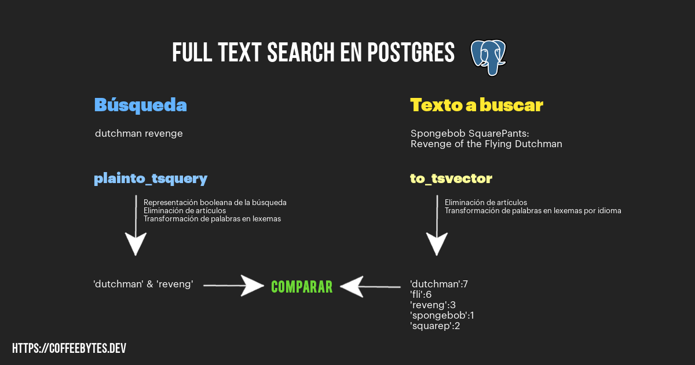

Sometimes when we type we make a mistake in a letter, we can repeat it, omit it or change it for another one. That mistake can lead to a series of different results in a web search, or even no results at all. Maybe for a blog it does not represent a threat, but for an ecommerce it can mean the loss of a sale, and for those stores with a huge traffic, a successful text search, either using full text search or something more complex, in Django or another framework, can represent the difference between losses or huge profits.

Django is a framework that abstracts most of the code you need to perform text searches in Postgres, so if you are thinking about a project that requires a search engine, using Django combined with Postgres is a combination to take into account another popular option to perform searches in Django is [Solr and Django-haystack](/en/full-text-search-and-searches-with-django-and-postgres/).

If you are still hesitating about using Django, check my post where I explain [the advantages and disadvantages of Django](/en/why-should-you-use-django-framework/)

If you already know how basic searches work and want to move on to more complex searches with trigrams visit my [trigrams and advanced searches with Django.](/en/trigrams-and-advanced-searches-with-django-and-postgres/) post.

Let's start with the most basic searches.

## contains and icontains with Django and Postgres

Django has a number of basic functions that allow you to search for an exact match of a text string.

```python
from videogame.models import Videogame
Videogame.objects.filter(name__contains="NIER")
<QuerySet []>
# ...WHERE "videogame_videogame"."name"::text LIKE %NIER%
```

But this will exclude the words "nier", "Nier" and any other case differences. So we should perform a case insensitive search for these differences. Now it doesn't matter if the user used upper or lower case. Notice how, internally, the SQL query returns all uppercase.

```python
Videogame.objects.filter(name__icontains="nier") # nota la i, antes de contains
<QuerySet [<Videogame: Nier automata>]>
#...WHERE UPPER("videogame_videogame"."name"::text) LIKE UPPER(%nier%)
```

But what if our search string has accents? A search for "nier" (without accent) will give us different results than "niér" (accented). Usually people on the internet do not take care of the correct accentuation of words. So, in order to return what they are looking for, it is necessary to create a search in which the correct accentuation is irrelevant.

```python
Videogame.objects.filter(name__icontains="tekkén")
<QuerySet []>
Videogame.objects.filter(name__unaccent__icontains="tekkén") # Ahora no importa que la palabra esté acentuada
<QuerySet [<Videogame: Tekken>]>
#...WHERE UPPER(UNACCENT("videogame_videogame"."name")::text) LIKE '%' || UPPER(REPLACE(REPLACE(REPLACE(UNACCENT(tekkén), E'\\', E'\\\\'), E'%', E'\\%'), E'_', E'\\_')) || '%'
```

If you got an error when you ran the above search, it is because you have not installed the _unnacent_ extension. Let's install it.



## How to install Postgres extensions in Django?

### Prerequisites

Have psycopg2 and its dependencies installed in [your virtual environment](/en/pipenv-the-virtual-environment-manager-you-dont-know/)

```python
pip install psycopg2 # también sirve con pip install psycopg2
```

Likewise, make sure your project has the _django.contrib.postgres_ application installed and check that you are using _postgres_ in the _DATABASES_ variable of your configuration file:

```python
# settings.py

INSTALLED_APPS = [
    # ...
    'django.contrib.postgres',
    # ...
]

# ...

DATABASES = {
    'default': {
        'ENGINE': 'django.db.backends.postgresql_psycopg2',
        'NAME': 'base_de_datos',
        'USER': 'usuario',
        'PASSWORD': 'contrasena',
        'HOST': 'localhost',
        'PORT': '5432',
    }
}
```

### Installing postgres extensions in Django from a migration

To install a new extension **create an empty migration** which we will modify next. Now we open the file and install the extensions under the operations section.

```bash
./manage.py makemigrations tu_app --empty
```

Now we place in operations the extension we want to install.

```python
from django.contrib.postgres.operations import UnaccentExtension

class Migration(migrations.Migration):

    dependencies = [
        (<snip>)
    ]

    operations = [
        UnaccentExtension(),
        # TrigramExtension() # Descomenta esta linea para instalar esta extensión también
    ]
```

Let's run the migrations.

```bash
./manage.py migrate
```

There, now we have the _unaccent_ extension installed and, if you uncommented the line in the migrations file, _TrigramExtension_ will also be installed.

### Installing extensions from the Postgres terminal

Another way to install the extensions is to execute the required command directly from the database. For this example we install _TrigramExtension_, the extension required to use trigram searches. I will cover [trigrams with django and postgres](/en/trigrams-and-advanced-searches-with-django-and-postgres/), so don't worry about that, just focus on the process of installing the extensions.

To enter the database terminal I will use the dbshell command provided by Django.

```bash
python3 manage.py dbshell
psql (9.6.20)
conexión SSL (protocolo: TLSv1.2, cifrado: ECDHE-RSA-AES256-GCM-SHA384, bits: 256, compresión: desactivado)
Digite «help» para obtener ayuda.

basededatos=# CREATE EXTENSION pg_trgm;
CREATE EXTENSION
```

With all the functions we have seen above, we can search with uppercase, lowercase, accents and without accents, but what about more complex searches?

## Django full text search

When performing a search it would not make sense to search for articles and prepositions, as it would return too many results, so it is better to omit them. Imagine how many results you would get in an online store with a thousand items if you search for the article "he" or the preposition "in".

Another aspect that would be great for our searches would be to return words that match the same lexeme or base. That is, if our user searches for "cat", we would probably also want to return data that match derivatives of that word: cat, cat, cats, cats, cats, cats, gatuno or any other word that starts with "gat".


All of the above is quite common in Postgres and is already covered by Django's search functionality. Django incorporates full text searching.

And what is that? Well, translating directly from the postgres page it means more or less the following.

> Full-text search (or text-only search) provides the ability to identify natural language documents that satisfy a query, and optionally sort them by their relevance to the query. The most common type of search is to find all documents that contain certain terms of a query and return them sorted by their similarity to the query.
>
> [https://www.postgresql.org/docs/current/textsearch-intro.html](https://www.postgresql.org/docs/current/textsearch-intro.html)

The similarity will take into account the number of times the word appears, how far apart the search queries are in the text and other factors that we can establish ourselves.

```python
Videogame.objects.filter(name__search="dutchman revenge")
<QuerySet [<Videogame: Spongebob SquarePants: Revenge of the Flying Dutchman>]>
# WHERE to_tsvector(COALESCE("videogame_videogame"."name", )) @@ plainto_tsquery(dutchman revenge)
```

Isn't it great? We passed a two-word phrase to our search, the words are not adjacent in our data, and it still returned a result.

### How does search work in Django?

Look at the SQL query in the last code block and note the _to_tsvector_ and _plainto_tsquery_ functions.



Diagram of full text search in Postgres

The _search_ function executes the _to_tsvector_ function, which takes the field of our model (in this case _name_) and removes the conjunctions, articles and leaves only the lexemes (the part of a word that does not change from a word with the gender and number of a word e.g.: gat would be the lexeme of cat, cat, cats, cats, etc.) and its position in the phrase passed as argument.

```sql
SELECT to_tsvector('english', 'Spongebob SquarePants: Revenge of the Flying Dutchman');
                        to_tsvector                        -
----------------------------------------------------------
 'dutchman':7 'fli':6 'reveng':3 'spongebob':1 'squarep':2
```

Notice how articles and prepositions (of and the) were eliminated and how SquarePants became squarep, Revenge became reveng and flying became fli.

Also, notice how we specify the language. Postgres must receive the correct language to identify lexemes and propositions.

On the other hand, the _plainto_tsquery_ function transforms its argument to a _tsquery_, which is the Boolean representation of the words of a phrase.


```sql
SELECT plainto_tsquery('english', 'dutchman revenge');
    plainto_tsquery    -
----------------------
 'dutchman' & 'reveng'
```

Did you notice that _revenge_ became _reveng_?

Once _search_ has the results of each function it compares them to see if they match or not.

In this way our search will be much more flexible and it will no longer be necessary for the user to search for an exact text string in order to return the results we want.

### Text search in multiple fields of a Django model

Searching on a single field is quite limiting, so we can use _SearchVector_ to search on multiple fields, even foreign key relationships.

Simply separate the field names using commas.

```python
from django.contrib.postgres.search import SearchVector
Videogame.objects.annotate(
     search=SearchVector('name', 'description'),
 ).filter(search='Nier')
```

SearchVector objects can also be combined for better readability.

```python
from django.contrib.postgres.search import SearchVector
Videogame.objects.annotate(
     search=SearchVector('name') + SearchVector('description'),
 ).filter(search='Nier')
```

Remember I told you that lexemes and propositions vary by language? Well, in the _config_ parameter we can specify the language on which we want postgres to work for that query.

```python
from django.contrib.postgres.search import SearchVector
from django.db import F

Videogame.objects.annotate(
     search=SearchVector('name', 'description', config=F('blog__language')), # config = 'spanish' también valia
 ).filter(search='Nier')
```

## Repeat the calls to_tsvector is inefficient

Notice that every time we perform a query using the Django ORM, the _to_tsvector_ function is executed on the field we specify, but what if the field in our model contains a lot of information? **The function is going to run with each search and return the same result over and over again**, isn't it a bit inefficient? Well, yes, and the Django developers have already thought of that.

```python
from django.db import models
from django.contrib.postgres.search import SearchVectorField

class Videogame(models.Model):
    name = models.CharField(max_length=256)
    created = models.DateTimeField(auto_now_add=True)
    modified = models.DateTimeField(auto_now=True)
    search_vector = SearchVectorField(blank=True, null=True)

    def __str__(self):
        return self.name
```

This new field is like any other field, at the beginning it has nothing and we can put anything in it, although we probably want it to contain the vector of one of the fields of our model. But Django will not make it automatic, it is our responsibility to keep it updated with the content that suits us, either by overwriting the _save_ method, using _signals_, periodic tasks, _celery_ or whatever approach you prefer.

```python
from django.contrib.postgres.search import SearchVector

Videogame.objects.update(search_vector=SearchVector('name'))
Videogame.objects.filter(search_vector='revenge')
```

If you are interested to deepen more about how Postgres handles internally these functions, I found an excellent article on [text search in postgresql](https://blog.kaleidos.net/como-usar-busqueda-de-texto-en-postgresql/) where they explain in SQL code the search vectors.

Enter my next post where I will talk about [advanced searches with Postgres and Django](/en/trigrams-and-advanced-searches-with-django-and-postgres/).