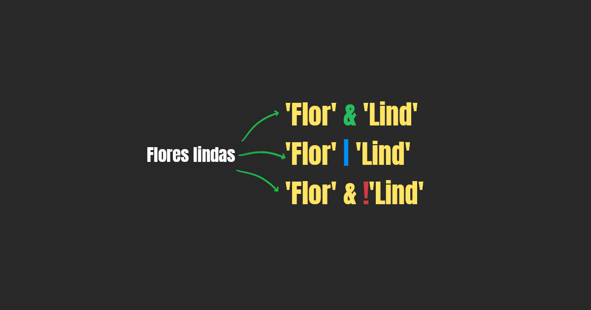

Algunas veces cuando tecleamos nos equivocamos en una letra, podemos repetirla, omitirla o cambiarla por otra. Ese error puede arrojar una serie de resultados diferentes en una búsqueda web, o incluso carecer de resultados. Quizás para un blog no represente una amenaza, pero para un ecommerce puede significar la perdida de una venta, y para aquellas tiendas con un tráfico gigantesco, una búsqueda de texto exitosa, ya sea usando full text search o algo más complejo, en Django u otro framework, puede representar la diferencia entre perdidas o ganancias enormes.

Django es un framework que abstrae la mayor parte del código que necesitas para realizar búsquedas de texto en Postgres, por lo que si estás pensando en un proyecto que requiera de un buscador, usar Django combinado con Postgres es una combinación a tomar en cuenta.

Si aún estás dudando sobre si usar Django, revisa [mi entrada donde te explico las ventajas que tiene Django para ofrecerle a tu proyecto.](https://coffeebytes.dev/por-que-deberias-usar-django-framework/)

Si ya conoces como funcionan las búsquedas básicas y quieres pasar a búsquedas más complejas con trigramas visita mi entrada de [trigramas y búsquedas avanzadas con Django.](https://coffeebytes.dev/trigramas-y-busquedas-avanzadas-con-django-y-postgres/)

Empecemos por las búsquedas más básicas.

## contains e icontains con Django y Postgres

Django tiene una serie de funciones básicas que te permiten buscar la coincidencia exacta de una cadena de texto.

```python
from videogame.models import Videogame
Videogame.objects.filter(name__contains="NIER")
<QuerySet []>
# ...WHERE "videogame_videogame"."name"::text LIKE %NIER%
```

Pero esto nos va a excluir las palabras "nier", "Nier" y cualquier otra diferencia causada por mayúsculas o minúsculas. Por lo que nos convendría realizar una búsqueda insensible a estas diferencias. Ahora no importa si el usuario uso mayúsculas o minúsculas. Observa como, internamente, la consulta SQL vuelve todo a mayúsculas.

```python
Videogame.objects.filter(name__icontains="nier") # nota la i, antes de contains
<QuerySet [<Videogame: Nier automata>]>
#...WHERE UPPER("videogame_videogame"."name"::text) LIKE UPPER(%nier%)
```

¿Pero y si nuestro cadena a buscar tiene acentos? Una búsqueda para "nier" (sin acento) va a darnos resultados diferentes que "niér" (acentuada). Normalmente la gente en internet no cuida la correcta acentuación de las palabras. Por lo que lo que, para devolver lo que ellos están buscando, es necesario crear una búsqueda en la que la acentuación correcta sea irrelevante.

```python
Videogame.objects.filter(name__icontains="tekkén")
<QuerySet []>
Videogame.objects.filter(name__unaccent__icontains="tekkén") # Ahora no importa que la palabra esté acentuada
<QuerySet [<Videogame: Tekken>]>
#...WHERE UPPER(UNACCENT("videogame_videogame"."name")::text) LIKE '%' || UPPER(REPLACE(REPLACE(REPLACE(UNACCENT(tekkén), E'\\', E'\\\\'), E'%', E'\\%'), E'_', E'\\_')) || '%'
```

Si cuando ejecutaste la búsqueda anterior te saltó un error es porque te falta instalar la extensión _unnacent_. Vamos a instalarla.

## ¿Cómo instalar las extensiones de Postgres en Django?

### Prerrequisitos

Tener instalado psycopg2 y sus dependencias en [tu entorno virtual.](https://coffeebytes.dev/pipenv-el-administrador-de-entornos-virtuales-que-no-conoces/)

```python
pipenv install psycopg2 # también sirve con pip install psycopg2
```

De la misma manera, asegúrate de que tu proyecto tenga la aplicación _django.contrib.postgres_ instalada y revisa que estés usando _postgres_ en la variable _DATABASES_ de tu archivo de configuración:

```python
# settings.py

INSTALLED_APPS = [
    # ...
    'django.contrib.postgres',
    # ...
]

# ...

DATABASES = {
    'default': {
        'ENGINE': 'django.db.backends.postgresql_psycopg2',
        'NAME': 'base_de_datos',
        'USER': 'usuario',
        'PASSWORD': 'contrasena',
        'HOST': 'localhost',
        'PORT': '5432',
    }
}
```

### Instalar extensiones de postgres en Django desde una migración

Para instalar una extensión nueva **creamos una migración vacía** que modificaremos a continuación. Ahora abrimos el archivo e instalamos las extensiones bajo la sección de operaciones.

```bash
./manage.py makemigrations tu_app --empty
```

Ahora colocamos en operaciones la extensión que deseamos instalar.

```python
from django.contrib.postgres.operations import UnaccentExtension

class Migration(migrations.Migration):

    dependencies = [
        (<snip>)
    ]

    operations = [
        UnaccentExtension(),
        # TrigramExtension() # Descomenta esta linea para instalar esta extensión también
    ]
```

Corramos las migraciones.

```bash
./manage.py migrate
```

Listo, ahora tenemos instalada la extensión _unaccent_ y, si descomentaste la linea del archivo de migraciones, _TrigramExtension_ también estará instalada.

### Instalar extensiones desde la terminal de Postgres

Otra manera de instalar las extensiones es ejecutar el comando requerido directo de la base de datos. Para este ejemplo instalamos _TrigramExtension_, la extensión requerida para usar búsquedas con trigramas. Trataré el tema de los trigramas en mi [siguiente entrada "Trigramas y búsquedas avanzadas con Django y Postgres"](https://coffeebytes.dev/trigramas-y-busquedas-avanzadas-con-django-y-postgres/), por lo que no te preocupes por eso, solo céntrate en el proceso de instalación de las extensiones.

Para entrar en la terminal de la base de datos usaré el comando dbshell que nos provee Django.

```bash
python3 manage.py dbshell
psql (9.6.20)
conexión SSL (protocolo: TLSv1.2, cifrado: ECDHE-RSA-AES256-GCM-SHA384, bits: 256, compresión: desactivado)
Digite «help» para obtener ayuda.

basededatos=# CREATE EXTENSION pg_trgm;
CREATE EXTENSION
```

Con todas las funciones que vimos anteriormente ya podemos buscar con mayúsculas, minúsculas, acentos y sin acentos, pero, ¿y las búsquedas más complejas?

## Django full text search o búsqueda de texto completo

Al realizar una búsqueda no tendría sentido buscar artículos y preposiciones, ya que nos devolvería demasiados resultados, por lo que es mejor omitirlos. Imagínate cuantos resultados obtendrías en una tienda en linea con mil artículos si buscas el artículo "él" o la preposición "en".

Otro aspecto que estaría genial para nuestras búsquedas sería devolver palabras que coinciden con la misma lexema o base. Es decir, si nuestro usuario busca "gato", probablemente querremos devolverme también aquellos datos que coincidan con derivados de esa palabra: gato, gata, gatos, gatas, gatuno o cualquier otra palabra que empiece con "gat".


Todo lo anterior es bastante común en Postgres y ya está cubierto por la funcionalidad search de Django. Django incorpora búsqueda de texto completo o full text searching.

¿Y eso que es? Pues traduciendo directo de la página de postgres significa más o menos lo siguiente.

> La búsqueda de texto completo (o solo búsqueda de texto) provee la capacidad de identificar documentos en lenguaje natural que satisfacen una consulta, y opcionalmente ordenarlos por su relevancia con la consulta. El tipo de búsqueda más común es encontrar todos los documentos que contienen ciertos términos de una consulta y retornarlos ordenados por su similitud a la consulta.
> 
> [https://www.postgresql.org/docs/current/textsearch-intro.html](https://www.postgresql.org/docs/current/textsearch-intro.html)

La similitud va a tomar en cuenta el número de veces que aparece la palabra, que tan distanciadas están las consultas de una búsqueda en el texto y otros factores que podemos establecer nosotros mismos.

```python
Videogame.objects.filter(name__search="dutchman revenge")
<QuerySet [<Videogame: Spongebob SquarePants: Revenge of the Flying Dutchman>]>
# WHERE to_tsvector(COALESCE("videogame_videogame"."name", )) @@ plainto_tsquery(dutchman revenge)
```

¿No es genial? Le pasamos una frase formada por dos palabras a nuestra búsqueda, las palabras no son adyacentes en nuestros datos y aún así nos devolvió un resultado.

### ¿Cómo funciona search en Django?

Mira la consulta SQL del último bloque de código y observa las funciones _to\_tsvector_ y _plainto\_tsquery_


Esquema de full text search en Postgres

La función _search_ ejecuta la función _to\_tsvector_, la cual toma el campo de nuestro modelo (en este caso _name_) y remueve las conjunciones, artículos y deja solo los lexemas (la parte de una palabra que no cambia de una palabra con el género y el número de una palabra por ejemplo: gat sería el lexema de gato, gata, gatos, gatas, etc.) y su posición en la frase que se le pasa como argumento.

```sql
SELECT to_tsvector('english', 'Spongebob SquarePants: Revenge of the Flying Dutchman');
                        to_tsvector                        -
----------------------------------------------------------
 'dutchman':7 'fli':6 'reveng':3 'spongebob':1 'squarep':2
```

Observa como se eliminaron los artículos y preposiciones (of y the) y como SquarePants se transformó en squarep, Revenge en reveng y flying en fli.

Así mismo, aprecia como especificamos el idioma. Postgres debe recibir el idioma correcto para identificar los lexemas y las proposiciones.

Por otro lado, la función _plainto\_tsquery_ transforma su argumento a un _tsquery_, que es la representación de las palabras de una frase de manera booleana.



```sql
SELECT plainto_tsquery('english', 'dutchman revenge');
    plainto_tsquery    -
----------------------
 'dutchman' & 'reveng'
```

¿Notaste que _revenge_ se transformó en _reveng_?

Una vez que _search_ tiene los resultados de cada función los compara para ver si coinciden o no.

De esta manera nuestra búsqueda será mucho más flexible y ya no será necesario que el usuario busque una cadena exacta de texto para poder devolverle los resultados que queremos.

### Búsqueda de texto en múltiples campos de un modelo de Django

Buscar en un solo campo es bastante limitante, por lo que podemos usar _SearchVector_ para buscar en múltiples campos, incluso en relaciones de llave foránea.

Basta con separar los nombres de los campos usando comas.

```python
from django.contrib.postgres.search import SearchVector
Videogame.objects.annotate(
     search=SearchVector('name', 'description'),
 ).filter(search='Nier')
```

Así mismo, los objetos SearchVector pueden combinarse para una mejor legibilidad

```python
from django.contrib.postgres.search import SearchVector
Videogame.objects.annotate(
     search=SearchVector('name') + SearchVector('description'),
 ).filter(search='Nier')
```

¿Te acuerdas que te dije que los lexemas y las proposiciones variaban según el idioma? Pues en el parámetro _config_ podemos especificar el idioma sobre el cual queremos que postgres trabaje para esa consulta.

```python
from django.contrib.postgres.search import SearchVector
from django.db import F

Videogame.objects.annotate(
     search=SearchVector('name', 'description', config=F('blog__language')), # config = 'spanish' también valia
 ).filter(search='Nier')
```

## Repetir las llamadas a to\_tsvector es ineficiente

Observa que cada vez que realizamos una consulta usando el ORM de Django, se ejecuta la función _to\_tsvector_ en el campo que nosotros le especifiquemos, pero ¿y si el campo de nuestro modelo contiene muchísima información? **La función va a ejecutarse con cada búsqueda y va a devolver el mismo resultado una y otra vez**, ¿no es un poco ineficiente? Pues sí, y los desarrolladores de Django ya pensaron en eso.

```python
from django.db import models
from django.contrib.postgres.search import SearchVectorField

class Videogame(models.Model):
    name = models.CharField(max_length=256)
    created = models.DateTimeField(auto_now_add=True)
    modified = models.DateTimeField(auto_now=True)
    search_vector = SearchVectorField(blank=True, null=True)

    def __str__(self):
        return self.name
```

Este nuevo campo es como un campo cualquiera, al principio no tiene nada y podemos ponerle lo que sea, aunque probablemente querramos que contenga el vector de uno de los campos de nuestro modelo. Pero Django no lo hará automático, es responsabilidad nuestra mantenerlo actualizado con el contenido que nos convenga, ya sea sobreescribiendo el método _save_, usando _signals_, tareas periódicas, _celery_ o cualquier aproximación que prefieras.

```python
from django.contrib.postgres.search import SearchVector

Videogame.objects.update(search_vector=SearchVector('name'))
Videogame.objects.filter(search_vector='revenge')
```

Si te interesa profundizar más respecto a como maneja Postgres internamente estas funciones, encontré un [excelente artículo](https://blog.kaleidos.net/como-usar-busqueda-de-texto-en-postgresql/) donde explican en código SQL los vectores de búsqueda.

Entra mi siguiente [entrada donde hablaré de búsquedas avanzadas con Postgres y Django.](https://coffeebytes.dev/trigramas-y-busquedas-avanzadas-con-django-y-postgres/)
