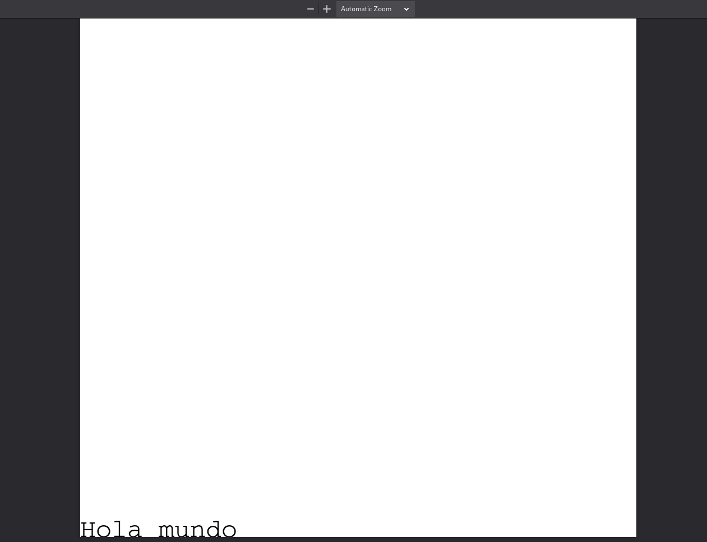
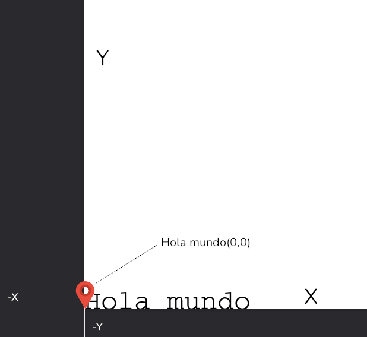
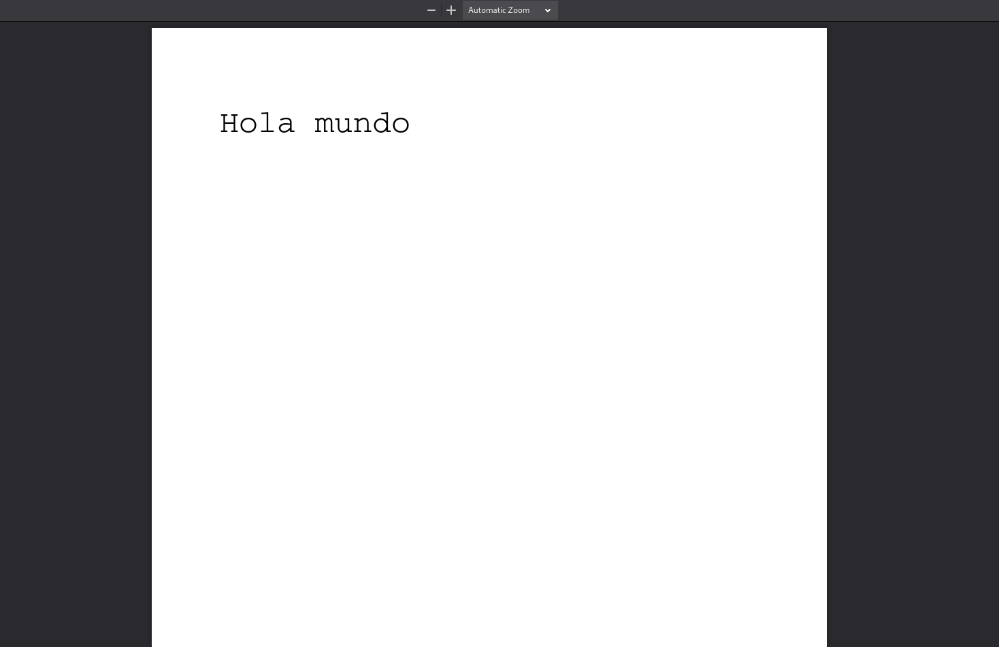
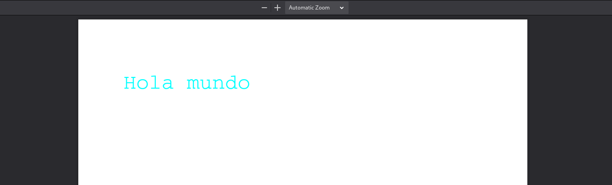
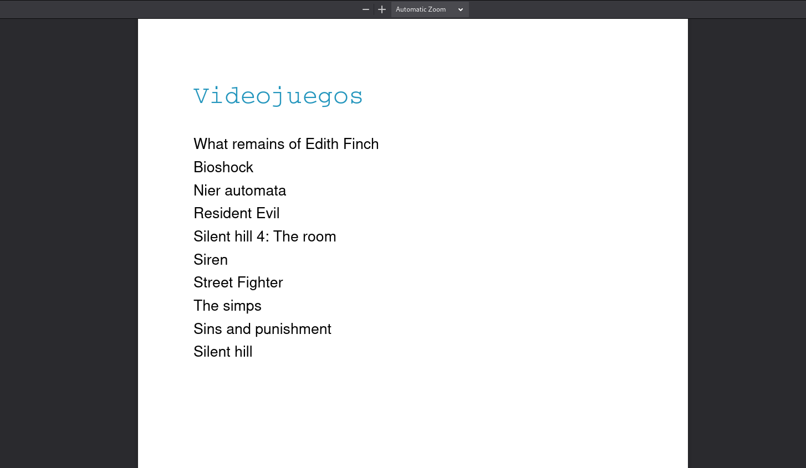

With django and reportlab we can generate PDFs dynamically, using information from our database, user input or any other business logic we want.

## Installation of reportlab

The first thing will be to install reportlab, we can use pip, pipenv or any other package manager you want.

```bash
pip install reportlab
# pip install reportlab
```

## Define PDF response type in Django

Once installed, the first lines we will write will be to make sure that the browser knows that we will return a pdf, we will do it through an HTTP header, the Content-Type header, through the _content_type_ variable.

We will then tell it to open it as an attachment, in a new window. I will show you how it looks step by step, for didactic reasons, but **you need to save in the response object the pdf before you can see it on your screen**, I will do it a little later.

```python
from reportlab.pdfgen import canvas
from django.http import HttpResponse

def pdfVideogame(request):
    response = HttpResponse(content_type="application/pdf")
    response["Content-Disposition"] = 'attachment; filename="hello.pdf"'
```

## Create text in a PDF in Django

To begin with we are going to create a canvas to write on it.

This library works as if we were painters, we can only have one brush active, each different brush stroke (font, font size or color) requires us to change brush (set another text size, font or color).

As you know, the first thing a painter needs is a canvas, for this the Canvas method is perfect.

Then, as if we were choosing a brush, we will choose our font and size.

```python
def pdfVideogame(request):
    # ...
    p = canvas.Canvas(response)
    p.setFont("Courier", 28)
```

Now we are going to use that font to "draw" a string at position 0 and 0.

```python
def pdfVideogame(request):
    # ...
    p.drawString(0, 0, "Hola mundo")
```



This will draw our string... at the bottom of the screen.

Why in the background? You may think that canvas works with a Cartesian plane, we just told reportlab to draw the string in the 0,0 coordinates of the plane.



### Positioning the text

Now that we know that the first argument is the X-axis separation value, while the second is the Y-axis separation, we will try something more natural.

```python
def pdfVideogame(request):
    # ...
    p.drawString(60, 750, "Hola mundo")
```



### Change font color in PDF

To change the font color we use the setFillColorRGB method. We need to call this method before reportlab paints our string, otherwise it will use the active one.

We pass the RGB value (a float from 0 to 1) that we want our text to have.

```python
def pdfVideogame(request):
    # ...
    p.setFillColorRGB(0,1,1)
    p.drawString(60, 750, "Hola mundo")
```



We already have a simple text, let's save the content we generated and return it as a response.

## Save a PDF and return as a response

Our instance of the canvas object received our response object as an argument, so the changes we just made were saved in the response object.

```python
def pdfVideogame(request):
    # ...
    p.showPage()
    p.save()
    return response
```

Remember that, as we are in django, we will have to add your view to the urls.

```python
from .views import pdfVideogame

urlpatterns = [
    # ...
    path("pdf", pdfVideogame, name="pdfVideogame"),
]
```

## Generate PDF dynamically with Django

Knowing this, we will be able to create a PDF directly by iterating over a database query using the django ORM.

```python
def pdfVideogame(request):
    #...
    p.setFont("Courier", 28)
    p.setFillColorRGB(0.14, 0.59, 0.74)
    p.drawString(60, 750, "Videojuegos")

    p.setFont("Helvetica", 16)
    p.setFillColorRGB(0, 0, 0)

    # Usamos el ORM de Django para consultar la base de datos
    videogames = Videogame.objects.all()

    positionY = 700
    for videogame in videogames:
        # Accedemos al nombre individual de cada objeto
        p.drawString(60, positionY, videogame.name)
        positionY -= 25
    # ...
```

First we create a title with font and change to another one for dynamic information.
We simply use the django ORM to create any query we want and call the drawString method for each object in our query.

Notice how I decrease the position of the Y coordinate, so that each iteration writes the text in a new line, otherwise each line would overlap with the next.



## Improve performance when generating PDF

If you have performance problems when handling complex PDFs, consider using Python's io library, which allows you to work with an object that behaves exactly as if it were a file, but in memory.

```python
from io import BytesIO

def pdfVideogame(request):

    buffer = BytesIO()

    p = canvas.Canvas(buffer)

    # ... 

    p.showPage()
    p.save()

    pdf = buffer.getvalue()
    buffer.close()
    response.write(pdf)
    return response
```

Instead of passing the response object to the Canvas method, we pass a binary buffer.

At the end, after saving the changes in the pdf, we get the buffer value, close it and write it in the answer.

I leave here the complete code:

```python
def pdfVideogame(request):
    response = HttpResponse(content_type="application/pdf")
    response["Content-Disposition"] = 'attachment; filename="hello.pdf"'
    buffer = BytesIO()
    p = canvas.Canvas(buffer)
    p.setFont("Courier", 28)
    p.setFillColorRGB(0.14, 0.59, 0.74)
    p.drawString(60, 750, "Videojuegos")
    p.setFont("Helvetica", 16)
    p.setFillColorRGB(0, 0, 0)
    videogames = Videogame.objects.all()
    positionY = 700
    for videogame in videogames:
        p.drawString(60, positionY, videogame.name)
        positionY -= 25
    p.showPage()
    p.save()
    pdf = buffer.getvalue()
    buffer.close()
    response.write(pdf)
    return response
```

Now you know how to create a simple PDF that will be useful in most cases.