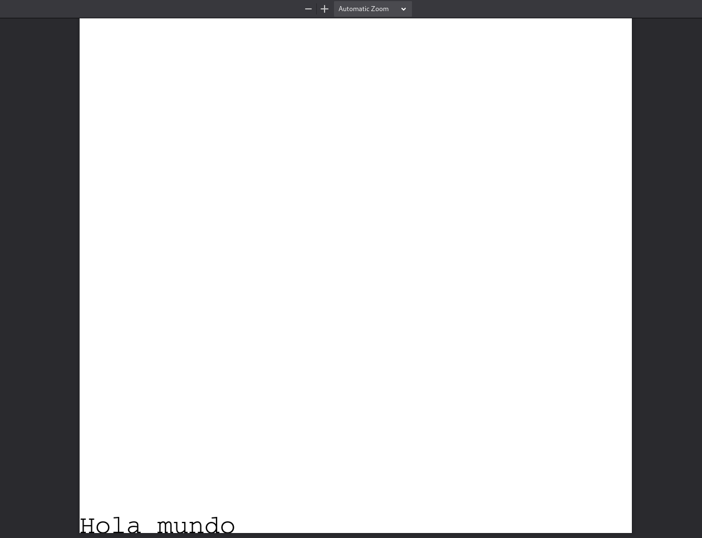
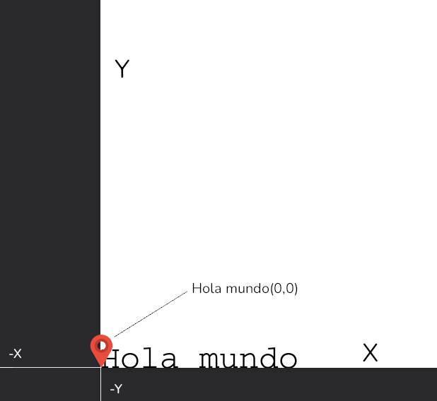
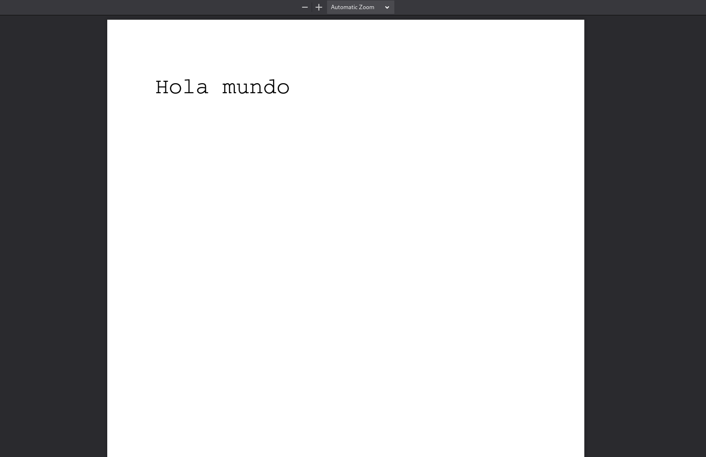
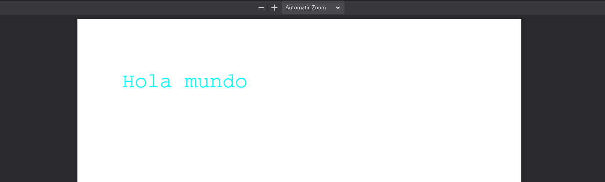

---
aliases:
- /generer-pdfs-con-django-y-reportlab
- /tutorial-generacion-de-pdfs-con-django-y-reportlab
- /generar-pdfs-con-django-y-reportlab
authors:
- Eduardo Zepeda
categories:
- django
coverImage: images/generar-pdfs-con-django.jpg
coverImageCredits: Créditos de la imagen a https://unsplash.com/es/@retrokram
date: '2022-09-22'
description: Tutorial para generar PDFs en Django con Reportlab, definir el tipo de
  respuesta crear texto, posicionarlo, cambiarlo de color y devolverlo como respuesta
keywords:
- python
- django
title: Tutorial Generación de PDFs con Django y Reportlab
url: generar-pdfs-con-django-y-reportlab
---

Con django y reportlab podemos generar PDFs de manera dinámica, usando información de nuestra base de datos, input del usuario o cualquier otra lógica de negocio que deseemos. 

## Instalación de reportlab

Lo primero será instalar reportlab, podemos usar pip, pipenv o cualquier otro gestor de paquetes que quieras.

```bash
pip install reportlab
# pip install reportlab
```
## Definir tipo de respuesta PDF en Django

Una vez instalado vamos, las primeras lineas que escribiremos serán para asegurarnos de que el navegador sepa que le devolveremos un pdf, lo haremos por medio de una cabecera HTTP, la cabecera Content-Type, por medio de la variable *content_type*

Posteriormente le diremos que lo abra como un archivo adjunto, en una nueva ventana. Te mostraré como va quedando paso a paso, por razones didácticas, pero **necesitas guardar en el objeto response el pdf antes de poder verlo en tu pantalla**, lo haré un poco más adelante.

```python
from reportlab.pdfgen import canvas
from django.http import HttpResponse

def pdfVideogame(request):
    response = HttpResponse(content_type="application/pdf")
    response["Content-Disposition"] = 'attachment; filename="hello.pdf"'
```

## Crear texto en un PDF en Django

Para empezar vamos a crear un lienzo o canvas para escribir en él. 

Esta librería funciona como si fueramos pintores, solo podemos tener activo un pincel, cada pincelada diferente (tipo de letra, tamaño de letra o color) requiere que cambiemos de pincel (establecer otro tamaño de texto, fuente o color)

Como ya sabes, lo primero que necesita un pintor es un lienzo, para esto viene perfecto el método Canvas. 

Posteriormente, tal cual si escogieramos un pincel, vamos a elegir nuestro tipo de letra y tamaño.

```python
def pdfVideogame(request):
    # ...
    p = canvas.Canvas(response)
    p.setFont("Courier", 28)
```

Ahora vamos a usar ese tipo de letra para "dibujar" un string en la posición 0 y 0.

```python
def pdfVideogame(request):
    # ...
    p.drawString(0, 0, "Hola mundo")
```



Esto dibujará nuestro string... en el fondo de la pantalla. 

¿Por qué en el fondo? Puedes pensar que canvas trabaja con un plano cartesiano, le acabamos de decir a reportlab que dibuje el string en las coordenadas 0,0 del plano.



### Posicionando el texto

Ahora que sabemos que el primer argumento es el valor de separación del eje de las X, mientras que el segundo es la separación del eje de las Y, intentaremos algo más natural.

```python
def pdfVideogame(request):
    # ...
    p.drawString(60, 750, "Hola mundo")
```



### Cambiar color de letra en el PDF

Para cambiar el color de letra usamos el método setFillColorRGB. Necesitamos llamar este método antes de que reportlab pinte nuestro string, de otra manera usará el que esté activo.

Le pasamos el valor RGB (Un flotante de 0 a 1) que querramos que tenga nuestro texto.

```python
def pdfVideogame(request):
    # ...
    p.setFillColorRGB(0,1,1)
    p.drawString(60, 750, "Hola mundo")
```



Ya tenemos un texto simple, vamos a guardar el contenido que generamos y a retornarlo como respuesta. 

## Guardar un PDF y retornarlo como respuesta

Nuestra instancia del objeto canvas recibió nuestro objeto response como argumento, por lo que los cambios que acabamos de hacer se guardaron en el objeto response.

```python
def pdfVideogame(request):
    # ...
    p.showPage()
    p.save()
    return response
```

Recuerda que, como estamos en django, deberemos agregar tu vista a las urls.

```python
from .views import pdfVideogame

urlpatterns = [
    # ...
    path("pdf", pdfVideogame, name="pdfVideogame"),
]
```

## Generar PDF de manera dinámica con Django

Sabiendo lo anterior, seremos capaces de crear un PDF de manera directa iterando sobre una consulta a la base de datos usando el ORM de django.

```python
def pdfVideogame(request):
    #...
    p.setFont("Courier", 28)
    p.setFillColorRGB(0.14, 0.59, 0.74)
    p.drawString(60, 750, "Videojuegos")

    p.setFont("Helvetica", 16)
    p.setFillColorRGB(0, 0, 0)

    # Usamos el ORM de Django para consultar la base de datos
    videogames = Videogame.objects.all()

    positionY = 700
    for videogame in videogames:
        # Accedemos al nombre individual de cada objeto
        p.drawString(60, positionY, videogame.name)
        positionY -= 25
    # ...
```

Primero creamos un título con tipo de letra y cambiar a otro para la información dinámica.
Simplemente usamos el ORM de django para crear cualquier consulta que querramos y llamamos al método drawString por cada objeto de nuestra query.

Observa como disminuyo la posición de la coordenada Y, para que cada iteración escriba el texto en una nueva linea, de otra forma cada linea se sobrepondría con la siguiente.


## Mejorar el rendimiento al generar PDF

Si tienes problemas de rendimiento al manejar PDFs complejos, considera usando la biblioteca io de Python, que permite trabajar con un objeto que se comporta exactamente como si fuera un archivo, pero en memoria.

```python
from io import BytesIO

def pdfVideogame(request):

    buffer = BytesIO()

    p = canvas.Canvas(buffer)

    # ... 
    
    p.showPage()
    p.save()

    pdf = buffer.getvalue()
    buffer.close()
    response.write(pdf)
    return response
```

En lugar de pasarle el objeto response al método Canvas, le pasamos un buffer binario.

Al final, después de guardar los cambios en el pdf, obtenemos el valor del buffer, lo cerramos y lo escribimos en la respuesta.

Te dejo aquí el código completo:

```python
def pdfVideogame(request):
    response = HttpResponse(content_type="application/pdf")
    response["Content-Disposition"] = 'attachment; filename="hello.pdf"'
    buffer = BytesIO()
    p = canvas.Canvas(buffer)
    p.setFont("Courier", 28)
    p.setFillColorRGB(0.14, 0.59, 0.74)
    p.drawString(60, 750, "Videojuegos")
    p.setFont("Helvetica", 16)
    p.setFillColorRGB(0, 0, 0)
    videogames = Videogame.objects.all()
    positionY = 700
    for videogame in videogames:
        p.drawString(60, positionY, videogame.name)
        positionY -= 25
    p.showPage()
    p.save()
    pdf = buffer.getvalue()
    buffer.close()
    response.write(pdf)
    return response
```

Ahora ya sabes como crear un PDF sencillo que te va a servir para la mayoría de los casos.