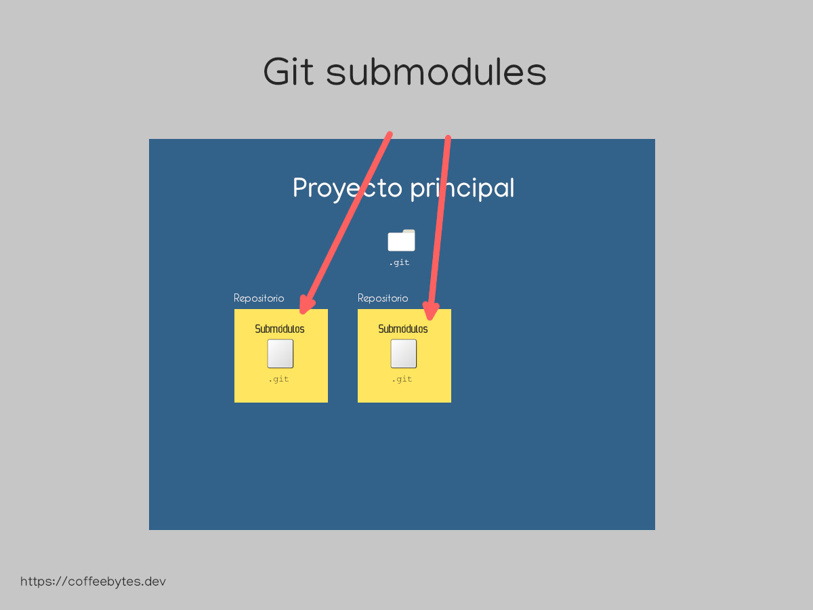
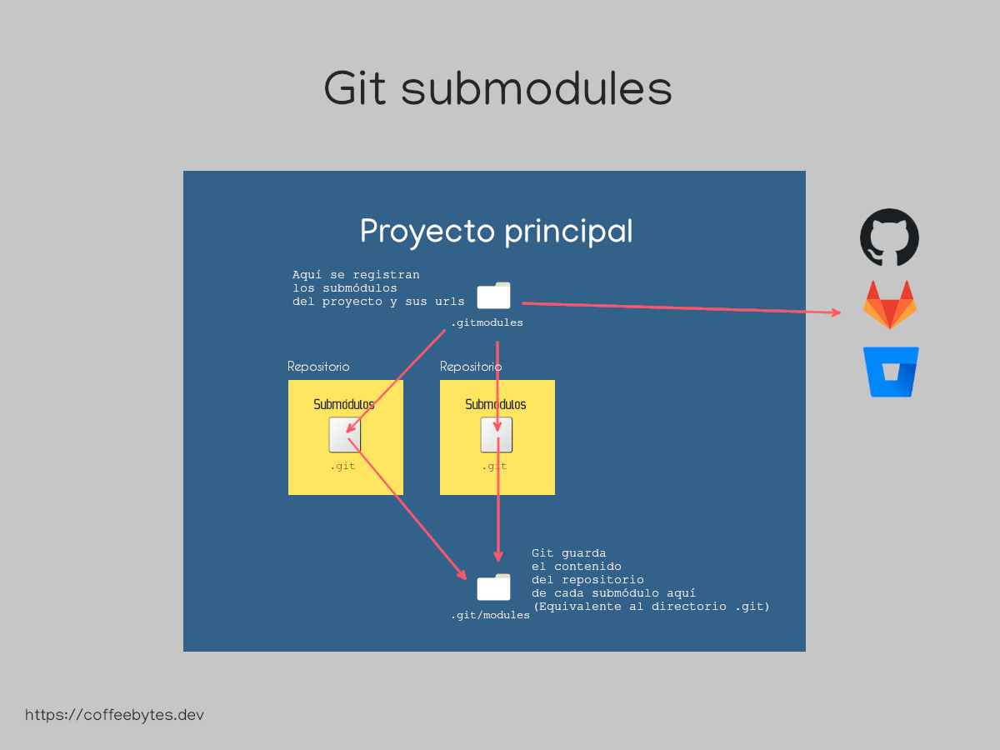
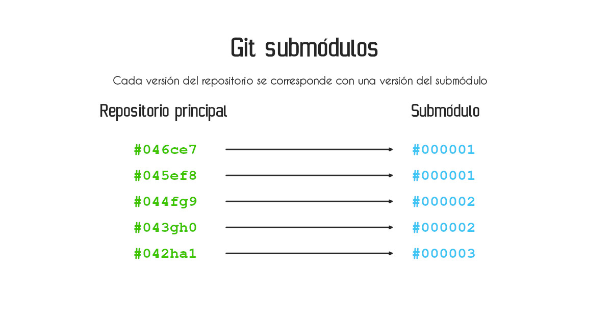

A git submodule is a record within a git repository that points to a commit in an external repository. They are handled exactly as you would with a repository, they even have a _.git_ file that points to the location where a changelog is kept.



git submodules are useful when we want to incorporate third-party code into a project and at the same time we want to keep strict control of the updates of that code through git. For example:

* A shared repository for a theme or styles (As in SSG, Hugo).
* A third-party library.
* A repository that you want to use to create a [Dockerfile in Docker](/blog/basic-linux-commands-you-should-know/).

On the other hand, **using git submodules makes repository management quite complicated if you are not careful or if you work with many submodules**, you have to pay attention to the context you are in and remember all the time the repository you are in.

## Adding a submodule to a git repository

To start using a submodule in an existing repository (our main repository) we use the command _git submodule add_, placing first the url of the submodule and then the folder where we want the submodule to be located.

If the directory does not exist it will be created.

```bash
git submodule add <url> <destino>
```

The above command will copy the url `<url>` code into the specified `<destination>` directory.

### Structure of a submodule

After adding a submodule to a repository a new file (not a directory) named _.git_ will be created inside the submodule folder of our repository.

```bash
.
├── .gitignore
├── .gitmodules
├── <destino>
│   ├── .git
│   ├── .gitignore
│   ├── app
│   │   ├── files.js
```

Depending on the repository you choose as a submodule, you will also see its own _.gitignore_ file.

### The .gitmodules file

In addition to copying the code from the remote repository into the target folder, git will create a _.gitmodules_ file in the root of our main repository. This file stores the references to the submodule(s) of our repository.

Each of these submodules specifies its path, relative to the repository root, the url and the branch (optional).

```bash
[submodule <destino>]
    path = <destino>
    url = <url-del-repositorio>
    [branch = <rama>]
```

This file is important because it is a reference to the submodules that our project needs to work.



### The contents of a submodule's .git file

What does the submodule contain? If you go into any submodule, you will see that it has a file named _.git_.

```bash
cd <destino>
ls -la 
.rw-r--r--   31 usuario 14 may 09:49 .git
# ...
```

If you check the contents of this file with the [cat command](/blog/basic-linux-commands-you-should-know/), you will see that it is a path pointing to the _.git/modules_ folder in our main repository. This is how git can keep track of submodules directly in the main repository.

```bash
cat .git
gitdir: ../.git/modules/<submodule>
```

And what's at that location? In that location are the files with which git manages a repository internally, they keep the same structure as the ones inside the _.git_ folder of your main repository.

### Git treats submodules as individual repositories.

A submodule is handled in exactly the same way as a normal repository.

If you run the _git status_ command inside a submodule, you will see that we are inside a different repository than the main one.

```bash
git status
En la rama master
Tu rama está actualizada con 'origin/master'.
```

Within the submodule you can perform checkouts, create branches, even commits and pushes. All these changes will be made in the submodule repository, not in the main repository.

Git treats each submodule as if it were a separate repository, so **each version of your main repository corresponds to a version of the submodule**.



## Workflow of git submodules

Every time you make a change **within your submodule you must push the changes and then update the reference from the main repository to the submodules**.

What happens if you don't? Well this is where the nightmare of all the people who hate submodules begins, you will be working on the latest version of the submodule, while your colleagues will be working on the old version.

### Steps to save changes in a sub-module

How to solve it? With these three steps

1. Save the changes (commit) and push them to your submodule.
2. Return to your main repository.
3. Save the changes (commit) and push to your main repository.

```bash
# Realizando cambios en el submódulo
git add <archivos>
git commit -m "Mensaje del commit del submódulo"
git push

# Regresando al repositorio principal
cd <repositorio-principal>

# Actualizando la versión del submodulo
git add .gitmodules <archivos>
git commit -m "Actualizar a nueva versión del submódulo"
git push
```

The important thing to remember here is that we must always update changes to both the submodule and the main repository.

### Initializing a repository with submodules in git

What if instead of adding a submodule with _git add submodule_, we clone a project that has a _.gitmodules_ file?

When cloning a repository that has submodules, **git clones only the main repository, without including the content of the submodules**.

```bash
git clone <repositorio-con-submodules>
```

Check it, navigate inside the submodule folders and you will see that they are empty.

For git to download the content of the submodules we need to initialize, with _--init_ the submodules with the following command:

```bash
git submodule update --init --recursive
```

The _--recursive_ option will take care of initializing all the submodules of the main repository.

### Updating a repository with submodules in git

What if we do a _pull_ of our main project?

As I mentioned to you earlier, **each version of your main project corresponds to a version of the submodule**, so if the version of your project changed, the submodule it points to may have changed.

Also, in git, **submodules are not automatically updated when you update the main repository**.

If there were changes in your main repository and you do a _git pull_ it is **your obligation to update the submodules up to the most recent commit of the remote submodule code**:

```bash
git submodule update --recursive --remote
```

With the above I conclude the article, if you found it useful you can share it in your favorite social networks.