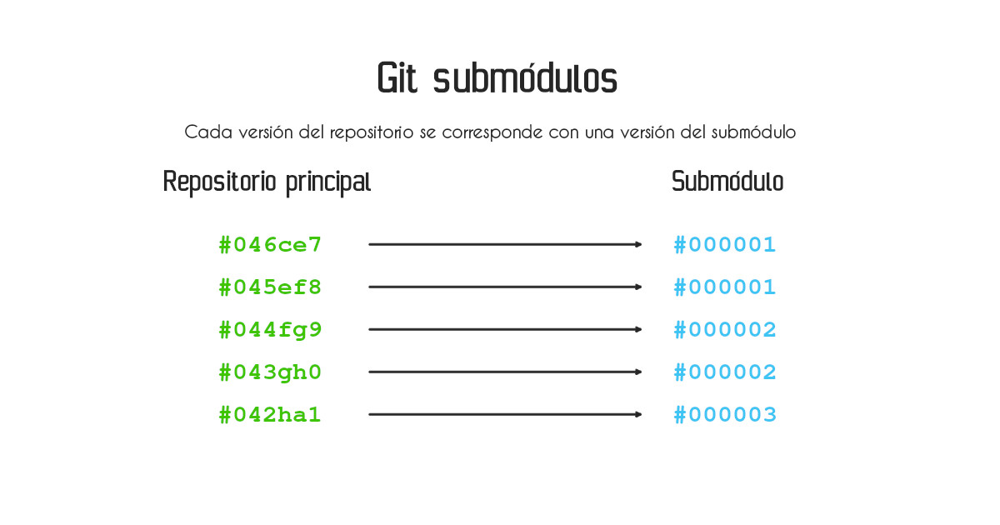

Los git submodules o submódulos son un registro dentro de un repositorio de git que apunta a un commit en un repositorio externo. Se manejan exactamente igual que harías con un repositorio, incluso tienen un archivo *.git* que apunta a la ubicación en la que se lleva un registro de los cambios.

Los submodules de git son útiles cuando queremos incorporar código de terceros a un proyecto y al mismo tiempo queremos llevar un control estricto de las actualizaciones de ese código por medio de git. Por ejemplo:

* Un repositorio compartido para un tema o estilos (Como en el SSG, Hugo).
* Una librería de terceros.
* Un repositorio que quieres usar para crear un [Dockerfile en Docker](https://coffeebytes.dev/tutorial-de-comandos-basicos-de-docker/).

Por otro lado, **usar git submodules complica bastante el manejo de repositorios si no se tiene cuidado o si se trabaja con muchos submódulos**, tienes que prestar atención al contexto en el que te encuentras y recordar todo el tiempo el repositorio en el que te encuentras.

## Agregar un submodule a un repositorio de git

Para agregar un submódulo a un repositorio existente (nuestro repositorio principal) usamos el comando *git submodule*, poniendo como destino la carpeta donde queremos que se localice el submódulo. 

Si el directorio no existe se creará.

```bash
git submodule add <url> <destino>
```

El comando anterior copiará el código de la url `<url>` en el directorio `<destino>` especificado.

### Estructura de un submódulo

Nota como se creó un nuevo archivo (no un directorio) *.git* dentro de la carpeta del submódulo de nuestro repositorio. Dependiendo del repositorio que elijas como un submódulo, también podrás ver su propio archivo *.gitignore*.

```bash
.
├── .gitignore
├── .gitmodules
├── <destino>
│   ├── .git
│   ├── .gitignore
│   ├── app
│   │   ├── files.js
```

### El archivo .gitmodules

Además de copiar el código del repositorio remoto en la carpeta destino, git crea un archivo *.gitmodules* en la raiz de nuestro repositorio principal. Este archivo lleva un registro de el o los submódulos de nuestro repositorio. 

Cada uno de estos submódulos especifica su ruta, relativa a la raiz del repositorio, la url y la rama (opcional)

```bash
[submodule <destino>]
    path = <destino>
    url = <url-del-repositorio>
    [branch = <rama>]
```

Este archivo es importante pues es una referencia a los submódulos que necesita nuestro proyecto para funcionar.


### El contenido del archivo .git de un submodule

¿Qué contiene el submódulo? Si entras en cualquier submódulo, verás que tiene un archivo llamado *.git*

```bash
cd <destino>
ls -la 
.rw-r--r--   31 usuario 14 may 09:49 .git
# ...
```

Si revisas el contenido de este archivo, verás que es una ruta que apunta a la carpeta *.git/modules* de nuestro repositirio principal. Es de esta manera que git puede llevar un seguimiento de los submodulos directamente en el repositorio principal.

```bash
cat .git
gitdir: ../.git/modules/<submodule>
```

¿Y que hay en esa ubicación? En esa ubicación se encuentran los archivos con los que git maneja un repositorio, guardan la misma estructura que los que están dentro de la carpeta *.git* de tu repositorio principal.

### Git trata a los submodules como repositorios individuales

Un submodulo se maneja exactamente igual que un repositorio normal. 

Si ejecutas el comando *git status* dentro de un submódulo, verás que estamos dentro de un repositorio diferente al prinicipal.

```bash
git status
En la rama master
Tu rama está actualizada con 'origin/master'.
```

Dentro del submódulo puedes realizar checkouts, crear ramas, inclusive realizar commits y push. Todos estos cambios se harán en el repositorio del submódulo, no en el principal.

Git trata a cada submódulo como si fuera un repositorio separado, por lo que **cada versión de tu repositorio principal se corresponde con una versión del submódulo**.



## Flujo de trabajo de git submodules

Cada vez que realices un cambio **dentro de tu submódulo debes hacer un push de los cambios y, posteriormente, actualizar la referencia del repositorio principal hacia los submódulos.**. 

¿Qué pasa si no lo haces? Pues aquí es donde comienza la pesadilla de toda la gente que detesta a los submódulos, tú vas a estar trabajando en la versión más reciente del submódulo, mientras que tus compañeros estarán trabajando en la versión antigua.

### Pasos para guardar cambios en un submódulo

¿Cómo solucionarlo? Con estos tres pasos

1. Guardar los cambios (commit) y subir (push) en tu submódulo.
2. Regresar a tu repositorio principal.
3. Guardar los cambios (commit) y subir (push) en tu repositorio principal.

```bash
# Realizando cambios en el submódulo
git add <archivos>
git commit -m "Mensaje del commit del submódulo"
git push

# Regresando al repositorio principal
cd <repositorio-principal>

# Actualizando la versión del submodulo
git add .gitmodules <archivos>
git commit -m "Actualizar a nueva versión del submódulo"
git push
```

Lo importante a recordar aquí es que siempre debemos actualizar los cambios tanto del submódulo como del repositorio principal.

### Inicializar un submodule en git

¿Y qué pasa si en lugar de agregar un submódulo con *git add submodule*, clonamos un proyecto que tiene un archivo *.gitmodules*?

Cuando clonamos un repositorio que tiene submodules, **git clona solo el repositorio principal, sin el contenido de los submodules**.

```bash
git clone <repositorio-con-submodules>
```

Compruebalo, navega al interior de las carpetas de los submódulos y podrás apreciar están vacias. 

Para que git descargue el contenido de los submódulos necesitamos inicializar, con *--init* los submódulos con el siguiente comando:

```bash
git submodule update --init --recursive
```

La opción *--recursive* se encargará de inicializar todos los submódulos del repositorio principal.

### Actualizar un submodule en git

¿Y qué pasa si hacemos un *pull* de nuestro proyecto principal? 

Como te mencioné anteriormente, **cada versión de tu proyecto principal se corresponde con una versión del submódulo**, por lo que si la versión de tu proyecto cambió, puede que haya cambiado el submódulo al que apunta. 

Además, en git, **los submódulos no se actualizan de manera automática cuando actualizas el repositorio principal**. 

Si hubo cambios en tu repositorio principal y haces un *git pull* es **tu obligación actualizar los submódulos hasta el commit más reciente del código remoto del submodule**:

```bash
git submodule update --recursive --remote
```