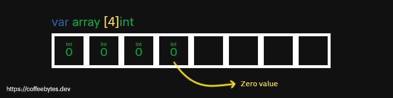

---
aliases:
- /go-arrays-y-slices
- /go-slices-y-arrays
authors:
- Eduardo Zepeda
categories:
- go
coverImage: images/ArrayslicesYArrays.jpg
date: '2021-12-14'
description: Sintaxis y usos básicos de los arrays y slices en el lenguaje de programación
  go. También te explico como usar la función make en slices.
keywords:
- go
title: 'Go:  slices y arrays'
---

En go o golang los slices, los arrays y los [maps](/es/go-maps-o-diccionarios/) son estructuras para manejar colecciones de datos. En esta entrada voy a hablar de los dos primeros: slices y arrays.

En esta entrada voy a usar tipos de datos, zero values, y otras aspectos muy básicos de go. Si no sabes de que hablo, visita mi entrada [Golang: introducción al lenguaje, variables y tipos de datos](/es/go-lenguaje-de-programacion-introduccion-a-variables-y-tipos-de-datos/).

## Arrays en go

Los arrays son **colecciones de datos inmutables**, para crear un _array_ necesitamos definir su tamaño y el tipo de dato que contendrá, **una vez declarado no se puede modificar**.

```go
var array [4]int
```

En el ejemplo anterior, tenemos un _array_ con espacio para 4 enteros. Los valores que no asignemos se asignarán como zero values.



### Asignar valores a un array

Para asignar valores a un _array_, previamente declarado, utilizamos su índice.

```go
array[1] = 1
// [0, 1, 0, 0]
```

También podemos crear un array directamente dentro de una función colocando cada elemento del array entre llaves, separados por comas.

```go
array := [4]int{0, 0, 0, 0}
```

## Slices en go

Los slices son **colecciones mutables de tipos de datos**. Internamente es una abstracción de un array, con una diferencia, estos sí pueden modificarse.

Sin embargo, al declarar un slice, y luego intentar modificar uno de sus índices, justo como haríamos con un array, tendremos un error. ¿Por qué? Porque un slice es una referencia, y al crearse vacío, estamos apuntando a la nada, a _nil_.

```go
var slice []int
slice[0] = 1
// panic: runtime error: index out of range [0] with length 0
```

Internamente un _slice_ es un _struct_ con un apuntador al verdadero array. Además del pointer o apuntador, cuenta con| la propiedad llamada _cap_ y _len_, que se refieren a la capacidad y longitud del array, respectivamente.


Para crear un slice no vacío tenemos dos maneras de hacerlo:

- Asignar memoria con la función _make_.
- Declararlo directamente pasándole el contenido después del tipo de dato del slice

### Crear un slice con make

La función _make_ asigna memoria e inicializa un objeto del tipo _slice_, _map_ o _chan_ y lo retorna. Si usamos make, es necesario pasarle la longitud del slice como segundo argumento.

```go
var slice = make([]int, 4)
slice[0] = 1
fmt.Println(slice)
// [1,0,0,0]
```

Si intentamos añadir un elemento más allá de la capacidad que definimos obtendremos un error.

```go
slice[4] = 4
// panic: runtime error: index out of range [4] with length 4
```

Para más detalles [revisa la documentación de la función make](https://pkg.go.dev/builtin#make).

### Creando slices con valores

Podemos crear un slice en un solo paso, pasándole el contenido directamente, colocando entre llaves los elementos del slice, separados por comas.

Observa como no especificamos el tamaño del slice.

```go
var slice = []int{0, 1, 2, 3, 4}
```

También es posible dejar que go detecte automáticamente que se trata de un slice usando el operador walrus ":=". Solo posible dentro de una función

```go
slice := []int{0, 1, 2, 3, 4}
```

### Particionar slices

Los _slices_ pueden partirse en un estilo similar al de Python, especificando una **posición incluyente para el primer dígito y excluyente para el segundo**.

```go
slice[2:] // {2, 3, 4}
slice[:2] // {0, 1}
slice[2:3]// { 2 }
```

Si no especificamos uno de los dos, tomará la primera posición para el primer dígito y la última para el segundo dígito.

### Extendiendo un slice

Los slices son mutables, pueden extenderse usando la función _append_, la cual recibe cualquier número de elementos, separados por comas.

```go
sliceExtendido := append(slice, 5)
// [1 2 3 4 6 5]
otroSliceExtendido := append(sliceExtendido, 6, 7, 8)
// [1 2 3 4 6 5 6 7 8]
```

Es posible crear un nuevo slice a partir de la desestructuración de un slice. La desestructuración se lleva a cabo poniendo tres puntos (...) al final del slice.

```go
nuevoSlice :=[]int{9, 10}
// [8 9]
sliceHastaDiez = append(nuevoSlice, otroSliceExtendido...)
// [1 2 3 4 6 5 6 7 8 9 10]
```

## Recorrer array y slices con range

Parecido a la sintaxis de Python, podemos recorrer un _array_, un _slice_ o un _map_ (hablaré de los maps en la siguiente entrada) usando _range_. Cada iteración nos devolverá el índice y el elemento del array o slice, o la llave y el valor en el caso de maps.

Aquí iteramos sobre un _array_, aprecia como estamos declarando el tamaño de antemano.

```go
var array [2]string
	array[0] = "Nier"
	array[1] = "Hollow knight"
	for index, videojuego := range array {
		fmt.Println(index, videojuego)
	}
```

En el caso de un _slice_, observa como no especificamos un tamaño entre los corchetes.

```go
list := []int{0, 1, 2, 3, 4, 5}
	for i, n := range list {
		fmt.Println(i, n)
	}
```


## ¿Cómo convertir un array en un slice en Go?

Para convertir un array en un slice podemos usar la notación *[:]*.

```go
newArray := mySlice[:]
```


Con esto termino de platicarte lo más básico de slices y arrays en Go. Para la siguiente entrada voy a hablar de los maps en Go.