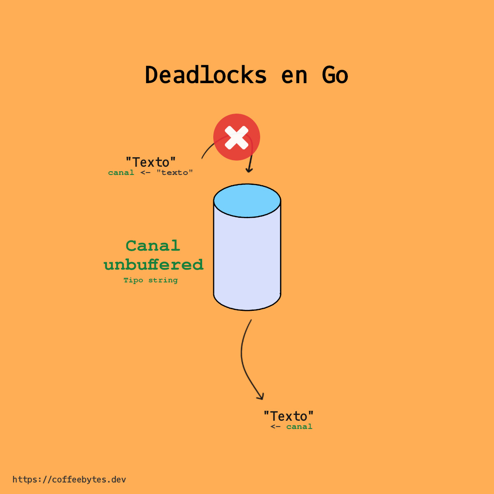
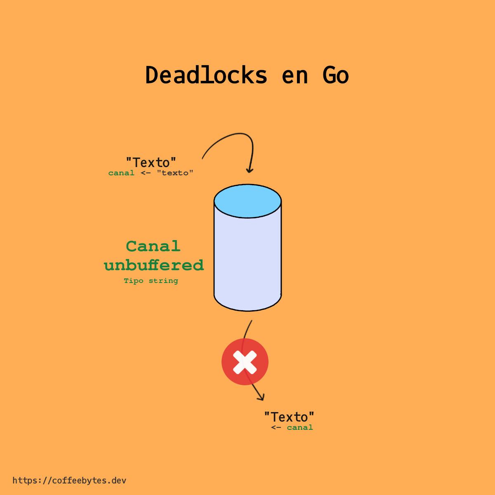
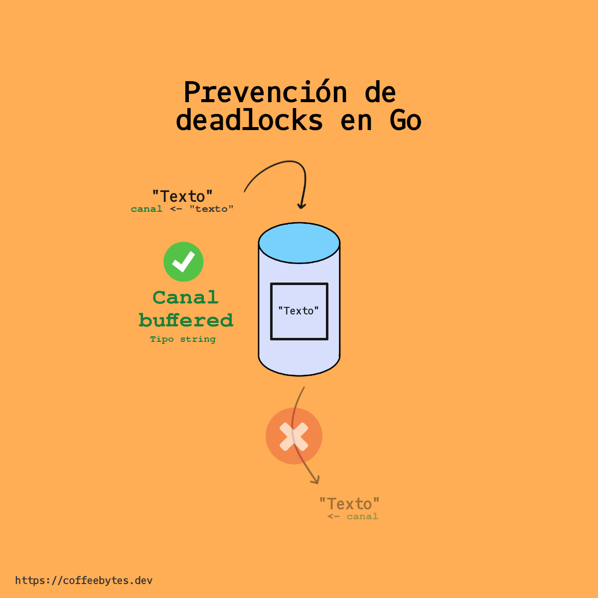

When working with channels there is a quite common error that occurs when you are not familiar with the concepts, the error is "_fatal error: all goroutines are asleep - deadlock!_". The first time I saw this error I was perplexed and, although I knew how to fix it, I didn't understand why it happened, so in this post I explain why it happens as I would have liked to have read it at the time.



## Why does the error fatal error: all goroutines are asleep - deadlock! happen?

This error occurs when:
- A channel sends information, but not channel is there to receive it.
- There is a channel that receives information, but not channel that sends it.
- When we are not inside a goroutine other than the one from the main function.

In any of these cases the goroutines are "waiting" either to send or receive information, so we can say that we are "stuck" and that is when we receive the fatal error: all goroutines are asleep - deadlock!



## Blocking operations

In go, operations that send or receive channel values are blocking inside their own goroutine (remember that the _main_ function is a goroutine), i.e., they keep code execution waiting:

* If an operation receives information from a channel, it will be blocked until it receives it.
* If an operation sends information to a channel, it will be blocked until the sent information is received.

Knowing the two previous situations we will have two main cases:

### Blocking or deadlock due to lack of sender

What if an operation is waiting to receive information from a channel, but that channel is never going to send anything?

It happens when there is a channel that receives information, but not one that sends it.



```go
package main

import (
    "fmt"
)

func main() {

    c := make(chan string)
    fmt.Println(<-c)
}
// fatal error: all goroutines are asleep - deadlock!
```

### Blocking or deadlock for lack of recipient

What if an operation sends information to a channel but there is no longer any other goroutine receiving information from that channel?

It happens when there is a channel that sends information, but not one that receives it.



```go
package main

func main() {

    c := make(chan string)
    c <- "text"
}
// fatal error: all goroutines are asleep - deadlock!
```

### Blocking by absence of goroutine

There is a third case: if there is an operation that writes to and reads from a channel, as in the example below, but it is not inside another goroutine (different from the main goroutine) that reads the value, we will get a deadlock error.

```go
package main

import "fmt"

func main() {
    var channel = make(chan string)
    channel <- "forty two"
    fmt.Println(<-channel) // This should be in other goroutine
    fmt.Println("Finished")
}
// fatal error: all goroutines are asleep - deadlock!
```

In the three previous cases the program would be waiting and, as you know, **it makes no sense to keep the program waiting for something that will never happen**, so the execution is aborted and the fatal error "_fatal error: all goroutines are asleep - deadlock!_" is generated.

The above situation is referred to as a *deadlock*.

## Deadlocks or dead spots

In a deadlock there is a goroutine waiting to read or write to a channel, however there is no goroutine running because they are waiting for each other; they are in a deadlock from which no progress can be made.

### Prevent deadlocks on go with goroutines

In the [introduction to channels in go post](/en/go-use-of-channels-to-communicate-goroutines/), I told you that the **default capacity of a channel is 0**, this causes that we cannot store data in the channels by default. If we try to store a data in a channel, we will get an error from the compiler, because there is no other goroutine to receive the value immediately.

To prevent a deadlock, we can immediately use the channel data by creating a goroutine that uses the channel value.

```go
package main

import "fmt"

func main() {
    var channel = make(chan int)
    go func(channel chan int) {
        channel <- 42
    }(channel)
    fmt.Println(<-channel)
    fmt.Println("Finished")
}
// No ocurre el error de deadlock
```

In this case I have created a goroutine with an anonymous function that reads from the channel.

## How to prevent deadlocks and all goroutines are asleep error in go using buffered channels

If a channel does not have buffer, the value remains "retained" until it is received, blocking the execution while it happens, causing the deadlock or deadlock if no one receives it.

On the other hand, if the channel is buffered, then execution is blocked until the value has been copied to the buffer, so we will not get an error, even if no goroutine receives it.



```go
package main

import "fmt"

func main() {
    var channel = make(chan int, 1)
    channel <- 42
    fmt.Println(<-channel)
    fmt.Println("Finished")
}
// No deadlock error
```

## More resources on deadlocks in go

To conclude the article, I'll share with you some interesting resources about deadlocks in Go that I consider worth mentioning.

* [Golang - Understanding channel, buffer, blocks, deadlocks and gorotuines](https://gist.github.com/YumaInaura/8d52e73dac7dc361745bf568c3c4ba37).
* [Why a goroutine block on channel is considered as deadlock?](https://stackoverflow.com/questions/61759204/why-a-go-routine-block-on-channel-is-considered-as-deadlock).
* [Effective go, channels](https://go.dev/doc/effective_go#channels)