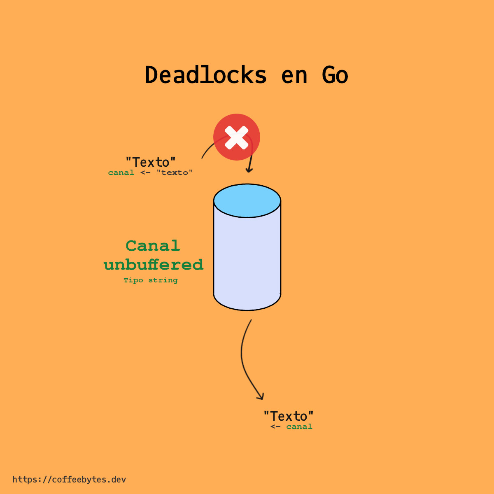
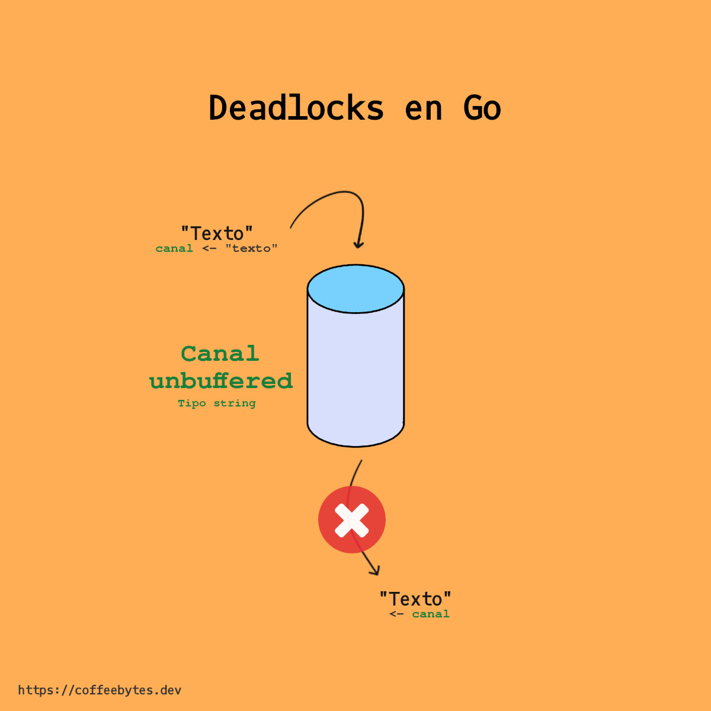
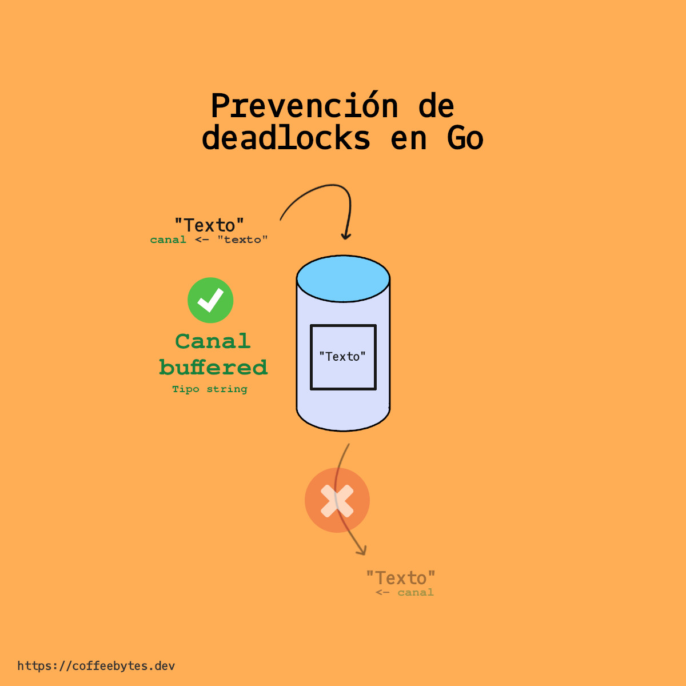

Cuando trabajamos con channels hay un error bastante común que ocurre cuando no se está familiarizado con los conceptos, el error es "_fatal error: all goroutines are asleep - deadlock!_", traducido significa algo como "error fatal: todas las goroutines están dormidas - en un punto muerto". La primera vez que vi este error me confundió mucho y, aunque sabía como solucionarlo, no entendía porque sucedía, así que en esta entrada te explico porque sucede como me hubiera gustado haberlo leído en su momento.

## Operaciones bloqueantes

En go, las operaciones que mandan o reciben valores de canales son bloqueantes dentro de su propia goroutine (recuerda que la función _main_ es una goroutine), es decir, mantienen la ejecución del código en espera :

- Si una operación recibe información de un canal, se bloqueará hasta que la reciba.

- Si una operación manda información a un canal, se bloqueará hasta que la información enviada sea recibida.

Conociendo las dos situaciones anteriores tendremos dos casos principales:

¿Qué pasa si una operación está esperando recibir información de un canal, pero ese canal no va a mandar nada jamás?



No hay una operación que envie datos a través de un canal.

```go
package main

import (
	"fmt"
)

func main() {

	c := make(chan string)
	fmt.Println(<-c)
}
// fatal error: all goroutines are asleep - deadlock!
```

¿Y si una operación manda información a un canal pero ya no hay ninguna otra goroutine que reciba la información de ese canal?



No hay una operación que reciba texto a través de un canal.

```go
package main

func main() {

	c := make(chan string)
	c <- "texto"
}
// fatal error: all goroutines are asleep - deadlock!
```

Existe un tercer caso: si hay una operación que lea de un canal, como en el ejemplo de abajo, pero no se encuentra dentro de otra goroutine (diferente a la goroutine de main) que lea el valor, obtendremos un error de deadlock o bloqueo.

```go

package main

import "fmt"

func main() {
    var channel = make(chan string)
    channel <- "forty two"
    fmt.Println(<-channel) // Esto debería de estar en otra goroutine
    fmt.Println("Finished")
}
// fatal error: all goroutines are asleep - deadlock!
```

En los tres casos anteriores el programa se quedaría esperando y, como ya sabes, **no tiene sentido mantener el programa esperando por algo que jamás sucederá**, por lo que la ejecución se corta y se genera el error fatal: "_fatal error: all goroutines are asleep - deadlock!_"

A la situación anterior se le conoce como un deadlock o punto muerto.

## Deadlocks o puntos muertos

Como ya mencioné, en un deadlock hay una goroutine que está esperando leer de un canal vacio, sin embargo ya no hay ninguna goroutine ejecutándose pues están esperándose las unas a las otras; están en un punto muerto del que no se puede avanzar.

### Prevenir deadlocks en go con goroutines

Como te mencioné en la [introducción a los channels o canales en go](https://coffeebytes.dev/go-goroutines-channels-o-canales-introduccion/), la capacidad por defecto de un canal es de 0, esto provoca que no podamos almacenar datos en los canales de manera predeterminada. Si intentamos almacenar un dato en un canal, obtendremos un error por parte del compilador, pues ya no existe otra goroutine que reciba el valor de manera inmediata.

Para prevenir el deadlock, podemos usar inmediatamente el dato del canal creando una goroutine que use el valor del canal.

```go

package main

import "fmt"

func main() {
    var channel = make(chan int)
    go func(channel chan int) {
        channel <- 42
    }(channel)
    fmt.Println(<-channel)
    fmt.Println("Finished")
}
// No ocurre el error de deadlock
```

En este caso he creado una goroutine con una función anónima que se encarga de leer del canal.

### Prevenir deadlocks en go con buffered channels

Si un canal no tiene buffer, el valor queda "retenido" hasta que se reciba, bloqueando la ejecución mientras sucede, ocasionando el deadlock o punto muerto si nadie lo recibe.

Por otro lado, si el canal tiene buffer, entonces la ejecución se bloquea hasta que el valor se haya copiado al buffer, por lo que no obtendremos un error, incluso si ninguna goroutine lo recibe.



En un canal con buffer no importa si el valor no se lee pues ya ha sido copiado al buffer

```go
package main

import "fmt"

func main() {
    var channel = make(chan int, 1)
    channel <- 42
    fmt.Println(<-channel)
    fmt.Println("Finished")
}
// No ocurre el error de deadlock
```

## Recursos sobre deadlocks en go

Para concluir, te comparto algunos recursos interesantes que hablan de los deadlocks o puntos muertos.

- [Golang — Understanding channel, buffer, blocking, deadlock and happy groutines](https://gist.github.com/YumaInaura/8d52e73dac7dc361745bf568c3c4ba37).
- [Why a go-routine block on channel is considered as deadlock?](https://stackoverflow.com/questions/61759204/why-a-go-routine-block-on-channel-is-considered-as-deadlock)
- [Effective Go, channels](https://go.dev/doc/effective_go#channels)
