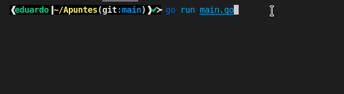
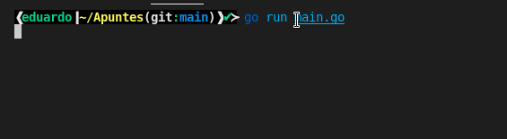
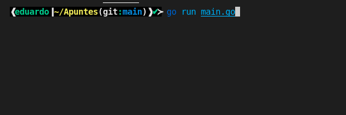

Esta entrada tratará sobre la sintaxis básica de las funciones de Go. Si no sabes absolutamente nada de go visita mi entrada [go: introducción al lenguaje de programación, variables y tipos de datos](https://coffeebytes.dev/golang-introduccion-al-lenguaje-variables-y-tipos-de-datos/) para empezar desde el principio de esta serie de tutoriales.

Ahora sí, pasemos a las funciones.

## Funciones en go

En go las funciones se declaran anteponiendo la palabra _func_ al nombre de la función. De la siguiente manera:

```go
func borrarRoot() { }
```

Recuerda que al ser un lenguaje compilado, go requiere que especifiques el tipo de dato en los argumentos.

```go
func borrarRoot(argumento int, otroArgumento int) { }
```

Si los dos argumentos son del mismo tipo, podemos ahorrarnos una palabra omitiendo el primer tipo, en este caso _int_.

```go
func borrarRoot(argumento, otroArgumento int) {}
```

### Return en go

Como en casi todos los lenguajes usamos la palabra _return_ en una función para retornar un valor.

Una función **no requiere que retornes nada forzosamente**, y no necesitas especificar un retorno, como si harías en C++ y otros lenguajes similares.

Por otro lado, **si tu función sí cuenta con un return, requieres especificar el tipo de dato a retornar,** colocándolo después de los argumentos.

```go
func RetornaUno(argumento, otroArgumento int) int{
    return 1
}
```

Así mismo, podemos retornar dos valores, como si de una tupla se tratara.

```go
func retornaUnoYDos(argumento, otroArgumento int) (int, int) {
    return 1, 2
}
```

Y, justo como en Python, es posible asignar esos dos valores a dos variables diferentes, separándolas por una coma.

```go
a, b = retornaUnoYDos()
```

### Retornar una función en go

En go las funciones "son ciudadanos de primera clase" por lo que, en go, **las funciones pueden retornar funciones.**

```go
func retornaFuncion(argumento, otroArgumento int) func() {
    return func() {
        return 1
}
```

Y, como la función retorna una función podemos llamar a esta última dentro de cualquier otro bloque de la siguiente manera:

```go
// El equivalente a a llamar a la función retornada
retornaFuncion()()
```

### Return sin nombre

Go tiene una manera especial de devolver un valor de manera implícita, sin tener que colocarlo después de _return_.

```go
func split(sum int) (x, y int) {
        // retornará x y x de manera implícita
        x = sum * 4 / 9
        y = sum - x
        return
    }
```

Esta sintaxis puede parecer un poco truculenta, pero realmente es muy sencilla. ¿Recuerdas que te dije que el tipo de dato que retorna una función va después de los argumentos? _(x, y int)_ Pues aquí, además del tipo, especificamos que variables retornará y de que tipo, **en caso de que no coloquemos nada después de return**.

Básicamente le estamos diciendo a go: "oye, si no pongo nada después del return, retorna las variables "x" y "y", que son de tipo _int_.

### Funciones variádicas

En go, las funciones que reciben una cantidad variable de argumentos requieren que pases el nombre del argumento que la contendrán, seguida de puntos suspensivos y el tipo de dato.

```go
func multiples(nums ...int) {
	fmt.Println(nums)
}
```

si llegaras a ejecutar la función verías que nos retorna un array.

```go
multiples(1, 2, 3, 4, 5)
// [1 2 3 4 5] 
```

Listo, con esto termina mi resumen de las funciones. Ahora pasemos a uno de los paquetes esenciales de go, el paquete fmt.

## Paquete fmt

Este paquete es el que usarás normalmente para imprimir sentencias en pantalla y, ya puedo verlo en el futuro, el que usarás de manera incorrecta para debuggear.

Antes que nada te digo que **fmt viene de format package y es el paquete que se encargará de darle formato a cualquier tipo de entrada o salida de dato**. Con entrada y salida de dato, me refiero a lo que tus compañeros más oldies denominarían [stdin y stdout en GNU/Linux](https://es.wikipedia.org/wiki/Entrada_est%C3%A1ndar).

Por cierto, fmt cuenta con soporte para caracteres especiales, por lo que puedes imprimir los subtítulos en el idioma original de tus animes favoritos.

### Println

Si ya has trabajado con otros lenguajes de programación es tu clásica función print, echo, console.log o equivalente, con todo y su _newline_ añadido al final.

Println es capaz de imprimir varios argumentos seguidos, incluso si son de diferente tipo.

```go
import "fmt"
// ...
fmt.Println(1, "彼氏彼女の事情", nil)
```

### Printf

Printf es como Println pero con operadores de posición que le dicen a go el tipo de dato que le estamos pasando. Sí, igualita a la función de C++

```go
texto := "World!"
numero := 42
// %s es de string y %d de digit
fmt.Printf("Hello %s %d", texto, numero)
```

### Tipos de operadores

¿Viste que usé los tipos de operadores %s y %d, para strings y dígitos, respectivamente? Pues en go hay múltiples tipos de operadores para muchísimos tipos de datos.

Hay algunos operadores de posición que yo considero destacables.

- %T, tipo de dato (string, int, boolean, etc).
- %v, valor en el formato predeterminado de go
- %t, Para booleanos, retorna la palabra false o true
- %x, número de base 16
- %o, número de base 8
- %e, número notación científica
- %9.2f, flotante con ancho de 9 y precisión de 2
- %.2f, flotante con ancho predeterminado y precisión de 2
- %q un string o cadena de texto, entre comillas, previamente escapado

Puedes ver el resto de operadores en la [documentación oficial de go.](https://pkg.go.dev/fmt)

### Sprintf

Sprintf guarda la misma sintaxis que printf, pero con **la diferencia de que no imprime en pantalla, sino que genera un string** o cadena de texto.

```go
var message string = fmt.Sprintf("Hello %s %d", texto, numero)
```

Pero ¿y si queremos obtener input de un usuario? Pues, igual que en C, contamos con la función scan.

### Scan

Scan leerá el texto de la entrada estándar (stdin) hasta que encuentre el primer espacio o salto de linea y nos retornará el número de argumentos recibidos.

Si no sabes que significa el ampersand "&" puedes pensar en él como la dirección en memoria a la que corresponde la variable mensaje.

Si aún así no tienes tienes idea de que hablo, vas a tener que darle una investigada a los pointers o apuntadores. Hay muchísima información en internet disponible como para crear una nueva entrada.

```go
var mensaje string
fmt.Scan(&mensaje)
fmt.Println(mensaje)
```

El código anterior hace solo dos cosas: guardar el texto que escribimos en la consola en la variable mensaje y, posteriormente, imprimirlo en pantalla.



### Scanf

Scanf es como Scan, pero para guardar múltiples argumentos, separados por espacios.

Mira como primero creamos las tres variables, para después, como primer argumento para Scanf pasarle el orden en el que recibirá los argumentos como un tipo de dato, separados por espacio y al final la dirección de las variables a las cuales los tiene que asignar.

```go
var (
		nombre   string
		apellido string
		telefono int
	)
        // nombre apellido telefono
	fmt.Scanf("%s %s %d", &nombre, &apellido, &telefono)
	fmt.Printf("Nombre: %s, Apellido: %s, telefono: %d", nombre, apellido, telefono)
```

Aprecia como le indicamos la separación de cada argumento por medio de un espacio.



### Manejando errores en Scanf y Scan

Scanf y Scan, además de guardar texto en variables, también retornan el número de argumentos asignados y, solo en caso de que ocurra, un mensaje de error.

```go
var (
		nombre     string
		apellido   string
		telefono   int
		argumentos int
		err        error
	)
	argumentos, err = fmt.Scanf("%s %s %d", &nombre, &apellido, &telefono)
	if err != nil {
		fmt.Printf("Error: %s", err)
	} else {
		fmt.Printf("Todo bien, recibimos %d argumentos: %s, %s, %d", argumentos, nombre, apellido, telefono)
	}
```

Mira lo que pasa si intentamos pasarle un argumento de un tipo incorrecto.



La primera vez que se ejecuta la función todo sale bien y ocurre con normalidad, pero la segunda vez nos devuelve un error porque estamos intentando pasarle a Scanf un argumento de tipo string, y está esperando uno de tipo int.

Si quieres ver el resto de funciones que tiene este paquete go para ofrecer, revisa la [documentación oficial del paquete fmt.](https://pkg.go.dev/fmt)
