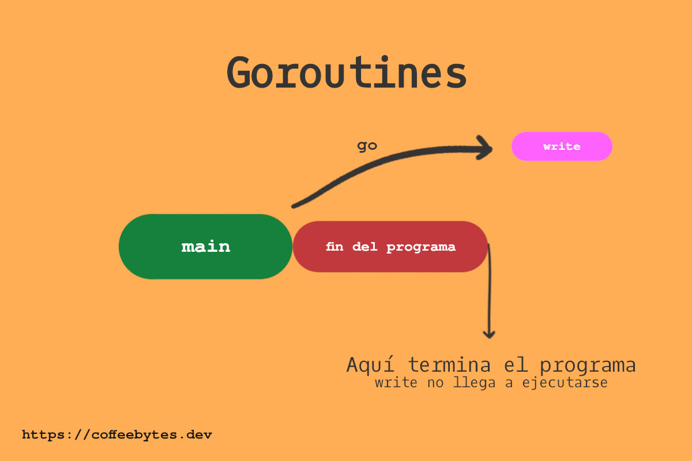
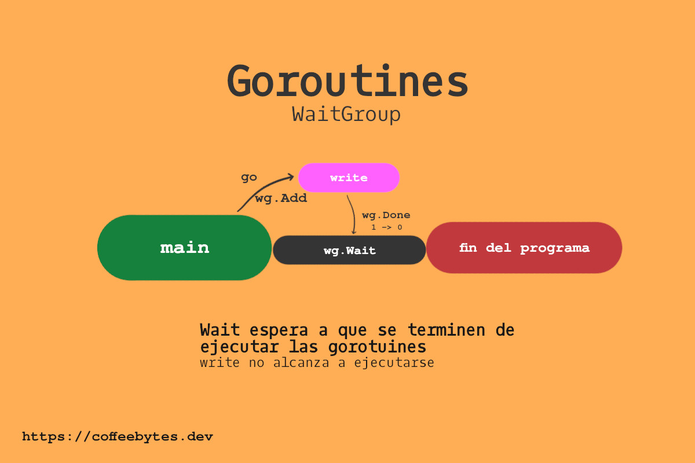
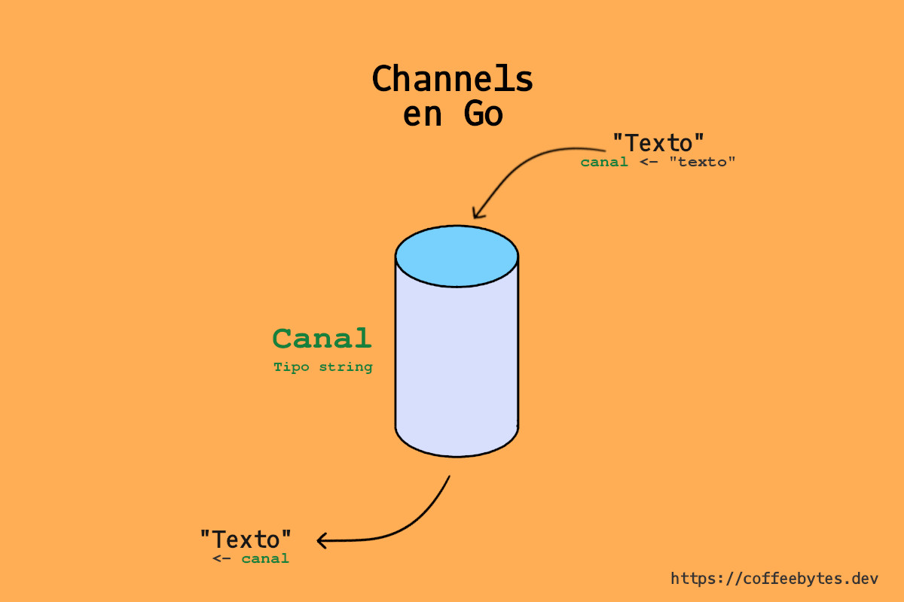

Como te mencioné en la introducción al lenguaje de programación go: [go es un lenguaje especializado en la concurrencia](/golang-introduccion-al-lenguaje-variables-y-tipos-de-datos/). Es un lenguaje que fue diseñado para manejar múltiples tareas de manera asíncrona. Esta entrada trata sobre los channels o canales de go.

## Concurrencia no es paralelismo

Antes de empezar, recuerda que paralelismo y concurrencia son diferentes. Este post es muy pequeño para tratar un tema tan amplio, sin embargo hay dos recursos que quiero destacar:

- [Programación concurrente de Felipe Restrepo Calle](http://ferestrepoca.github.io/paradigmas-de-programacion/progconcurrente/concurrente_teoria/index.html)
- [Concurrencia vs paralelismo de Hector Patricio en The dojo blog](https://blog.thedojo.mx/2019/04/17/la-diferencia-entre-concurrencia-y-paralelismo.html)

Cito una frase del primer recurso que, a mi parecer, resume bastante bien la diferencia:

> Un programa es concurrente si puede soportar dos o más acciones **en progreso.**
> 
> Un programa es paralelo si puede soportar dos o más acciones **ejecutándose simultáneamente.**
> 
> Felipe Restrepo Calle

Si aún así te parecen confusos y no entiendes la diferencia, dale una leída a esos posts y deberías estar listo para seguir adelante.

## Corrutinas en go

Una [corrutina](https://es.wikipedia.org/wiki/Corrutina), en go, es **una función o método que se ejecuta concurrentemente junto con otras funciones o métodos**. En go, a las corrutinas se les conoce como **goroutines** o gorutinas. Incluso, la función principal, _main_, se ejecuta dentro de una.

Para generar una goroutine agregamos el keyword _go_ antes de una función. Lo anterior programará la función para su ejecución asíncrona.

```go
func write(texto string) {
fmt.Println(texto)
}
fmt.Println("hey")
go write("hey again")
// hey
```

En el caso anterior, debido a su naturaleza asíncrona, la goroutine no detiene la ejecución del código. Lo anterior implica que el cuerpo de la función _main_ continua su ejecución y **nuestra goroutine nunca llega a ejecutarse.**



¿Pero entonces? ¿cómo le hacemos para que nuestra goroutine se ejecute? La aproximación ingenua sería usar un sleep para pausar la ejecución del código. Esto, como ya sabes, es un sinsentido.

```go
// NO LO HAGAS
time.Sleep(1 * time.Second)
```

Una mejor aproximación sería crear un **Waigroup** o grupo de espera.

## WaitGroups en go

Un **WaitGroup** sirve para esperar a que se ejecuten un conjunto de goroutines. 

Un **WaitGroup** funciona internamente con un contador, cuando el contador esté en cero la ejecución del código continuará, mientras el contador sea mayor a cero, esperará a que se terminen de ejecutar las demás goroutines.

```go
var wg sync.WaitGroup

wg.Wait()
fmt.Println("Si el contador del waitgroup es mayor que cero se continuará con esta función.")
```

Para incrementar y decrementar el contador del **WaitGroup** usaremos los métodos *Add* y *Done*, respectivamente.

### El método Add

El método _Add_ incrementa el contador del WaitGroup en *n* unidades, donde *n* es el argumento que le pasamos. Lo llamaremos cada vez que ejecutemos una goroutine. 

```go
wg.Add(1)
go write("Hey")
```

### El Método Done

El método **Done** se encarga de disminuir una unidad del contador del **Waigroup**. Lo llamaremos para avisarle  al **WaitGroup** que la goroutine ha finalizado y decremente el contador en uno.

```go
func write(texto string, wg *sync.WaitGroup) {
	fmt.Println(texto)
	wg.Done()
}
```

Recuerda que la instancia del **Waigroup** (wg \*) necesita pasarse por referencia o de otra manera no accederemos al **Waigroup** original.


```go
func write(texto string, wg *sync.WaitGroup) {
    fmt.Println(texto)
    defer wg.Done()
}
```

Un tip bastante útil es usar _defer_ sobre el método _Done_ para garantizar que sea lo último que se ejecute.



Una vez que el contador de wg.Wait se vuelve cero, se continua la ejecución del programa.

```go
var wg sync.WaitGroup
wg.Add(1)
go escribirEnCanal("Ge", &wg)
wg.Wait()
```

### Funciones anónimas en goroutines

Las funciones anónimas se usan frecuentemente en conjunto con las goroutines.

```go
go func() {
}()
```

Recuerda que los paréntesis que aparecen tras el cuerpo de la función ejecutan la función anónima que declaramos y también reciben sus argumentos.

```go
go func(text string) {
}("Texto")
```

Hasta ahora te he explicado como ejecutar una goroutine, ejecutar código de manera concurrente con las goroutines y a esperar a que terminen de ejecutarse pero nuestras goroutines no pueden hacer nada más, no pueden cooperar entre ellas para acelerar los procesos.

Imagínate que tienes un web scrapper que obtiene datos de internet de manera concurrente; obtenemos los datos con goroutines y los procesamos con gorotuines. ¿tenemos que esperar a que terminen todas las goroutines para usarlos? Lo ideal sería que las goroutines se comunicaran entre ellas los datos y continuaran con el proceso.

## Comunicando goroutines con channels

Los channels o canales son "conductos", que aceptan un único tipo de dato. A través de estos canales "introducimos" información que, posteriormente, podremos "sacar".

Las goroutines pueden enviar datos a los canales y también leer datos de ellos, logrando comunicarse entre si.




Un channel o canal en go se declara con *make* y la palabra *chan*, que hace referencia a la palabra channel.

```go
c := make(chan string)
```

### Channels o canales con buffer

La función *make* permite pasarle como un argumento extra la cantidad límite de datos simultaneos que manejará ese canal. **A esto se le conoce como un canal con buffer o buffered channel.**

```go
c := make(chan string, 1)
```

### Acceder a un channel en una función

Cuando querramos hacer referencia al canal como argumento de una función, es necesario indicar el tipo de dato del canal.

```go
func say(text string, c chan string) {

}
```

El tipo de dato de un canal también puede ser uno definido usando un _struct_.

```go
func say(text string, c chan MiStruct) {

}
```

### Meter datos en un channel

Para indicar la entrada de datos a través del channel usamos <-

```go
func say(text string, c chan string) {
    c <- text
}
```

### Sacar datos de un channel

Para obtener la respuesta del canal invertimos el orden entre el canal y el símbolo <-

```go
fmt.Println(<-c)
```

### Meter y sacar datos de un channel en go

El proceso completo de introducir y extraer datos de un channel en go se vería algo así:

1. Creamos un canal de un tipo de dato usando make
2. Usamos le introducimos un dato (en este caso _string_) al canal usando una goroutine
3. Sacamos el texto del canal y lo imprimimos usando _Println_

```go
package main

import "fmt"

func escribirEnCanal(texto string, c chan string) {
	c <- texto
}

func main() {
	c := make(chan string)
	go escribirEnCanal("Dato de un canal", c)
	fmt.Println(<-c)
}
```

### Canales de entrada y salida

Hay canales que reciben información y canales que sacan información, **de manera predeterminada un canal es bidireccional, pero podemos declarar canales de entrada y de salida.**

Para identificarlos, observa el flujo de la flecha alrededor de la palabra chan; una entra (o se dirige) a chan y la otra sale de chan.

Este es un canal de entrada.

```go
func say(text string, c chan<- string) {

}
```

Este es un canal de salida.

```go
func say(text string, c <-chan string) {

}
```

Es importante definir el tipo de canal pues, con los canales bidireccionales corremos el riesgo de ocasionar un bloqueo en nuestro programa.

Para la siguiente entrada explicaré los bloqueos y los puntos muertos o deadlocks en las goroutines.

## Capacidad de un canal

¿Recuerdas que te dije que la función make podía establecer el número máximo de datos que puede trabajar un canal?

La función len nos dice cuantos datos hay en un channel y cap nos devuelve la capacidad máxima, respectivamente.

```go
c := make(chan string, 3)
c <- "dato1"
c <- "dato2"
fmt.Println(len(c), cap(c))
// 2 3
```

## Cerrar un canal o channel en go

La función close cierra el canal, incluso aunque tenga capacidad disponible para almacenar más datos.

```go
c :=make(chan string, 3) 
c <- "dato1" 
c <- "dato2" 
close(c)
c <- "dato3"
//panic: send on closed channel
```

## Iterar sobre un canal

Range es ideal para iterar sobre los datos de los canales. Sin embargo **no existe certeza sobre que dato recibiremos** puesto que el contenido del canal puede venir de múltiples goroutines.

```go
c := make(chan string, 3)
c <- "dato1"
c <- "dato2"
close(c)
for message := range c {
	fmt.Println(message)
}
```

Con eso conoces la información básica de los canales y los waitGroups, en la siguiente entrada te explicaré un error bastante común cuando usamos las goroutines.

## Más recursos sobre goroutines

- [Goroutines](https://golangbot.com/goroutines/)
- [Goroutines por google devs](https://www.youtube.com/watch?v=f6kdp27TYZs)
