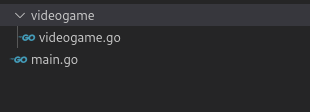
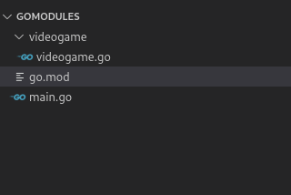
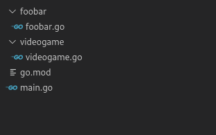

In go **you can consider a package as all the files contained in a directory and a module as a collection of packages**. To use the code of a package we need to import it, however, in Go there are no relative module imports. Before Go 1.8, to import packages (there were no modules) it was necessary to use the absolute path, considering as base the path pointed to by the environment variable $_GOPATH_ or. Since Go 1.11, the easiest way to work with packages is to use go mod. I will explain the latter.


Difference between modules and packages in go, in Go a module is just a collection of packages.

### Defining the name of a package in Go

Before we start, do you remember that I told you in the [introduction to the Go programming language](/en/go-programming-language-introduction-to-variables-and-data-types/), that the name of each package is set at the beginning of each file, placing it after the reserved word _package_?

For this example the package name will be _videogame_.

Once defined, I will create a model or struct in _videogame.go_.

```go
//videogame/videogame.go
package videogame

type Videogame struct {
    Id int32
    Title string
}
```

Remember that the [Go struct privacy rules](/en/go-structs-inheritance-polymorphism-and-encapsulation/) say that in order for us to access a _struct_ or its properties, from another package to where it was declared, we must use uppercase.

I know, it is one of the things that I abhor about Go's language, not enough for me to abandon it, but pretty cumbersone in my opinion, what if you need to debug one? welcome to regexland.

Once created, we will end up with a structure similar to this one



Localization of the main file and our module in go

## Import packages with go.mod

### What is a go.mod file for?

A go.mod file **defines a module and allows us to set the directory that we will use as a base to import the packages**.



In the above example the _go.mod_ file will allow us to treat the _videogame_ path as a package and import code from the _mymodule/videogame_ path.

### What does a go.mod file contain?

The basic _go.mod_ file is very short, it only specifies **the name of the module, which we will use to perform the imports, and the version of go**. That's all.

```go
module mymodule

go 1.15
```

### How to create a go.mod file?

The _go mod init_ command, followed by the name it will take as the base path for our package, will create a file named _go.mod_ in the directory where we run it.

```bash
go mod init mymodule
```

For example, if we name it _mymodule_, all the folders **that are at the same level as the _go.mod_ file and that declare a package at the beginning of their file**, will be considered packages.



And we can import them directly from our _main.go_ file.

```go
import (
    "mymodule/foobar"
    "mymodule/videogame"
)
```



## Remote modules in Go

### The go module handler

Go has a module handler equivalent to pip and npm, python and javascript, respectively, called get.

### go get

To get remote modules we run the _go get_ command in console followed by the path to our package; it supports any repository, not just github. Since go version 1.18, go get does not compile the code it downloads, but just adds, updates or removes dependencies in the _go.mod_ file.

```bash
go get github.com/labstack/echo
```

After executing the command, go will download the files to the path pointed to by the _$GOPATH_ environment variable and perform the corresponding imports into your _go.mod_ file.

```go
module mypackage

go 1.15

require (
    github.com/labstack/echo v3.3.10+incompatible // indirect
    github.com/labstack/gommon v0.3.1 // indirect
)
```

You will notice that their packages will be available for us to import with their respective path.

```go
import "github.com/labstack/echo"
```

In case we need a specific version we declare it after the route.

```bash
go get github.com/labstack/echo/v4
```

### go install

On the other hand, go install **does not download code**, but compiles a module and installs the binary into $GOPATH/bin, ignoring the contents of the _go.mod_ file when a version is specified to it via the command line.

```bash
go install sigs.k8s.io/kind@v0.9.0
```

Go install will generally be used to install commands which we'll be available for us to use.

### Import remote packages in go

Packages found in code repositories, such as GitHub, GitLab or BitBucket, require that we specify the full path to the repository as their import path.

```go
go mod init github.com/user/package
```

## Import packages without using them

There are times when we may want to import packages and not use them. For this, just add an underscore before the import.

```go
import (
  _ "fmt"
)
```

## Define an aliases when importing packages in Go

Go also allows us to declare an alias when importing a package by prefixing the alias to the import path.

```go
import ourAlias "route/to/package"
```

That way we can treat our alias as if it were the name of the package we are importing.

```go
import ourAlias "mypackage/videogame"
// ... our alias replaces videogame
var vd = ourAlias.Videogame{Id: 1, Title: "hello"}
```

### Imports with dot in Go

Go allows direct access to the contents of the package if we import using a dot as alias. In this way we can ignore the package name and directly access the objects it contains.

```go
import . "mypackage/videogame"
// ... we can replace videogame.Videogame by Videogame
var vd = Videogame{Id: 1, Title: "hello"}
```

## Other resources

* [Libraries to speed-up development](http://awesome-go.com/#?)
* [Sobre la variable $GOPATH y su configuración](https://www.digitalocean.com/community/tutorials/understanding-the-gopath-es/#?)
* [Sobre imports (en inglés)](https://scene-si.org/2018/01/25/go-tips-and-tricks-almost-everything-about-imports/#?)