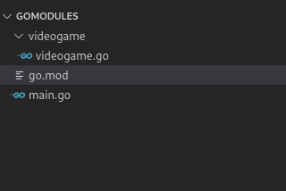

En go **puedes considerar un paquete como todos los archivos que contenga un directorio y un modulo como una colección de paquetes**. Para usar el código de un paquete necesitamos importarlo, sin embargo, en Go no existen las importaciones de módulos relativas. Antes de Go 1.8, para importar paquetes (no había modulos) era necesario usar la ruta absoluta, considerando como base la ruta a la que apuntaba la variable de entorno $_GOPATH_ o. A partir de Go 1.11, la manera más sencilla de trabajar con paquetes es usar go mod. Te explicaré esta última.


Diferencia entre modulos y paquetes en go

### Definir el nombre de un paquete en Go

Antes de empezar, ¿recuerdas que te comenté en la [introducción al lenguaje de programación Go](/golang-introduccion-al-lenguaje-variables-y-tipos-de-datos/), que el nombre de cada paquete se establece al principio de cada archivo, colocándolo después de la palabra reservada _package_?

Para este ejemplo el nombre del paquete será _videogame_.

Una vez definido, crearé un modelo o struct en _videogame.go_.

```go
//videogame/videogame.go
package videogame

type Videogame struct {
    Id          int32
    Title       string
}
```

Recuerda que las [reglas de privacidad de los structs](/go-structs-herencia-polimorfismo-y-encapsulacion/) dicen que para que podamos acceder a un _struct_ o sus propiedades, desde otro paquete a donde fue declarado, debemos usar mayúsculas.

Una vez creado terminaremos con una structura similar a esta


Localización del archivo principal y nuestro modulo en go

## Importar paquetes con go.mod

### ¿Para que sirve un archivo go.mod?

Un archivo de go.mod **define un modulo y nos permite establecer el directorio que usaremos como base para importar los paquetes.**



Archivo go.mod que contiene el nombre del modulo

En el ejemplo de arriba el archivo _go.mod_ nos permitirá tratar a la ruta _videogame_ como un paquete e importar código desde la ruta _mimodulo/videogame_

### ¿Qué contiene un archivo go.mod?

El archivo básico de _go.mod_ es muy corto, dentro de este solo se especifica **el nombre del modulo, el cual usaremos para realizar las importaciones, y la versión de go**. Es todo.

```go
module mimodulo

go 1.15
```

### Crear un archivo go.mod

El comando _go mod init_, seguido del nombre que tomará como la ruta base para nuestro paquete, creará un archivo de nombre _go.mod_ en el directorio donde lo ejecutemos.

```bash
go mod init mimodulo
```

Por ejemplo, si le pasamos como nombre _mimodulo_, todas las carpetas **que estén al mismo nivel que el archivo _go.mod_ y que declaren un package al inicio de su archivo**, se considerarán paquetes.


Y podremos importarlos directo desde nuestro archivo _main.go_

```go
import (
	"mimodulo/foobar"
	"mimodulo/videogame"
)
```

## Modulos remotos en Go

### El manejador de modulos de go

Go tiene un manejador de modulos equivalente a pip y npm, python y javascript, respectivamente, llamado get.

### go get

Para obtener modulos remotos ejecutamos el comando _go get_ en consola seguido de la ruta de nuestro paquete; soporta cualquier repositorio, no solo github. Desde la versión de go 1.18, go get no compila el código que descarga, sino que se limita a agregar, actualizar o remover dependencias en el archivo *go.mod*.

```bash
go get github.com/labstack/echo
```

Tras la ejecución del comando, go descargará los archivos en la ruta a donde apunte la variable de entorno _$GOPATH_ y realizará las importaciones correspondientes en tu archivo _go.mod_.

```go
module mipaquete

go 1.15

require (
	github.com/labstack/echo v3.3.10+incompatible // indirect
	github.com/labstack/gommon v0.3.1 // indirect
)
```

Podrás notar que sus paquetes estarán disponibles para que los importemos con su respectiva ruta.

```go
import "github.com/labstack/echo"
```

En caso de que necesitemos una versión en específico la declaramos después de la ruta.

```bash
go get github.com/labstack/echo/v4
```

### go install

Por otro lado, go install **no descarga código**, sino que compila un modulo e instala el binario en $GOPATH/bin, ignorando el contenido del archivo *go.mod* cuando se le especifica una versión a través de la linea de comandos.

```bash
go install sigs.k8s.io/kind@v0.9.0
```

Go install generalmente se usará para instalar comandos.

### Importar paquetes remotos en go

Los paquetes que se encuentran en repositorios de código, como GitHub, GitLab o BitBucket, requieren que especifiquemos la ruta completa del repositorio como su ruta de importación.

```go
go mod init github.com/usuario/paquete
```

## Importar paquetes sin usarlos

Hay ocasiones en donde querremos importar paquetes y no usarlos. Para esto basta con agregar un guión bajo antes de la importación.

```go
import (
  _ "fmt"
)
```

## Alias al importar paquetes

Go también nos permite declarar un alias a la hora de importar un paquete anteponiendo el alias a la ruta de importación.

```go
import nuestroAlias "ruta/a/paquete"
```

De esa manera podemos tratar nuestro alias como si se tratara del nombre del paquete que estamos importando.

```go
import nuestroAlias "mipaquete/videogame"
// ... nuestroAlias reemplaza a videogame
var vd = nuestroAlias.Videogame{Id: 1, Title: "hola"}
```

### Importaciones con punto

Go permite acceder al contenido del paquete de manera directa si importamos usando como alias un punto. De esta manera podemos ignorar el nombre del paquete y acceder directamente a los objetos que contiene.

```go
import . "mipaquete/videogame"
// ... en lugar de videogame.Videogame podemos usar solo Videogame
var vd = Videogame{Id: 1, Title: "hola"}
```

## Librerías en Go

Si estás buscando librerías que aceleren el desarrollo de algún proyecto, existe un directorio de frameworks, librerías y utilidades en [Awesome go](http://awesome-go.com/), hay recursos para todo, desde GUI, ORMs, web frameworks, machine learning y todo lo que te puedas imaginar.

## Otros recursos

- [Sobre la variable $GOPATH y su configuración](https://www.digitalocean.com/community/tutorials/understanding-the-gopath-es)
- [Sobre imports (en inglés)](https://scene-si.org/2018/01/25/go-tips-and-tricks-almost-everything-about-imports/)
