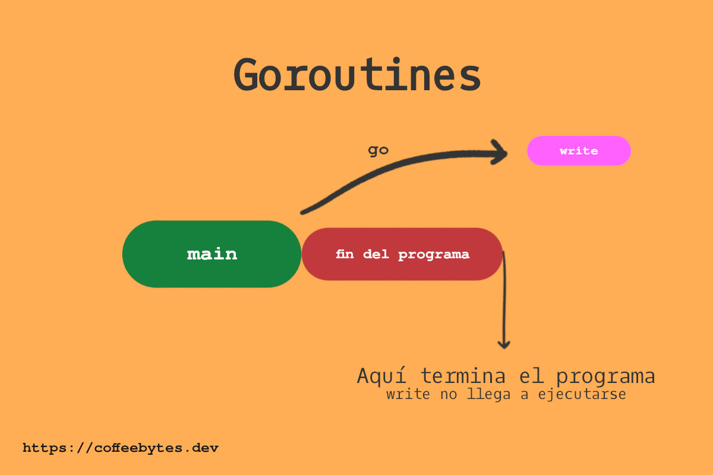
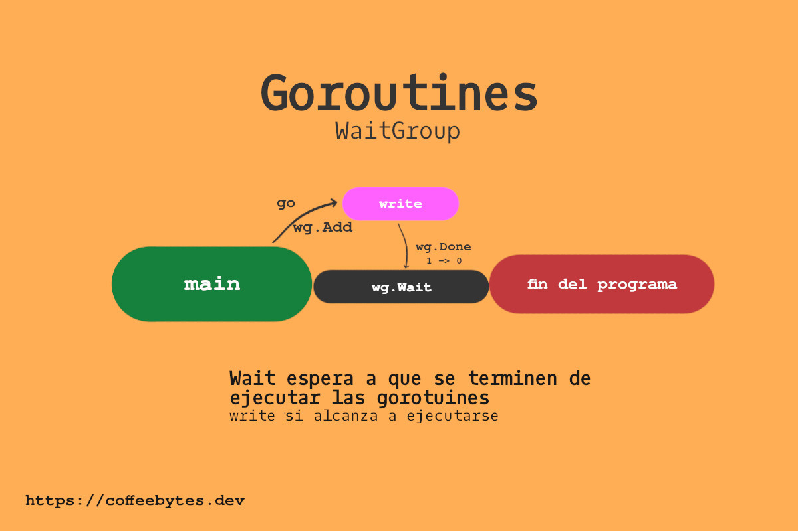

<!-- TRANSLATED by md-translate -->
---

title: "Go: introduction to goroutines and concurrency"
date: "2022-01-19"
categories:

* go

coverImage: "images/goroutines-and-concurrency-in-go.jpg"
description: "Post about the basics of goroutines, channels or channels, waitgroups and locks in the golang or go programming language."
keywords:

* go
* concurrency
* parallelism
* workers

authors:

* Eduardo Zepeda

---

As I mentioned in the introduction to the go programming language: [go is a specialized concurrency language](/golang-introduction-to-the-variables-and-data-types-language/). It is a language that was designed to handle multiple tasks asynchronously. This entry is about go channels.

## Concurrency is not parallelism

Before we begin, remember that parallelism and concurrency are different. This post is too small to deal with such a broad topic, however there are two resources I want to highlight:

* [Concurrent Programming by Felipe Restrepo
Street](http://ferestrepoca.github.io/paradigmas-de-programacion/progconcurrente/concurrente_teoria/index.html)
* [Concurrency vs parallelism by Hector Patricio in The dojo
blog](https://blog.thedojo.mx/2019/04/17/la-diferencia-entre-concurrencia-y-paralelismo.html)

I quote a sentence from the first resource that, in my opinion, sums up the difference quite well:

> A program is concurrent if it can support two or more actions **in
> progress.
>
> A program is parallel if it can support two or more actions **executing
> simultaneously.** > > A program is parallel if it can support two or more actions
>
> Felipe Restrepo Calle

If they still seem confusing and you don't understand the difference, give those posts a read and you should be ready to move on.

## Corrutinas en go

A [corroutine](https://es.wikipedia.org/wiki/Corrutina), in go, is **a function or method that runs concurrently with other functions or methods**. In go, corroutines are referred to as **goroutines** or goroutines. Even the main function, _main_, is executed inside one.

Goroutines are used in design patterns, such as the [worker-pool-design-pattern](explanation-of-worker-pool-design-pattern/)

To generate a goroutine we add the keyword _go_ before a function. This will schedule the function for asynchronous execution.

```go
func write(texto string) {
fmt.Println(texto)
}
fmt.Println("hey")
go write("hey again")
// hey
```

In the above case, due to its asynchronous nature, the goroutine does not stop code execution. This implies that the body of the _main_ function continues its execution and **our goroutine never executes.



But then, how do we get our goroutine to run? The naive approach would be to use a sleep to pause the execution of the code. This, as you know, is nonsense, we can't be putting sleeps everywhere, the flow of the program would be unnecessarily slowed down!

```go
// NO LO HAGAS
time.Sleep(1 * time.Second)
```

A better approach would be to create a **WaitGroup**.

## WaitGroups in go

A **WaitGroup** will stop the execution of the program and wait for the goroutines to be executed.

Internally, a **WaitGroup** works with a counter, when the counter is at zero the execution of the code will continue, while if the counter is greater than zero, it will wait for the other goroutines to finish executing.

```go
var wg sync.WaitGroup

wg.Wait()
fmt.Println("Si el contador del waitgroup es mayor que cero se continuará con esta función.")
```

And how do we change the counter value?

To increment and decrement the counter of the **WaitGroup** we will use the _Add_ and _Done_ methods, respectively.

### The Add method

The _Add_ method increments the WaitGroup counter by _n_ units, where _n_ is the argument we pass to it.

The trick is to call it every time you run a goroutine.

```go
wg.Add(1)
go write("Hey")
```

### The Done Method

The **Done** method is responsible for decrementing one unit of the **WaitGroup** counter. We will call it to tell the **WaitGroup** that the goroutine has finished and decrement the counter by one.

```go
func write(texto string, wg *sync.WaitGroup) {
    fmt.Println(texto)
    wg.Done()
}
```

Remember that the instance of the **WaitGroup** (wg *) needs to be passed by reference or else we will not access the original **WaitGroup**.

```go
func write(texto string, wg *sync.WaitGroup) {
    fmt.Println(texto)
    defer wg.Done()
}
```

Tip: use _defer_ over the _Done_ method to ensure that it is the last thing to be executed.



Once the wg.wait counter becomes zero, program execution continues.

```go
var wg sync.WaitGroup
wg.Add(1)
go escribirEnCanal("Ge", &wg)
wg.Wait()
```

### Anonymous functions in goroutines

When using goroutines, it is quite common to use anonymous functions to avoid declaring a new function.

```go
go func() {
}()
```

Remember that the parentheses that appear after the body of the function execute the anonymous function that we declare and also receive its arguments.

```go
go func(text string) {
}("Texto")
```

## More resources about goroutines

Finally, here are some other resources on goroutines that you can consult.

* [Goroutines](https://golangbot.com/goroutines/)
* [Goroutines by google devs](https://www.youtube.com/watch?v=f6kdp27TYZs)