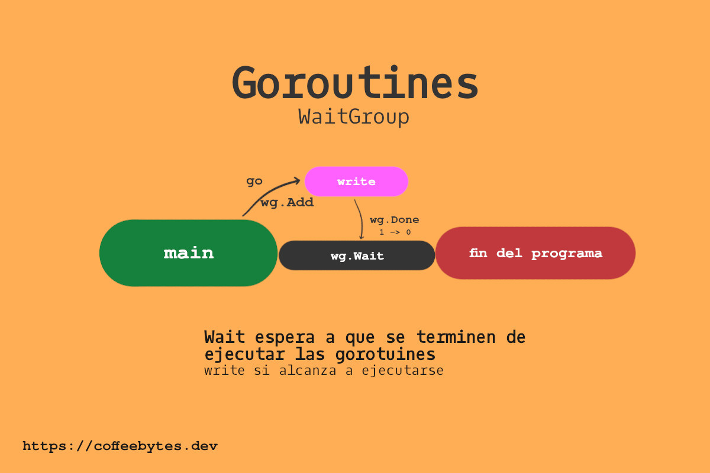

Como te mencioné en la introducción al lenguaje de programación go: [go es un
lenguaje especializado en la
concurrencia](/golang-introduccion-al-lenguaje-variables-y-tipos-de-datos/). Es
un lenguaje que fue diseñado para manejar múltiples tareas de manera asíncrona.
Esta entrada trata sobre los channels o canales de go.

## Concurrencia no es paralelismo

Antes de empezar, recuerda que paralelismo y concurrencia son diferentes. Este
post es muy pequeño para tratar un tema tan amplio, sin embargo hay dos recursos
que quiero destacar:

- [Programación concurrente de Felipe Restrepo
  Calle](http://ferestrepoca.github.io/paradigmas-de-programacion/progconcurrente/concurrente_teoria/index.html)
- [Concurrencia vs paralelismo de Hector Patricio en The dojo
  blog](https://blog.thedojo.mx/2019/04/17/la-diferencia-entre-concurrencia-y-paralelismo.html)

Cito una frase del primer recurso que, a mi parecer, resume bastante bien la
diferencia:

> Un programa es concurrente si puede soportar dos o más acciones **en
> progreso.**
> 
> Un programa es paralelo si puede soportar dos o más acciones **ejecutándose
> simultáneamente.**
> 
> Felipe Restrepo Calle

Si aún así te parecen confusos y no entiendes la diferencia, dale una leída a
esos posts y deberías estar listo para seguir adelante.

## Corrutinas en go

Una [corrutina](https://es.wikipedia.org/wiki/Corrutina), en go, es **una
función o método que se ejecuta concurrentemente junto con otras funciones o
métodos**. En go, a las corrutinas se les conoce como **goroutines** o
gorutinas. Incluso, la función principal, _main_, se ejecuta dentro de una.

Las goroutines son usadas en patrones de diseño, como el [patrón de diseño worker pool](/explicacion-del-patron-de-diseno-worker-pool/)

Para generar una goroutine agregamos el keyword _go_ antes de una función. Lo
anterior programará la función para su ejecución asíncrona.

```go
func write(texto string) {
fmt.Println(texto)
}
fmt.Println("hey")
go write("hey again")
// hey
```

En el caso anterior, debido a su naturaleza asíncrona, la goroutine no detiene
la ejecución del código. Lo anterior implica que el cuerpo de la función _main_
continua su ejecución y **nuestra goroutine nunca llega a ejecutarse.**


¿Pero entonces? ¿cómo le hacemos para que nuestra goroutine se ejecute? La
aproximación ingenua sería usar un sleep para pausar la ejecución del código.
Esto, como ya sabes, es un sinsentido. ¡No podemos estar poniéndo sleeps en
todos lados, el flujo del programa se ralentizaría innecesariamente!

```go
// NO LO HAGAS
time.Sleep(1 * time.Second)
```

Una mejor aproximación sería crear un **WaitGroup** o grupo de espera.

## WaitGroups en go

Un **WaitGroup** detendrá la ejecución del programa y esperará a que se ejecuten
las goroutines. 

Internamente, un **WaitGroup** funciona con un contador, cuando el contador esté
en cero la ejecución del código continuará, mientras que si el contador es mayor
a cero, esperará a que se terminen de ejecutar las demás goroutines.

```go
var wg sync.WaitGroup

wg.Wait()
fmt.Println("Si el contador del waitgroup es mayor que cero se continuará con esta función.")
```

¿Y como cambiamos el valor del contador?

Para incrementar y decrementar el contador del **WaitGroup** usaremos los
métodos *Add* y *Done*, respectivamente.

### El método Add

El método _Add_ incrementa el contador del WaitGroup en *n* unidades, donde *n*
es el argumento que le pasamos. 

El truco está en llamarlo cada vez que ejecutemos una goroutine. 

```go
wg.Add(1)
go write("Hey")
```

### El Método Done

El método **Done** se encarga de disminuir una unidad del contador del
**WaitGroup**. Lo llamaremos para avisarle al **WaitGroup** que la goroutine ha
finalizado y decremente el contador en uno.

```go
func write(texto string, wg *sync.WaitGroup) {
	fmt.Println(texto)
	wg.Done()
}
```

Recuerda que la instancia del **WaitGroup** (wg \*) necesita pasarse por
referencia o de otra manera no accederemos al **WaitGroup** original.


```go
func write(texto string, wg *sync.WaitGroup) {
    fmt.Println(texto)
    defer wg.Done()
}
```

Tip: usa _defer_ sobre el método _Done_ para garantizar que
sea lo último que se ejecute.



Una vez que el contador de wg.Wait se vuelve cero, se continua la ejecución del
programa.

```go
var wg sync.WaitGroup
wg.Add(1)
go escribirEnCanal("Ge", &wg)
wg.Wait()
```

### Funciones anónimas en goroutines

Cuando se usan gorutinas, es bastante común utilizar funciones anónimas para evitar declarar una función nueva.

```go
go func() {
}()
```

Recuerda que los paréntesis que aparecen tras el cuerpo de la función ejecutan
la función anónima que declaramos y también reciben sus argumentos.

```go
go func(text string) {
}("Texto")
```

## Más recursos sobre goroutines

Para finalizar te dejo algunos otros recursos sobre gorutinas que puedes consultar.

- [Goroutines](https://golangbot.com/goroutines/)
- [Goroutines por google devs](https://www.youtube.com/watch?v=f6kdp27TYZs)
