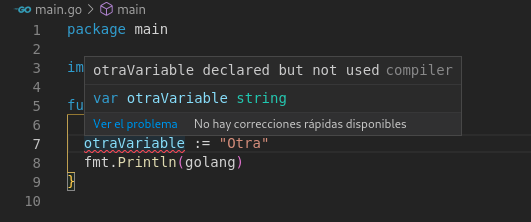
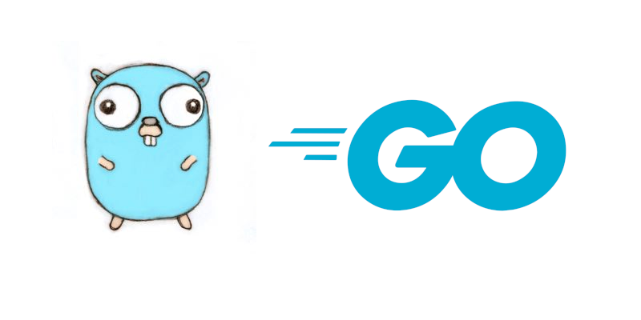

Golang, also known as go, is a compiled programming language developed by Google. It is a language quite appreciated according to the latest Stackoverflow surveys (2023), as you can see in my python vs go post, where I also compare the good, the bad and the ugly of this language.

## What's Go the programming language?

Go or Golang is a language with a syntax similar to that of C and with certain abstractions in its syntax that make it a language in which writing code is a piece of cake, coding in Go feels like a mixture between coding in Python and C.

This is a compiled, imperative, **strongly concurrency-centric**, statically typed language.

### Cool aspects and advantages of Go

* **The language is quite simple** It is a language with just a few keywords and functionalities. You can learn it in a breeze.
* **Go compiler is super fast** Since it has few keywords and the language is quite simple, go compiles *blazinlgy fast* (I detest the over use of that expression) compared to other programming languages.
* **Concurrency handling is easy** Go was designed as a concurrent language, creating [concurrency with goroutines](/en/go-use-of-channels-to-communicate-goroutines/) is quite easy.
* **Creating web applications is quite simple** Go incorporates in its standard library a lot of utilities to create web servers, so you can even use it without using any framework, for simple applications, and you won't have any problem.

### Why does go suck? Disadvantagesof Go

To make this analysis as objective as possible, here are some controversial aspects of go that are not viewed favorably by some developers. Yes, I know the community can be toxic sometimes, but I agree with most of them. Let's be realistic, Go is not perfect, but in my opinion this is not about perfection but getting things done.


* **Go lacks support for classes** directly. But all is not lost, because it does have certain features that provide it with OOP functionalities, such as polymorphism and classes, by means of [interfaces, structs and embedded values](/en/go-structs-inheritance-polymorphism-and-encapsulation/).
* **Go does not have exception handling with try and catch blocks or equivalent**, but errors must be returned as a return value in a function and are handled by checking that it is not null (nil), by means of if blocks. This can become quite verbose and repetitive.


* **There are no default arguments in go**, which increases the amount of code to write to deal with defaults.
* **No manual memory management**, go uses a garbage collector, which simplifies memory management enormously, but limits more granular memory management, this was one of the reasons why [discord migrated from Go to Rust](https://discord.com/blog/why-discord-is-switching-from-go-to-rust).
* **~~Go does not have generics~~** Go already has generics support since version 1.18.

## Go and its best practices

Go is strongly oriented to good code practices. How does it do it? The compiler forces good practices in the code, preventing the code from compiling if there are variables or imports that are not used, or if the privacy rules of our properties and functions are not respected, among others.



However it doesn't force you to check for nil values.

## The most popular mascot in programming

The official mascot is a ground squirrel and it is popular among the community to use it to illustrate go-related content. This Blue Sartre rodent version is so popular among developers that there are tools, such as [Gopherizme](https://gopherize.me), to create custom avatars. The impact of the mascot is such that many developers use it as a logo, although the [official go logo](https://blog.golang.org/go-brand) has already been defined.



## Go Installation

Go can be found in most GNU/Linux distribution repositories. In debian and ubuntu it is installed using the [apt install command](/en/linux-commands-you-should-know-part-two/) like any other package.

```bash
sudo apt install golang
```

The installation instructions for Freebsd, windows and macOSx will be different.

## Structure of a go file

The go files are structured as follows and in this order:

### Package name

A section where the package name is declared after the word _package_. The package name will be used to import our modules.

```python
package main
```

### Imports

A section where all the [go packages](/en/go-package-import-and-module-management/) that will be used are imported. For this we use the word _import_.

import "fmt" import "fmt" import "fmt" import "fmt" import

Multiple imports can be placed inside parentheses, without commas.

```go
import (
    "strconv"
    "fmt"
)
```

### Content

The contents of the file, i.e. declarations of variables, types, [functions](/en/go-functions-arguments-and-the-fmt-package/), constants, etc.

```go
func main() {
    fmt.Println("Hello world!")
}
```

## The main package

Go requires a main package called _main_, which will be specified by placing _package main_ at the beginning of our source code.

```go
package main
```

### The main function

The _main_ function is the starting point of a go file, as it would be in C, and returns nothing.

```go
package main

import "fmt"

func main() {
    fmt.Println("Ejecutando el programa")
}
```

### init function

Before the entry point of the program (the _main_ function) an init function is executed, this can contain all the initializations necessary for the execution of the program.

```go
package main

import "fmt"

func init() {
    fmt.Println("Inicializando el programa principal")
}

func main() {
    fmt.Println("Ejecutando el programa")
}
```

## Compiling and running a go file

Since go is a compiled language, it requires the compilation of the code before the code can be executed. Compiling is done with the build command.

```go
go build src/main.go
```

After the compilation we will have a file that we will be able to execute.

```go
./main
```

It is also **possible to compile and run the code in one step** using run instead of go.

```go
go run src/main.go
```

### Differences between run and build

The difference between build and run is that **run compiles the code and executes it from a temporary directory**, and then cleans up the generated files. If we add the --work flag, we can see the location of this directory.

```go
go run --work src/main.go
# WORK=/tmp/go-build983014220
```

## Primitive data types

Since we are dealing with a compiled language, we need to tell the compiler the data type we will use for each variable or constant.

The primitive values of Go are as follows.

### Integer

For signed or unsigned integer values.

* int, assigned according to OS (32 or 64 bits)
* int8,
* int16
* int32
* int64

### Unsigned integer

For unsigned, i.e. positive values.

* uint, assigned according to OS (32 or 64 bits)
* uint8
* uint16
* uint32
* uint64

### Decimal

For decimal numbers

* float32
* float64

### Texts

For text there is only _string_

### Boolean

For _true_ or _false_ values

### Complex numbers

It allows to handle real and imaginary numbers:

* Complex64
* Complex128

For example: c:=100+2i

## Variables, constants and zero values in go

### Variables

Go allows you to define variables by specifying the data type and the keyword var. It is as if you added the data type to a Javascript variable declaration.

```go
var gravedad int8
```

Variable assignment can be performed in a single step as follows:

```go
var gravedad int = 123
```

It is also possible to **let the compiler intuit the data type with the walrus (groundhog) operator**. This type of assignment **is only possible within the scope of a function**.

```go
gravedad := 123
```

In go you cannot assign a variable to the null value; _nil_.

```go
var gravedad = nil // error
```

### Constants

Constants work in a similar way, but are characterized by the fact that they cannot be modified. The keyword _const_ is used.

**It is necessary to assign a value to a constant when declaring it**.

```go
const gravedad int8 = 123
```

If we do not specify a constant type the compiler will try to guess it.

```go
const pi = 3.14159
```

### Zero values

In go, **if we do not assign a value the compiler will use default values** for each data type.

* int: 0
* float: 0
* string: "
* bool: false

## Null value

Go uses the reserved word _nil_ to refer to a null value.

## Comments

The comments are marked using two diagonals in a row.

```go
// This is a comment
```

Multi-line comments are made with a diagonal followed by an asterisk.

```go
/*
this is a multiline comment
*/
```

## Operators in go

The operators of go are similar to the rest of the languages.

* +, sum
* \-, subtraction
* \*, multiplication
* /, division
* <, less than
* <=, less than or equal to
* \>, greater than
* \>=, greater than or equal to
* %, modulus or remainder
* !=, inequivalence
* ==, equality
* !, negation
* &&, AND operator
* ||, OR operator
* ++, incremental
* \--, decremental

With this I finish the most basic part of the language, I hope to put the language in a good light for you. If you want to learn more about it you can read the following post, I have written tutorials about all the basic parts of the language. See you soon!