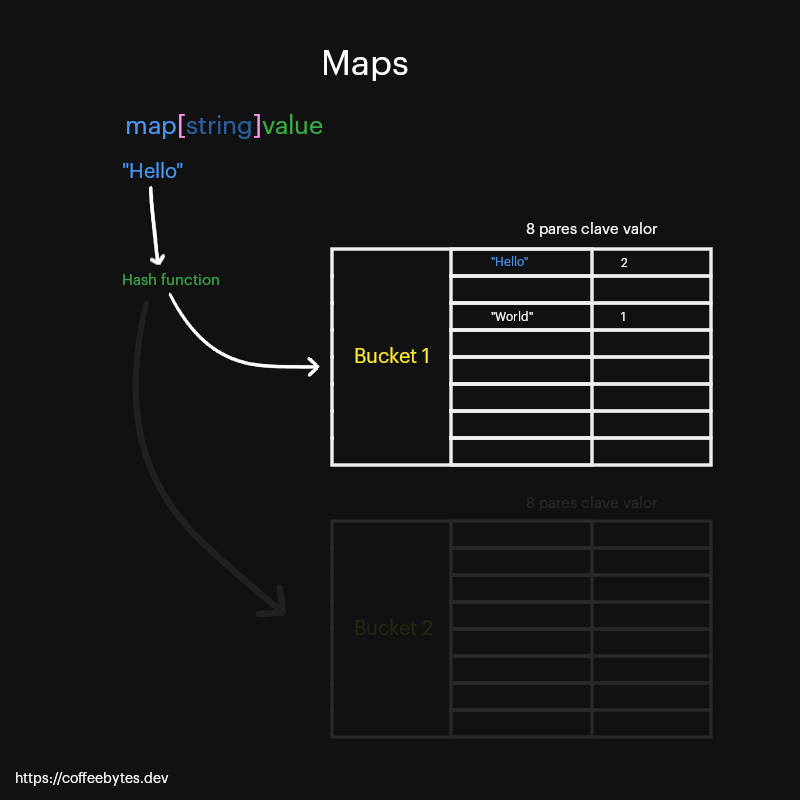

---
aliases:
- /go-maps-o-diccionarios
authors:
- Eduardo Zepeda
categories:
- go
coverImage: images/go-maps-o-diccionarios.jpg
date: '2021-12-21'
description: Te explico como funcionan un map en go o golang y aprende a declararlos,
  crearlos explícitamente con make y recorrerlos con range.
keywords:
- go
title: 'Go: maps o diccionarios'
---

En el lenguaje de programación go, un map o hash table es el equivalente de un diccionario; poseen una llave o key que se relaciona con un valor o value. La llave y el valor pueden ser de diferentes tipos de datos, pero todas las llaves deben ser de un solo tipo y todos los valores deben ser del mismo tipo.

Junto con el [array y el slice de go](/es/go-slices-y-arrays/), un map es una estructura que nos sirve como una colección de valores.

## Funcionamiento interno de un map en go

En go un map funciona bastante similar a cualquier otro lenguaje. En go hay buckets, un tipo de sección que consisten en 8 pares de llave-valor. La función hash (hash function) recibe la llave y nos redirige al bucket adecuado, es decir, el espacio de 9 pares de llave-valor donde se encuentra la nuestra y, una vez ahí, se busca la llave correcta.



Funcionamiento interno de un map en go. La información está tomada de la [documentación oficial de un map.](https://go.dev/src/runtime/map.go)

Para declarar un map, usamos la palabra map y encerramos en corchetes el tipo de dato de la llave, seguido del tipo de dato del valor.

```go
var diccionario map[string]int
// un map con llaves tipo string y valores de tipo entero
diccionario["hello"] = 0
diccionario["panic"] = 1
fmt.Println(diccionario)
// panic: assignment to entry in nil map
```

Sin embargo si ejecutamos lo anterior nos dará un error. ¿Por qué? Es importante que sepas que **los maps son referencias, apuntan a una ubicación de memoria**, como creamos un _map_ vacío pues apunta a la nada, a _nil_, por lo que si intentamos modificarlo, nos dará un error.

Igual que con el slice, tenemos dos maneras de crear un map o diccionario.

- Pasándole los valores después del tipo de dato del valor
- Usando la función make.

## Crear un map en go con valores

Podemos crear un map o diccionario usando map, el tipo de dato de las llaves entre corchetes, seguido del tipo de dato de los valores y luego los datos llave valor entre corchetes, separando cada uno con dos puntos.

Las llaves del map pueden modificarse e incluso se pueden agregar nuevas.

```go
var cuenta = map[string]int{
        "Paloma": 100,
        "Renee": 200,
        "Kakuro": 300,
        "Manuela": 400,
}
cuenta["Paloma"] = 500
cuenta["Colombe"] = 900
```

También podemos dejar que go infiera que es un map, pero solo dentro de una función, usando el operador walrus ":=".

```go
cuenta := map[string]int{
        "Paloma": 100,
        "Renee": 200,
        "Kakuro": 300,
        "Manuela": 400,
}
cuenta["Paloma"] = 500
cuenta["Colombe"] = 900
```

## Crear un map con make

Para crear un map asignando memoria necesitamos usar la función make y especificar el tipo de datos que tendrán las llaves y los valores tras la palabra map.

En este caso no tenemos que pasarle a make el argumento de la longitud del map. Si omitimos el tamaño del map, internamente, go le asignará un valor pequeño.

```go
var diccionario = make(map[string]int)
diccionario["hello"] = 2
diccionario["world"] = 1
fmt.Println(diccionario)
// map[hello:2 world:1]
```

¡Ahora mira esto! Tenemos un map o diccionario con solo dos llaves, mira que pasa si accedemos a una tercera.

```go
fmt.Println(saldo["usuario"])
// 0
// ¿Cómo distinguimos si el usuario no existe o si tiene un saldo igual a 0
```

**Si intentamos acceder a una llave que no existe, go nos devolverá su respectivo zero value**, pero esto nos lleva a un problema: ¿cómo distinguimos si tenemos un cero porque la llave no existe o porque el valor de nuestra llave es cero?

## Distinguir entre valores inexistentes y zero values

Para distinguir entre un zero value, go nos provee de un segundo valor de retorno, que nos indica si existe una llave. Este segundo valor es un booleano: _true_ o _false_.

```go
value, exist := diccionario["Inexistente"]
```

## Capacidad opcional en maps

Para establecer una capacidad máxima de llaves en un _map_, le pasamos la longitud del map como segundo argumento.

```go
m := make(map[string]int,99)
```

Sin embargo, a diferencia de los slices, esta longitud solo le indica al compilador que asigne un mínimo de memoria, si agregamos más llaves del valor máximo se seguirán añadiendo, aunque no tan eficientemente.

## Borrar llaves con delete

Si queremos deshacernos de una llave de nuestro _map_, usamos la función _delete,_ la cual borra una llave de un map o diccionario.

```go
delete(diccionario, "Helio")
```

## Recorrer un map con range

Al igual que con un un _array_ o un _slice_, podemos recorrer un _map_ usando _range_. Cada iteración nos devolverá la llave y el valor.

Recuerda que, al ser un map, **los elementos se retornarán sin ningún orden** en particular.

```go
for key, value := range diccionario {
        fmt.Println(key,value)
    }
```

Con esto doy por terminada la entrada, es lo mínimo que se debe saber sobre los maps o diccionarios en go.