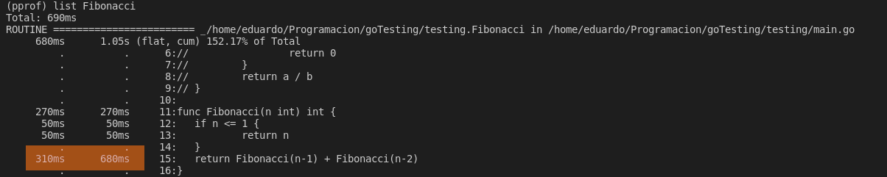
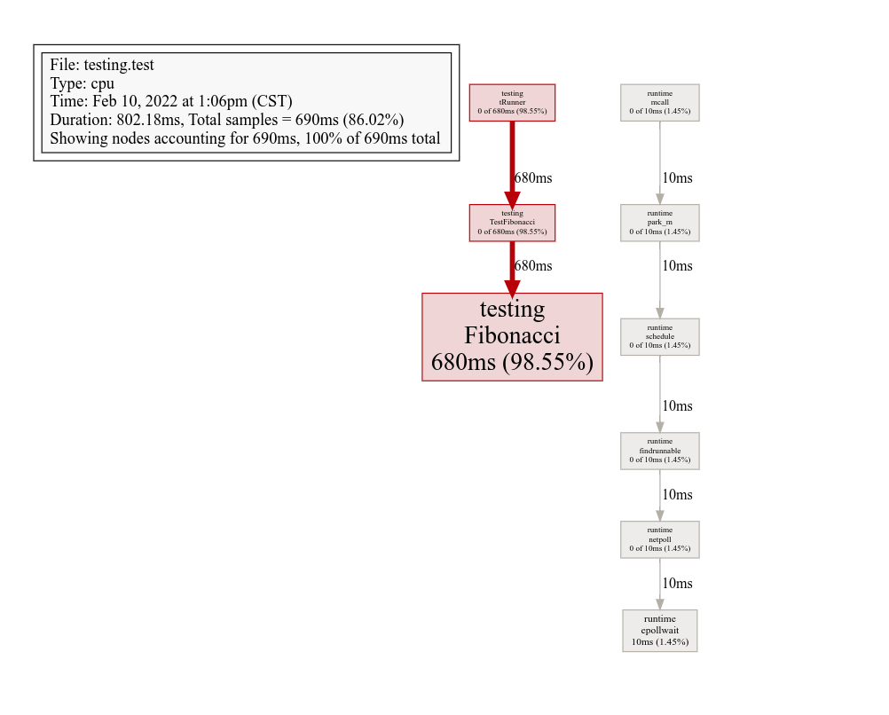
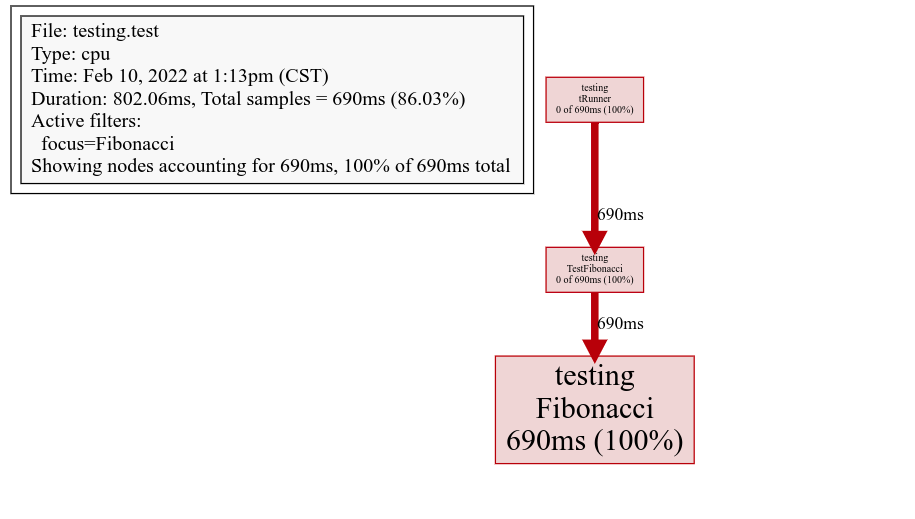

In addition to [unit test testing and coverage measurement in go](/go-testing-basic-and-coverage/), this programming language is capable of profiling the efficiency of the code by analyzing it in a very detailed way. This is quite useful to find bottlenecks or very expensive parts of the code, which are called numerous times or whose performance can be improved.

## How does Go profiling work internally in GNU/Linux?

GNU/Linux, more specifically GNU, has an alarm signal called [SIGPROF](https://www.gnu.org/software/libc/manual/html_node/Alarm-Signals.html), this signal warns when a timer finishes measuring CPU usage and interrupts code execution.

In Go profiling, the SIGPROF signal is programmed to be called every 10 ms. Each time this signal is invoked, the current instruction of the [program counter (PC)](https://es.wikipedia.org/wiki/Contador_de_programa) is examined and traced back to the sequence of instructions that called it. The result of the above process is a report of the elements in the execution stack, known as [stack trace](https://es.wikipedia.org/wiki/Stack_trace).

The profiling process will slow down the execution of the code, as it is interrupted every 10ms to see what is being executed. As you probably already deduced, if a function is found multiple times in the stack traces that are generated after each SIGPROF signal, it means that it has been running for a long time.

At the end of the profiler the go _pprof_ tool organizes the data so that it can be represented in a more user-friendly way.

## CPU profiling in go

For this entry I will use the classic fibonacci recursion to demonstrate the profiling capabilities of go. I am using go version go1.15.15 linux/amd64.

```go
func Fibonacci(n int) int {
    if n <= 1 {
    	return n
    }
    return (Fibonacci(n-1) + Fibonacci(n-2))
}
```

For testing in go, just as I explained in the previous post, we will use an array of structs to handle the different cases.

```go
func TestFibonacci(t *testing.T) {
    tables := []struct {
    	n int
    	fibo int
    }{
    	{0, 0},
    	{1, 1},
    	{2, 1},
    	{15, 610},
    	{17, 1597},
    	{40, 102334155},
    }

    for _, table := range tables {
    	result := Fibonacci(table.n)
    	if result != table.fibo {
    		t.Errorf("Fibonacci incorrecta, esperabamos %d, pero obtubimos %d", table.fibo, result)
    	}
    }
}
```

### Obtaining profiling information

As we did to view the [coverage in go testing](/go-testing-basic-and-coverage/), we use a flag to create a file with the profiling information in binary, this file cannot be viewed directly.

```go
go test -cpuprofile=cpu.out

PASS
ok _/home/eduardo/Programacion/goTesting/testing 0.813s
```

But it can be used by other tools to visualize it in a more human way.

### Display profiling results

To see the cpu usage summary we use _tool pprof_ passing as argument the file containing the profiling data.

```go
go tool pprof cpu.out

File: testing.test
Type: cpu
Time: Feb 10, 2022 at 1:06pm (CST)
Duration: 802.18ms, Total samples = 690ms (86.02%)
Entering interactive mode (type "help" for commands, "o" for options)
```

After executing the above command we will be inside a terminal. If we execute _top_ we will see the behavior of our code.

See how Fibonacci occupies almost all of the time used.

```go
(pprof) top

File: testing.test
Type: cpu
Time: Feb 10, 2022 at 1:06pm (CST)
Duration: 802.18ms, Total samples = 690ms (86.02%)
Entering interactive mode (type "help" for commands, "o" for options)
(pprof) top
Showing nodes accounting for 690ms, 100% of 690ms total
      flat flat%   sum%        cum cum%
     680ms 98.55% 98.55%      680ms 98.55%  _/home/eduardo/Programacion/goTesting/testing.Fibonacci
      10ms 1.45%   100%       10ms 1.45%  runtime.epollwait
         0 0%   100%      680ms 98.55%  _/home/eduardo/Programacion/goTesting/testing.TestFibonacci
         0 0%   100%       10ms 1.45%  runtime.findrunnable
         0 0%   100%       10ms 1.45%  runtime.mcall
         0 0%   100%       10ms 1.45%  runtime.netpoll
         0 0%   100%       10ms 1.45%  runtime.park_m
         0 0%   100%       10ms 1.45%  runtime.schedule
         0 0%   100%      680ms 98.55%  testing.tRunner
```

Within the pprof terminal it is possible to inspect the average execution time of each line of a function, using:

```go
list <nombre_funcion>
```

After executing the command a list will be generated where we can see each function broken down line by line, along with its impact.

You have probably noticed that most of the time is consumed by the recursive part of Fibonacci.



### Export of results

In addition to console results, we can also visualize the results, in a more understandable way using the _web_ command, which creates a small schematic accessible from the browser.

Each box represents an individual function and the lines indicate the order in which the functions call each other.



As an optional parameter we can pass the name of a function and go will filter the results.

```go
(pprof) web <funcion>
```



The schematic generated by the _web_ command can be exported to a pdf with the _pdf_ command.

```go
(pprof) pdf
```

## Other profiling resources

* Documentación oficial de go sobre profiling](https://go.dev/blog/pprof)
* [Go profiler internals](https://www.instana.com/blog/go-profiler-internals/)
* [GopherCon 2019: Dave Cheney - Dos programas Go, tres técnicas de perfilado diferentes](https://www.youtube.com/watch?v=nok0aYiGiYA)