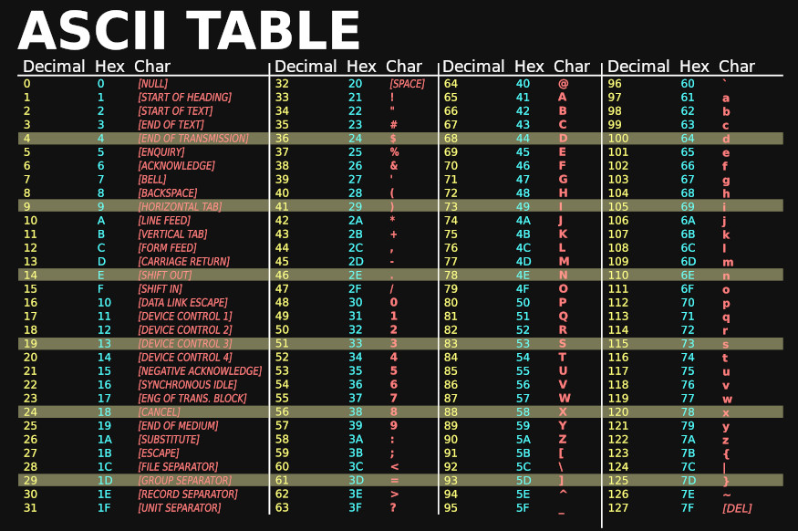
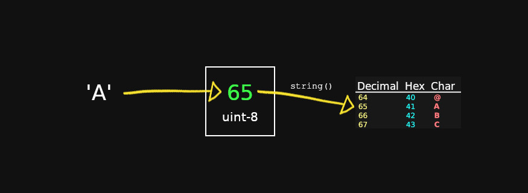
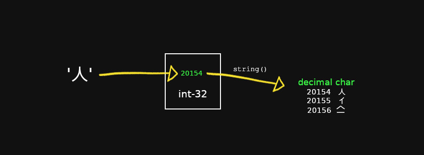
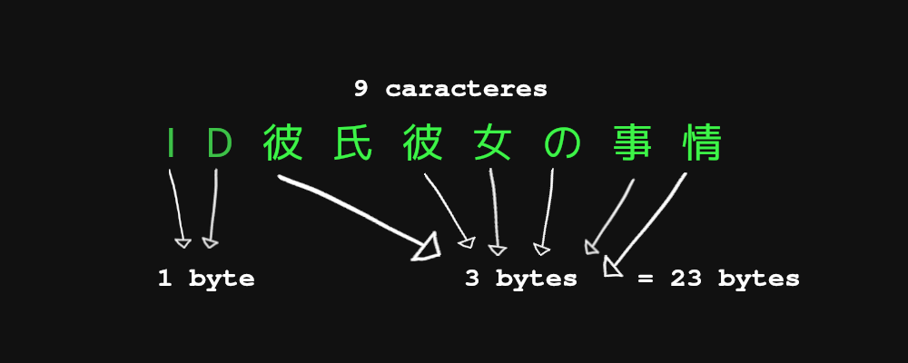

In this entry I will explain the basics of how strings, runes and bytes work in go, and even a little bit of utf-8.

To explain the topic I will assume you know the basics of slices and data types in go, if you don't know about these topics visit my [array, slices in golang](/go-arrays-and-slices/) entry.

If this is your first approach to go, take a look at my [introduction to the go programming language](/golang-introduction-to-the-language-variables-and-data-types/) post and then come back here.

## A little bit about conventions

As you probably already know, computers only store numbers. The letters you see on the screen are a representation of those numbers.

So how does the computer know which number corresponds to which letter? Well, a bunch of people got together and agreed to assign a number to each character. Of course these agreements are not universal and there are multiple variants on what numbers correspond to each letter, including ASCII, UTF-8, UTF-16, UTF-32 and other less common ones. That is, a number may represent the character "人" in one convention, but it may represent another in another convention, so they are just numbers.

This topic is quite extensive and there is already enough information on the internet, so just keep in mind that behind each character there is a number that represents it and that this character depends on the table we use to represent it.



ASCII table with modified colors taken from [wikimedia](https://commons.wikimedia.org/wiki/File:ASCII-Table-wide.svg).

Knowing the above, let's go to the byte data type.

## Bytes in go

A byte in go is synonymous with an _uint8_, an unsigned int8. In other words, 8 bits that we can assign directly to different notations. The fact that it is a _uint8_ data type allows us to use any number between 0 and 255.

```go
var ch byte = 65 // decimal
var ch1 byte = 0b1000001 // Binaria
var ch2 byte = 0o101      // Octadecimal
var ch3 byte = 0X41       // hexadecimal
```

Just as we can store a number, we can also store the numeric representation of a character by wrapping it in single quotes.

It is like saying to go: "Save the number value to which this character corresponds". When printed, it will return the number, in decimal notation.

```go
var ch byte = 'A'
fmt.Println(ch)
// 65
```

If we perform a type conversion to string, using the string converter, we will obtain the letter "A".

```go
fmt.Println(string(ch))
// 'A'
```



### Array of bytes

Just as we have the byte data type, we can also create an array of bytes and in multiple ways. Notice how the array is stored with the number that corresponds to each character.

```go
// Instanciado directamente de un string
t1 := []byte("ABCDE")

// Como si fuera un array de caracteres
t2 := []byte{'A', 'B', 'C', 'D', 'E'}

// como si fuera un array de números ord()
t3 := []byte{65, 66, 67, 68, 69}

// Con la función copy
var t4 = make([]byte, 5)
copy(t4, "ABCDE")

// En todos los casos obtenemos:
//[65 66 67 68 69]
```

### Converting an array of bytes to a string

Remember I told you that each number represents a character? Well, we can transform a sequence of bytes into a string. For that we use the function string, and we pass it our array of bytes.

```go
t3 := []byte{65, 66, 67, 68, 69}
fmt.Println(string(t1))
// ABCDE
```

## Runes in go

Runes or runes are synonymous with an _int32_ type. It is the default variable type when you define a character, **we use single quotes to declare it**. If you do not specify a byte or other data type, go will assume it is a rune.

```go
var runa rune = 65
fmt.Printf("type:%T, value:%v\n", runa, runa)
// type:int32, value:65
```

However, **you will probably use runes most of the time to store characters**, not numbers.

```go
var runa rune = '人'
fmt.Printf("type:%T, value:%v\n", runa, runa)
// type:int32, value:20154
```

Notice how the type remains the same, but its value is now 20154, because being an int32 we have access to 2³¹-1 (remember that a bit is used for the positive or negative sign).



Representation of the character '人' in decimal notation. The square represents a 32 bits.

### Array of runes

In the same way that we create a **modifiable byte array**, we can create an array of runes, which is, for practical purposes, an array of _int32_, which we can represent by characters.

rune, with parentheses, is a type conversion from string to rune. Observe how at the end we have an array of _int32_

```go
arrayRunas := []rune("Jello, ")
arrayRunas[0] = 'H'
arrayRunas = append(arrayRunas, '世', '!')
fmt.Println(arrayRunas)
// [72 101 108 108 111 44 32 19990 33]
```

As we did before, we can transform those numbers into a string using the string function.

```go
fmt.Println(string(arrayRunas))
// Hello, 世!
```

## Strings in go

A string is a **slice of read-only, non-modifiable bytes,** declared using double quotes.
**Each index of the slice of an array refers to one byte. Pointing this out is important, because if we iterate over a string, we are going to get a different number of bytes than the characters that make up our string.

At first glance we might think that our string has a length of 9 (and therefore will have 9 bytes), which is the number of runes or characters it has. However, if we measure the length of our string with the _len_ function, we will get the number 23, which refers to the number of bytes it occupies.

```go
s := "ID彼氏彼女の事情"
fmt.Println(len(s))
// 23
```



When iterating over our string, we will be iterating byte by byte, so we will print 23 bytes, each byte expressed in octadecimal notation.

```go
s := "ID彼氏彼女の事情"
for i := 0; i < len(s); i++ {
    fmt.Printf("%x ", s[i])   
}
// 49 44 e5 bd bc e6 b0 8f e5 bd bc e5 a5 b3 e3 81 ae e4 ba 8b e6 83 85
```

But what if we want to get each rune or character instead of the bytes? range allows us to do that, it iterates rune by rune, decoding the corresponding character.

```go
for index, runeValue := range s {
    fmt.Printf("%#U empieza en el byte de posición %d\n", runeValue, index)
}
//U+0049 'I' starts at byte position 0
//U+0044 'D' starts at byte position 1
//U+5F7C '彼' starts at byte position 2
//U+6C0F '氏' starts at byte position 5
//U+5F7C '彼' starts at byte position 8
//U+5973 '女' starts at byte position 11
//U+306E 'の' starts at byte position 14
//U+4E8B '事' starts at byte position 17
//U+60C5 '情' starts at byte position 20
```

## Package strings

Go has a package in its standard library to handle strings, with multiple methods. Here are some of the most important ones:

* func Contains(s, substr string) bool Checks if a string is contained in another string.
* func Count(s, substr string) int Counts the occurrences of one string in another.
* func HasPrefix(s, prefix string) bool Checks if a string starts a string.
* func HasSuffix(s, suffix string) bool Checks if a string ends with another string.
* func Join(elems []string, sep string) string Joins all elements of a list into a string, using a separator between each pair of elements
* func Split(s, sep string) []string Splits a string in a list by a separator we specify
* func Index(s, substr string) int Returns the index of a string in another string
* func Replace(s, old, new string, n int) string Replaces the first occurrence of a string by another string
* func ReplaceAll(s, old, new string) string Replaces all occurrences of a string with another string
* func ToLower(s string) string Convert to lower case
* func ToUpper(s string) string Converts to upper case
* func Trim(s, cutset string) string Removes leading and trailing spaces

Check out the complete functions in [the strings documentation in go](https://pkg.go.dev/strings).

## strconv package

There is also a package that allows us to convert strings into other data types:

* func Atoi(s string) (int, error) converts a string into an integer
* func Itoa(i int) string converts an integer to a string
* func ParseInt(s string, base int, bitSize int) (i int64, err error) Converts a string representation of a number in some base to an integer.
* func ParseBool(str string) (bool, error) Converts 1, t, T, TRUE, true, True to True or 0, f, F, FALSE, false, False to False.
* func ParseFloat(s string, bitSize int) (float64, error) to convert in a string to a float

See the rest of the functions in [the strconv documentation in go.](https://pkg.go.dev/strconv)