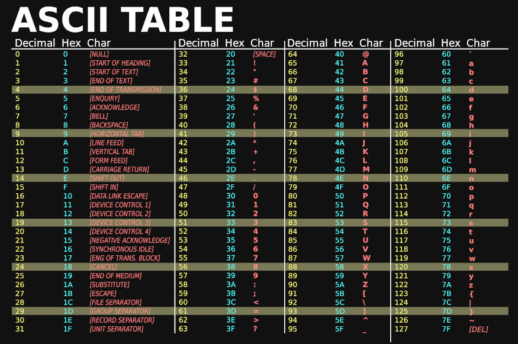
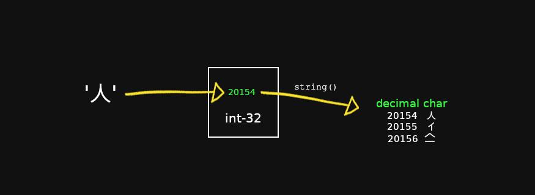
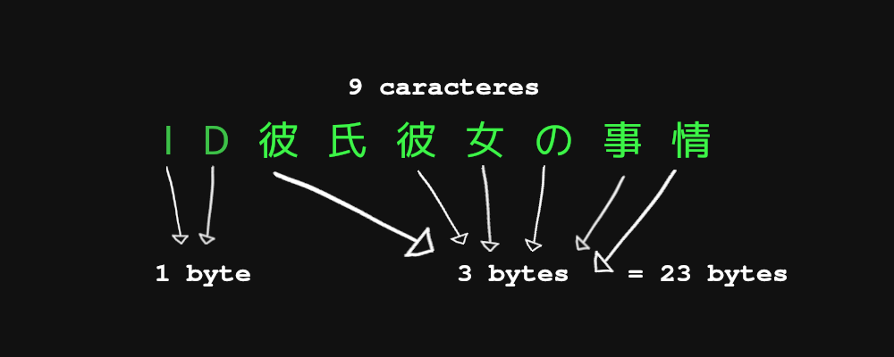

En esta entrada voy a explicar lo básico del funcionamiento de strings, runes y bytes en go, y hasta un poquito de utf-8.

Para explicar el tema voy a dar por hecho que sabes lo básico de slices y tipos de datos en go, si no sabes sobre estos temas visita mi entrada de [array, slices en golang](https://coffeebytes.dev/go-arrays-y-slices/).

Si es tu primer acercamiento a go, date una vuelta por mi post de [introducción al lenguaje de programación go](https://coffeebytes.dev/golang-introduccion-al-lenguaje-variables-y-tipos-de-datos/) y luego regresa acá.

## Un poquito sobre convenciones

Como seguramente ya sabes, las computadoras solo almacenan números. Las letras que ves en pantalla son una representación de esos números.

Entonces, ¿cómo sabe la computadora que número corresponde a cada letra? Pues un montón de personas se reunieron y acordaron asignarle un número a cada carácter. Por supuesto que esos acuerdos no son universales y hay múltiples variantes sobre que números corresponden a cada letra, entre ellas ASCII, UTF-8, UTF-16, UTF-32 y otras menos comunes. Es decir, un número puede representar el carácter "人" en una convención, pero a lo mejor representa otro en otra convención, por detrás son solo números.

Este tema es bastante extenso y ya hay suficiente información en internet, por lo que solo quédate con que detrás de cada carácter hay un número que la representa y que ese carácter depende de la tabla que usemos para representarlo.



Tabla ASCII con colores modificados tomada de [wikimedia](https://commons.wikimedia.org/wiki/File:ASCII-Table-wide.svg).

Sabiendo lo anterior, vayamos al tipo de dato byte.

## Bytes en go

Un byte en go es sinónimo de un _uint8_, un unsigned int8. En otras palabras, 8 bits que podemos asignar de manera directa a diferentes notaciones. El hecho de que sea un tipo de dato _uint8_ nos permite usar cualquier número entre 0 y 255.

```go
var ch byte = 65 // decimal
var ch1 byte = 0b1000001 // Binaria
var ch2 byte = 0o101      // Octadecimal
var ch3 byte = 0X41       // hexadecimal
```

Así como podemos guardar un número, también podemos guardar la representación numérica de un carácter, envolviéndolo en comillas sencillas.

Al imprimirlo nos devolverá el número, en notación decimal, que representa este carácter.

```go
var ch byte = 'A'
fmt.Println(ch)
// 65
```

Si realizamos un tipo de conversión a string, usando el convertidor a tipo string, obtendremos la letra "A".

```go
fmt.Println(string(ch))
// 'A'
```


Representación de la letra 'A' en notación decimal. El cuadrado representa un byte u 8 bits.

### Array de bytes

Así como tenemos el tipo de dato byte, también podemos crear un array de bytes y de múltiples maneras. Observa como el array queda guardado con el número que corresponde a cada carácter.

```go
// Instanciado directamente de un string
t1 := []byte("ABCDE")

// Como si fuera un array de caracteres
t2 := []byte{'A', 'B', 'C', 'D', 'E'}

// como si fuera un array de números ord()
t3 := []byte{65, 66, 67, 68, 69}

// Con la función copy
var t4 = make([]byte, 5)
copy(t4, "ABCDE")

// En todos los casos obtenemos:
//[65 66 67 68 69]
```

### Convirtiendo un array de bytes en un string

¿Te acuerdas que te dije que cada número representa un carácter? Pues podemos transformar una secuencia de bytes en un string. Para eso usamos la función string, y le pasamos nuestro array de bytes.

```go
t3 := []byte{65, 66, 67, 68, 69}
fmt.Println(string(t1))
// ABCDE
```

## Runes en go

Las runes o runas son sinónimo de un tipo _int32_. Es el tipo de variable por defecto cuando defines un carácter, **utilizamos comillas sencillas para declararlo**. Si no especificas byte u otro tipo de dato, go dará por sentado que se trata de una rune.

```go
var runa rune = 65
fmt.Printf("type:%T, value:%v\n", runa, runa)
// type:int32, value:65
```

Sin embargo, **probablemente usarás las runas la mayor parte del tiempo para guardar caracteres**, no números.

```go
var runa rune = '人'
fmt.Printf("type:%T, value:%v\n", runa, runa)
// type:int32, value:20154
```

Aprecia como el tipo sigue siendo el mismo, pero su valor ahora es 20154, pues al ser un int32 tenemos acceso hasta 2³¹-1 (recuerda que un bit se usa para el signo positivo o negativo).



Representación del caracter '人' en notación decimal. El cuadrado representa un 32 bits.

### Array de runes

De la misma manera que creamos un **array de bytes modificable**, podemos crear un array de runes, el cual es, para fines prácticos, un array de _int32_, que podemos representar por medio de caracteres.

rune, con paréntesis, es una conversión de tipo, de string a rune. Observa como al final tenemos un array de _int32_

```go
arrayRunas := []rune("Jello, ")
arrayRunas[0] = 'H'
arrayRunas = append(arrayRunas, '世', '!')
fmt.Println(arrayRunas)
// [72 101 108 108 111 44 32 19990 33]
```

Igual que hicimos anteriormente, podemos transformar esos números en un string usando la función string.

```go
fmt.Println(string(arrayRunas))
// Hello, 世!
```

## Strings en go

Un string es un **slice de bytes de solo lectura, no modificable,** se declara usando comillas dobles.  
**Cada índice del slice de un array se refiere a un byte**. Señalar esto es importante, porque si iteramos sobre un string, vamos a obtener una cantidad diferente de bytes a los caracteres que forman nuestro string.

¿Cómo? A primera vista podríamos pensar que nuestro string tiene una longitud de 9 (y que por ende tendrá 9 bytes), que es la cantidad de runas o caracteres que tiene. Sin embargo, si medimos la longitud de nuestro string con la función _len_, obtendremos la cantidad 23, que se refiere a la cantidad de bytes que ocupa.

```go
s := "ID彼氏彼女の事情"
fmt.Println(len(s))
// 23
```



Al momento de iterar sobre nuestro string, estaremos iterando byte por byte, por lo que imprimiremos 23 bytes, cada byte expresado en notación octadecimal.

```go
s := "ID彼氏彼女の事情"
for i := 0; i < len(s); i++ {
    fmt.Printf("%x ", s[i])   
}
// 49 44 e5 bd bc e6 b0 8f e5 bd bc e5 a5 b3 e3 81 ae e4 ba 8b e6 83 85
```

¿Pero que pasa si queremos obtener cada runa o carácter en lugar de los bytes? range nos permite eso, se encarga de iterar runa por runa, decodificando el carácter correspondiente.

```go
for index, runeValue := range s {
    fmt.Printf("%#U empieza en el byte de posición %d\n", runeValue, index)
}
//U+0049 'I' starts at byte position 0
//U+0044 'D' starts at byte position 1
//U+5F7C '彼' starts at byte position 2
//U+6C0F '氏' starts at byte position 5
//U+5F7C '彼' starts at byte position 8
//U+5973 '女' starts at byte position 11
//U+306E 'の' starts at byte position 14
//U+4E8B '事' starts at byte position 17
//U+60C5 '情' starts at byte position 20
```

## Paquete strings

Go cuenta con un paqueteen su librería estándar para manejar strings, con múltiples métodos. Aquí dejo algunos de los más importantes:

- func Contains(s, substr string) bool Revisa si una cadena de texto se encuentra en otra.
- func Count(s, substr string) int Cuenta las ocurrencias de una cadena de texto en otra.
- func HasPrefix(s, prefix string) bool Revisa si un string empieza un string
- func HasSuffix(s, suffix string) bool Revisa si un string termina con otro string
- func Join(elems \[\]string, sep string) string Une todos los elementos de una lista en un string, usando un separador entre cada par de elementos
- func Split(s, sep string) \[\]string Separa un string en una lista por un separador que le indiquemos
- func Index(s, substr string) int Devuelve el índice de una cadena de texto en otra
- func Replace(s, old, new string, n int) string Reemplaza la primera ocurrencia de una cadena de texto por otra
- func ReplaceAll(s, old, new string) string Reemplaza todas las ocurrencias de una cadena de texto por otra
- func ToLower(s string) string Convierte en minúsculas
- func ToUpper(s string) string Convierte en mayúsculas
- func Trim(s, cutset string) string Remueve los espacios al principio y al final

Revisa las funciones completas en [la documentación de strings en go](https://pkg.go.dev/strings).

## Paquete strconv

También existe un paquete que nos permite convertir strings en otros tipos de datos:

- func Atoi(s string) (int, error) convierte un string en un entero
- func Itoa(i int) string convierte un número entero en un string
- func ParseInt(s string, base int, bitSize int) (i int64, err error) Convierte una representación en string de un número en cierta base a un entero.
- func ParseBool(str string) (bool, error) Convierte 1, t, T, TRUE, true, True en True o 0, f, F, FALSE, false, False en False
- func ParseFloat(s string, bitSize int) (float64, error) para convertir en un string en un flotante

Mira el resto de funciones en [la documentación de strconv en go.](https://pkg.go.dev/strconv)
