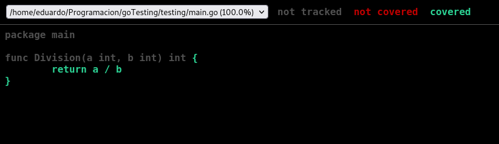
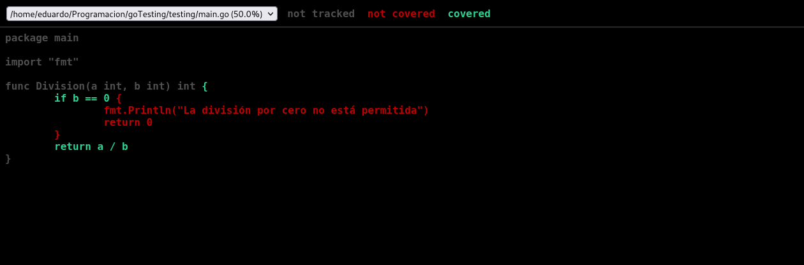

Go ya cuenta con un modulo de testing en su librería estándar que está lista para nuestro uso, solo hace falta importarlo y usarlo.

## Preparación del testing en go

Para que se lleven a cabo los tests necesitamos:

- Un archivo que termine en _\_test.go_
- Correr el comando _go test_

```bash
├── go.mod
├── main.go
└── testing
    ├── main.go
    └── main_test.go

1 directory, 5 files
```

Considera que, si vas a [asignarle un nombre a tu módulo](https://coffeebytes.dev/go-importacion-de-paquetes-y-manejo-de-modulos/)**, jamás debeser nombrarlo _testing_**. ¿Por qué? si lo haces, go confungirá su modulo _testin_g con el tuyo, devolviéndote esos resultados incorrectos.

Para crear los tests, dentro del archivo _testing/main\_test.go_, necesitamos una función que reciba de argumento nuestro paquete de testing con el carácter de desestructuración.

Compararemos el resultado usando un if, o lo que querramos y, **si el test falla, llamaremos al método _Errorf_** del modulo de _testing_.

```go
package main

import "testing"

func TestDivision(t *testing.T) {
    total := Division(10, 2)
    if total != 5 {
        t.Errorf("División incorrecta, obtuvimos %d pero se esperaba %d", total, 5)
    }
}
```

No es necesario que las funciones a probar se encuentren dentro del archivo de testing, en este caso las coloqué dentro de _testing/main.go_.

```go
package main

func Division(a int, b int) int {
	return a / b
}
```

## Ejecutar los tests

Para ejecutar los tests necesitamos estar en el directorio donde se encuentran nuestros archivos terminados en _\_test.go_ y correr el comando _go test_. Si el test aprueba obtendremos la leyenda PASS.

```go
cd testing/
go test

PASS
ok      main/testing    0.001s
```

Por otro lado, si los tests fallan se imprimirá la palabra FAIL en pantalla:

```go
--- FAIL: TestDivision (0.00s)
    main_test.go:14: División incorrecta, obtuvimos 12 pero se esperaba 5
FAIL
exit status 1
FAIL    main/testing    0.001s
```

## Manejo de casos con tablas

En el ejemplo anterior usamos una función para probar un caso, sin embargo, si necesitaramos someter a prueba múltiples casos, necesitariamos una función por cada test, bastante tedioso, ¿no?

Para evitar llenarse de funciones, los desarrolladores usan un array compuesto de structs, donde cada struct representa un caso a probar. Puedes pensar en el array de structs como una tabla, donde cada fila es un caso y cada columna un tipo de dato a probar.

En este caso, cada struct de nuestro array consiste en tres enteros; los primeros dos representan los argumentos, mientras que el último es el resultado.

```go
	tables := []struct {
		x int
		y int
		r int
	}{
		{100, 10, 10}, // 100 / 10 = 10
		{200, 20, 10}, // 200 / 20 = 10
		{300, 30, 10},
		{1000, 100, 10},
	}
```

De seguro ya notaste que no estamos cubriendo la división entre cero, pero déjalo así por ahora.

Ya que contamos con nuestro array de structs, [iteraremos sobre cada uno de sus elementos usando range](https://coffeebytes.dev/go-arrays-y-slices/). De esta manera cubriremos cada caso.

```go
for _, table := range tables {
		total := Division(table.x, table.y)
		if total != table.r {
			t.Errorf("División de %d entre %d incorrecta, obtuvimos: %d, pero el resultado es: %d.", table.x, table.y, total, table.r)
		}
	}
```

Si todo salió bien, pasaremos todas las pruebas.

## Coverage

Coverage ya forma parte del código en go, por lo que no necesitamos librerías externas. Si no sabes que es Coverage, piensa en él como el porcentaje de tu código que es sometido a pruebas. Si todo tú código pasa por las pruebas tendrás un coverage de 100%, si solo la mitad pasa por las pruebas el coverage será de 50%. Anteriormente te hablé del coverage en mi entrada [unittest en Python.](https://coffeebytes.dev/unittest-python-valen-la-pena-los-tests-en-python/)

Para calcular el coverage basta con agregar el flag _\-cover_ al comando _go test_

```bash
go test -cover

PASS
coverage: 100.0% of statements
ok      _/home/eduardo/Programacion/goTesting/testing   0.002s
```

Como nuestra función es muy corta, obtenemos un resultado de 100%, sin desglosar, de coverage

### Exportar resultados de coverage

Podemos mandar el toda la información en bruto de nuestro test de coverage a un archivo externo con el flag _\-coverprofile_.

```bash
go test -coverprofile=coverage.out

mode: set
/home/eduardo/Programacion/goTesting/testing/main.go:3.33,5.2 1 1
```

Este archivo, de nombre _coverage.out_, que fue generado, es un archivo que contiene información en bruto y que **será necesario para visualizar los resultados** de una manera más detallada.

### Visualización de resultados con go tool

Para resumir de una manera más legible la información del archivo que contiene nuestro test de coverage, usaremos el comando tool, acompañado del flag _\-func_, seguido del nombre del archivo. Lo que nos devolverá un resultado de coverage desglosado.

```bash
go tool cover -func=coverage.out

/home/eduardo/Programacion/goTesting/testing/main.go:3: Division        100.0%
total:                                                  (statements)    100.0%
```

Go también nos permite visualizar el coverage en formato HTML, con colores, directo en nuestro navegador. Para ello usamos la opción -html, seguido del archivo con los datos de coverage.

Al ejecutar el comando, se abrirá una pestaña de nuestro navegador y nos mostrará los resultados testeados en verde y los no testeados en rojos.

```bash
go tool cover -html=coverage.out
```



Coverage completo en html en go

Si decidimos modificar nuestra función para que maneje los casos de la división por cero, y corremos los tests de coverage de nuevo, obtendremos un esquema diferente al anterior. Ahora sí aparece una sección de código no cubierto por los tests en colo rojo y nuestro coverage bajó a 50%.



Coverage incompleto en html en go

Con esto termino esta entrada super corta sobre testeo en go. Para la siguiente entrada voy a hablar un poquito de profiling y daré por terminadas las entradas de go básico para escribir nuevamente sobre Python.

## Otros recursos sobre testing

- [Empezado con los tests automatizados de Friends of go](https://blog.friendsofgo.tech/posts/empezando-con-los-tests-automatizados-en-go/)
- [Documentación oficial de Go](https://pkg.go.dev/testing)
- [Testify, para emular la sintaxis de testeo en Javascript](https://github.com/stretchr/testify#assert-package)
