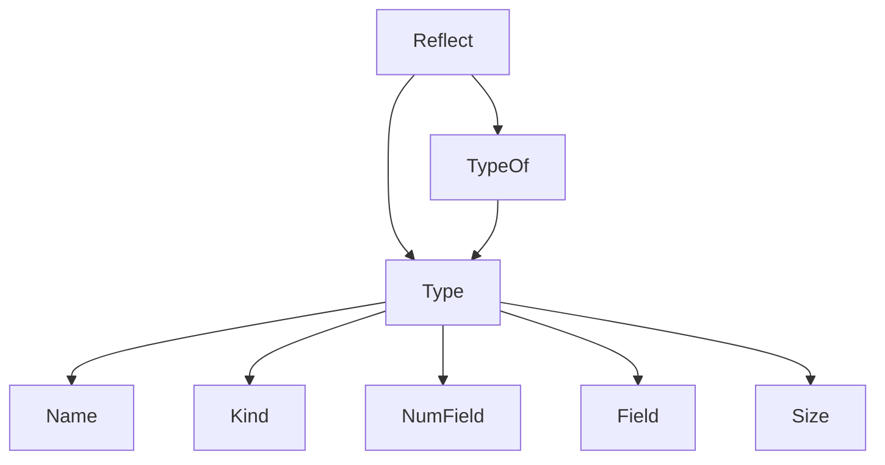
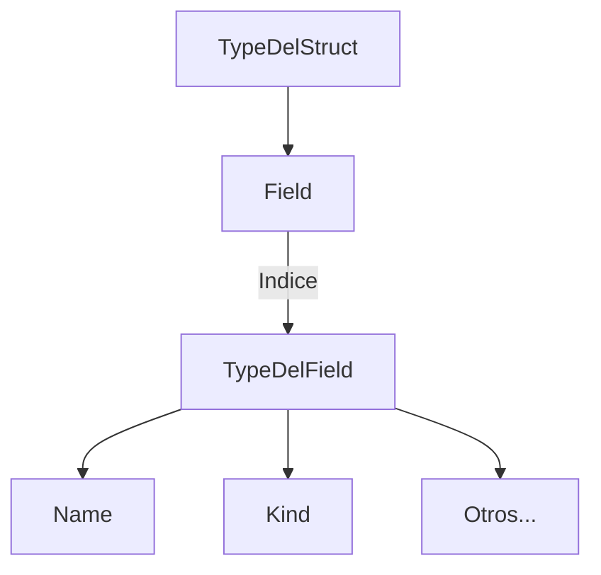
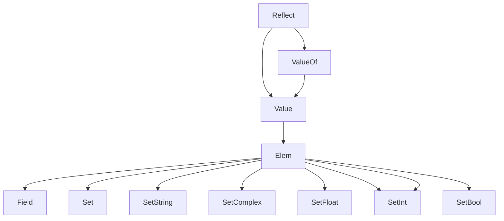

---
aliases:
- /el-paquete-reflections-de-go
- /go-con-reflect-descubre-como-la-reflexion-puede-impulsar-la-flexibilidad-de-tu-programa
- /en/go-con-reflect-descubre-como-la-reflexion-puede-impulsar-la-flexibilidad-de-tu-programa/
- /es/go-con-reflect-mayor-flexibilidad-en-tu-codigo/
authors:
- Eduardo Zepeda
categories:
- Go
coverImage: images/reflect-typeof-value-of-en-go.jpg
date: '2023-03-13'
description: Te explico el paquete reflect de go y sus funciones básicas de reflexión
  para obtener los tipos de datos en tiempo de ejecución
keywords:
- go
- reflect
slug: /go/go-con-reflect-descubre-como-la-reflexion-puede-impulsar-la-flexibilidad-de-tu-programa/
title: 'Go con Reflect: Mayor Flexibilidad En Tu Código'
---

El paquete "reflect" es una biblioteca útil en el lenguaje de programación Go que proporciona funciones para trabajar con la reflexión.



## ¿Qué es la reflexión en programación?

La reflexión es la habilidad de un programa de inspeccionar su propia estructura en tiempo de ejecución. Esto incluye la habilidad de examinar: tipos, valores y metada de los objetos en memoria. La reflexión nos permite tener código más flexible y genérico y nos permite crear funciones y estructuras de dato que pueden trabajar con cualquier tipo de objeto, sin importar su tipo. Además es la base para la metaprogramación.

Podemos dividir la reflexión de Go en dos tipos de datos importantes:

* **Type**: El tipo de dato de Go, a partir del cual se desglosan todos la información del tipo de dato, su clase, su nombre, tamaño, etc.
* **Value**: El valor del dato de Go, con métodos para modificar los datos de un objeto.



## Tipo de dato: Type y TypeOf

*Type* es el **tipo de dato más importante en el paquete reflect** ya que representa al objeto en memoria y guarda toda la meta información de nuestros objetos: su tipo, representación, métodos y campos.

¿Y como obtenemos un *Type*? Con el método *TypeOf* 

El método *TypeOf* del paquete *reflect* se utiliza para obtener el tipo de una interfaz, recibe un *interface* (o sea cualquier cosa) y retorna un *reflect.Type*; "el tipo más importante de reflect".



En este diagrama coloco los que considero los métodos más importantes de *Type*, pero tanto el tipo *reflect.Type* y *reflect.Value* tiene muchos más.

Mira un ejemplo con *TypeOf*:

``` go
type Coffee struct {
	Origin string `tagEjemplo:"valor"`
	Height int
}

instanciaDelCafe := Coffee{Origin: "Michoacan", Height: 1100}
// TypeOf nos devolverá un tipo *reflect.Type*
typeOfCoffee := reflect.TypeOf(instanciaDelCafe)
fmt.Println(typeOfCoffee)
// main.coffee
```

Observa como el tipo de dato es una estructura que corresponde a main, de nombre *coffee*. 


### Name, el nombre del tipo de dato

Name contiene el nombre del respectivo tipo de dato

``` go
// TypeOf nos devolverá un tipo *reflect.Type*
typeOfCoffee := reflect.TypeOf(instanciaDelCafe)
fmt.Println(typeOfCoffee.Name())
// coffee
```

### Kind, la clase del tipo de dato

El método *TypeOf* nos permite obtener un objeto *Type*, que representa el tipo de dato de nuestra interfaz, a partir del cual podemos leer la clase de dato, con su método *Kind*. 

``` go
// TypeOf nos devolverá un tipo *reflect.Type*
typeOfCoffee := reflect.TypeOf(instanciaDelCafe)
fmt.Println(typeOfCoffee.Kind())
// struct
```

### NumField para obtener el número de campos de un struct

A partir de *Type* podemos obtener todo tipo de información útil, como el número de campos de un objeto. Lo anterior es bastante útil en el caso de structs y otras estructuras con múltiples campos.

``` go
// Obtendremos el número de campos de nuestro objeto
typeOfCoffee := reflect.TypeOf(instanciaDelCafe)
coffeeNumFields := typeOfCoffee.NumField()
fmt.Println(coffeeNumFields)
// 2 
```

En este caso obtenemos 2 campos (Location y Height)

Considera que si intentas obtener el NumField de un tipo int u otro tipo que **no cuente con múltiples campos**, Go devolverá un error

``` go
panic: reflect: Field of non-struct type int
```

### Field y Type anidados de un struct

*Type* también pone a nuestra disposición el método *Field*, que junto con *NumField*, nos dejará acceder directamente a los campos de un struct, a partir de su índice.

Y, con esto, podremos acceder a los *Types* anidados dentro del objeto *Type*. 



Cada *Type* anidado, al igual que el de su padre, contará con los métodos *Name* y *Kind* que ya vimos unas lineas arriba.

``` go
// Obtendremos el nombre y tipo del primer campo de nuestro objeto
typeOfCoffee := reflect.TypeOf(instanciaDelCafe)
field := typeOfCoffee.Field(0)
fmt.Println(field.Type.Name())
fmt.Println(field.Type.Kind())
// string string
```

En este caso, al ser tipos de datos primivitos, ambos son el mismo: string; puesto que el campo de tipo string se llama string. 

### Leer los tags de un campo de un struct con reflect

Reflect también nos permite acceder a los metadatos de un objeto, esas anotaciones que seguramente ya viste si has trabajado con ORM y/o JSON en Go. 

Para obtener los Tags de un struct se usa *Tag.Get*.

``` go
// Añadimos un tag personalizado para posteriormente leerlo
type Coffee struct {
	Origin string `tagEjemplo:"valor"`
	Height int
}

typeOfCoffee := reflect.TypeOf(instanciaDelCafe)
field := typeOfCoffee.Field(0)
// ...
fmt.Println(field.Tag.Get("tagEjemplo"))
// valor
```

## Valor del dato: Value y ValueOf

Como te dije anteriormente, además de Type, hay otra parte muy importante en reflect, esta es *Value*. *Value* se corresponde con el valor de una interfaz. ¿Y cómo podemos obtener un *Value*? Pues con *ValueOf*, ¿te fijas como se conserva la coherencia?

El método *ValueOf* recibe un *interface* como parámetro y retorna un objeto de tipo *Value* que contendrá todos los métodos necesarios para modificar su propio valor.



Mira este ejemplo donde se aprecia como *ValueOf* retorna el valor de nuestro struct.

``` go
// ValueOf devolverá el valor de nuestra variable
instanciaDelCafe := Coffee{Origin: "Michoacan", Height: 1100}
ValueOfCoffee := reflect.ValueOf(instanciaDelCafe)
fmt.Println(ValueOfCoffee)
// {Michoacan 1100}
```

A partir de Value nosotros tendremos una serie de métodos para cambiar el valor de un objeto.

### Modificar un campo de un objeto Value

Para modificar un campo necesitamos acceder al objeto *Value* que apunta a nuestro objeto, el cual podemos obtener pasándole un puntero al método *ValueOf*. Y, a partir de ahí, usaremos *Elem* para acceder al valor de nuestro objeto, luego a su primer campo (sólo en el caso de structs) y finalmente cambiar el valor usando *SetString*.

``` go
instanciaDelCafe := Coffee{Origin: "Michoacan", Height: 1100}
valueofCoffee := reflect.ValueOf(&instanciaDelCafe)
valueofCoffee.Elem().Field(0).SetString("Oaxaca")
fmt.Println(instanciaDelCafe)
//{Oaxaca 1100}
```

### Los métodos para asignar datos en reflect

Además del método SetString, Go nos provee de [otra serie de métodos especializados para cada tipo de dato](https://pkg.go.dev/reflect) : 

* SetBool(x bool)
* SetBytes(x []byte)
* SetCap(n int)
* SetComplex(x complex128)
* SetFloat(x float64)
* SetInt(x int64)
* SetIterKey(iter *MapIter)
* SetIterValue(iter *MapIter)
* SetLen(n int)
* SetMapIndex(key, elem Value)
* SetPointer(x unsafe.Pointer)
* SetString(x string)
* SetUint(x uint64)
* SetZero()
  
Estos métodos se pueden acceder directamente desde *Value.Elem* para tipos de datos no compuestos (como los structs).

``` go
stringOriginal := "Yo NO me imprimiré"
// Obtenemos el valor del string
valor := reflect.ValueOf(&stringOriginal)
stringModificado := "Yo SI me imprimiré en la pantalla"
// Cambiamos el valor original del string 
valor.Elem().SetString(stringModificado)
fmt.Printf(stringOriginal)
// Yo SI me imprimiré en la pantalla
```

#### Modificar un campo con el método Set

Los métodos especializados para "setear" un dato son muy útiles, pero a veces necesitamos un método más genérico que nos permita modificar los valores de manera dinámica, y para ello reflect nos provee de *Set*, sí *Set* a secas, sin nada más.

En este ejemplo, primero creamos un string, para posteriormente obtener el valor de este, con *ValueOf*, y luego pasarle este nuevo valor al método genérico *Set*, el cual recibe un objeto *Value*. ¿y de dónde sacamos *Value*? Pues de pasarle cualquier dato a *ValueOf*.

``` go
unString := "Oaxaca"
nuevoValue := reflect.ValueOf(unString)
valueofCoffee.Elem().Field(0).Set(nuevoValue)
// {Oaxaca 1100}
```

## Creación de un objeto con reflect

Reflect también nos permite crear objetos de manera dinámica a partir de un *Type*. Para lo anterior, basta pasarle como argumento el tipo de objeto, *Type*, que queremos crear, al método *New*, el cual, como ya sabes, lo podemos obtener fácilmente a partir de *TypeOf* 

``` go
typeOfCoffee := reflect.TypeOf(instanciaDelCafe)
nuevaInstancia := reflect.New(typeOfCoffee)
fmt.Println(nuevaInstancia)
// &{ 0}
```

A partir del tipo que obtuvimos con *TypeOf* reflect creará un nuevo objeto. Sin embargo, en este caso, al tratarse de un struct al cual no le hemos especificado los valores de sus campos, se inicializará con sus [zero values]().


Y ya se acabó la pequeña introducción a reflect, ahora ya sabes lo suficiente para confundirte y llorar mientras trabajas con cualquier cosa que necesite reflexión. ¿Genial no?