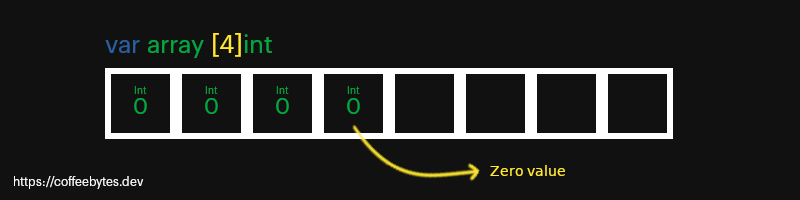
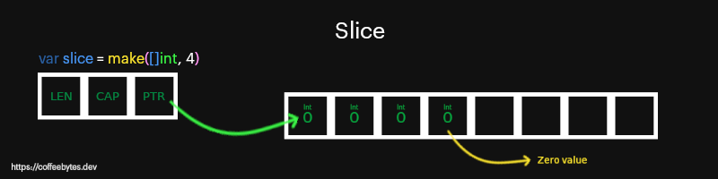

---
aliases:
- /en/go-slices-y-arrays-characteristicas-and-basic-uses/
- /en/go-slices-and-arrays-basic-characteristics-and-most-common-uses/
authors:
- Eduardo Zepeda
categories:
- go
coverImage: images/ArrayslicesYArrays.jpg
date: '2021-12-14'
description: Syntax and most common uses of arrays and slices in the go programming
  language. I also explain how to use the make function in slices.
keywords:
- go
title: 'Go: slices and arrays, basic characteristics and most common uses'
---

In go or golang slices, arrays and [maps](/en/go/golang-maps-or-dictionaries/) are structures for handling data collections. In this entry I am going to talk about the first two: slices and arrays.

In this entry I am going to use data types, zero values, and other very basic aspects of go. If you don't know what I'm talking about, visit my entry [Golang: introduction to the language, variables and data types](/en/go/go-programming-language-introduction-to-variables-and-data-types/).



## Arrays in go

Arrays are **immutable data collections**, to create an _array_ we need to define its size and the type of data it will contain, **once declared it cannot be modified**.

```go
var array [4]int
```

In the above example, we have an _array_ with space for 4 integers. The values that we do not assign will be assigned as zero values.



### Assign values to an array

To assign values to an _array_, previously declared, we use its index.

```go
array[1] = 1
// [0, 1, 0, 0]
```

We can also create an array directly inside a function by placing each element of the array between braces, separated by commas.

```go
array := [4]int{0, 0, 0, 0}
```



## Slices in go

Slices are **mutable collections of data types**. Internally it is an abstraction of an array, with a difference, they can be modified.

However, when declaring a slice, and then trying to modify one of its indexes, just as we would do with an array, we will have an error. Why? Because a slice is a reference, and when it is created empty, we are pointing to nothing, to _nil_.

```go
var slice []int
slice[0] = 1
// panic: runtime error: index out of range [0] with length 0
```

### How does a slice in Go works?

Internally a _slice_ is a _struct_ with a pointer to the real array. In addition to the pointer, it has a property called _cap_ and _len_, which refer to the capacity and length of the array, respectively.



To create a non-empty slice we have two ways to do it:

* Allocate memory with the _make_ function.
* Declare it directly by passing the content after the slice data type.

### Create a slice with make

The _make_ function allocates memory and initializes an object of type _slice_, _map_ or _chan_ and returns it. If we use make, it is necessary to pass the length of the slice as a second argument.

```go
var slice = make([]int, 4)
slice[0] = 1
fmt.Println(slice)
// [1,0,0,0]
```

Consider that, if we try to add an element beyond the capacity we defined we will get an error.

```go
slice[4] = 4
// panic: runtime error: index out of range [4] with length 4
```

For more details [check the documentation of the make function](https://pkg.go.dev/builtin#make).

### Creating slices with values

Besides using make, we can create a slice in a single step, passing the content directly to it, placing the elements of the slice between braces, separated by commas.

Notice how we do not specify the size of the slice.

```go
var slice = []int{0, 1, 2, 3, 4}
```

It is also possible to let go automatically detect that it is a slice using the walrus operator ":=". Only possible within a function

```go
slice := []int{0, 1, 2, 3, 4}
```

### Partition an slice in Go

The _slices_ can be split in a Python-like style, specifying an **inclusive position for the first digit and exclusive for the second digit**.

```go
slice[2:] // {2, 3, 4}
slice[:2] // {0, 1}
slice[2:3]// { 2 }
```

If we do not specify one of the two, it will take the first position for the first digit and the last position for the second digit.

### Extend an slice in Go

Slices are mutable, they can be extended using the _append_ function, which receives any number of elements, separated by commas.

```go
sliceExtendido := append(slice, 5)
// [1 2 3 4 6 5]
otroSliceExtendido := append(sliceExtendido, 6, 7, 8)
// [1 2 3 4 6 5 6 7 8]
```

It is possible to create a new slice from the destructuring of a slice. The destructuring is carried out by putting three dots (...) at the end of the slice.

```go
nuevoSlice :=[]int{9, 10}
// [8 9]
sliceHastaDiez = append(nuevoSlice, otroSliceExtendido...)
// [1 2 3 4 6 5 6 7 8 9 10]
```

## Iterate through arrays and slices with range

Similar to Python syntax, we can traverse an _array_, a _slice_ or a _map_ (I'll talk about maps in the next post) using _range_. Each iteration will return the index and element of the array or slice, or the key and value in the case of maps.

Here we iterate over an _array_, notice how we are declaring the size beforehand.

```go
var array [2]string
    array[0] = "Nier"
    array[1] = "Hollow knight"
    for index, videojuego := range array {
    	fmt.Println(index, videojuego)
    }
```

In the case of a _slice_, notice how we do not specify a size between the square brackets.

```go
list := []int{0, 1, 2, 3, 4, 5}
    for i, n := range list {
    	fmt.Println(i, n)
    }
```

## How to convert an array into an slice in Go?

To convert an array into a slice in Go, we can use the following syntax *[:]*

```go
newArray := mySlice[:]
```

And that's the basics of slices and arrays, for the next post I'm going to talk about maps in go.