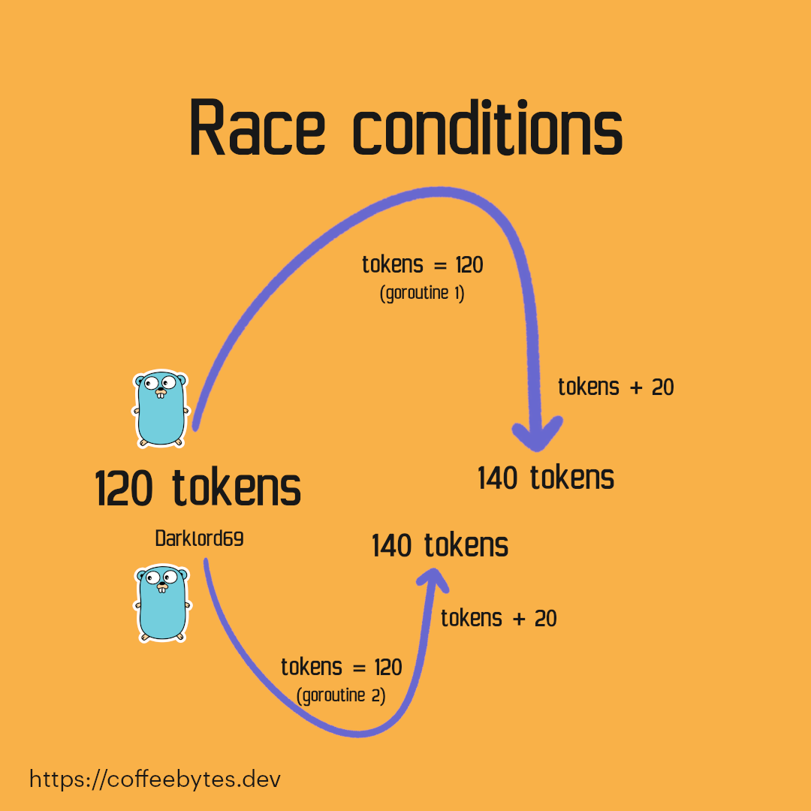
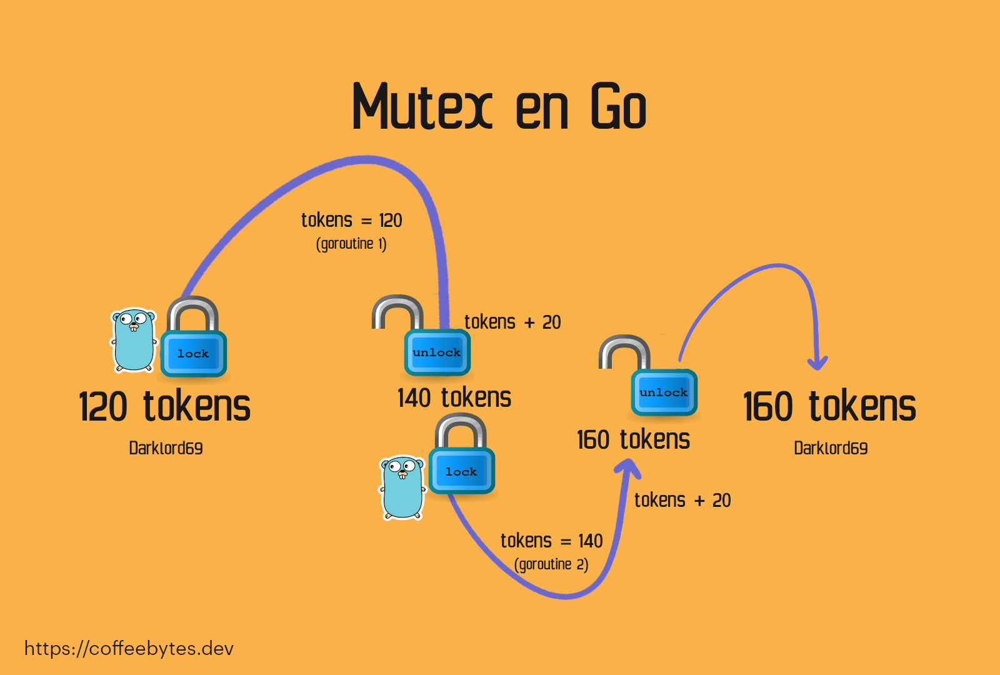

---
aliases:
- /en/go-race-conditions-on-goroutines-and-mutexes/
authors:
- Eduardo Zepeda
categories:
- go
coverImage: images/go-mutex-race-conditions.jpg
date: '2022-02-02'
description: In this post I talk about race conditions that occur when using goroutines
  and how to prevent them by using mutex.
keywords:
- go
title: 'Go: race conditions on goroutines and mutexes'
---

In past posts I talked a bit about [goroutines, deadlocks and channels](/en/go/go-channels-understanding-the-goroutines-deadlocks/). But there is another quite interesting issue about goroutines that stands out when we use asynchrony and there are many functions accessing data at the same time and. Multiple functions reading and writing the same information can lead to chaotic situations where very strange things can happen.



## What is a race condition?

If you already know what a race condition is, you can skip to the next section. If you do not, keep reading.

A race condition occurs when two threads have access to a shared variable at the same time. Let me give you a more detailed example.

Imagine it's a special day on your dubious content website and you're going to give away 20 tokens to your users for every new user they refer. Then you decide to use goroutines to implement the functionality. Everything goes smoothly, until one of your customers contacts you about an alleged bug.

DarkLord69 claims to have referred two people, however he complains that his tokens have not increased by 40, but by 20.

You probably think you've already messed up in the code, but everything looks good, so what could have gone wrong? After reviewing your code you realize that the problem is in the goroutines.

It happens that a goroutine read the amount of DarkLord69's credits: 120, and, almost at the same time, another goroutine read those same credits.

The first goroutine said, "I have 120 credits, if I add 20, the total of new credits is 140".

While the second goroutine, almost at the same time as the first one, said: "I read that there were 120 credits, if I add 20, the total of new credits will be 140".

Both goroutines are setting the total credits at 140, because they read, almost at the same time, that there were 120.



As you may already know, DarkLord69 will not be joyful, but if you give him some extra tokens as compensation there should be no problem. But what if instead of tokens it had been money, or perhaps some other more precious commodity?

Now let's go to an example made in code.

If you don't understand what the waitgroup does, I wrote a post where I explain [goroutines, channels and waitgroups](/en/go/go-use-of-channels-to-communicate-goroutines/) that you can refer to. For now, just keep in mind that they wait for all goroutines to finish before proceeding with the code execution.

```go
package main

import (
    "fmt"
    "sync"
)

var tokens int = 120

func main() {
    var wg sync.WaitGroup
    for i := 0; i < 10; i++ {
    	wg.Add(1)
    	go func() {
    		tokens_leidos := tokens
    		tokens_leidos += 20
    		tokens = tokens_leidos
    		wg.Done()
    	}()
    }
    wg.Wait()
    fmt.Println(tokens)
}
```

The important part is that, within a goroutine, we read the variable content tokens, then increment it by 20 and then assign that result to tokens again. But no problem, if we run the code we will get the correct result: 320 (120 tokens + One increment of 20 tokens for each of the 10 goroutines).

Everything is perfect, isn't it? No, the code is so small and the process happens so fast that you don't notice the problem.

If we add a small waiting time in the goroutines (which can be caused by a database access or any other process), we will face the problem head on.

```go
package main

import (
    "fmt"
    "sync"
    "time"
)

var tokens int = 120

func main() {
    var wg sync.WaitGroup
    for i := 0; i < 10; i++ {
    	wg.Add(1)
    	go func() {
    		tokens_leidos := tokens
    		time.Sleep(1 * time.Millisecond) // Tiempo de espera
    		tokens_leidos += 20
    		tokens = tokens_leidos
    		wg.Done()
    	}()
    }
    wg.Wait()
    fmt.Println(tokens)
}
```

After executing the code, instead of the correct result, I get 140 with 1 millisecond and 200 with one microsecond.



## Detect race conditions with --race

To help us identify these problems, Go has a flag to detect race conditions, if we run the compilation with the _--race_ flag we will see that go warns us that our code has race conditions.

```go
go build --race main.go
./main.go
==================
WARNING: DATA RACE
Read at 0x0000005fe430 by goroutine 8:
# ...
```

## Preventing race conditions with Mutex

There is an object called Mutex (**mut**ual **ex**clusion) that will ensure that our code does not access a variable until we tell it to, preventing race conditions from occurring.

Think of a mutex as a lock, which will block access to our code by other goroutines until we release it.

```go
var lock sync.Mutex
lock.Lock()
// Todo lo que está aquí está bloqueado para el resto de las goroutines
lock.Unlock()
```

.

If we protect the reading and writing of the tokens variable, our code should work perfectly. Even if we compile with the _--race_ flag and run it, Go will no longer return a warning.

```go
package main

import (
    "fmt"
    "sync"
    "time"
)

var tokens int = 120

func main() {
    var wg sync.WaitGroup
    var lock sync.Mutex
    for i := 0; i < 10; i++ {
    	wg.Add(1)
    	go func() {
    		lock.Lock()
    		// Todo lo que está aquí está bloqueado para el resto de las goroutines
    		tokens_leidos := tokens
    		time.Sleep(1 * time.Millisecond)
    		tokens_leidos += 20
    		tokens = tokens_leidos
    		lock.Unlock()
    		wg.Done()
    	}()
    }
    wg.Wait()
    fmt.Println(tokens)
}
```

## Read and write mutex

In addition to the above mutex, Go has a lock called RWMutex, which allows, at any given time, only a single goroutine to write or multiple readers to read.

RWmutex works by activating the lock when there is a process writing to the lock, during which time the contents of the lock cannot be read or written to. But when one process is reading, other processes can read as well.

```go
var lock sync.RWMutex
lock.RLock()
// Todo lo que está aquí está bloqueado para el resto de las goroutines
lock.RUnlock()
```

## Useful mutex resources

* [difference between mutex and rwmutex](https://programmer.help/blogs/difference-between-mutex-and-rwmutex.html) (en inglés)
* [Race conditions](https://cloudxlab.com/blog/race-condition-and-deadlock/) (en inglés)