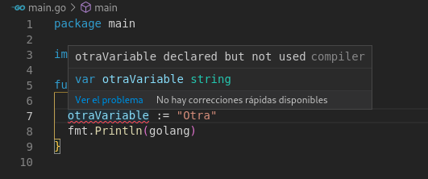
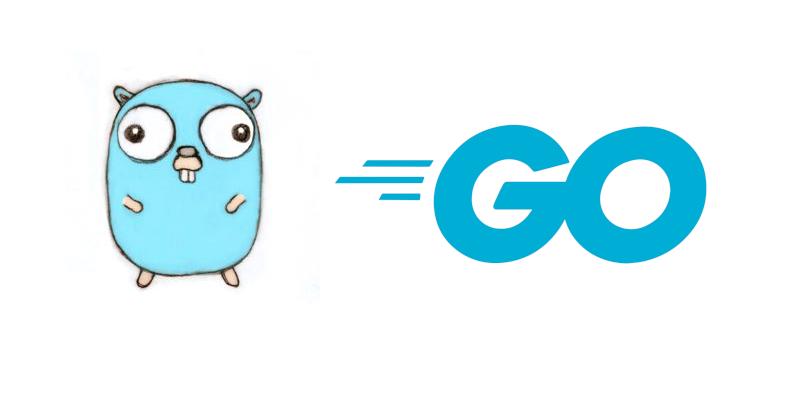

Golang, también conocido como go, es un lenguaje de programación compilado desarrollado por Google. Es un lenguaje bastante apreciado según los desarrolladores de acuerdo a las últimos encuestas de Stackoverflow (2021), como puedes apreciar en mi post de python vs go, donde también comparo lo bueno, lo malo y lo feo de este lenguaje.

## Un poco sobre el lenguaje

Go o Golang es un lenguaje con una sintaxis muy parecida a la de C y con ciertas abstracciones en su sintaxis que lo vuelven un lenguaje en el que escribir código es muy sencillo, la verdad es que la sensación es una mezcla entre C y Python.

Estamos ante un lenguaje compilado, imperativo, **fuertemente centrado en la concurrencia** y con tipado estático.

Cuando se creó el lenguaje se decidió que se priorizaría un tiempo de compilación a cambio de una pérdida mínima de rendimiento, por lo que no pasarás tanto tiempo esperando a que tu código compile, pero su rendimiento será, probablemente, inferior al que obtendrías con C o C++.

### Algunas cosas criticadas de go

Algo que desanima a muchos desarrolladores es que go **no cuenta con soporte para clases** de manera directa. Pero no todo está perdido, porque sí cuenta con ciertas características que lo dotan de funcionalidades de la POO, tales como polimorfismo y clases, por medio de [interfaces, structs y embedded values](https://coffeebytes.dev/go-structs-herencia-polimorfismo-y-encapsulacion/).

Otra de las cosas no tan queridas de este lenguaje es que **no cuenta con manejo de excepciones con bloques try y catch o equivalentes.** Sino que los errores se hacen por medio de bloques if. Aunque otros lenguajes como Rust también han prescindido del manejo de errores tradicionales.


Los errores se manejan comprobando que la variable err no es nula (nil)

A la fecha no existen argumentos por defecto en go, lo que aumenta la cantidad de código a escribir para lidiar con valores predeterminados.

## Go y las buenas prácticas

Go está fuertemente orientado a las buenas prácticas de código. ¿Cómo lo hace? El compilador fuerza buenas prácticas en el código, impidiendo que el código compile si hay variables o importaciones que no se usan, o si no se respetan las reglas de la privacidad de nuestras propiedades y funciones, entre otras.



La compilación no es permitida si hay variables sin usar

## Una mascota genial

La mascota oficial es una ardilla de tierra y es muy común entre la comunidad usarla para ilustrar el contenido relacionado con go. Este Sartre en versión roedor azul es tan popular entre los desarrolladores que existen herramientas, como [Gopherizme](https://gopherize.me), para crear avatares personalizados. El impacto de la mascota es tal, que muchos desarrolladores la usan a manera de logo, aunque el [logo oficial de go](https://blog.golang.org/go-brand) ya ha sido definido.



A la izquierda la mascota de Go. A la derecha el logo oficial

## Instalación

Go se encuentra en la mayoría de los repositorios de las distribuciones de GNU/Linux. En debian y ubuntu se instala usando el [comando apt install](https://coffeebytes.dev/comandos-de-la-terminal-de-gnu-linux-que-deberias-conocer-segunda-parte/) como cualquier otro paquete.

```bash
sudo apt install golang
```

Las instrucciones de instalación para Freebsd, windows y macosx serán diferentes.

## Estructura de un archivo de go

Los archivos de go se estructuran de la siguiente manera y en este orden:

### Nombre del paquete

Una sección donde se declara el nombre del paquete después de la palabra _package_. El nombre del paquete nos servirá para hacer importaciones de nuestros modulos.

```python
package main
```

### Importaciones

Una sección donde se importan todos los [paquetes de go](https://coffeebytes.dev/go-importacion-de-paquetes-y-manejo-de-modulos/) que se usarán. Para ello usamos la palabra _import_.

import "fmt"

Múltiples importaciones pueden colocarse dentro de paréntesis, sin comas.

```go
import (
    "strconv"
    "fmt"
)
```

### Contenido

El contenido del archivo, es decir declaraciones de variables, types, [funciones](https://coffeebytes.dev/go-funciones-argumentos-y-el-paquete-fmt/), constantes, etc.

```go
func main() {
    fmt.Println("Hello world!")
}
```

## El paquete main

Go requiere de un paquete principal llamado _main_, que se especificará colocando _package main_ al principio de nuestro código fuente.

```go
package main
```

### La función main

La función _main_ es el punto de partida de un archivo de go, como lo sería en C, y no retorna nada.

```go
package main

import "fmt"

func main() {
    fmt.Println("Ejecutando el programa")
}
```

### Función init

Antes del punto de entrada del programa (la función _main_) se ejecuta una función init, esta puede contener todas las inicializaciones necesarias para la ejecución del programa.

```go
package main

import "fmt"

func init() {
    fmt.Println("Inicializando el programa principal")
}

func main() {
    fmt.Println("Ejecutando el programa")
}
```

## Compilar y ejecutar un archivo de go

Dado que go es un lenguaje compilado, requiere la compilación del código antes de poder ejecutar el código. El compilado se realiza con el comando build.

```go
go build src/main.go
```

Tras el compilado tendremos un archivo que podremos ejecutar.

```go
./main
```

También **es posible compilar y correr el código en un solo paso** usando run en lugar de go.

```go
go run src/main.go
```

### Diferencias entre run y build

La diferencia entre build y run radica en que **run compila el código y lo ejecuta desde un directorio temporal**, y posteriormente limpia los archivos generados. Si agregamos el flag --work, podremos ver la ubicación de este directorio.

```go
go run --work src/main.go
# WORK=/tmp/go-build983014220
```

## Tipos primitivos de datos

Dado que estamos tratando con un lenguaje compilado, necesitamos decirle al compilador el tipo de dato que usaremos para cada variable o constante.

Los valores primitivos de Go son los siguientes.

### Entero

Para valores enteros con o sin signo.

- int, se asigna de acuerdo al SO (32 o 64 bits)
- int8,
- int16
- int32
- int64

### Entero sin signo

Para valores sin signo, es decir, positivos.

- uint, se asigna de acuerdo al SO (32 o 64 bits)
- uint8
- uint16
- uint32
- uint64

### Decimal

Para números decimales

- float32
- float64

### Textos

Para textos existe únicamente _string_

### Boolean

Para valores _true_ or _false_

### Números complejos

Permite manejar números reales e imaginarios:

- Complex64
- Complex128

Por ejemplo: c:=100+2i

## Variables, constantes y zero values en go

### Variables

Go permite definir variables especificando el tipo de dato y la keyword var. Es como si a una declaración de variable de Javascript le agregaras el tipo de dato.

```go
var gravedad int8
```

La asignación de variables puede realizarse en un solo paso de la siguiente manera:

```go
var gravedad int = 123
```

También es posible dejar que el compilador intuya el tipo de dato con el operador walrus (marmota). Este tipo de asignación **solo es posible dentro del scope de una función**.

```go
gravedad := 123
```

En go no puedes asignar una variable al valor nulo; _nil_.

```go
var gravedad = nil // error
```

### Constantes

Con las constantes funciona de manera similar, pero se caracterizan porque no pueden modificarse. Se usa la keyword _const_.

**Es necesario asignar un valor a una constante al momento de declararla**.

```go
const gravedad int8 = 123
```

Si no especificamos un tipo de constante el compilador intentará intuirlo.

```go
const pi = 3.14159
```

### Zero values

En go, **si no asignamos un valor el compilador usará valores predeterminados** para cada tipo de dato.

- int: 0
- float: 0
- string: "
- bool: false

## Valor nulo

Go usa la palabra reservada _nil_ para referirse a un valor nulo.

## Comentarios

Los comentarios se marcan usando dos diagonales seguidas

```go
// Este es un comentario en go
```

Los comentarios multilinea se realizan con una diagonal seguida de asterisco

```go
/*
Este es un comentario multilinea
*/
```

## Operadores en go

Los operadores de go son similares al resto de los lenguajes.

- +, suma
- \-, resta
- \*, multiplicación
- /, división
- <, menor que
- <=, menor o igual que
- \>, mayor que
- \>=, mayor o igual que
- %, el módulo o residuo
- !=, inequivalencia
- \==, igualdad
- !, negación
- &&, operador AND
- ||, operador OR
- ++, incremental
- \--, decremental

Con esto termino la parte más básica del lenguaje, en las siguiente entrada voy a hablar de [funciones y el paquete fmt en go](https://coffeebytes.dev/go-funciones-argumentos-y-el-paquete-fmt/), y en una entrada futura de otros aspectos tales como [runes, array, slices en go](https://coffeebytes.dev/go-strings-runes-y-bytes/) y otras características del lenguaje.
