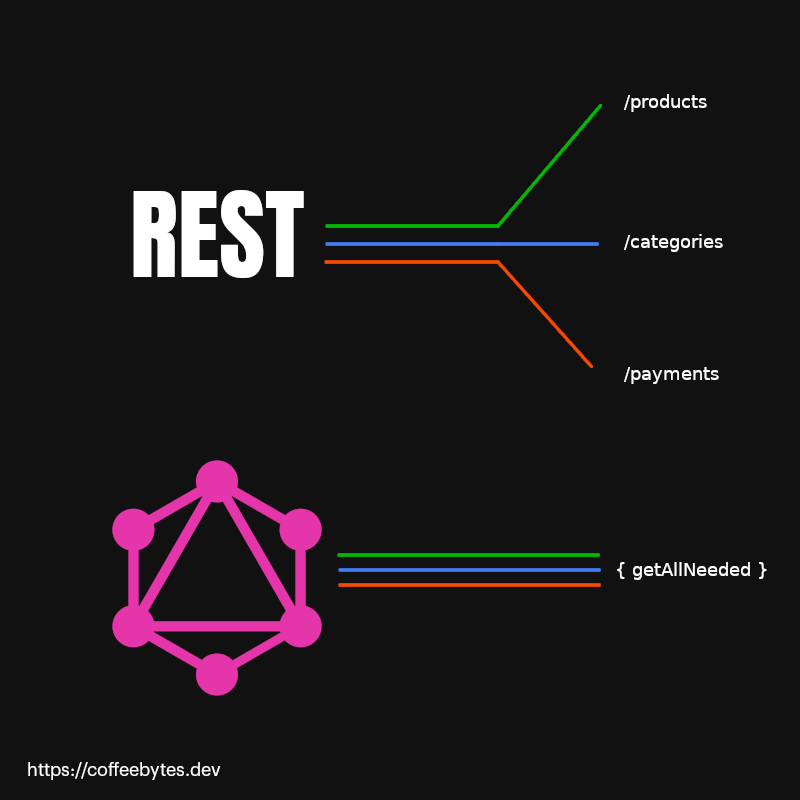
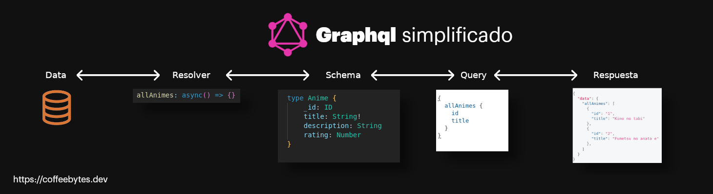
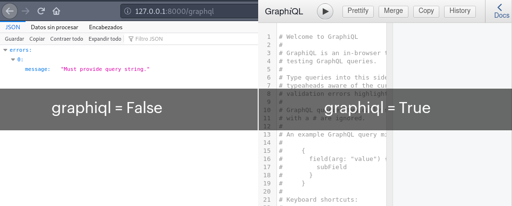
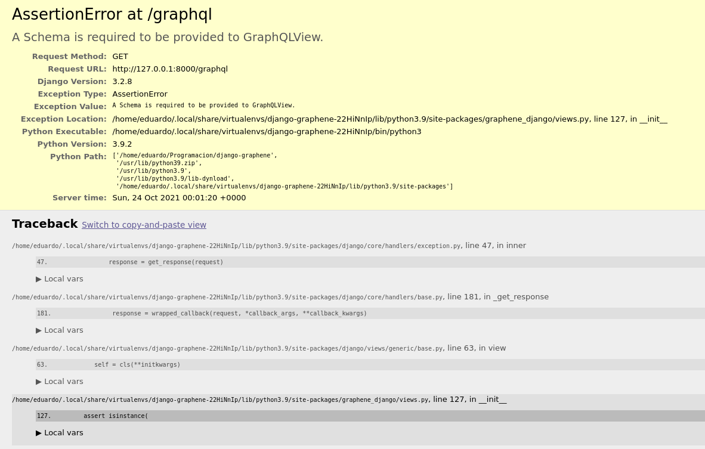
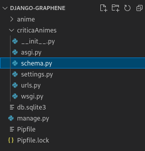
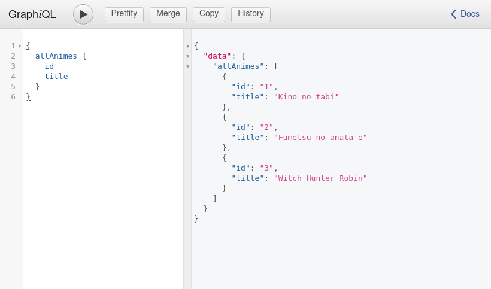
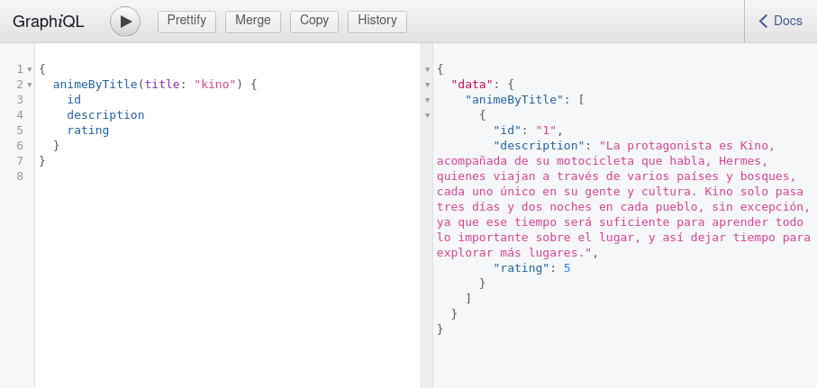
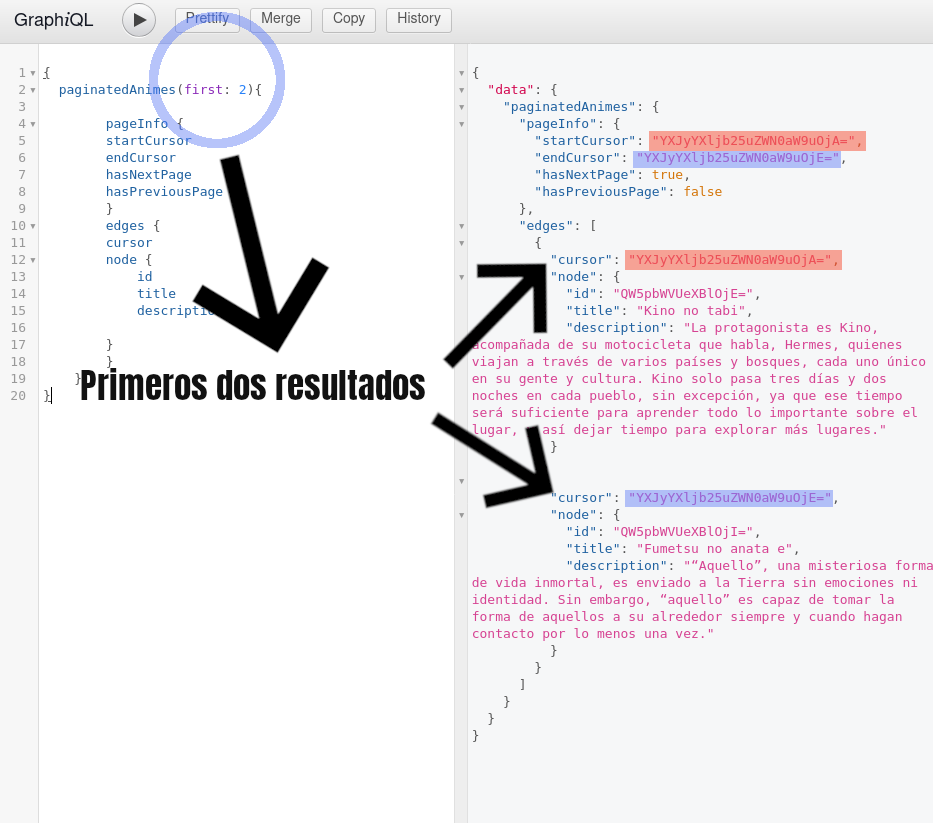
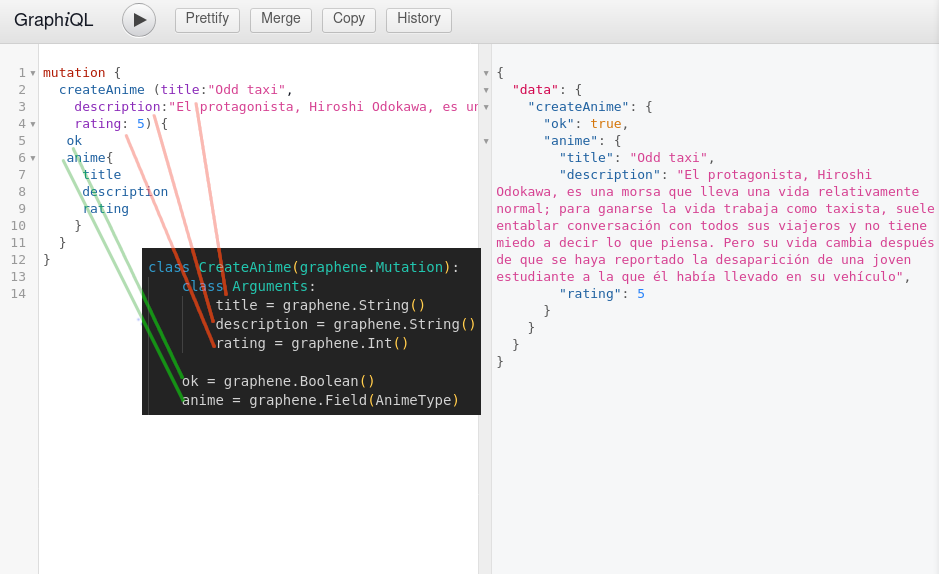

---
aliases:
- /graphql-y-django-con-graphene
- /graphene-y-django-tutorial-de-queries-y-mutaciones-en-graphql
- /graphql-y-django-con-graphene//1000
- /graphql-y-django-con-graphene/feed/
authors:
- Eduardo Zepeda
categories:
- django
coverImage: images/GraphqlGrapheneDjango.jpg
coverImageCredits: Créditos a https://www.pexels.com/@frank-cone-140140/
date: '2021-10-26'
description: 'Tutorial para implementar queries y mutaciones de graphql en un proyecto
  de django, usando graphene, una de las librerías más comunes y su ORM '
keywords:
- django
- python
- graphene
- graphql
- api
title: Graphene y Django, Tutorial de Queries y Mutaciones en Graphql
url: graphql-y-django-con-graphene
---

Normalmente graphql se utiliza en conjunto con Nodejs y express, u otros frameworks de javascript, para crear una API de graphql en la cual hacer consultas o queries, pero graphql también puede implementarse con frameworks de Python como Django. Vamos a crear una aplicación de django que sirva contenido con graphql usando una librería genial llamada graphene que abstrae casi todo el boilerplate de integrar graphql con los modelos de Django.

## ¿Por qué graphql?

Graphql permite integrar peticiones de múltiples fuentes en una sola llamada a la API. A diferencia de REST consiste de un único endpoint al que podemos hacerle determinadas queries o consultas (definidas por nosotros mismos en un schema, sí, como esquema) y obtener una respuesta.



El schema le dice a graphql que tipo de objetos retornaremos y que campos de estos objetos, graphql utilizará un resolver para obtener esa información de una base de datos o cualquier otra referencia.



Esquema simplificado de graphql en Javascript

Cada query o consulta que realicemos será validada por graphql para que devuelva solo lo que está permitido en el schema.

### ¿Deberías usar graphql?

Yo soy más fan de mantener las cosas lo más simples posibles y complicarlas hasta que sea necesario. Facebook creó graphql con el propósito de facilitar las búsquedas de información en su aplicación. Facebook requiere muchísima información de diferentes fuentes para poder funcionar de la manera en la que lo hace. Probablemente tú aplicación no sea tan compleja ni caótica como facebook y no se enfrente a los mismos problemas.

Cada equipo o persona debe considerar si vale la pena implementar graphql de acuerdo a las necesidades a corto, mediano y largo plazo de la app a construir. Quizás REST sea suficiente, o quizás no.

## Instalación de graphene-django

Vamos a instalar primero graphene-django. Yo usaré el administrador de entornos virtuales pipenv, pero tú puedes usar pip o cualquier otro que prefieras.

Voy a crear un proyecto con una aplicación bastante sencilla para este tutorial. que cuenta con un único modelo.

```python
pip install graphene-django==2.15.0 django
django-admin startproject criticaAnimes .
django-admin startapp anime
```

Ahora crearé un único modelo en la app y añadiré tres instancias usando el admin. Tengo una [entrada sobre el django admin](/es/django-admin-panel-y-su-personalizacion/) en caso de que no sepas configurarlo.

```python
# anime/models.py
from django.db import models

class Anime(models.Model):
    title = models.CharField(max_length=256)
    description = models.TextField()
    rating = models.PositiveSmallIntegerField()
```

Recuerda ejecutar las migraciones en caso de que no lo hayas hecho, para que los cambios en nuestra app se reflejen en la base de datos.

```python
python manage.py migrate
```

Ahora vamos a instalar graphene en nuestra aplicación de Django.

Graphene-django requiere que esté instalado staticfiles en tu aplicación, por lo que asegúrate de tenerlo instalado.

```python
# criticaAnimes/settings.py
INSTALLED_APPS = [
    "django.contrib.staticfiles",
    "graphene_django"
]
```

Como ya sabes, a diferencía de una API en REST, **Graphql cuenta con un único endpoint que recibe las queries**, por lo que solo necesitaremos añadir una url a nuestra aplicación.

```python
# criticaAnimes/urls.py
from graphene_django.views import GraphQLView
urlpatterns = [
    # ...
    path("graphql", GraphQLView.as_view(graphiql=True)),
]
```

El parámetro _graphiql_ le indica a django si debe servir o no la interfaz graphiql.



Si ahora intentamos acceder a la url que acabamos de crear, django nos devolverá un error avisándonos que **necesitamos un _schema_ de graphql**.



Error por falta de un schema en graphene

Vamos a indicarle a django donde será la ubicación de nuestro schema.

```python
# criticaAnimes/settings.py
GRAPHENE = {
    "SCHEMA": "criticaAnime.schema.schema"
}
```

Nuestro schema será un objeto llamado _schema_ que se encuentrará dentro de un archivo llamado _schema_.py en la carpeta de nuestro proyecto.



Yo lo he puesto aquí, pero tú puedes ponerlo donde consideres mejor y ajustar la ruta a tu ubicación.

## Crear un schema con graphene

Ahora que contamos con un schema y que django sabe donde encontrarlo, necesitamos detallarle a graphql el manejo de nuestras queries.

Aquí vamos a crear un objeto que represente un type de graphql. Para esto creamos una clase que herede de _DjangoObjectType_ y especificamos el modelo y los campos en su clase Meta.

Este _DjangoObjectType_ es el modelo que se usará como base para manejar las validaciones de graphql y decirle a Django que campos de nuestro objeto debe devolver.

```python
# criticaAnimes/schema.py
import graphene
from graphene_django import DjangoObjectType

from anime.models import Anime

class AnimeType(DjangoObjectType):
    class Meta:
        model = Anime
        fields = ("id", "title", "description", "rating")
```

Ahora vamos a crear una clase _Query_ que contendrá todas y cada una de nuestras queries o consultas, en forma de métodos.

## Retornando listas con graphene

A continuación buscamos que nuestra query sea una lista de objetos _AnimeType_ (el que acabamos de crear en el paso anterior).

Podrías considerar a esta propiedad como el **equivalente de un type o parte del schema** en Javascript.

```python
# criticaAnimes/schema.py
import graphene
from graphene_django import DjangoObjectType

# ...

class Query(graphene.ObjectType):
    all_animes = graphene.List(AnimeType)
```

Ahora vamos a decirle que debe contener la query que resuelve _all\_animes_, para eso vamos a crear una función con el siguiente formato <_resolve\_ + propiedad\_de\_graphene>_ = resolve\_propiedad\_graphene (_resolve\_all\_animes_).

Puedes considerar a este método como el **equivalente de un resolver** en Javascript.

Graphene se encargará automáticamente de dos cosas:

- Asociar el queryset que devolvamos con la propiedad
- Transformar la query a camel case (En este caso allAnimes).

```python
# criticaAnimes/schema.py
import graphene
from graphene_django import DjangoObjectType

# ...


class Query(graphene.ObjectType):
    all_animes = graphene.List(AnimeType)

    def resolve_all_animes(root, info):
        return Anime.objects.all()

schema = graphene.Schema(query=Query)
```

Si por alguna razón quieres **desactivar la transformación del texto a camel** case indícalo en el objeto schema. Yo lo dejaré con el camel case activado

```python
# criticaAnimes/schema.py
# SOLO si quieres desactivar el camelcase
schema = graphene.Schema(query=Query, auto_camelcase=False)
```

Con el camel case activado, la query llamada _allAnimes_ nos retornará el resultado del queryset _Anime.objects.all()_



## Retornando consultas Graphql con parámetros

Para crear una nueva query con parámetros añadiremos un nuevo método para nuestro objeto Query y seguiremos la misma formula: crearemos una propiedad y luego uniremos el nombre con el prefijo _resolve\__

Sin embargo en este caso usaremos un argumento, así que le tenemos que decir el nombre del argumento y el tipo de dato en graphql, en este caso el argumento se llamará _title_ y el tipo de dato será _String_. Aprecia como le pasamos _required_ para que sea obligatorio y su presencia como argumento en el nuevo método.

Recuerda que el resultado de la query lo decidimos nosotros, yo he usado un simple _icontains_ para una búsqueda insensible a mayúsculas o minúsculas, pero tú puedes usar lo que quieras, incluso un [full text search](/es/full-text-search-y-busquedas-con-django-y-postgres/), [búsquedas avanzadas con trigramas con postgres](/es/trigramas-y-busquedas-avanzadas-con-django-y-postgres/) o lo que prefieras.

```python
# criticaAnimes/schema.py
import graphene
from graphene_django import DjangoObjectType

# ...


class Query(graphene.ObjectType):
    # ... 
    anime_by_title = graphene.List(AnimeType, title=graphene.String(required=True))

    # ...

    def resolve_anime_by_title(root, info, title):
        return Anime.objects.filter(title__icontains=title)

schema = graphene.Schema(query=Query)
```



## Paginación en graphql usando relays

Para usar paginación en nuestra búsqueda necesitamos usar el objeto relay que obtenemos de graphene y crear una propiedad en la clase Meta de nuestro Type de graphql.

Y un objeto que Connection con un nodo igual a nuestro tipo de graphql.

```python
# criticaAnimes/schema.py
import graphene
from graphene import relay
from graphene_django import DjangoObjectType

from anime.models import Anime

class AnimeType(DjangoObjectType):
    class Meta:
        model = Anime
        interfaces = (relay.Node,)
        fields = ("id", "title", "description", "rating")

class AnimeConnection(relay.Connection):
    class Meta:
        node = AnimeType

class Query(graphene.ObjectType):
    # ...
    paginated_animes = relay.ConnectionField(AnimeConnection)
    # ...
    def resolve_paginated_animes(root, info, **kwargs):
        return Anime.objects.all()

schema = graphene.Schema(query=Query)
```

Con esto podremos hacer queries donde le indiquemos la cantidad de resultados que queremos. Y nos devolverá información respecto a si tenemos una página siguiente, el cursor de inicio, el cursor de final.

Si estás confundido piensa en los cursores como identificadores. En el query le estamos diciendo que nos traiga los dos primeros resultados, cada uno tiene un cursor, que es como su identificador, y un nodo, el cual contiene la información que nos interesa.

Además de los objetos podemos obtener información de la paginación, como el cursor de inicio, del final y si hay páginas previas o posteriores a nuestra consulta.



## Mutaciones Graphql con graphene

Con esto ya podemos manejar la mayoría de consultas para leer información que se nos puedan ocurrir. Pero, ¿y el resto de operaciones? ¿Crear, actualizar o eliminar datos? Como ya sabes, en graphql, de estas operaciones se encargan las mutations o mutaciones.

Podemos personalizar el comportamiento de nuestras mutaciones creando un nuevo objeto que herede de _Mutation_.

### Argumentos y retorno de una mutation

Dentro de el objeto que hereda de Mutation colocaremos una clase _Arguments_, que nos indica los argumentos que requiere nuestra mutación. En este caso he puesto todos los campos con sus respectivos tipos

Los otros dos campos en el objeto se refieren a lo que retornará la mutation cuando la ejecutemos; en este caso es un objeto Anime, que corresponde a nuestro modelo; y un campo ok, para indicar que todo salió bien.

```python
# criticaAnimes/schema.py
# ...
class CreateAnime(graphene.Mutation):
    class Arguments:
        title = graphene.String()
        description = graphene.String()
        rating = graphene.Int()

    ok = graphene.Boolean()
    anime = graphene.Field(AnimeType)
```

### El método mutate

Ahora creamos un método llamado _mutate_ dentro de esta misma clase. Este objeto recibe root, info y los argumentos que especificamos en clase _Arguments_, dentro del método nosotros decidimos que sucede.

Yo he creado un objeto anime, lo he guardado en la base de datos y he retornado la clase con el objeto _anime_ creado y la palabra _ok_ igual a True.

```python
# criticaAnimes/schema.py
class CreateAnime(graphene.Mutation):
    # ...
    def mutate(root, info, title, description, rating):
        anime = Anime(title=title, description=description, rating=rating)
        anime.save()
        ok = True
        return CreateAnime(anime=anime, ok=ok)
```

Ahora que tenemos definido nuestro comportamiento creemos nuestro objeto _mutation_, que será recibido por el _schema_. Aprecia como todo el comportamiento viene de la clase que acabamos de crear y el objeto _Mutation_ solo establece el nombre de la mutation que usaremos en nuestra query.

```python
# criticaAnimes/schema.py
# ...
class Mutation(graphene.ObjectType):
    create_anime = CreateAnime.Field()

schema = graphene.Schema(query=Query, mutation=Mutation)
```

Es todo, el mutation _createAnime_ recibe los tres parámetros que le indicamos y retorna un objeto anime y la palabra ok como respuesta.



La [documentación de graphene](https://docs.graphene-python.org/en/latest/) es bastante amplia y hay muchos temas más, yo solo te he puesto lo básico y probablemente lo que más utilices, pero date una vuelta y lee todo lo que graphene tiene para ofrecerte.