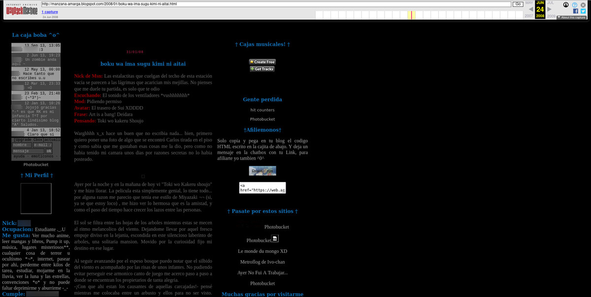
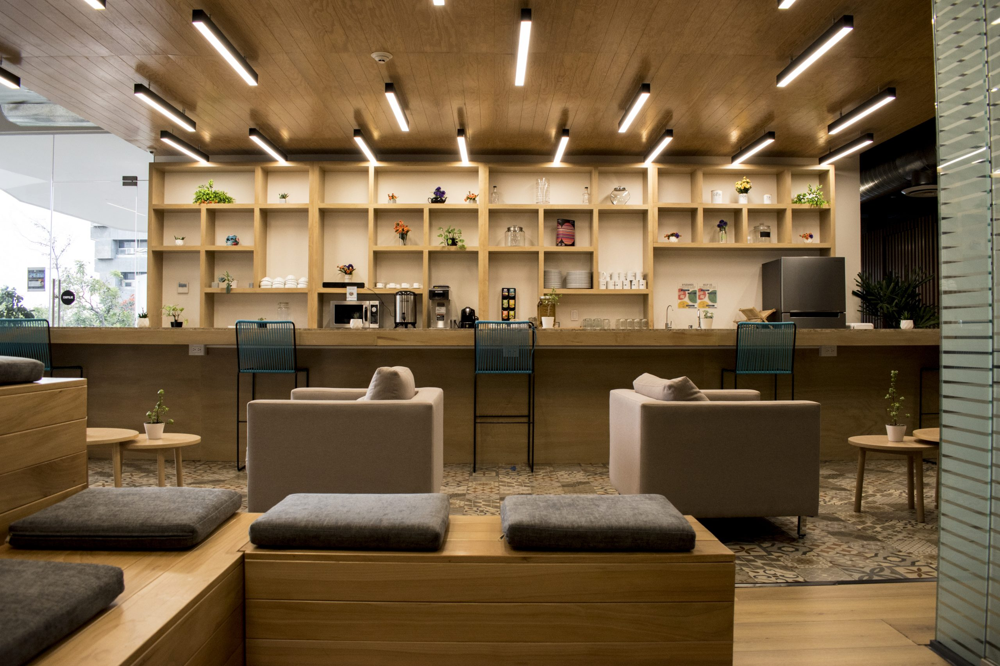

La primera vez que usé una computadora fue a los 9 años, en el salón de computación del colegio donde estudiaba. Los profesores nos enseñaban a manejar a la tortuga de [Logo Writer](https://www.xataka.com/historia-tecnologica/tortuga-que-nos-enseno-a-programar-historia-logo-primer-lenguaje-programacion-disenado-para-ninos) usando comandos simples, en MS-DOS. Hicimos que la tortuga pintara hexágonos, octágonos e incluso la atrapamos en un bucle infinito.

Yo no tenía computadora en casa, así que mi interacción con las computadoras se limitaba a aquellas dos horas semanales en el colegio.

Cuando tenía 12 años mi papá trajo una computadora a casa, una IBM que le dieron para facilitar sus labores como profesor. Esa pequeña con 256 MB de RAM y 10 GB de disco duro era mi sujeto de prueba. Le instalé pequeños programas, le di click a todo lo que pude, descargué los openings y endings de Neon Genesis Evangelion en midi (el mp3 no era nada popular en aquel entonces) y la usé para jugar muchísimos videojuegos en los emuladores que estaban disponibles en la red.

Un buen día, mientras navegaba por internet, descubrí los blogs personales en [blogspot](https://www.blogger.com), me enamoré. Leía uno tras otro, todos tenían cosas tan interesantes que contar. Había brillantes, coloridos y llenos de detalles, otros eran minimalistas y elegantes, otros bastante oscuros y sombríos; **cada blog era un reflejo de la personalidad de su autor**. En aquel entonces yo no tenía idea de como tener el mío.

## Internet y los blogs

Tras leer un par de tutoriales y enterarme de lo fácil que era crear un blog, decidí crear el mío, lo nombré "manzana amarga", por una canción de un anime llamado Shaman King. Solía llenarlo con mis pensamientos y una que otra fotografía. Eventualmente quise personalizarlo y me topé con que tenía que modificar el código HTML y CSS. Para poder modificar mi espacio en internet a mi antojo, aprendí lo básico de HTML y CSS; cambiar colores a las letras, al fondo, modificar el acomodo de los elementos para tener más columnas, insertar imágenes de fondo, añadir pequeños scripts y chatboxs, etc.

Unos años más tarde, gracias a la recomendación de uno de mis mejores amigos, conseguí trabajo en un cyber café. Aprendí como reparar los errores más comunes, conectar impresoras, pasar archivos entre computadoras en red, modificar el registro, descargar archivos por torrent, manejo de paquetería de Office, Photoshop, Keyloggers, conectar computadoras en red, etc. **Sin embargo, durante todo ese tiempo, no escribí ningún programa por mi mismo.**

A la par que trabajaba en el cyber café, decidí estudiar química porque era bueno en las matemáticas y las ciencias exactas. A lo largo de la carrera cree otro blog llamado "Lluvia de fotones" que mantenía mientras tomaba mis clases. 

La universidad (en general, no solo mi carrera) no me gustó, me pareció lenta, aburrida, protocolaría y llena de sin sentidos. A lo largo de mi estancia en la universidad, saber usar una computadora para buscar información me representó muchísimas ventajas frente a mis compañeros menos diestras en ellas.

Terminé la carrera y **me gradué entre los tres mejores promedios de la generación**. Sin embargo, tras echar un leve vistazo a los lugares de trabajo decidí nunca ejercer.

## Supercell y Miku Hatsune

Una tarde investigaba sobre una banda japonesa llamada [Supercell](https://www.supercell.jp/english.html) en internet. Supercell era una banda bastante peculiar, su vocalista era un programa de computadora llamado Vocaloid, un software que tomaba prestada la voz de [Saki Fujita](https://es.wikipedia.org/wiki/Saki_Fujita) para crear una cantante virtual, llamada Miku Hatsune. Vocaloid permitía a sus usuarios utilizar a Miku Hatsune como su vocalista personal, modulando los tonos, tiempos y sílabas.

Mientras más leía sobre Miku Hatsune más quería saber, estaba estupefacto; la compañía que había programado a Vocaloid estaba, literalmente, dándoles una voz a todos aquellos artistas que, por una u otra razón, no contaban con una voz que le diera vida a sus letras. En ese momento entendí el verdadero potencial que tenía el código y me dije: "yo también quiero usar las computadoras y el código para crear".

En aquel momento pasó por mi mente el volver a la universidad, pero deseché la idea igual de rápido. Yo ya había estado ahí, la universidad era ineficiente, el nivel de la mayoría de los profesores era, a lo mucho, mediocre, sus planes académicos estaban completamente desactualizados y las clases presenciales eran lentas e ineficientes. Decidí que no cometería el mismo error dos veces, esta vez intentaría aprender por mi cuenta.

## Pasando de Windows a GNU/Linux

En algún momento justo después de salir de la universidad cambié mi sistema operativo personal a GNU/Linux, al principio me costó bastante trabajo adaptarme, echaba de menos Photoshop y otros programas, pero al ir aprendiendo como funcionaba empecé a disfrutarlo incluso aún más que Windows. Empecé con Linux Mint (Ubuntu nunca me gustó), después probé Kali un año y terminé con Debian, el cual uso hasta la fecha como mi sistema operativo principal. 

En Linux aprendí a instalar programas y los comandos básicos. Posteriormente aprendí a montar un servidor LAMP e hice mi primer "hello world" en PHP.

## Mi experiencia con PHP

PHP fue mi primera experiencia con un lenguaje de programación, y también la más corta. Tras leer un libro grueso llamado Beginning PHP and MySQL, escrito por W. Jason Gilmore en la biblioteca municipal, y aprender bastantes conceptos básicos quedé bastante abrumado con la gran cantidad de funciones innecesarias, su sintaxis se me antojaba quimérica y caprichosa, me desilusioné bastante cuando me enteré de que el lenguaje era incapaz de producir aplicaciones de escritorio de una manera sencilla. 

PHP me había introducido en el mundo de la programación de manera relativamente sencilla, pero aún así sentía que el lenguaje no era para mi... pero después llegó Python.

## El lenguaje con el nombre de un grupo de humoristas

Tras meses evadiendo toda aquella información relacionada con Python **por la simplona razón de deberle su nombre a 'Monty Python'**, un grupo de humoristas británicos con los cuales no estaba familiarizado, decidí dejar atrás mis prejuicios y darle una oportunidad. Me apunté al curso en linea de Python [code.org](https://code.org/) y me enamoré. 

Python me fascinó con su sencilla sintaxis, la simplicidad de las funciones y lo elegante de su diseño.

Un mes más tarde leí el libro [Beginning Python from novice to Professional](/aprender-python-desde-cero-resena-de-beginning-python/) y experimenté la belleza de la simplicidad y la versatilidad de Python. 

Con Python podía hacer de todo: crear aplicaciones de escritorio, páginas web, scripts sencillos para automatizar tareas, todo eso con una sintaxis lo suficientemente simple y predecible para un profano de la programación como yo. Unas semanas bastaron para que Python se convirtiera en mi lenguaje favorito de programación (lo sigue siendo hoy en día), y pasara de mi primer "Hello World" a cosas más complicadas.

## Usando Python para facilitarme la vida

Un año más tarde usaría Python para automatizar mis tareas digitales del día a día. 

Automaticé por completo la creación de imágenes con precios para mi tienda en linea usando imagemagick. Programé la publicación periódica de productos en grupos de facebook, usando selenium, y sin usar la API oficial de facebook (pues habían deshabilitado la opción de publicación en grupos). 

Más tarde usé Django para crear y personalizar una tienda en linea para la fanpage de productos fotográficos que administraba. Para entonces ya había leído bastantes libros sobre Python, Django y desarrollo web, así como visto y practicado muchísimos videotutoriales de la misma temática.

Python era maravilloso, podía programar todas las tareas del día y dejarlas ejecutándose mientras yo me iba a hacer otras cosas. El sistema funcionaba perfecto, me generaba dinero y casi no requería inversión de tiempo de mi parte. Dediqué el tiempo libre que tenía para formarme en más temas relacionados con el mundo de la programación: C, C++, algoritmos, matemáticas discretas, criptografía, buenas prácticas, seguridad informática, software libre, GNU/Linux y otros temas que consideraba relevantes.

Esta es, de manera bastante resumida, la historia sobre como empecé a programar. Siempre de manera autodidacta, [leyendo libros](/pages/libros-que-he-leido-y-resenas) y blogs, viendo tutoriales y practicando mucho.

## Bootcamp en Bedu

Por último, dado que a muchas empresas les encanta tener un papel que respalde lo que ya sabes, y me sentía un poco inseguro sobre si todo lo que había leído aplicaba al mundo del desarrollo actual (el famoso síndrome del impostor), decidí apuntarme a un Bootcamp de 6 meses en [Bedu](https://bedu.org).

Aún con el riesgo de que pecar de soberbia, diré que el bootcamp fue pan comido gracias a todo lo que había practicado y leído anteriormente, realmente no aprendí muchas cosas nuevas. Sin embargo fue gracias a Bedu conocí personas bastante interesantes y talentosas entre mis compañeros y profesores. Además gracias a Bedu probé Platzi, la plataforma de aprendizaje en linea que usan de prework para sus clases presenciales. La verdad solamente la comunidad hizo que valiera cada centavo que pagué.

Tomé el bootcamp de Bedu en Colabora Coworking. 

Quizás en alguna entrada futura hable de mi experiencia en Bedu y en Platzi, dado que esta entrada ya se está alargando bastante. Si quieres preguntarme más sobre como fue mi experiencia déjame un comentario o mándame un DM a [twitter](https://twitter.com/hello_wired) y te platico con más detalle mi experiencia.
