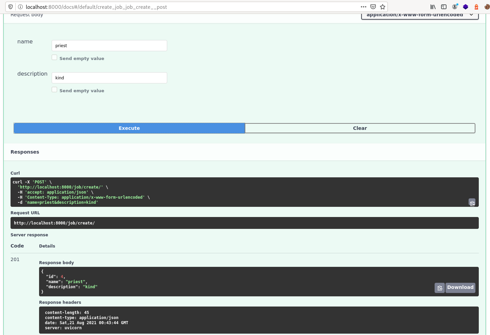
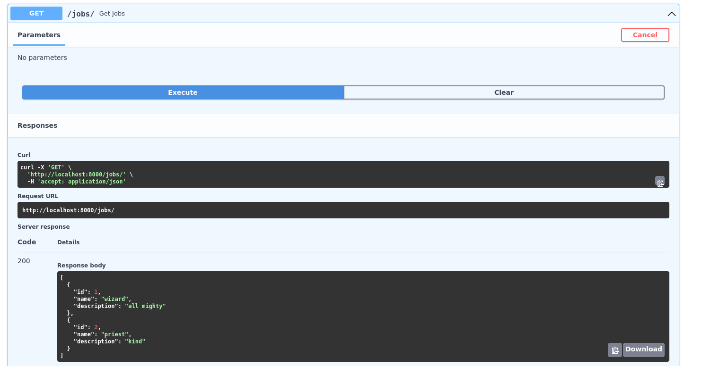
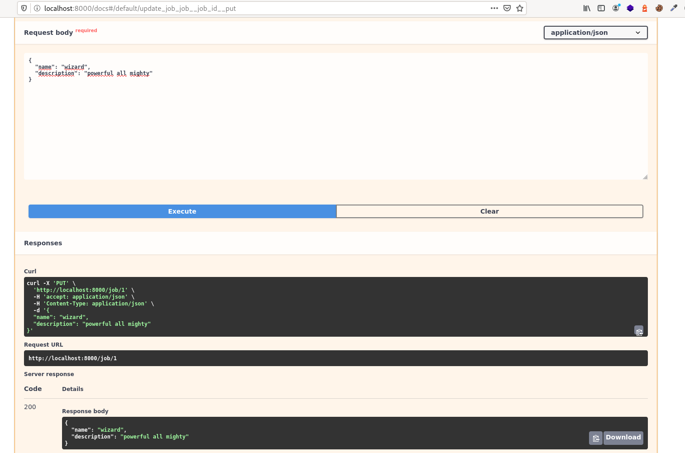
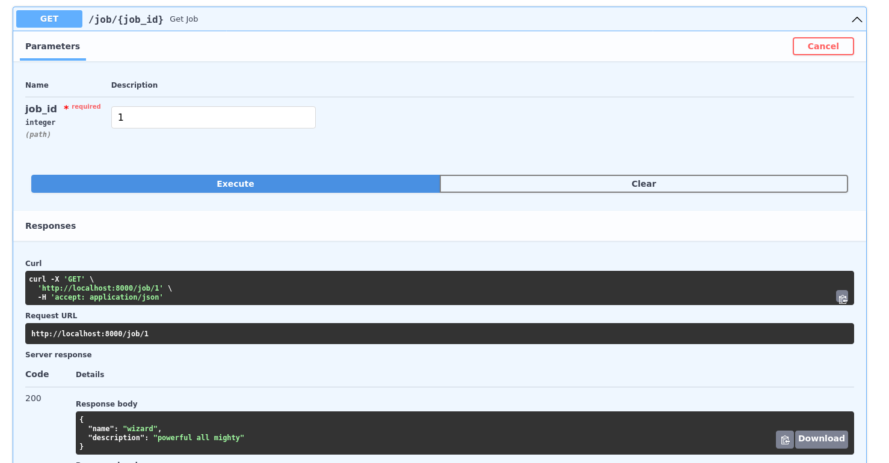
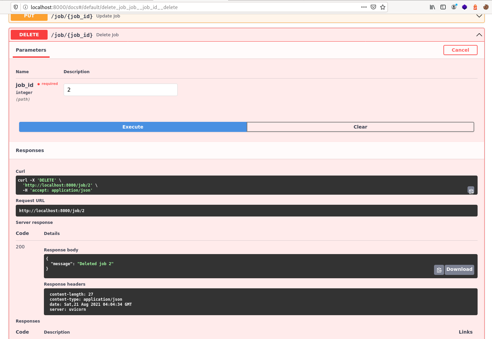

Una de las cosas que más me gustan de Django es su ORM; [una de las razones por las que este framework es tan popular](https://coffeebytes.dev/por-que-deberias-usar-django-framework/). Por otro lado FastAPI no cuenta con un ORM y se centra únicamente en servir endpoints, mostrándose agnóstico sobre la base de datos. Hay bastantes opciones de ORM para python: django-alchemy, peewee, ponyORM, tortoise. Este último, además de ser asíncrono, está inspirado en el ORM de django, por lo que su sintaxis es bastante similar, incluso muchas funciones de tortoise comparten nombre con su contraparte de Django, por lo que los usuarios que usan el ORM de Django van a ahorrarse mucho tiempo aprendiendo las funciones de tortoise.

Para este tutorial voy a usar fastAPI y tortoise-orm juntos por lo que asegúrate de saber al menos lo básico del framework fastAPI y lo básico de base de datos.

## Compatibilidad de tortoise

Tortoise es compatible con las siguientes bases de datos.

- PostgreSQL >= 9.4 (usando asyncpg)
- SQLite (usando aiosqlite)
- MySQL/MariaDB (using aiomysql o asyncmy)

Pero para este ejemplo voy a usar SQLite, por que no necesita configuración de ningún tipo.

## Instalación del ORM de Python tortoise

Para instalar tortoise-orm basta con usar el administrador de entornos virtuales que prefieras, yo usaré pipenv.

```bash
pipenv install tortoise-orm
```

Instalaré también fastAPI y otras utilidades que necesitaremos

```bash
pipenv install python-multipart fastapi uvicorn pydantic
```

## Crear modelos con tortoise

Vamos a crear un directorio llamado app y un archivo de modelos llamado _models.py_

```python
# app/models.py
from tortoise.models import Model
from tortoise import fields


class Job(Model):
    # El campo de la llave primaria se crea automáticamente
    # id = fields.IntField(pk=True) 
    name = fields.CharField(max_length=255)
    description = fields.TextField()

    def __str__(self):
        return self.name
```

Si te fijas la sintaxis es bastante similar a los campos de Django, incluso algunos parámetros son iguales.

Para empezar a trabajar con el ORM de tortoise necesitamos:

1. Conectarnos a la base de datos
2. Crear la(s) tabla(s) necesaria(s)

## Conectarse a la base de datos con tortoise

Vamos a crear una función para conectarnos a la base de datos en un directorio llamado database:

```python
# database/connectToDatabase.py
from tortoise import Tortoise

async def connectToDatabase():
    await Tortoise.init(
        db_url='sqlite://db.sqlite3',
        modules={'models': ['app.models']}
    )
```

## Generando esquemas con tortoise

Ahora creemos una función para generar los modelos en la raíz de nuestra aplicación.

```python
# createSchema.py
from tortoise import Tortoise, run_async
from database.connectToDatabase import connectToDatabase

async def main():
    await connectToDatabase()
    await Tortoise.generate_schemas()

if __name__ == '__main__':
    run_async(main())
```

Observa como importamos la función para conectarnos que acabamos de crear y posteriormente llamamos al método _generate\_schemas()_ , que se encargará de leer nuestros modelos y hacer los cambios en la base de datos.

Otro aspecto que debes apreciar es que corremos la función principal dentro de la función _run\_async()_, que nos provee tortoise. Esto es necesario para que nuestras funciones await se ejecuten, de otra forma solo se crearía un objeto _corroutine_.

¿Por qué colocamos este método en un archivo externo? Porque **_generate\_schemas()_ solo requiere usarse una vez**; cuando se crean las tablas. No debemos incluirlo en el archivo que se correrá cuando se ejecute fastAPI.

Sabiendo eso, ejecutémoslo para crear nuestras tablas.

```bash
python3 createSchema.py
```

Si todo salió bien ya tendremos las tablas creadas en nuestra base de datos SQLite.

## Integración de tortoise con fastAPI

Partiremos de una aplicación sencilla de fastAPI.

Para conectar fastAPI con tortoise, esta última nos da una función llamada _register\_tortosise()_. Que recibe la instancia que creamos con fastAPI, la dirección a la base de datos y la ubicación de nuestros modelos.

```python
# main.py
from fastapi import FastAPI
from database.connectToDatabase import connectToDatabase

app = FastAPI()
await connectToDatabase()

@app.get("/")
async def read_root():
    return {"Hello": "World"}

register_tortoise(
    app,
    db_url="sqlite://db.sqlite3",
    modules={"models": ["app.models"]},
    generate_schemas=True,
    add_exception_handlers=True,
)
```

## Crear un objeto con tortoise

Para crear un objeto podemos optar por **llamar al método _create()_ del modelo, dentro de una función decorada con el método _post()_** de nuestra instancia, o también crear una instancia y posteriormente llamar a su método _save()_.

```python
# main.py
from fastapi import FastAPI
from tortoise.contrib.fastapi import HTTPNotFoundError, register_tortoise

app = FastAPI()

@app.get("/")
async def read_root():
    return {"Hello": "World"}

@app.post("/job/create/", status_code=201)
async def create_job(name=Form(...), description=Form(...)):
    job = await Job.create(name=name, description=description)
    return {"status":"ok"}
# ...
```

Si ahora hacemos una petición web usando la interfaz de documentación que crea fastAPI, en _/docs/_, veremos que seremos capaces de crear un objeto Job usando un nombre y una descripción.



## Serializar objetos con pydantic y tortoise

Hemos creado el objeto, pero, ¿y si queremos devolver el objeto después de crearlo? Dado que es una instancia de un modelo, no podemos devolverlo nada más así. Necesitamos un tipo de datos apto para una respuesta HTTP.

**Pydantic nos permite serializar objetos de la base de datos para poder devolverlos como respuesta JSON** o lo que querramos.

Hay que importar la función _pydantic\_model\_creator_ y pasarle como parámetro nuestro modelo.

```python
# main.py
from fastapi import FastAPI
from app.models import Job
from tortoise.contrib.fastapi import HTTPNotFoundError, register_tortoise
from tortoise.contrib.pydantic import pydantic_model_creator

app = FastAPI()

job_pydantic = pydantic_model_creator(Job)

@app.get("/")
async def read_root():
    return {"Hello": "World"}

@app.post("/job/create/", status_code=201)
async def create_job(name=Form(...), description=Form(...)):
    job = await Job.create(name=name, description=description)
    return await job_pydantic.from_tortoise_orm(job)

register_tortoise(
    app,
    db_url="sqlite://db.sqlite3",
    modules={"models": ["app.models"]},
    add_exception_handlers=True,
)
```

Y para obtener nuestro objeto en JSON llamamos al método al método _from\_tortoise\_orm()_ del objeto que acabamos de crear.

Recuerda anteponer la palabra _await_ o lo que retornarás es una _corroutine_.

## Obtener una lista objetos de un queryset

Usaremos el método **get()** de nuestra instancia de fastAPI.

Para obtener una lista de objetos usamos el método _all()_ y, serializamos el resultado con _from\_queryset()_.

```python
# main.py

# ...

@app.get("/jobs/")
async def get_jobs():
    return await job_pydantic.from_queryset(Job.all())
```



## Actualizar un objeto con tortoise

Ahora **creamos un endpoint que reciba un id y esté decorada con el método _put()_**. Le pasamos como response\_model el objeto job\_pydantic, [para que valide la entrada de los datos, los incluya en la documentación y limite la respuesta a los campos modificables](https://fastapi.tiangolo.com/tutorial/response-model/).

Ademas vamos a crear un segundo objeto job\_pydantic, es decir otro serializador, que excluya los campos de solo lectura (nuestra llave primaria), para devolverlos sin id.

Y, para actualizar un objeto, usamos el método put de fastAPI y recibimos la id del objeto a editar. A continuación filtramos aquellos objetos que coinciden con la id con _Job.filter()_ y luego llamamos a su método _update()_. Dado que el id es único, ya que es llave primaria, solo se editará el objeto cuya id corresponda con el dato que enviamos.

```python
# main.py

job_pydantic = pydantic_model_creator(Job)
job_pydantic_no_ids = pydantic_model_creator(Job, exclude_readonly=True)
# ...

@app.put("/job/{job_id}", response_model=job_pydantic, responses={404: {"model": HTTPNotFoundError}})
async def update_job(job_id: int, job: job_pydantic):
    await Job.filter(id=job_id).update(**job.dict())
    return await job_pydantic_no_ids.from_queryset_single(Job.get(id=job_id))
```



## Obtener un objeto con tortoise

Ahora podemos aplicar el mismo método de la sección pasada. Esta vez **necesitaremos un id y el método _get()_ de fastAPI**. Le pasamos el _response\_model_ para que se encargue de la validación y definimos que el único parámetro que usaremos será la id, con la cual usaremos el método _from\_queryset\_single_() sobre el resultado de la query del ORM: Job.ge_t(id=job\_id)_.

```python
# main.py

# ...

@app.get("/job/{job_id}", response_model=job_pydantic, responses={404: {"model": HTTPNotFoundError}})
async def get_job(job_id: int):
    return await job_pydantic_no_ids.from_queryset_single(Job.get(id=job_id))
```



## Eliminar un objeto con tortoise

Para eliminar un objeto también **vamos a necesitar un id y llamar al método _delete()_** de fastAPI, por lo que la función quedaría de la siguiente manera:

```python
# main.py
class Status(BaseModel):
    message: str
# ...

@app.delete("/job/{job_id}", response_model=Status, responses={404: {"model": HTTPNotFoundError}})
async def delete_job(job_id: int):
    deleted_job = await Job.filter(id=job_id).delete()
    if not deleted_job:
        raise HTTPException(status_code=404, detail=f"Job {job_id} not found")
    return Status(message=f"Deleted job {job_id}")
```

Filtramos por el id que obtenemos en la url y, si encontramos el objeto, lo borramos, en caso de que no exista el id de ese objeto devolveremos un error 404 por medio de una excepción. En caso de que sí, ya no vamos a devolver el objeto, sino que bastará con que devolvamos un mensaje avisando que el id fue borrado.



Y con eso podemos realizar las operaciones básicas de CRUD en fastAPI usando tortoise como ORM. En esta entrada no he tratado las llaves foráneas, ni los campos de llave foránea, ni los many to many, ni otro tipo de relaciones entre modelos. Probablemente haga una entrada en un futuro sobre eso, mientras tanto puedes leerte [la documentación oficial de tortoise.](https://tortoise-orm.readthedocs.io)
