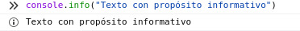
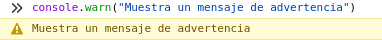
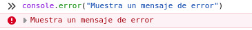
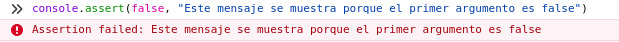
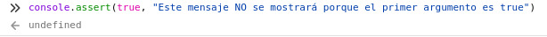
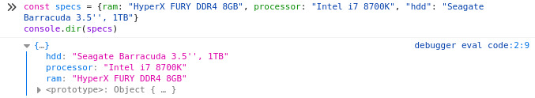
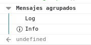
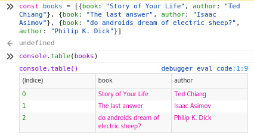

---
aliases:
- /en/you-are-misusing-consolelog-in-javascript/
authors:
- Eduardo Zepeda
categories:
- javascript
coverImage: images/estas_usando_console_mal.jpg
date: '2020-01-15'
description: Learn at once how to take advantage of the javascript console object
  and its most useful methods to make your development easier.
keywords:
- javascript
- opinion
title: You are misusing console.log in javascript
---

I bet you have ever used _console.log()_ to debug errors when programming in javascript. But you may not know that _console_ has other useful methods besides _log()_. In this post I am going to place some of the most useful methods that I have found on the web. In this entry I am going to put some of the most useful methods I have found on the web.

## Displays information

_console.info()_ performs the function of displaying information

```javascript
console.info("Texto con propósito informativo")
```





## Displays warning messages

_console.warn()_ displays a warning message, with yellow background

```javascript
console.warn("Muestra un mensaje de advertencia")
```



## Displays an error message

_console.error()_ shows us an error message

```javascript
console.error("Muestra un mensaje de error")
```



## Evaluates whether an expression is true, or displays an error

_console.assert()_ takes two arguments: the first is an expression, the second a message to display if the expression is false.

```javascript
console.assert(false, "Este mensaje se muestra porque el primer argumento es false")
Assertion failed: Este mensaje se muestra porque el primer argumento es false
console.assert(true, "Este mensaje NO se mostrará porque el primer argumento es true")
```





## Event account

_console.count()_ receives a label that we define, each time it is executed it will show us how many times this function has been executed with the given label.

```javascript
console.count(3)
console.count(7)
console.log("Ya se tiene un conteo para 3 y 7")
for(let i=0; i<10; i++){
    console.count(i)
}
3: 1 
7: 1 
Ya se tiene un conteo para 3 y 7
0: 1 
1: 1 
2: 1 
3: 2 
4: 1 
5: 1 
6: 1 
7: 2
8: 1 
9: 1
```

## Print an object as JSON

For this example we create an object

```javascript
const specs = {ram: "HyperX FURY DDR4 8GB", processor: "Intel i7 8700K", "hdd": "Seagate Barracuda 3.5'', 1TB"}
```

We use _console.dir()_ to print the object in its JSON representation

```javascript
console.dir(specs)
{…}
hdd: "Seagate Barracuda 3.5'', 1TB"
processor: "Intel i7 8700K"
ram: "HyperX FURY DDR4 8GB"
<prototype>: Object { … }
```



## Group messages

_console.group()_ marks the beginning of the messages we want to group and receives as argument the title of the grouping, while console.groupEnd() marks the end of this grouping.

```javascript
console.group("Mensajes agrupados")
console.log("Log")
console.info("Info")
console.groupEnd()

Mensajes agrupados
| Log
| Info
```



## Measure time

_console.time()_ will start a timer that will stop when we use console.timeEnd(). Which is useful for us to measure everything that is executed in between these two functions.

```javascript
console.time()
functionToMeasure()
console.timeEnd()
default: 8605ms - temporizador finalizado
```

## Print a list of objects as a table

_console.table()_ Prints a list of objects in a table format that is quite pleasing to the eye.

```javascript
const books = [{book: "Story of Your Life", author: "Ted Chiang"}, {book: "The last answer", author: "Isaac Asimov"}, {book: "do androids dream of electric sheep?", author: "Philip K. Dick"}]
console.table(books)
```



With this example I end this entry. I hope that the next time you use _console.log()_ you take into account the different options you have to make easier the development of your code. In this entry I only put the most useful methods, if you want to go deeper into the subject you can consult the [official documentation](https://developer.mozilla.org/es/docs/Web/API/Console)