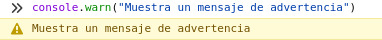
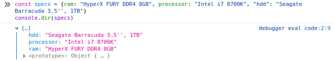
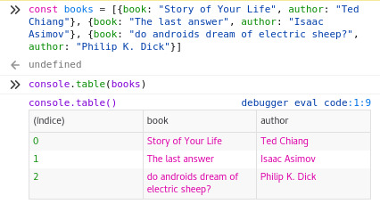

---
aliases:
- /estas-usando-mal-console-log-en-javascript
- /estas-usando-mal-console.log-en-javascript/
- /es/estas-usando-mal-consolelog-en-javascript/
authors:
- Eduardo Zepeda
categories:
- javascript
coverImage: images/estas_usando_console_mal.jpg
date: '2020-01-15'
description: Aprende de una vez como aprovechar el objeto console de javascript y
  sus métodos más útiles para hacer más sencillo tu desarrollo.
keywords:
- javascript
- opinion
title: Estás usando mal console.log en javascript
---

Te apuesto a que alguna vez has usado _console.log()_ para depurar los errores al programar en javascript. Pero quizás no sepas que _console_ tiene otros métodos muy útiles a parte de _log()_. En esta entrada voy a colocar algunos de los métodos más útiles que he encontrado en la web. En esta entrada voy a colocar algunos de los métodos más útiles que he encontrado en la web.

## Muestra información

_console.info()_ cumple la función de presentar información

```javascript
console.info("Texto con propósito informativo")
```




## Muestra mensajes de advertencia

_console.warn()_ muestra un mensaje de advertencia, con fondo amarillo

```javascript
console.warn("Muestra un mensaje de advertencia")
```



## Muestra un mensaje de error

_console.error()_ nos muestra un mensaje de error

```javascript
console.error("Muestra un mensaje de error")
```


## Evalua si una expresión es true, o muestra un error

_console.assert()_ recibe dos argumentos: el primero es una expresión, el segundo un mensaje a mostrar si la expresión es false.

```javascript
console.assert(false, "Este mensaje se muestra porque el primer argumento es false")
Assertion failed: Este mensaje se muestra porque el primer argumento es false
console.assert(true, "Este mensaje NO se mostrará porque el primer argumento es true")
```


## Cuenta eventos

_console.count()_ recibe una etiqueta que nosotros definimos, cada vez que se ejecute nos mostrará cuantas veces se ha ejecutado esta función con la etiqueta dada.

```javascript
console.count(3)
console.count(7)
console.log("Ya se tiene un conteo para 3 y 7")
for(let i=0; i<10; i++){
    console.count(i)
}
3: 1 
7: 1 
Ya se tiene un conteo para 3 y 7
0: 1 
1: 1 
2: 1 
3: 2 
4: 1 
5: 1 
6: 1 
7: 2
8: 1 
9: 1
```

## Imprime un objeto como JSON

Para este ejemplo creamos un objeto

```javascript
const specs = {ram: "HyperX FURY DDR4 8GB", processor: "Intel i7 8700K", "hdd": "Seagate Barracuda 3.5'', 1TB"}
```

Usamos _console.dir()_ para imprimir el objeto en su representación JSON

```javascript
console.dir(specs)
{…}
hdd: "Seagate Barracuda 3.5'', 1TB"
processor: "Intel i7 8700K"
ram: "HyperX FURY DDR4 8GB"
<prototype>: Object { … }
```



## Agrupa mensajes

_console.group()_ marca el inicio de los mensajes que queremos agrupar y recibe como argumento el título de la agrupación, mientras que console.groupEnd() marca el término de esta agrupación.

```javascript
console.group("Mensajes agrupados")
console.log("Log")
console.info("Info")
console.groupEnd()

Mensajes agrupados
| Log
| Info
```


## Mide el tiempo

_console.time()_ empezará un temporizador que se detendrá cuando usemos console.timeEnd(). Lo que nos sirve para medir todo lo que se ejecuta en medio de estas dos funciones.

```javascript
console.time()
functionToMeasure()
console.timeEnd()
default: 8605ms - temporizador finalizado
```

## Imprime una lista de objetos como una tabla

_console.table()_ Nos imprime una lista de objetos con un formato de tabla bastante agradable a la vista

```javascript
const books = [{book: "Story of Your Life", author: "Ted Chiang"}, {book: "The last answer", author: "Isaac Asimov"}, {book: "do androids dream of electric sheep?", author: "Philip K. Dick"}]
console.table(books)
```



Con este ejemplo doy por terminada la entrada. Espero que la próxima vez que uses _console.log()_ tomes en cuenta las diferentes opciones que tienes para hacer más sencillo el desarrollo de tu código. En esta entrada solo puse los métodos más útiles, si quieres ahondar más en el tema puedes consultar la [documentación oficial.](https://developer.mozilla.org/es/docs/Web/API/Console)