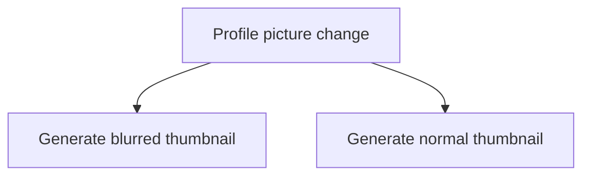

---
aliases:
- /en/i-took-advantage-of-an-error-in-the-code-of-a-dating-app/
authors:
- Eduardo Zepeda
categories:
- javascript
- software architecture
coverImage: images/i_took_advantage_of_an_error_in_the_code_of_a_dating_app.jpg
date: '2025-01-03T20:36:36-06:00'
description: ''
keyword: ''
keywords:
- cyber security
- javascript
- css
- web
title: I took advantage of an error in the code of a dating app
---

While using a Tinder-style dating app, one of those in which, after a mutual like, the application puts the people involved in contact, I noticed that, to promote their premium plan, they used obfuscated blurred pictures to introduce you to the people who had pressed the Like button on your profile.

After having a couple of matches I noticed that the obfuscated pictures belonged to real accounts, that is, they were not a set of generic images or placeholders.



It sounded too obvious, so I opened my browser's developer console and went directly to the CSS code to double-check my suspicions. They couldn't possibly be making such a simple mistake—I thought—they're protecting the identity of the photographs with a simple CSS *filter: blur*.

``` css
.hidden-image {
    filter: blur(4px);
}
```

## Image processing of this dating app.

The actual images were served by the app's CDN and then a filter was applied to hide them, so to find out who had liked you, you just had to remove the filter. 

Unfortunately it was impossible to get any other data from the pictures or from the URL structure, [API calls](), or any other information given; neither the name, nor the profile nor any other piece of information was accessible other than the profile picture.



## How to obfuscate images in dating apps?

Certainly this was an architectural mistake, it's true that is plain simple to hide the images in the frontend, using CSS, not only that, you save disk space and avoid processing time in the backend, however, a better option would have been to use a set of generic images for all accounts. 

Another plausible alternative would have been to generate a thumbnail (and other [changes, like changing the format, example: webp](/en/linux/how-to-convert-jpg-to-webp-on-gnu-linux/)) automatically every time a user updates their main profile image; it consumes a bit more space but keeps the real images safe and personalizes the experience for each user. 



## Exploiting the bug with a browser extension

And, what I did about it? Well, in order to exploit the bug, I created a small Javascript script that gathered all the profile images and removed the class that applied the blur effect, afterwards I integrated it into a browser extension to automate the process of unblocking them each time I entered the page.

This little oversight on the part of the developers lasted about two years. It has now been fixed so if you try to search for the bug on the main dating pages, you will no longer find it, and this is also the main reason that I decided to post about it.

The developers in charge modified the code for its web version, leaving the rest of the UI almost intact and chose to create an obfuscated thumbnail for each account, but processing it from the backend, so that it is completely impossible to get the real image.