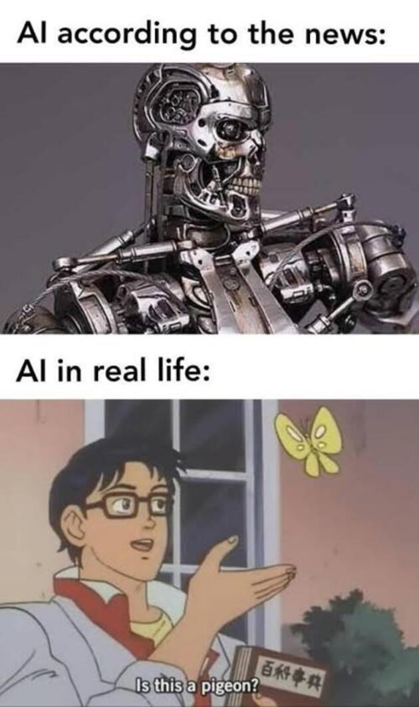
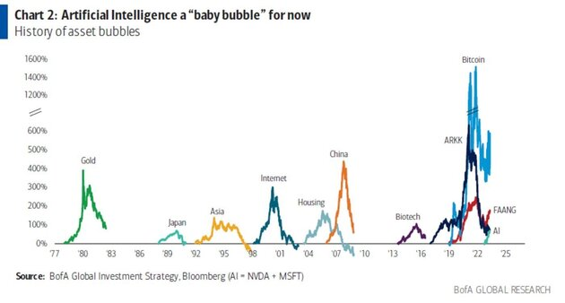
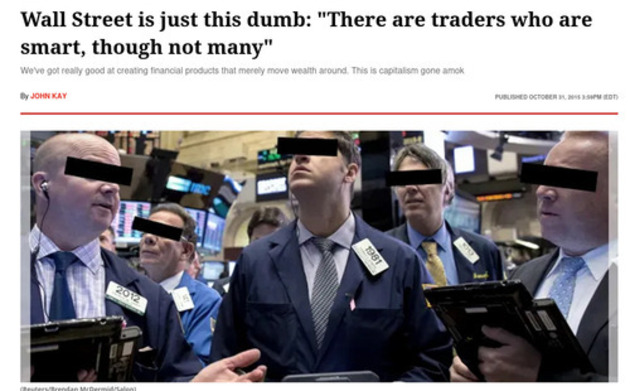
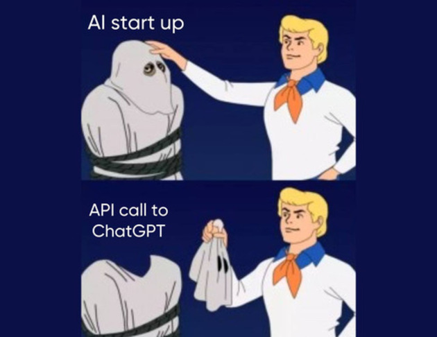
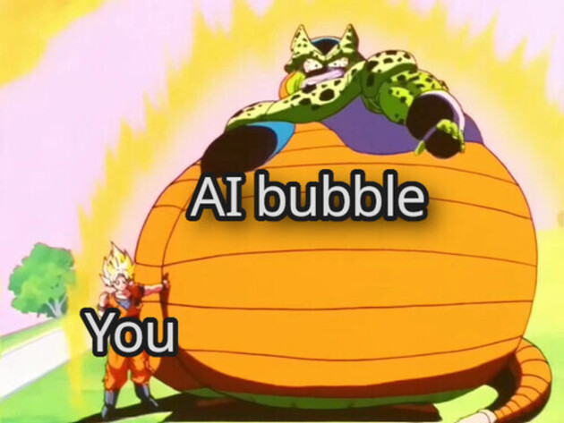

Since ChatGPT rapidly surpassed the record of user growth, artificial intelligence is almost omnipresent in the modern metropolis collectivity. Its arrival has brought a wide gradient of expectations ranging from simple problem solving to the complete automation of our societies. 

But I believe that, while AI has amazing capabilities, it is far from revolutionizing the world and achieving the full automation expected by the general public in the short term.

## The market is saturated with AI startups
If you've been ~~doom~~ scrolling on social media, you'll know that influencers keep talking about new AI tools that are going to revolutionize the world, ~~just like they said cryptocurrencies would,~~ from voice cloners, image and video creators, data analytics, just to name a few. There are too many AI companies! It's all AI!

### The AI company trend

In this AI fever, entrepreneurs are becoming ~~even more~~ elitist, by which I mean that all those business ideas that don't use AI are ipso facto discarded. "To use AI" has been added to the checklist of any company that wants to go to market and this, to me, is what creates this bubble.

## Investors' greed and consumers' ignorance are guilty of The AI bubble

It is enough for a company to use AI to grant it with an unknown magic that makes it irresistible to the general public, and also to investors. And this for a simple reason: as a society we do not understand how AI works internally, we do not understand the statistics behind it and we endow it with the mysticism of magic.
Consumers, usually businesses, expect AI to reduce (or eliminate) the costs of hiring people and investors expect the investment of a lifetime.

## AI fever and capital investment

As I said, investors don't want to be left out of this party and are so eager to hit the jackpot and become the new Zuckerberg of artificial intelligence that they open their wallets without thinking every time they hear the word "AI" in the same sentence as "disruptive."

But, in my opinion, this is all just a bunch of companies and entrepreneurs acting on the above, just as [creators of  Devin, the supposed replacement for programmers](/en/devin-ai-the-supposed-replacement-for-programmers/) are probably doing. 
The market is trying to make a quick and easy buck from the suddenly growing interest of tech laymen in something as abstract, and with such esoteric characteristics, as AI.

## Many of the AI solutions are just plain ChatGPT wrappers

In addition to this, most people involved in the financial side of AI don't understand that not much has really changed in the coding world, most solutions just use ChatGPT on the backend, along with a visually appealing interface to present themselves as the next unicorn and look for easy money from investors. 

And not that the above is wrong, but I would prefer that all the possibilities that AI has to offer be explored, that we train neural networks to automate every tedious aspect of society and free humans from the paradigm of performing repetitive 9-5 tasks. I want more investment in AI, but one that "adds value," not just seeks to capitalize as quick as possible.

## The tragic end of the AI Bubble and the New Normal

Having said the above, it seems that I believe that all this about AI is nothing more than smoke and mirrors, but no, I believe that AI is going to stay and it has potential for a social revolution but, at least in the short term, will be exclusive to a very small group of companies, among which I highlight openAI, Google, Microsoft and the usual players. 
The bubble will burst and only those companies with the potential to change the game forever will remain. Tools like Sora, Midjourney, ChatGPT, Eleven Labs or Watson. 

It is up to them to decide the pace at which this transition will take place despite what the market is trying to shove down your throat.

My prediction regarding the bubble, is that all other companies that don't have their own unique neural networks or some intellectual property to protect them, are going to cannibalize and commoditize themselves, and that, when the bubble bursts, a lot of people are going to lose money in the process.
