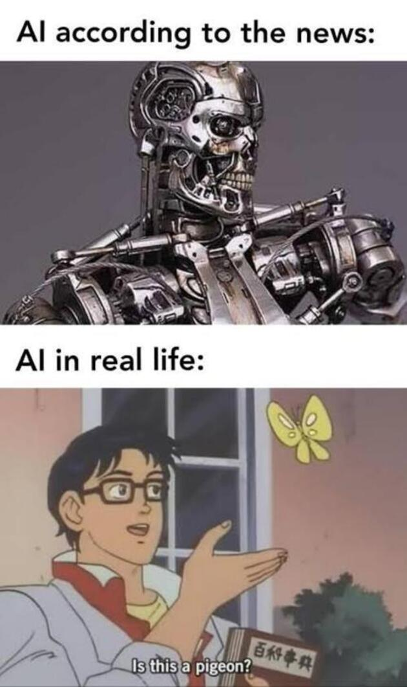
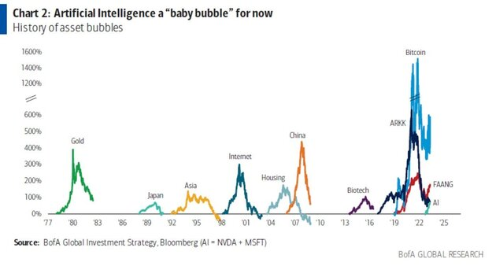
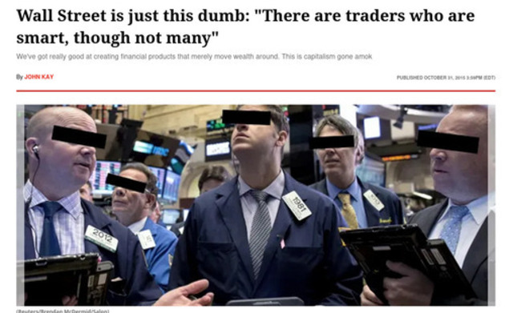

Desde que ChatGPT superó el record de crecimiento de usuarios, la inteligencia artificial es cuasi omnipresente en la colectividad moderna de las metropolis. Su llegada ha traído consigo un gradiente de expectativas que van desde la resolución de problemas sencillos, hasta la automatización completa de nuestras sociedades. 

Pero yo creo que, si bien la AI tiene capacidades asombrosas, está lejos de revolucionar el mundo y conseguir la automatización total esperada por el público en general en el corto plazo.

## El mercado está saturado de soluciones de AI

Si has estado haciendo ~~doom~~ scroll por redes sociales, sabrás que los influencers no paran de hablar de nuevas herramientas de AI que van a revolucionar el mundo, ~~justo como dijeron que harían las criptomonedas,~~ desde clonadores de voz, creadores de imágenes y video, analisis de información, solo por mencionar algunos. ¡Hay demasiadas compañias de AI! ¡Todo es AI!

### La moda por las empresas de AI

En esta fiebre por la AI, los emprendedores se están volviendo ~~aún más~~ elitistas, ¿a qué me refiero?, a que todas aquellas ideas de negocio que no echan mano de la AI son descartadas ipso facto. Se ha añadido "usar AI" a la checklist de cualquier empresa que quiera salir al mercado y esto, para mí, es lo que crea esta burbuja.

## La burbuja de AI es culpa de la ignorancia de inversores y consumidores

Basta con que una empresa use AI para dotarla de una magia desconocida que la vuelve irresistible hacia el público en general, y también para los inversionistas. Y esto por una sencilla razón: como sociedad no entendemos como funciona la AI a nivel interno, no entendemos las estadísticas detrás y le dotamos del misticismo de la magia.

Los consumidores, generalmente negocios, esperan que la AI reduzca (o elimine) los costos de contratar personal y los inversores esperan la inversión de sus vidas.

## La fiebre por la AI y la inversión de capital

Como ya dije, los inversores no quieren quedarse fuera de esta fiesta y están tan deseosos de sacarse la lotería y convertirse en el nuevo Zuckerberg de la inteligencia artificial, que abren sus carteras sin pensarlo cada vez que escuchan la palabra "AI" en el mismo enunciado que "disruptivo".

Pero, en mi opinión, todo esto no es más que un montón de empresas y emprendedores actuando en consecuencia a lo anterior, tal como sospecho de los [creadores de Devin, el supuesto reemplazo de los programadores](/es/devin-ai-el-supuesto-reemplazo-de-los-programadores/). 

El mercado intenta conseguir dinero fácil y rápido por el creciente y repentino interés de los legos del mundo de la tecnología por algo tan abstracto, y con aires tan esotéricos, como lo es la AI.

## Muchas de las soluciones de AI son solo wrappers de ChatGPT

Aunado a esto, la mayoría de las personas involucradas en el aspecto financiero de la AI no comprenden que realmente no ha cambiado mucho en el mundo del código, la mayoría de las soluciones solo usan a ChatGPT por detrás, junto a una interfaz linda para presentarse como el siguiente unicornio y buscar el dinero fácil de los inversores. 

No es que usar chatGPT para tu empresa esté mal, pero si una app es sólo un envoltorio de GPT, el riesgo de convertirse en una commodity es alto, ¿vamos a tener miles de apps diferentes que resuelven el mismo problema y son sólo envoltorios de chatGPT?

Y no es que lo anterior esté mal, pero yo preferiría que se exploraran todas las posibilidades que la AI tiene para ofrecer, que entrenáramos redes neuronales para automatizar cada aspecto tedioso de la sociedad y liberar al ser humano del paradigma de efectuar tareas repetitivas de 9-5, quizás el [diseño de mejores drogas por medio de la inteligencia artificial](/es/inteligencia-artificial-y-diseno-de-farmacos-y-medicamentos-para-desarrolladores/). Quiero más inversión en AI, pero que "agregue valor", no solo que busque obtener rendimientos rápido.

## Las empresas se quedan sin datos para entrenar a los LLM

Me topé con este video el otro día, y estoy de acuerdo con este buen caballero: las compañias se están quedando sin datos, nunca se trató sobre la potencia de cálculo, bueno quizás solo al principio, siempre se trato sobre la calidad y la fiabilidad de los datos necesarios para entrenar a la AI.



La avaricia que alimenta el uso de la AI va a inundar internet con una miríada de artículos sobre AI, que van a ser usados para alimentar a la AI y esta los regurgitará, una y otra vez ~~como en la película del ciempiés humano~~.

## El fin de la burbuja de AI y la nueva normalidad

Dicho lo anterior pareciera que creo que todo esto de la AI no es más que humo y espejos, pero no, yo creo que la AI va a quedarse y su potencial de revolución social, al menos en el corto plazo, va a ser exclusiva de un grupo muy reducido de empresas, entre las que destaco openAI, Google, Microsoft y los jugadores de siempre. 

En mi opinión, las Inteligencias Artificiales son el autocompletado definitivo, ya sea de texto, imágenes o video, nada más. Hasta ahora la AGI es un hito que se mantiene distante en el futuro.

> Machines don’t learn. What a typical “learning machine” does, is finding a mathematical formula, which, when applied to a collection of inputs (called “training data”), produces the desired outputs. This mathematical formula also generates the correct outputs for most other inputs (distinct from the training data) on the condition that those inputs come from the same or a similar statistical distribution as the one the training data was drawn from. -Andriy Burkov

La burbuja va a tronar y van a quedarse solo aquellas empresas con el potencial de cambiar el juego para siempre. Herramientas como Sora, Midjourney, ChatGPT, Eleven Labs o Watson. Les corresponde a ellas decidir el ritmo al que se llevará a cabo esta transición.

Mi predicción respecto a la burbuja, es que el resto de empresas que no posean sus propias redes neuronales exclusivas o alguna propiedad intelectual que las proteja, van a canibalizarse y a volverse commodities, destruyendo el mercado de AI en el proceso, y que, cuando truene la burbuja, muchas personas van a perder dinero en el proceso.

