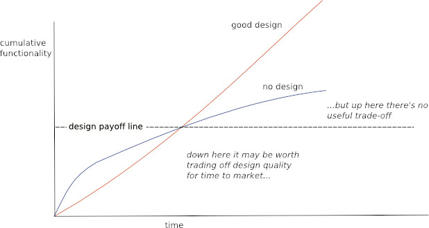

This post is for you, who want to become independent from companies and are looking to create your own projects in the internet world. Have you ever thought if those extra milliseconds of performance that we get by switching a project to a more verbose language really matter that much or if the search for the fastest framework is really worth it?

In the world of programmers there is an obsession with speed and performance; we want to squeeze every possible millisecond out of the language and reduce memory consumption to the minimum possible and write queries in their most elegant version that pushes our database to its speed limit and and subject them to the most rigorous [Big O performance analysis](/en/the-big-o-notation/).

In this constant search we go from high level languages to lower level languages, we wander through the darkest corners of the documentation towards the most esoteric runtimes written in arcane languages whose names seem to be taken out of a dictionary of another language. Did any particular one come to your mind?. 

Throughout this virtual odyssey, we completely forgot about what is probably the only factor that matters: the boring market.

## How much do requests per second matter at a startup?

If you, or your company, are not a major league player on the Internet, you are probably giving more importance than necessary to the fact that your application serves 1 request per second instead of 100. 

Yes, it is true that we are talking about a factor of 100, but consider the following:
One request per second means 60 in a minute, 3600 in an hour and 86400 a day. 

Are you really worried about your application having a traffic of 86400 requests in a day? If you already have such traffic, paying an extra developer to tune the gears of your software should not be a problem, and if it is, **you probably don't have a performance problem, but a monetization problem**.

## Does memory consumption matter in a new web application?

Does it matter whether your application runs with minimal memory consumption using a low-level language, or with higher consumption using a high-level language. I would say it depends; if your application or project is new, it's probably worth paying a few dollars more per month for extra memory in exchange for a higher development speed in each iteration. 

I'm not saying that it's wrong to take care of the technical aspects, but right now there are more important things, such as acquiring information that will translate into profitability later, or allocating more resources to marketing and advertising your startup or project than wasting time ironing out the kinks in your code. 

Optimizing for good SEO is also more important than the memory consumption or the efficiency of your application, believe me, [I learned the importance of SEO from my own mistakes](/en/my-mistakes-regarding-the-tech-seo-optimization-of-my-website/)

I'll say it again just in case you didn't get it: marketing and sales are more important than the quality of your software when you start a project.

## Development speed vs. performance

For most startups or solopreneurs, the market exploration process will be more important than reducing resource consumption. What good does it do you to cut your RAM and processor consumption in half if your iterations are going to go from one week to two and a half weeks?

### Usually fast enough is enough

Do not choose an efficient language, but one that allows you to be flexible to changes and adapt quickly while obtaining information. In this case, the speed of developing new features or modifying existing ones is much more important than their performance.

Remember that **in technology everything is a trade-off**, in this case performance for productivity.

Also, keep in mind that this also applies when choosing the tools you know; **you may be faster programming in a low level language that you already master, than in a high level language that you don't master.**

### Keep the technical debt in mind

Another thing, when optimizing for development speed, don't forget to consider technical debt, find the tipping point and pivot towards scalability.

## Situations where performance and security do matter.

Does it mean that you should forget about all other languages and try to implement all your ideas in a tool written in a mediocre language ~~javascript~~ just for the speed of development?, no, I think there are situations where it is crucial to choose the fastest, safest and most efficient, like for example: for browsers, game engines or operating systems (however this post is about web applications), although, again, you are not going to design an operating system by yourself... unless you want your OS to be the third temple of Jerusalem and you want to communicate with god.

Using a low-level language is usually the right decision for situations where performance is critical, you don't want services where people's lives or health are at stake written in high-level languages, which tend to be more flexible in typing and more prone to runtime errors.

You will also want performance and security in environments where you deal with things even more important than people's lives, such as applications related to the financial market and where significant amounts of money are handled (sarcasm, just in case, the only people who think like that are the people on Wall street).

## Top Tools To Get Shit Done in web development

I am an advocate of avoiding reinventing the wheel every time. It's quite annoying to have to create authentication systems, CRUDS, database queries over and over again, even though some communities, like Go, prefer to implement everything from scratch.

Here is a list of some of my favorite solutions to save you all the boilerplate and focus on what's important, that although they don't have the best performance, they focus on having working prototypes as soon as possible.

- Wordpress: [because you already know'](/en/to-program-a-blog-or-to-use-wordpress/)
- Ruby on Rails: Mature framework, with a long history and easy to use.
- AdonisJs: Javascript with ORM and authentication included.
- Django: [It's easy to develop a MVP without having to reinvent the wheel](/en/why-should-you-use-django-framework/), also there is lot of info out there on [how to scale it to serve up to one million users.](/en/how-to-scale-a-django-app-to-serve-one-million-users/)
- Pocketbase: [Portable backend made in Go, a single binary, authentication and CRUD](https://pocketbase.io/)
- Supabase: Another portable backend, but in JavaScript
- Appwrite: [Authentication, Databases, Functions, Storage, and Messaging](https://appwrite.io/)
- [Cookiecutter: templates to save you Boilerplate, the Django one is very good](/en/cookiecutter-django-for-configuring-and-deploying-in-django/)
- Hugo: Static site generator, fast enough (though not as fast as its Rust version, Zola)
- No-code tools
- Daisy UI: CSS library based on Tailwind.

## Care for performance only when it matters

Once the cash flow is sufficient, rewrite your application in a low-level language, get rid of the ORM and run your SQL queries manually, implement your own abstractions instead of using a framework, refactor your entire app with a more robust architecture pattern, and hire specialists to take care of every extra millisecond in your systems.

When that time comes, I hope you get to the point where [switching from a language like Go to Rust, as happened to Discord](https://discord.com/blog/why-discord-is-switching-from-go-to-rust), really makes a difference.

