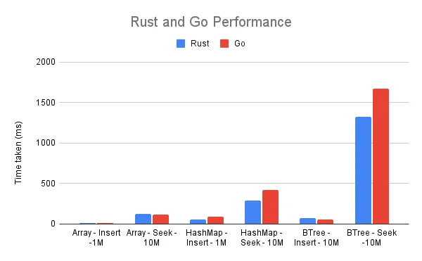
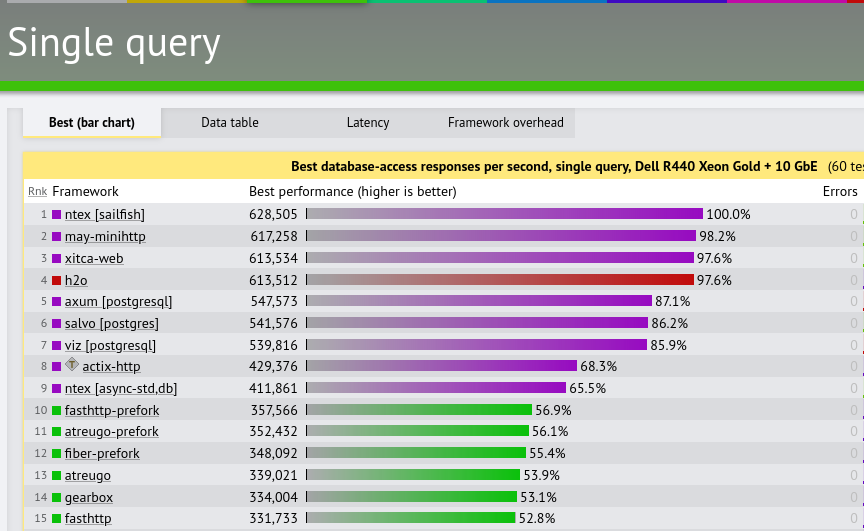
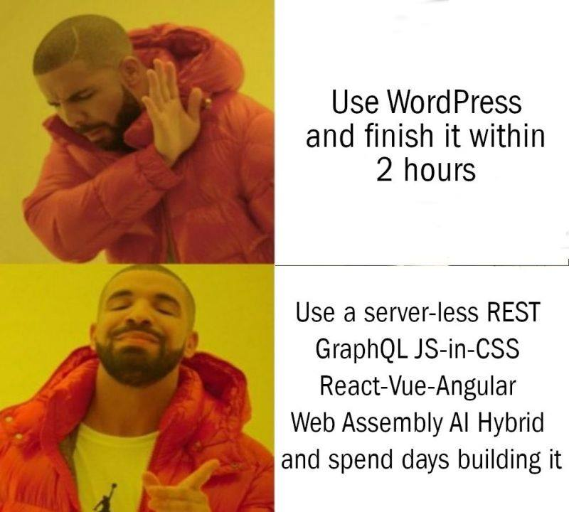
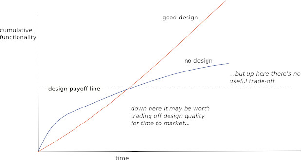
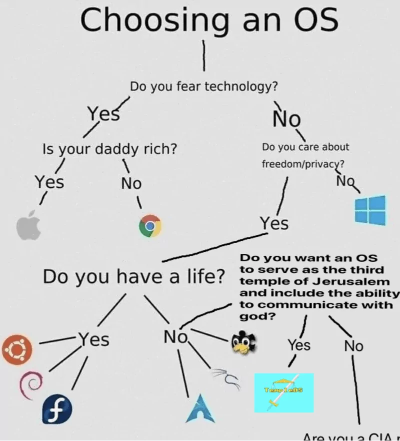

Esta entrada es para ti, que quieres independizarte de las empresas y estas buscando crear tus propios proyectos en el mundo del internet ¿Has pensado si de verdad importan tanto esos milisegundos de rendimiento extra que obtenemos al cambiar un proyecto a un lenguaje más verboso o si la búsqueda del framework más veloz realmente vale la pena? 

En el mundo de los programadores hay una obsesión por la velocidad y el rendimiento; queremos exprimir cada milisegundo posible al lenguaje y reducir el consumo de memoria al mínimo posible y escribir las queries en su versión más elegante que lleve al límite de la velocidad a nuestra base de datos.

En esa búsqueda constante pasamos de lenguajes de alto nivel a lenguajes de más bajo nivel, deambulamos por los rincones más oscuros de la documentación rumbo a los runtimes más esotéricos escritos en lenguajes arcanos cuyos nombres parecen sacados de un diccionario de otro idioma. ¿Se te vino a la mente alguno en particular? A mi sí. 

A lo largo de esta odisea virtual, nos olvidamos por completo de lo que probablemente sea el único factor que importa: el aburrido mercado.

## ¿Qué tanto importan las requests per second al iniciar?

Si tu, o tu empresa, no son un jugador de ligas mayores en internet, probablemente estás dándole más importancia de la necesaria al hecho de que tu aplicación sirva 1 peticiones por segundo en lugar de 100. 

Sí, es cierto que estamos hablando de un factor de 100, pero considera lo siguiente:

Una petición por segundo significa 60 en un minuto, 3600 en una hora y 86400 al día. ¿De verdad te preocupa que tu aplicación tenga un tráfico de 86400 peticiones en un día? Si ya tienes tal tráfico, pagarle a un desarrollador extra para que se encargue de ajustar los engranes de tu software no debería ser un problema, y si lo es, **probablemente no tienes un problema de rendimiento, sino de monetización.**

## ¿Importa el consumo de memoria en una nueva aplicación web?

Acaso importa que tu aplicación se ejecute con un consumo mínimo de memoria usando un lenguaje de bajo nivel, o con un consumo mayor usando un lenguaje de alto nivel. Yo diría que depende; si tu aplicación o proyecto es nuevo, probablemente valga la pena pagar unos dólares más al mes por memoria extra a cambio de una mayor velocidad de desarrollo en cada iteración. 

No digo que esté mal cuidar los aspectos técnicos, pero en este momento hay cosas más importantes, como el adquirir información que se traducirá en rentabilidad posteriormente, o destinar más recursos el marketing y la publicidad de tu startup o proyecto que en perder tiempo limando las asperezas de tu código.

## Velocidad de desarrollo vs rendimiento

Para la mayoría de las startups o solopreneurs, el proceso de exploración del mercado será más importante que reducir el consumo de recursos. ¿De que te sirve reducir tu consumo de RAM y procesador a la mitad si tus iteraciones van a pasar de una semana a dos semanas y media?

No elijas un lenguaje eficiente, sino uno que te permita ser flexible a los cambios y adaptarte rápido mientras obtienes información. En este caso, la velocidad de desarrollar nuevas características o modificar las existentes es mucho más importante que el rendimiento de estas. 

Recuerda que en tecnología todo es un tradeoff, en este caso rendimiento por productividad.

Asi mismo, manten presente, que esto también aplica al elegir las herramientas que conoces; quizás seas más rápido programando en un lenguaje de bajo nivel que ya domines, que en uno de alto nivel que no domines.

### Manten presente la deuda técnica

Otra cosa, cuando optimices en favor de la velocidad de desarrollo, no te olvides de considerar la deuda técnica, encuentra el punto de inflexión y pivotea hacia la escalabilidad.

## Situaciones donde sí importa el rendimiento y la seguridad

¿Significa que deberías olvidarte de todos los lenguajes y tratar de implementar todas tus ideas en ~~javascript~~ una herramienta escrita en un lenguaje mediocre?, no, creo que hay situaciones donde es crucial elegir lo más rápido, seguro y eficiente, como por ejemplo: para navegadores, motores de videojuegos o sistemas operativos (que no son aplicaciones web), aunque, nuevamente, no vas a diseñar un sistema operativo tú solo... a menos de que quieras que tu OS sea el tercer templo de Jerusalen y quieras comunicarte con dios.

Usar un lenguaje de bajo nivel suele ser la decisión correcta para situaciones donde el rendimiento es crítico, no quieres servicios donde la vida o la salud de las personas estén en juego escritos en lenguajes de alto nivel, que suelen ser más flexibles en el tipado y más propensos a errores en tiempo de ejecución. 

También querrás rendimiento y seguridad en entornos donde trates con cosas aún más importantes que la vida de las personas, como aplicaciones relacionadas con el mercado financiero y donde se manejen cantidades importantes de dinero (es sarcasmo, por si acaso, los únicos que piensan así son la gente de Wall street).

## Herramientas To Get Shit Done

Yo soy un defensor de evitar reinventar la rueda cada vez. Es bastante molesto tener que crear sistemas de autenticación, CRUDS, consultas a la base de datos una y otra vez, incluso aunque algunas comunidades, como la de Go, prefieran implementar todo desde cero.

Te dejo una lista de algunas de mis soluciones favoritas para ahorrarte todo el boilerplate y centrarte en lo importante, que si bien no poseen el mejor rendimiento, se centran en tener prototipos funcionales lo más pronto posible.

- [Wordpress: porque ya tu sabe'](/es/programar-un-blog-o-usar-wordpress/)
- Ruby on Rails: Framework maduro, con mucha trayectoria y fácil de usar
- AdonisJs: Javascript con ORM y autenticación incluida
- [Django: por su facilidad de tener un MVP rápido](/es/por-que-deberias-usar-django-framework/)
- [Pocketbase: Backend portátil hecho en Go, un solo binario, autenticación y CRUD](https://pocketbase.io/)
- Supabase: Otro backend portátil, pero en Javascript
- [Cookiecutter: plantillas para ahorrarte Boilerplate, el de Django es muy bueno](/es/cookiecutter-django-para-configurar-y-hacer-deploy-en-django/)
- Hugo: Generador de sitios estáticos, suficientemente rápido (aunque no tanto como su version en Rust, Zola)
- Herramientas no-code

## Cuando sea momento de cuidar el rendimiento, hazlo

Una vez que el flujo de efectivo sea el suficiente, reescribe tu aplicación en un lenguaje de bajo nivel, deshazte del ORM y ejecuta tus consultas SQL de manera manual, implementa tus propias abstracciones en lugar de usar un framework, refactoriza tu app entera con un patrón de arquitectura más robusto y contrata especialistas que cuiden cada milisegundo extra en tus sistemas.

Cuando llegue ese momento, espero que llegues al punto donde [cambiar de un lenguaje como Go a Rust, como le pasó a Discord](https://discord.com/blog/why-discord-is-switching-from-go-to-rust), realmente marque la diferencia.