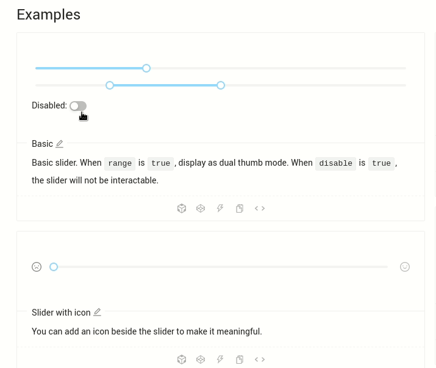
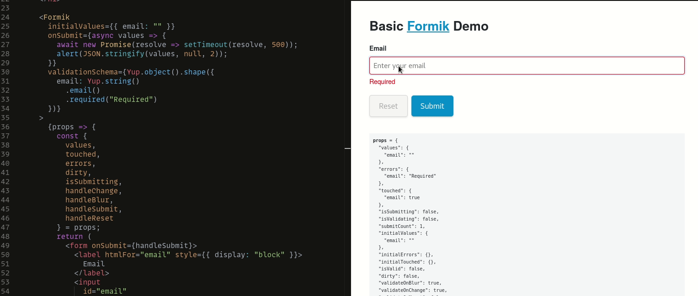
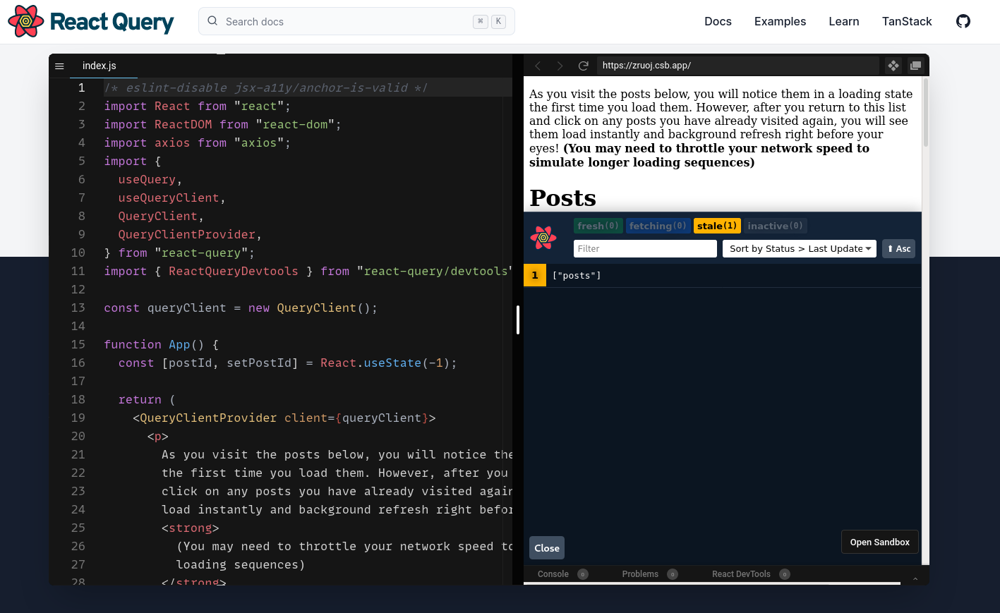
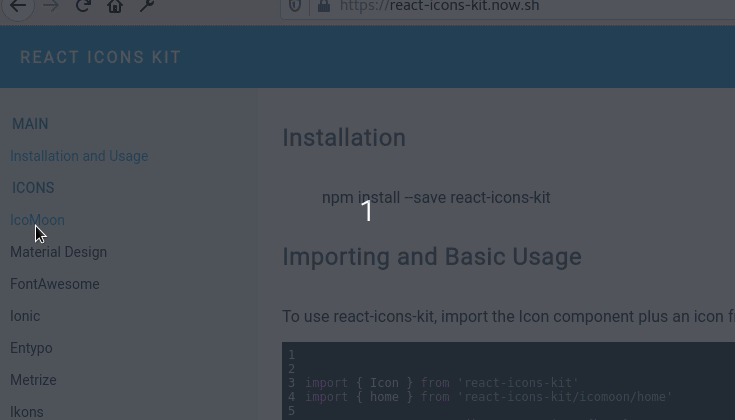
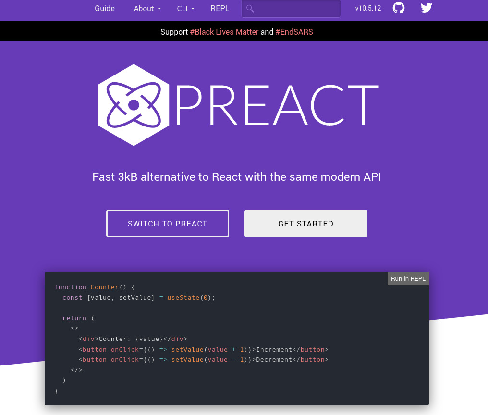
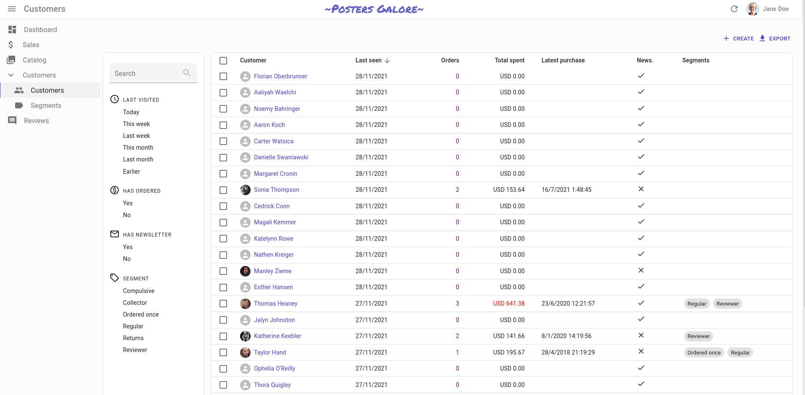
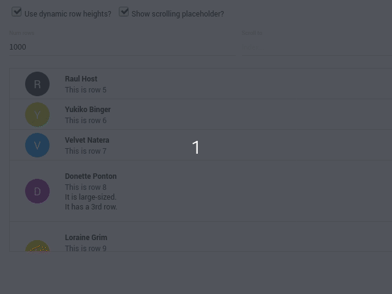

Después de varias semanas publicando sobre Django escribí una entrada corta de React, sobre librerías, porque no solo de Python vive el hombre. Estás son algunas de las librerías que considero más útiles de React. Por razones obvias están excluidas React-router, Redux y otras demasiado conocidas. Así como también algunos Frameworks de React tales como Gatsby, Nextjs, Frontity y otros.

Si quieres aprender React pero no sabes Javascript lee mi entrada, donde hablo de [uno de los mejores libros para empezar con Javascript.](https://coffeebytes.dev/el-mejor-libro-para-aprender-javascript-moderno/)

## Ant Design

Ant design es hermosa, sí, no hay mucho que se pueda profundizar usando texto. Tiene montones de componentes que son agradables visualmente hablando y muy elegantes: botones, sliders, barras de progreso, layouts, ya sabes, lo básico. Asegúrate de visitar el [sitio web de Ant design](https://ant.design/) para ver por ti mismo todo lo qu esta librería tiene para ofrecer.

## formik

Formik es una librería genial. Esta librería consigue que trabajar con formularios sea sencillo y escalable. Te permite tener campos controlados, crear validaciones, resetear el formulario, establecer un estado, manejar errores, todo con unas cuantas lineas de código: definimos un objeto que contenga propiedades con sus respectivas validaciones y listo, formik se encarga de casi todo.

Nota el esquema de validación en la parte izquierda consistente de un objeto llamado _ValidationSchema_ el cual tiene el nombre de los campos y funciones que se concatenan para llevar a cabo la validación. Existen funciones como _min()_, _max()_, _oneOf()_ y muchas otras para **casi cualquier tipo de validación que requieras.** Te dejo [el enlace al sandbox](https://codesandbox.io/s/zkrk5yldz?file=/index.js)  de donde tome este ejemplo.

## React query

Cada vez que se hace una petición a una API hay código que se repite; hacer la petición, mostrar un elemento que indique que se está cargando contenido, recibir el error o el estado exitoso y guardarlo en el estado. ¿Te suena?

React query se encarga de reducir todo el código repetitivo que se encarga de todo el proceso de manejo de peticiones web proveyéndonos de un hook especial del que podemos desestructurar variables que nos facilitarán el manejo de la respuesta.

## React-icons-kit

A veces es bastante molesto encargarse de la parte de la parte gráfica de una página web. Hay iconos en todos lados pero hay que buscarlos, a veces un paquete de íconos no tiene todos los íconos que necesitamos y tenemos que combinar diferentes. Una excelente opción a estos problemas es [React-icons-kit](https://react-icons-kit.now.sh/).

Antes de usarla recuerda revisar la licencia de los íconos que decidas usar, porque no todas las licencias son igual de permisivas.

## El React minimalista: Preact

Preact es React, sí, mismas funciones, bueno, en realidad no todas, pero las más comunes sí, todo en solo 3kb. **Preact promete ser mucho más rápido y ligero que su contraparte** pues usa el _addEventListener_ nativo del navegador en lugar del manejador de eventos sintético que usa React. Además también tiene funciones exclusivas que no encuentras en React. Esta librería es ideal para aplicaciones donde el rendimiento es un factor crítico.

Puedes leer más diferencias entre React y Preact en [su página oficial.](https://preactjs.com/guide/v10/differences-to-react/)

## React admin

React admin es el equivalente del django admin pero en React, una interfaz para realizar operaciones CRUD a los modelos de tu base de datos. Requiere una configuración muy básica, pero una vez que la configuras ya está todo hecho. Visita el [demo de React admin](https://marmelab.com/react-admin-demo/#/) para que lo conozcas.

## Bonus: React Virtualized

React virtualized se encarga de resolver un problema que luce bastante simple al principio. Renderizar listas e información susceptible de tabular. ¿Solo eso? Bueno, sí, pero renderizar listas con unos cuantos elementos no sería un problema, ¿o sí? El fuerte de React Virtualized no es renderizar listas pequeñas, sino listas grandes, mayores a 1k de elementos con la mayoría de los problemas que se presentan ya resueltos y probados.

Visita [la página de React Virtualized](https://bvaughn.github.io/react-virtualized/#/components/List) para leer la documentación completa.

