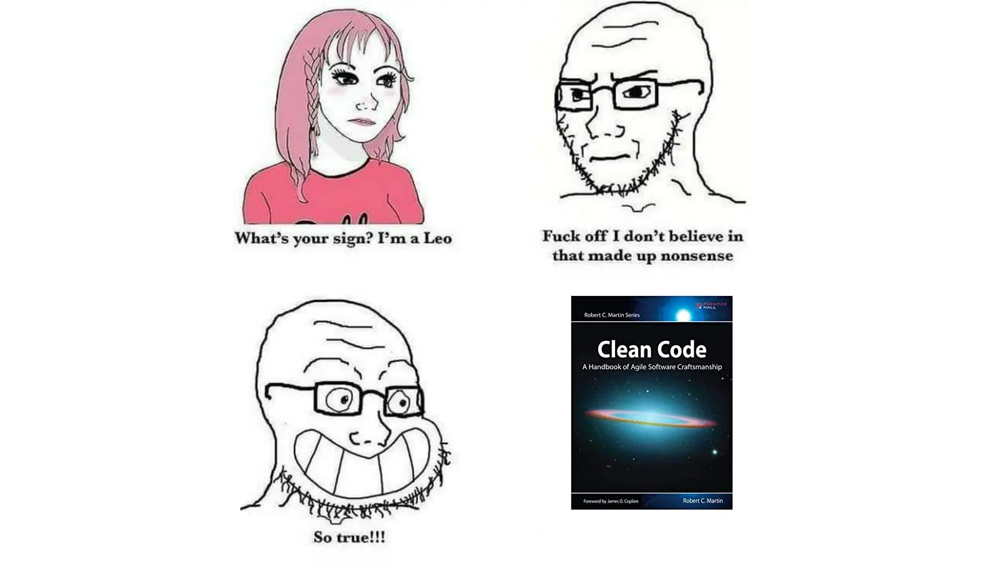
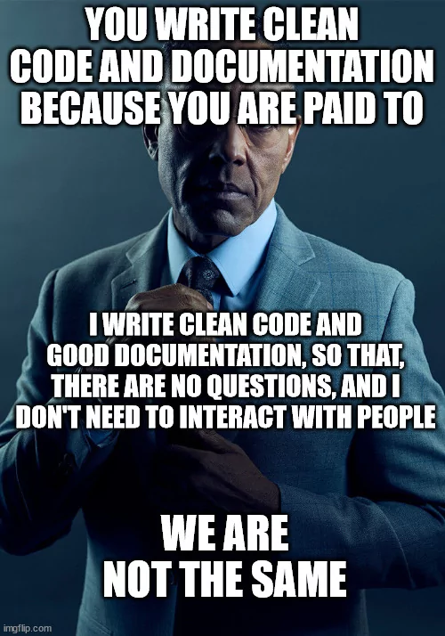
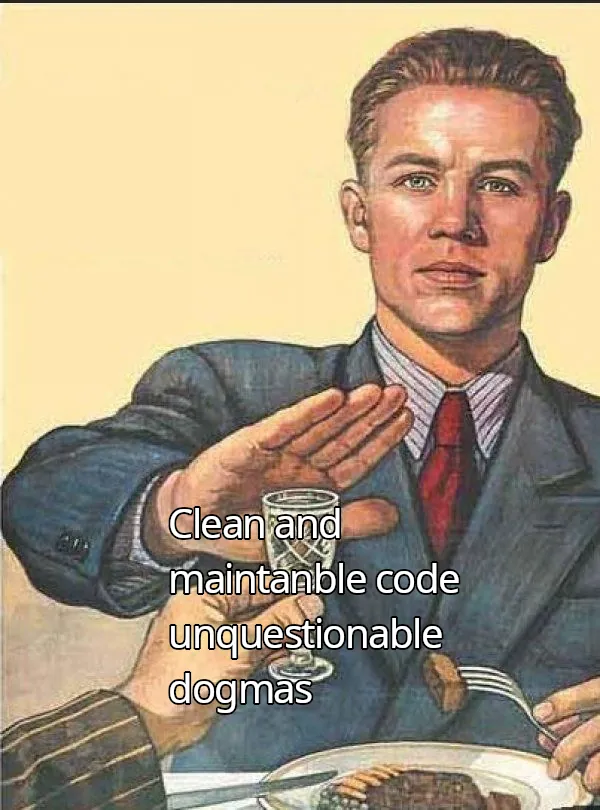

---
aliases:
- /en/is-code-commenting-wrong-clean-code-review/
- /en/the-clean-code-book-and-the-clean-code-paradigms/
- /en/uncle-bob-clean-code-and-the-clean-code-paradigms/
authors:
- Eduardo Zepeda
categories:
- linux
- opinion
coverImage: images/clean_code.jpg
date: '2020-05-16'
description: An analysis of Clean Code, the book by Robert C. Martin that explains
  how to write clean code and what I consider other alternatives and ideas of what
  is considered clean code in the world of software development.
keyword: clean code
keywords:
- books
- reviews
- opinion
- best practices
title: Uncle Bob Clean Code And The Clean Code Paradigms
---

There are two types of programmers, those who hate Clean Code and those who love it. This book sparks heated discussions on the internet; some consider it a bible that prophesies better times with clean and tidy code, others consider it an outdated manual written by a self-proclaimed pedantic dictator about how to write code. Well, to be honest, a bit of both. This post is my humble take on the book Clean Code by Robert C. Martin, the **creator of the widely known acronym SOLID** and also known as the *uncle bob*.

## What is Clean Code about?

Most of the programming books available on the market focus on teaching you the syntax of a programming language and some popular conventions. However, most of them do not go too much into how to organize the code, how to name variables or which parts of the code should have comments and which should not, how to determine the right amount of arguments a function should receive, or when to split a file in two, etc. This book aims to answer all these questions.



### What is the importance of using clean code?

Throughout the pages of Clean Code, *uncle bob* takes us into the subject with stories of some **companies that have had to close their doors because of badly written code**, yes, that's how serious the consequences of unreadable code can be.  It all starts with readable code.

Good *uncle Bob*, states that programmers spend more time reading code than writing it. This should put in a new light the way we write our code, because we have the certainty that someone else will read it (even ourselves in the future), when writing the code we should always ask ourselves: is the objective pursued by my functions clear? is it understood why I chose a certain code flow instead of another? is the meaning of each variable clear?




### How to name variables, classes and functions according to Clean Code?

According to Clean code the code should be self-commenting through the naming of variables, functions, classes and so on. Hence the book's reputation for abhorring comments and considering them a *necessary evil*.

This concept is quite simple but it is still very common to see cryptic code that is difficult to understand.

Consider this example:


```python
# Cryptic code in Python
import random

i=0
list = [x for x in range(1,57)]

while i<=52:
    a = random.sample(list, 6)
    print(a)
    i+=1
```

Do you know what the code above does? Not at the mathematical level, but what it represents. How long did it take you to realize that it represented a crude example (and with lousy randomness) of a lottery-type draw? Could you have predicted what other types of functions you would need later or what would need to be corrected just by looking at the code?

```python
# Cleaner code in Python
import random

lottoDrawCounter = 0
lottoDrawsPerYear = 52
lottoNumbersToSelect = 6
lottoNumbers = [x for x in range(1,57)]

while lottoDrawCounter <= lottoDrawsPerYear:
    winningNumbers = random.sample(lottoNumbers, lottoNumbersToSelect)
    print(winningNumbers)
    lottoCounter+=1
```

This code example provides much more information, although it is not perfect either. 

If you were to read the code above you would probably get several ideas about what could go wrong or right when executing the code, as well as ideas for modifying and improving it. 

### Is commenting the code wrong?

> The proper use of comments is to compensate for our failure to express ourselves in the code.
> 
> Robert C. Martin

The author considers comments as something to be avoided if possible. Yes, I know that **everywhere you have it drummed into your head that we should comment our code** and you may find it controversial that the controversial *uncle Bob* believes that you should avoid writing comments.

According to him, the reason is that the code should be self-explanatory, if you need comments you **failed to write code that speaks for itself**. 

Look at the following code snippet:

```python
# Check if the user is elegible for a discount
if employee.status_confirmation and employee.days_since_registration()>365 and employee.owns_a_credit_card:
    process_order()
```

Now look this one:

```python
if employee.is_eligible_for_discount():
    process_order()
```

The comment in the first code snippet is totally unnecessary, the function name can replace it and it is perfectly understood what the goal is.

Are there any situations that merit comments according to Uncle Bob? Yes, according to the author of Clean Code, there are **very punctual** cases in which it is better to have a comment than none at all (as to warn consequences, EVERYTHING, declare intentions) but, from the point of view of our clean code messiah, they are rather exceptions to the rule.

### What do I think about comments in code?

I don't have such a rigid stance on this, I think it's ok to write comments if they can reduce the time other developers spend trying to understand the code, even if sometimes it's obvious.

Comments should be used if they make life easier for others, even if you don't need them.

For example, if you use the Fisher-Yates algorithm to generate random numbers, I would put a small annotation to save a wikipedia search for the developer reading it, even if it's "basic knowledge".

I'd also add a "don't forget to add the WHERE id=" in a DELETE clause, if I suspect an accident could happen in certain line of code.

But make no mistake, I wouldn't do things like this either.

``` python
# PLEASE DONT DONT DO THIS
# Check if the product is available
is_product_available = check_if_product_available()
```

### How many arguments should a function have according to Clean Code?

> The ideal number of arguments for a function is zero. Then one, followed closely by two. Three arguments should be avoided whenever possible. More than three requires a very special justification....
> 
> Robert C. Martin

In the chapter that discusses functions, *uncle bob* emphasizes the need to keep the arguments a function receives to a minimum, furthermore he believes that any function that receives more than three arguments **should not be used**.

From our clean code foreman's point of view, arguments force you to require more information from a function than its name, as you must now understand how variables interact within the function's logic, plus they are difficult to include in tests since you have to try different combinations of these to make sure you cover every instance of the function. 

Sounds logical doesn't it? Well yes, but if you check books, videos, repositories and even in the official documentation of certain very mature technologies and used in world-class websites, one can see numerous functions with two, three and even four arguments. 

Example of express JS:


```javascript
const express = require('express')
const auth = require('../middleware/auth')

const router = new express.Router()

router.get('/users/me', auth, async (req, res) => {
    res.send(req.user)
})
```

To me, however, it doesn't seem so serious or so difficult to read this little piece of code but perhaps it would be reason enough to be excommunicated from the church of Clean Code.



## What didn't I like about Clean Code?

In what I consider an anachronism, the author uses Java to develop his examples. Yes, I know Java was incredibly popular before, but using pseudocode or C would have been a better choice.

The code used for the examples seems rather stilted to me, it uses whole code snippets instead of a minimal example, the author of Refactoring does much better in this regard.

I felt the book unnecessarily long, the examples are well detailed, but I don't think so many pages are needed to expose some simple topics, such as variable naming.

## What alternatives do exist to Clean Code?

If you haven't had any approach with good code writing practices I recommend you to give this book a read, because you can acquire some useful tips that you might not have considered, even if you don't agree with all its content, the point is that you don't stop there and complement it with more material.



**This book is not a manual that should be taken as an unbreakable regulation**, but the opinion of one person, but times change, rules improve and experience sets new guidelines. Take all the advice that will improve your code and question everything that you think can be improved. All religions have their detractors and Clean Code is no exception.

*Uncle Bob* proposes SOLID as a philosophy to follow, but you should know that it is not the only one, I leave you some interesting alternatives that can complement your vision and to give you a more complete view of this topic:

- [CUPID](https://speakerdeck.com/tastapod/cupid-for-joyful-coding?slide=9)
- A Philosophy of Software Design by John Ousterhout.
- The Art of Readable Code
- Refactoring to Patterns by Joshua Kerievsky
- Refactoring by Kent Beck and Martin Fowler

By the way, the other day I found on Twitter a [summary of Clean Code concepts with examples in Javascript](https://github.com/ryanmcdermott/clean-code-javascript) so you can take a look at the content of the book before deciding whether to buy it or not.